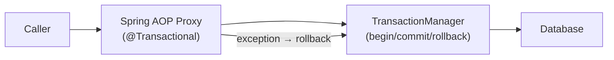

# Spring Transaction Management Deep Dive

[← Back to README](../README.md)

---

Spring's `@Transactional` wraps methods in a database transaction managed by the underlying `PlatformTransactionManager`. Understanding **propagation** (what happens when a transactional method calls another), **isolation** (what concurrent transactions can see), and common **pitfalls** (self-invocation, wrong rollback rules) is essential for writing correct data access code.



---

## Propagation Levels

```java
@Service
public class OrderService {

    @Transactional(propagation = Propagation.REQUIRED)       // DEFAULT
    public void placeOrder(Order order) { ... }
    // → joins existing tx if one exists; creates new one if not

    @Transactional(propagation = Propagation.REQUIRES_NEW)
    public void sendAuditLog(AuditEvent event) { ... }
    // → ALWAYS creates a new tx; suspends any existing one
    // Use for: audit logs that must commit even if outer tx rolls back

    @Transactional(propagation = Propagation.NESTED)
    public void reserveStock(String sku, int qty) { ... }
    // → creates a SAVEPOINT inside existing tx; partial rollback possible
    // Rolls back to savepoint on exception, outer tx can still commit

    @Transactional(propagation = Propagation.MANDATORY)
    public void deductInventory(String sku, int qty) { ... }
    // → MUST be called within an existing tx; throws if none exists

    @Transactional(propagation = Propagation.NEVER)
    public BigDecimal calculateTax(Order order) { ... }
    // → throws if called within an active tx

    @Transactional(propagation = Propagation.SUPPORTS)
    public List<Order> findByCustomer(String customerId) { ... }
    // → joins existing tx if present; non-transactional if none

    @Transactional(propagation = Propagation.NOT_SUPPORTED)
    public void sendEmail(String to, String subject) { ... }
    // → suspends existing tx; runs non-transactionally
}
```

---

## Isolation Levels

```java
// READ_COMMITTED (default for most DBs incl. PostgreSQL)
@Transactional(isolation = Isolation.READ_COMMITTED)
public Order findOrder(Long id) { ... }
// Prevents: dirty reads
// Allows: non-repeatable reads, phantom reads

// REPEATABLE_READ
@Transactional(isolation = Isolation.REPEATABLE_READ)
public void processBatch(Long batchId) { ... }
// Prevents: dirty reads, non-repeatable reads
// Allows: phantom reads
// PostgreSQL upgrades this to SERIALIZABLE automatically

// SERIALIZABLE — strongest isolation
@Transactional(isolation = Isolation.SERIALIZABLE)
public void transfer(Long fromId, Long toId, BigDecimal amount) { ... }
// Prevents: dirty reads, non-repeatable reads, phantom reads
// Cost: highest contention; use for financial operations

// READ_UNCOMMITTED — rarely used
@Transactional(isolation = Isolation.READ_UNCOMMITTED)
public long countApproximate() { ... }
// Allows dirty reads — only meaningful on MySQL; PostgreSQL ignores it
```

---

## Rollback Rules

```java
// DEFAULT: rolls back on RuntimeException and Error; COMMITS on checked exceptions
@Transactional
public void processPayment(Payment payment) throws PaymentException {
    // PaymentException (checked) → COMMITS — usually wrong!
}

// FIX: roll back on checked exceptions too
@Transactional(rollbackFor = PaymentException.class)
public void processPayment(Payment payment) throws PaymentException { ... }

// Roll back on everything
@Transactional(rollbackFor = Exception.class)
public void riskyOperation() throws Exception { ... }

// Prevent rollback on a specific runtime exception
@Transactional(noRollbackFor = OptimisticLockingFailureException.class)
public void updateWithRetry(Order order) { ... }
```

---

## The Self-Invocation Pitfall

```java
@Service
public class OrderService {

    @Transactional
    public void placeOrder(Order order) {
        saveOrder(order);
        sendAuditLog(order);  // ← PITFALL: calls this bean's own method directly
    }

    @Transactional(propagation = Propagation.REQUIRES_NEW)
    public void sendAuditLog(Order order) {
        // This @Transactional is IGNORED — called directly, not through the proxy
        // Both run in the SAME transaction as placeOrder()
    }
}

// FIX 1: inject self-reference (simple but feels odd)
@Service
@RequiredArgsConstructor
public class OrderService {
    @Lazy @Autowired private OrderService self;  // proxy-wrapped self

    @Transactional
    public void placeOrder(Order order) {
        saveOrder(order);
        self.sendAuditLog(order);  // goes through the proxy → REQUIRES_NEW works
    }
}

// FIX 2: extract to a separate Spring bean (cleaner)
@Service
@RequiredArgsConstructor
public class OrderService {
    private final AuditLogService auditLogService;

    @Transactional
    public void placeOrder(Order order) {
        saveOrder(order);
        auditLogService.sendAuditLog(order);  // separate bean → proxy used
    }
}
```

---

## Read-Only Transactions

```java
// readOnly = true — hint to the persistence provider and connection pool
// Hibernate skips dirty checking; some DBs/drivers route to read replica
@Transactional(readOnly = true)
public List<Order> findByCustomer(String customerId) {
    return orderRepository.findByCustomerId(customerId);
}

// Combine with routing datasource for automatic read-replica routing
@Transactional(readOnly = true)
public Page<Order> listOrders(Pageable pageable) {
    // AbstractRoutingDataSource sees isCurrentTransactionReadOnly() == true
    // and routes to replica
    return orderRepository.findAll(pageable);
}
```

---

## TransactionTemplate — Programmatic Transactions

```java
@Service
@RequiredArgsConstructor
public class PaymentService {

    private final TransactionTemplate txTemplate;
    private final TransactionTemplate requiresNewTemplate;

    @Bean
    public TransactionTemplate transactionTemplate(PlatformTransactionManager tm) {
        return new TransactionTemplate(tm);
    }

    @Bean
    public TransactionTemplate requiresNewTemplate(PlatformTransactionManager tm) {
        TransactionTemplate t = new TransactionTemplate(tm);
        t.setPropagationBehavior(TransactionDefinition.PROPAGATION_REQUIRES_NEW);
        return t;
    }

    // Useful when transactions span non-Spring-managed code paths
    public void processPayment(Payment payment) {
        txTemplate.execute(status -> {
            try {
                chargeCard(payment);
                updateBalance(payment);
                return null;
            } catch (InsufficientFundsException e) {
                status.setRollbackOnly();   // mark for rollback without throwing
                return null;
            }
        });
    }
}
```

---

## TransactionSynchronization — Hooks

```java
@Transactional
public void placeOrder(Order order) {
    orderRepository.save(order);

    // Register a callback that runs AFTER the transaction commits
    TransactionSynchronizationManager.registerSynchronization(
        new TransactionSynchronizationAdapter() {

            @Override
            public void afterCommit() {
                // Safe to send event — order is now visible to other transactions
                eventPublisher.publishEvent(new OrderPlacedEvent(order.getId()));
            }

            @Override
            public void afterCompletion(int status) {
                if (status == STATUS_ROLLED_BACK) {
                    log.warn("Order {} transaction rolled back", order.getId());
                }
            }
        });
}
```

---

## Spring Transaction Management Summary

| Concept | Detail |
|---------|--------|
| `REQUIRED` | Join existing tx or create new one — the safe default |
| `REQUIRES_NEW` | Always new tx; suspends outer tx — use for audit logs |
| `NESTED` | Savepoint inside existing tx; partial rollback on failure |
| `MANDATORY` | Must have an existing tx; throws `IllegalTransactionStateException` if none |
| Self-invocation | Direct method calls bypass the AOP proxy — `@Transactional` is ignored |
| `rollbackFor` | Include checked exceptions in rollback trigger (default: only `RuntimeException`) |
| `readOnly = true` | Skips Hibernate dirty checking; enables read-replica routing |
| `TransactionTemplate` | Programmatic alternative to `@Transactional`; avoids AOP proxy limitations |
| `TransactionSynchronizationManager` | Register `afterCommit()` callbacks — safe place to publish events |
| Isolation default | PostgreSQL uses `READ_COMMITTED` by default; change per method if needed |

---

[← Back to README](../README.md)
