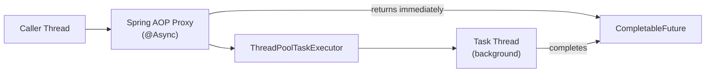

# @Async & Spring Task Execution

[← Back to README](../README.md)

---

Spring's `@Async` annotation offloads method execution to a background thread pool, freeing the caller immediately. Combined with `CompletableFuture`, it enables parallel fan-out patterns. The key points: `@Async` only works when called through a Spring proxy, requires an explicit `ThreadPoolTaskExecutor` for production, and needs deliberate error-handling because exceptions from async methods don't propagate to the caller.



---

## Enabling Async Support

```java
@Configuration
@EnableAsync
public class AsyncConfig implements AsyncConfigurer {

    @Override
    @Bean(name = "taskExecutor")
    public Executor getAsyncExecutor() {
        ThreadPoolTaskExecutor executor = new ThreadPoolTaskExecutor();
        executor.setCorePoolSize(4);
        executor.setMaxPoolSize(16);
        executor.setQueueCapacity(100);
        executor.setThreadNamePrefix("async-");
        executor.setRejectedExecutionHandler(new ThreadPoolExecutor.CallerRunsPolicy());
        executor.setWaitForTasksToCompleteOnShutdown(true);
        executor.setAwaitTerminationSeconds(30);
        executor.initialize();
        return executor;
    }

    @Override
    public AsyncUncaughtExceptionHandler getAsyncUncaughtExceptionHandler() {
        return new CustomAsyncExceptionHandler();
    }
}

class CustomAsyncExceptionHandler implements AsyncUncaughtExceptionHandler {
    @Override
    public void handleUncaughtException(Throwable ex, Method method, Object... params) {
        log.error("Async method '{}' threw uncaught exception: {}", method.getName(), ex.getMessage(), ex);
        // Alert, store failure, etc.
    }
}
```

---

## @Async Methods

```java
@Service
@Slf4j
public class NotificationService {

    // Fire-and-forget — caller doesn't wait
    @Async
    public void sendEmailAsync(String to, String subject, String body) {
        log.info("Sending email on thread {}", Thread.currentThread().getName());
        emailClient.send(to, subject, body);
    }

    // Returns a future — caller can wait or compose
    @Async
    public CompletableFuture<String> fetchExternalData(String customerId) {
        String data = externalClient.fetch(customerId);
        return CompletableFuture.completedFuture(data);
    }

    // Named executor — route to a specific pool
    @Async("reportExecutor")
    public CompletableFuture<byte[]> generateReport(ReportRequest request) {
        byte[] pdf = reportService.generate(request);
        return CompletableFuture.completedFuture(pdf);
    }
}
```

---

## Multiple Thread Pools

```java
@Configuration
@EnableAsync
public class MultiPoolAsyncConfig {

    @Bean("taskExecutor")         // default pool for @Async without name
    public Executor taskExecutor() {
        ThreadPoolTaskExecutor exec = new ThreadPoolTaskExecutor();
        exec.setCorePoolSize(8);
        exec.setMaxPoolSize(32);
        exec.setQueueCapacity(200);
        exec.setThreadNamePrefix("task-");
        exec.initialize();
        return exec;
    }

    @Bean("reportExecutor")       // dedicated pool for heavy report generation
    public Executor reportExecutor() {
        ThreadPoolTaskExecutor exec = new ThreadPoolTaskExecutor();
        exec.setCorePoolSize(2);
        exec.setMaxPoolSize(4);
        exec.setQueueCapacity(10);
        exec.setThreadNamePrefix("report-");
        exec.initialize();
        return exec;
    }

    @Bean("ioExecutor")           // I/O-bound tasks — larger pool
    public Executor ioExecutor() {
        ThreadPoolTaskExecutor exec = new ThreadPoolTaskExecutor();
        exec.setCorePoolSize(20);
        exec.setMaxPoolSize(100);
        exec.setQueueCapacity(500);
        exec.setThreadNamePrefix("io-");
        exec.initialize();
        return exec;
    }
}
```

---

## Fan-Out Pattern — Parallel Calls

```java
@Service
@RequiredArgsConstructor
public class OrderEnrichmentService {

    private final CustomerService customerService;
    private final InventoryService inventoryService;
    private final PricingService pricingService;

    public EnrichedOrder enrich(String orderId) throws Exception {
        // Fire all three calls in parallel
        CompletableFuture<Customer>   customerFuture   = customerService.fetchAsync(orderId);
        CompletableFuture<Inventory>  inventoryFuture  = inventoryService.checkAsync(orderId);
        CompletableFuture<PriceQuote> pricingFuture    = pricingService.quoteAsync(orderId);

        // Wait for all to complete
        CompletableFuture.allOf(customerFuture, inventoryFuture, pricingFuture).join();

        return new EnrichedOrder(
            customerFuture.get(),
            inventoryFuture.get(),
            pricingFuture.get()
        );
    }
}

// In the services
@Service
public class CustomerService {

    @Async
    public CompletableFuture<Customer> fetchAsync(String orderId) {
        return CompletableFuture.completedFuture(customerClient.fetch(orderId));
    }
}
```

---

## Error Handling in Async Methods

```java
@Service
public class AsyncOrderProcessor {

    // Option 1: return exceptionally-completed future — caller handles it
    @Async
    public CompletableFuture<Order> processAsync(String orderId) {
        try {
            Order order = processOrder(orderId);
            return CompletableFuture.completedFuture(order);
        } catch (Exception e) {
            return CompletableFuture.failedFuture(e);
        }
    }

    // Option 2: exception from void @Async method → goes to AsyncUncaughtExceptionHandler
    @Async
    public void processFireAndForget(String orderId) {
        processOrder(orderId);   // exception caught by AsyncUncaughtExceptionHandler
    }
}

// Caller handling failures
public void processWithFallback(String orderId) {
    asyncProcessor.processAsync(orderId)
        .thenAccept(order -> log.info("Processed: {}", order.getId()))
        .exceptionally(ex -> {
            log.error("Async processing failed for {}", orderId, ex);
            return null;
        });
}
```

---

## The Self-Invocation Pitfall (Same as @Transactional)

```java
@Service
public class ReportService {

    public void generateAll() {
        generatePdf();    // PITFALL: @Async is ignored — direct call bypasses proxy
        generateCsv();
    }

    @Async
    public void generatePdf() { ... }

    @Async
    public void generateCsv() { ... }
}

// FIX: inject self or extract to separate bean
@Service
@RequiredArgsConstructor
public class ReportOrchestrator {
    private final ReportService reportService;   // separate bean

    public void generateAll() {
        reportService.generatePdf();   // goes through proxy → @Async works
        reportService.generateCsv();
    }
}
```

---

## @Async vs Virtual Threads

```java
// @Async: explicit thread pool, good for bounded concurrency
@Async("ioExecutor")
public CompletableFuture<String> callExternalApi(String url) {
    return CompletableFuture.completedFuture(restClient.get(url));
}

// Virtual threads (Spring Boot 3.2+): unlimited lightweight threads, no pool config
@Bean
public AsyncTaskExecutor applicationTaskExecutor() {
    return new TaskExecutorAdapter(Executors.newVirtualThreadPerTaskExecutor());
}
// Then @Async without a named pool automatically uses virtual threads
```

---

## Monitoring Async Pools

```yaml
management:
  metrics:
    enable:
      executor: true   # expose ThreadPoolTaskExecutor metrics
```

```java
// Key Micrometer metrics:
// executor.pool.size{name="taskExecutor"}          — current thread count
// executor.pool.core{name="taskExecutor"}          — core pool size
// executor.queue.remaining{name="taskExecutor"}    — remaining queue capacity
// executor.completed{name="taskExecutor"}          — completed tasks counter
```

---

## @Async & Task Execution Summary

| Concept | Detail |
|---------|--------|
| `@EnableAsync` | Required on a `@Configuration` class to activate async support |
| `@Async` | Runs method on background thread; returns immediately to caller |
| `@Async("beanName")` | Route to a named `Executor` bean for pool isolation |
| `CompletableFuture<T>` | Return type for async results the caller can wait on or compose |
| `AsyncUncaughtExceptionHandler` | Catches exceptions from `void` `@Async` methods |
| `ThreadPoolTaskExecutor` | Configure core/max pool size, queue capacity, thread name prefix |
| `CallerRunsPolicy` | When queue is full, runs the task on the caller's thread — natural back-pressure |
| Self-invocation | `@Async` is ignored on direct same-bean calls — extract to separate Spring bean |
| `setWaitForTasksToCompleteOnShutdown(true)` | Prevents task loss on graceful shutdown |
| Virtual threads | Spring Boot 3.2+: configure `VirtualThreadPerTaskExecutor` as the default async executor |

---

[← Back to README](../README.md)
