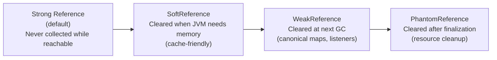

# Weak, Soft & Phantom References

[← Back to README](../README.md)

---

Java's reference hierarchy lets you hold object references at different GC strengths. **Strong references** (the default) prevent collection. **Soft references** are cleared under memory pressure — ideal for memory-sensitive caches. **Weak references** are cleared at the next GC — ideal for associating metadata with objects without preventing their collection. **Phantom references** are used for post-finalization cleanup without the pitfalls of `finalize()`. These underpin how Caffeine, WeakHashMap, and Cleaner work.



---

## Strong References (Default)

```java
// A strong reference — object lives as long as this reference exists
Object obj = new Object();   // strong reference

obj = null;   // now eligible for GC
```

---

## SoftReference — Memory-Sensitive Cache

Cleared by the GC only when the JVM is low on memory (before throwing `OutOfMemoryError`). The JVM tries to keep soft-referenced objects around as long as possible — making them ideal for caches.

```java
public class SoftCache<K, V> {

    private final Map<K, SoftReference<V>> cache = new ConcurrentHashMap<>();

    public void put(K key, V value) {
        cache.put(key, new SoftReference<>(value));
    }

    public Optional<V> get(K key) {
        SoftReference<V> ref = cache.get(key);
        if (ref == null) return Optional.empty();

        V value = ref.get();    // null if GC has cleared the referent
        if (value == null) {
            cache.remove(key);  // remove stale entry
            return Optional.empty();
        }
        return Optional.of(value);
    }
}

// Caffeine internally uses SoftValues for its optional soft-reference mode:
Cache<String, byte[]> imageCache = Caffeine.newBuilder()
    .softValues()   // values held by SoftReference — cleared under memory pressure
    .maximumSize(1000)
    .build();
```

---

## WeakReference — Non-Preventing Reference

Cleared at the next GC cycle regardless of memory pressure. Used when you want to associate data with an object without preventing it from being collected.

```java
// Canonical map: tracks objects without preventing their collection
public class ObjectRegistry<T> {

    // When the key object is GC'd, the entry is automatically removed
    private final WeakHashMap<T, String> registry = new WeakHashMap<>();

    public void register(T obj, String label) {
        registry.put(obj, label);
    }

    public Optional<String> getLabel(T obj) {
        return Optional.ofNullable(registry.get(obj));
    }
}

// Manual WeakReference usage
public class WeakEventListener {

    private final WeakReference<EventHandler> handlerRef;

    public WeakEventListener(EventHandler handler) {
        this.handlerRef = new WeakReference<>(handler);
    }

    public void onEvent(Event event) {
        EventHandler handler = handlerRef.get();
        if (handler != null) {
            handler.handle(event);
        } else {
            // Handler was GC'd — unregister this listener
            eventBus.unregister(this);
        }
    }
}
```

---

## ReferenceQueue — Tracking Cleared References

```java
// ReferenceQueue is notified when a reference is cleared by GC
ReferenceQueue<byte[]> queue = new ReferenceQueue<>();

SoftReference<byte[]> ref = new SoftReference<>(
    new byte[10 * 1024 * 1024],   // 10 MB buffer
    queue
);

// Background thread monitoring cleared references
Thread cleanupThread = new Thread(() -> {
    while (!Thread.currentThread().isInterrupted()) {
        try {
            Reference<?> cleared = queue.remove(1000);   // poll with 1s timeout
            if (cleared != null) {
                log.info("Reference cleared by GC: {}", cleared);
                // Release associated native resources, update metrics, etc.
            }
        } catch (InterruptedException e) {
            Thread.currentThread().interrupt();
        }
    }
});
cleanupThread.setDaemon(true);
cleanupThread.start();
```

---

## PhantomReference — Post-GC Cleanup

Phantom references are enqueued in the `ReferenceQueue` *after* the object is finalized and ready to be reclaimed. `phantomRef.get()` always returns `null` — you cannot resurrect the object. Use phantom references instead of `finalize()` for safe resource cleanup.

```java
public class NativeResourceManager {

    private final ReferenceQueue<Object> queue = new ReferenceQueue<>();
    private final Map<PhantomReference<?>, Runnable> cleanupActions = new ConcurrentHashMap<>();

    public <T> T track(T obj, Runnable cleanup) {
        PhantomReference<T> ref = new PhantomReference<>(obj, queue);
        cleanupActions.put(ref, cleanup);
        return obj;
    }

    public void startCleanupDaemon() {
        Thread daemon = new Thread(() -> {
            while (true) {
                try {
                    Reference<?> ref = queue.remove();
                    Runnable cleanup = cleanupActions.remove(ref);
                    if (cleanup != null) {
                        cleanup.run();
                        log.info("Native resource cleaned up");
                    }
                } catch (InterruptedException e) {
                    break;
                }
            }
        });
        daemon.setDaemon(true);
        daemon.start();
    }
}

// Usage
manager.track(nativeBuffer, () -> nativeLib.free(nativeBuffer.address()));
```

---

## Cleaner — Modern Replacement for finalize()

Java 9+ `Cleaner` is the recommended alternative to both `finalize()` and manual `PhantomReference` management:

```java
public class MappedFileBuffer implements AutoCloseable {

    private static final Cleaner CLEANER = Cleaner.create();

    private final MappedByteBuffer buffer;
    private final Cleaner.Cleanable cleanable;

    public MappedFileBuffer(Path path) throws IOException {
        FileChannel channel = FileChannel.open(path, StandardOpenOption.READ);
        this.buffer = channel.map(FileChannel.MapMode.READ_ONLY, 0, channel.size());
        channel.close();

        // Register cleanup action — runs after MappedFileBuffer becomes phantom-reachable
        this.cleanable = CLEANER.register(this, new UnmapAction(buffer));
    }

    @Override
    public void close() {
        cleanable.clean();   // explicit close — also cancels GC cleanup
    }

    private record UnmapAction(MappedByteBuffer buffer) implements Runnable {
        @Override
        public void run() {
            // Force-unmap the buffer (JDK internal — use Unsafe or reflection on Java 8)
            ((sun.nio.ch.DirectBuffer) buffer).cleaner().clean();
        }
    }
}
```

---

## WeakHashMap Deep Dive

```java
// WeakHashMap — entries removed when KEY is GC'd (not value)
Map<Object, String> meta = new WeakHashMap<>();

Object key = new Object();
meta.put(key, "some metadata");

System.out.println(meta.size());   // 1

key = null;   // key is now only weakly reachable
System.gc();
System.out.println(meta.size());   // 0 — entry removed

// PITFALL: String literals are interned and never GC'd
Map<String, Integer> bad = new WeakHashMap<>();
bad.put("permanent", 42);   // "permanent" is interned — entry NEVER removed
```

---

## Reference Strength Comparison

| Type | Collected when | `get()` after collection | Use case |
|------|---------------|--------------------------|----------|
| Strong | Never (while referenced) | N/A — never null | Default — all normal variables |
| `SoftReference` | JVM needs memory (before OOM) | Returns `null` | Memory-sensitive caches |
| `WeakReference` | Next GC cycle | Returns `null` | Canonical maps, event listeners |
| `PhantomReference` | After finalization | Always `null` | Post-GC native resource cleanup |

---

## Weak, Soft & Phantom References Summary

| Concept | Detail |
|---------|--------|
| `SoftReference<T>` | Cleared before OOM; `get()` returns `null` after clearing |
| `WeakReference<T>` | Cleared at next GC; `get()` returns `null` after clearing |
| `PhantomReference<T>` | Cleared after finalization; `get()` always returns `null` |
| `ReferenceQueue<T>` | Enqueued with cleared references; poll with `queue.remove(timeout)` |
| `WeakHashMap` | Entries automatically removed when the **key** is GC'd |
| `Caffeine.softValues()` | Cache values held by `SoftReference` — evicted under memory pressure |
| `Cleaner` | Java 9+ API for safe post-GC cleanup; replaces `finalize()` and manual `PhantomReference` |
| Listener leak | Register listeners via `WeakReference` so GC'd observers don't block collection |
| String interning | Interned strings are strong GC roots — avoid as `WeakHashMap` keys |
| finalize() | Deprecated in Java 9, removed in Java 18; replaced by `Cleaner` |

---

[← Back to README](../README.md)
