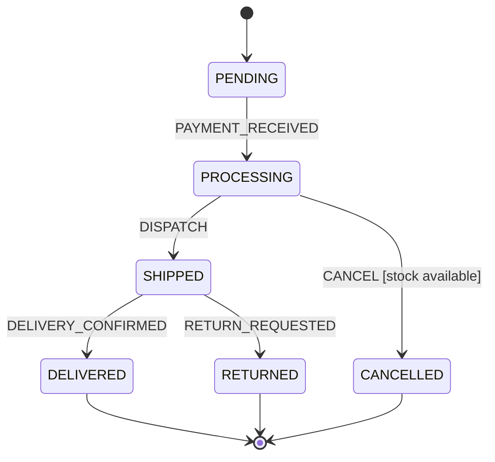

# Spring State Machine

[← Back to README](../README.md)

---

**Spring State Machine** models entities that move through a defined set of states via events, with guards that control whether transitions fire and actions that execute on entry/exit. Compared to a `status` field with conditional logic scattered across services, a state machine makes the allowed transitions explicit, testable, and auditable. Common use cases: order lifecycles, approval workflows, device state management, onboarding flows.



---

## Dependency

```xml
<dependency>
    <groupId>org.springframework.statemachine</groupId>
    <artifactId>spring-statemachine-core</artifactId>
    <version>4.0.0</version>
</dependency>
<!-- Optional: persist state to Redis or JPA -->
<dependency>
    <groupId>org.springframework.statemachine</groupId>
    <artifactId>spring-statemachine-data-jpa</artifactId>
    <version>4.0.0</version>
</dependency>
```

---

## States and Events

```java
public enum OrderState {
    PENDING, PROCESSING, SHIPPED, DELIVERED, CANCELLED, RETURNED
}

public enum OrderEvent {
    PAYMENT_RECEIVED, DISPATCH, DELIVERY_CONFIRMED,
    CANCEL, RETURN_REQUESTED
}
```

---

## State Machine Configuration

```java
@Configuration
@EnableStateMachine
public class OrderStateMachineConfig
        extends StateMachineConfigurerAdapter<OrderState, OrderEvent> {

    @Override
    public void configure(StateMachineStateConfigurer<OrderState, OrderEvent> states)
            throws Exception {
        states
            .withStates()
            .initial(OrderState.PENDING)
            .states(EnumSet.allOf(OrderState.class))
            .end(OrderState.DELIVERED)
            .end(OrderState.CANCELLED)
            .end(OrderState.RETURNED);
    }

    @Override
    public void configure(StateMachineTransitionConfigurer<OrderState, OrderEvent> transitions)
            throws Exception {
        transitions
            .withExternal()
                .source(OrderState.PENDING).target(OrderState.PROCESSING)
                .event(OrderEvent.PAYMENT_RECEIVED)
                .action(onPaymentReceived())
                .and()
            .withExternal()
                .source(OrderState.PROCESSING).target(OrderState.SHIPPED)
                .event(OrderEvent.DISPATCH)
                .guard(stockAvailableGuard())
                .action(onDispatched())
                .and()
            .withExternal()
                .source(OrderState.PROCESSING).target(OrderState.CANCELLED)
                .event(OrderEvent.CANCEL)
                .action(onCancelled())
                .and()
            .withExternal()
                .source(OrderState.SHIPPED).target(OrderState.DELIVERED)
                .event(OrderEvent.DELIVERY_CONFIRMED)
                .and()
            .withExternal()
                .source(OrderState.SHIPPED).target(OrderState.RETURNED)
                .event(OrderEvent.RETURN_REQUESTED);
    }

    @Bean
    public Action<OrderState, OrderEvent> onPaymentReceived() {
        return ctx -> {
            String orderId = ctx.getMessageHeaders().get("orderId", String.class);
            log.info("Payment received for order {}", orderId);
            // Update DB, send notifications, etc.
        };
    }

    @Bean
    public Action<OrderState, OrderEvent> onDispatched() {
        return ctx -> {
            String orderId = ctx.getMessageHeaders().get("orderId", String.class);
            log.info("Order {} dispatched", orderId);
        };
    }

    @Bean
    public Action<OrderState, OrderEvent> onCancelled() {
        return ctx -> log.info("Order cancelled — refund initiated");
    }

    @Bean
    public Guard<OrderState, OrderEvent> stockAvailableGuard() {
        return ctx -> {
            String sku = ctx.getMessageHeaders().get("sku", String.class);
            return inventoryService.isAvailable(sku, 1);
        };
    }
}
```

---

## Sending Events

```java
@Service
@RequiredArgsConstructor
public class OrderStateMachineService {

    private final StateMachine<OrderState, OrderEvent> stateMachine;

    public boolean sendEvent(String orderId, OrderEvent event,
                             Map<String, Object> headers) {
        Message<OrderEvent> message = MessageBuilder
            .withPayload(event)
            .setHeader("orderId", orderId)
            .copyHeaders(headers)
            .build();

        return stateMachine.sendEvent(Mono.just(message))
            .blockFirst()
            .getResultType() == StateMachineEventResult.ResultType.ACCEPTED;
    }

    public OrderState getCurrentState() {
        return stateMachine.getState().getId();
    }
}

// REST controller
@PostMapping("/orders/{id}/events")
public ResponseEntity<String> sendEvent(@PathVariable String id,
                                         @RequestBody OrderEvent event) {
    boolean accepted = stateMachineService.sendEvent(id, event, Map.of("orderId", id));
    return accepted
        ? ResponseEntity.ok("Event accepted")
        : ResponseEntity.badRequest().body("Event rejected by guard or not valid for current state");
}
```

---

## Persisting State — JPA

```java
@Entity
@Table(name = "order_state_machine")
public class OrderStateMachineEntity extends AbstractJpaRepositoryEntity<OrderState, OrderEvent> {
    // Provided by spring-statemachine-data-jpa; stores serialized state context
}

@Configuration
public class PersistConfig {

    @Bean
    public StateMachineRuntimePersister<OrderState, OrderEvent, String> stateMachineRuntimePersister(
            JpaStateMachineRepository jpaStateMachineRepository) {
        return new JpaPersistingStateMachineInterceptor<>(jpaStateMachineRepository);
    }
}

// Load/restore machine per-entity (e.g., per order)
@Service
@RequiredArgsConstructor
public class OrderWorkflowService {

    private final StateMachineFactory<OrderState, OrderEvent> factory;
    private final StateMachineRuntimePersister<OrderState, OrderEvent, String> persister;

    public StateMachine<OrderState, OrderEvent> acquireMachine(String orderId) throws Exception {
        StateMachine<OrderState, OrderEvent> sm = factory.getStateMachine(orderId);
        sm.getStateMachineAccessor()
            .doWithAllRegions(access -> access.addStateMachineInterceptor(
                persister.getInterceptor()));
        persister.restore(sm, orderId);
        sm.startReactively().subscribe();
        return sm;
    }

    public void transition(String orderId, OrderEvent event) throws Exception {
        StateMachine<OrderState, OrderEvent> sm = acquireMachine(orderId);
        sm.sendEvent(Mono.just(MessageBuilder.withPayload(event).build())).blockFirst();
        persister.persist(sm, orderId);
    }
}
```

---

## State Machine Listeners

```java
@Component
public class OrderStateListener extends StateMachineListenerAdapter<OrderState, OrderEvent> {

    @Override
    public void stateChanged(State<OrderState, OrderEvent> from,
                              State<OrderState, OrderEvent> to) {
        log.info("State changed: {} → {}",
            from == null ? "INITIAL" : from.getId(),
            to.getId());
    }

    @Override
    public void eventNotAccepted(Message<OrderEvent> event) {
        log.warn("Event not accepted: {}", event.getPayload());
    }

    @Override
    public void stateMachineError(StateMachine<OrderState, OrderEvent> sm, Exception ex) {
        log.error("State machine error", ex);
    }
}

// Register the listener in config
@Override
public void configure(StateMachineConfigurationConfigurer<OrderState, OrderEvent> config)
        throws Exception {
    config.withConfiguration()
        .listener(orderStateListener)
        .autoStartup(true);
}
```

---

## Testing State Machines

```java
@SpringBootTest
class OrderStateMachineTest {

    @Autowired
    private StateMachine<OrderState, OrderEvent> stateMachine;

    @BeforeEach
    void reset() throws Exception {
        stateMachine.stopReactively().block();
        stateMachine.startReactively().block();
    }

    @Test
    void happyPath() {
        StateMachineTestPlan<OrderState, OrderEvent> plan =
            StateMachineTestPlanBuilder.<OrderState, OrderEvent>builder()
                .stateMachine(stateMachine)
                .step().expectState(OrderState.PENDING).and()
                .step().sendEvent(OrderEvent.PAYMENT_RECEIVED)
                       .expectState(OrderState.PROCESSING).and()
                .step().sendEvent(OrderEvent.DISPATCH)
                       .expectState(OrderState.SHIPPED).and()
                .step().sendEvent(OrderEvent.DELIVERY_CONFIRMED)
                       .expectState(OrderState.DELIVERED).and()
                .build();

        plan.test();
    }

    @Test
    void cancelFromProcessing() {
        StateMachineTestPlanBuilder.<OrderState, OrderEvent>builder()
            .stateMachine(stateMachine)
            .step().sendEvent(OrderEvent.PAYMENT_RECEIVED).and()
            .step().sendEvent(OrderEvent.CANCEL).expectState(OrderState.CANCELLED).and()
            .build().test();
    }
}
```

---

## Spring State Machine Summary

| Concept | Detail |
|---------|--------|
| `@EnableStateMachine` | Activates state machine support; add to a `@Configuration` class |
| `StateMachineConfigurerAdapter` | Base class; override `configure(states)` and `configure(transitions)` |
| `withExternal()` | Transition that changes state; `.source()`, `.target()`, `.event()` |
| `Guard<S, E>` | Boolean condition; transition fires only if `guard.evaluate(ctx)` returns `true` |
| `Action<S, E>` | Side-effect callback; `ctx.getMessageHeaders()` provides event metadata |
| `State.initial()` | The starting state on machine creation |
| `State.end()` | Terminal state; machine stops accepting events |
| `StateMachineFactory` | Create per-entity state machines (`factory.getStateMachine(entityId)`) |
| JPA persister | Saves serialized machine state to DB; restore on next request |
| `StateMachineTestPlan` | Fluent DSL for step-by-step state machine test assertions |

---

[← Back to README](../README.md)
