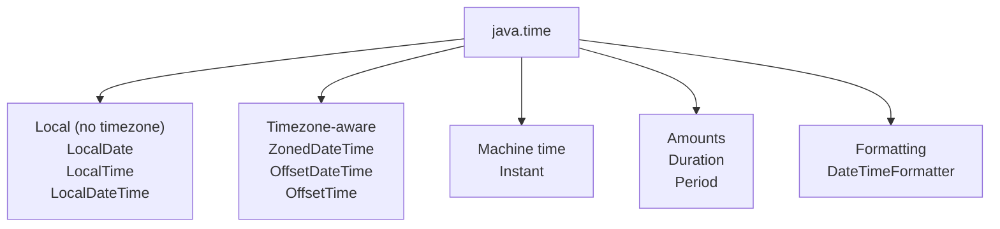

# Date and Time API

[← Back to README](../README.md)

---

Java 8 introduced `java.time` — a complete redesign of date/time handling. The old `java.util.Date` and `Calendar` classes are mutable, not thread-safe, and poorly designed. Always use `java.time` for new code.



---

## Core Classes

| Class | Represents | Example |
|-------|-----------|---------|
| `LocalDate` | A date (no time, no timezone) | `2026-06-14` |
| `LocalTime` | A time (no date, no timezone) | `14:30:00` |
| `LocalDateTime` | Date + time (no timezone) | `2026-06-14T14:30:00` |
| `ZonedDateTime` | Date + time + timezone | `2026-06-14T14:30:00+02:00[Africa/Johannesburg]` |
| `OffsetDateTime` | Date + time + UTC offset | `2026-06-14T14:30:00+02:00` |
| `Instant` | A point on the UTC timeline | `2026-06-14T12:30:00Z` |
| `Duration` | Amount of time (hours, minutes, seconds) | `PT2H30M` |
| `Period` | Amount of date (years, months, days) | `P1Y2M3D` |
| `ZoneId` | A timezone identifier | `Africa/Johannesburg` |

---

## LocalDate

```java
import java.time.LocalDate;

// create
LocalDate today    = LocalDate.now();
LocalDate specific = LocalDate.of(2026, 6, 14);
LocalDate parsed   = LocalDate.parse("2026-06-14");

// read
System.out.println(today.getYear());        // 2026
System.out.println(today.getMonth());       // JUNE
System.out.println(today.getMonthValue());  // 6
System.out.println(today.getDayOfMonth());  // 14
System.out.println(today.getDayOfWeek());   // SATURDAY
System.out.println(today.isLeapYear());     // false

// manipulate — all java.time objects are immutable
LocalDate tomorrow    = today.plusDays(1);
LocalDate nextMonth   = today.plusMonths(1);
LocalDate lastYear    = today.minusYears(1);
LocalDate firstOfMonth = today.withDayOfMonth(1);

// compare
System.out.println(today.isBefore(tomorrow));  // true
System.out.println(today.isAfter(lastYear));   // true
System.out.println(today.isEqual(specific));   // depends on today

// useful queries
LocalDate end = LocalDate.of(2026, 12, 31);
System.out.println(today.until(end).getDays());  // days until end of year
System.out.println(today.lengthOfMonth());        // days in current month
System.out.println(today.lengthOfYear());         // 365 or 366
```

---

## LocalTime

```java
import java.time.LocalTime;

LocalTime now      = LocalTime.now();
LocalTime specific = LocalTime.of(14, 30, 0);
LocalTime parsed   = LocalTime.parse("14:30:00");

System.out.println(now.getHour());    // 14
System.out.println(now.getMinute());  // 30
System.out.println(now.getSecond());  // 0

LocalTime later  = now.plusHours(2).plusMinutes(30);
LocalTime earlier = now.minusMinutes(45);

System.out.println(now.isBefore(later));  // true

// midnight and noon constants
LocalTime midnight = LocalTime.MIDNIGHT;  // 00:00
LocalTime noon     = LocalTime.NOON;      // 12:00
```

---

## LocalDateTime

```java
import java.time.LocalDateTime;

LocalDateTime now      = LocalDateTime.now();
LocalDateTime specific = LocalDateTime.of(2026, 6, 14, 14, 30, 0);
LocalDateTime parsed   = LocalDateTime.parse("2026-06-14T14:30:00");

// combine date and time
LocalDate     date = LocalDate.of(2026, 6, 14);
LocalTime     time = LocalTime.of(14, 30);
LocalDateTime dt   = LocalDateTime.of(date, time);

// extract parts
LocalDate datePart = dt.toLocalDate();
LocalTime timePart = dt.toLocalTime();

// manipulate
LocalDateTime nextWeek = now.plusWeeks(1);
LocalDateTime adjusted = now.withHour(9).withMinute(0).withSecond(0);
```

---

## ZonedDateTime

Use `ZonedDateTime` whenever you need to work across timezones.

```java
import java.time.*;

ZonedDateTime now = ZonedDateTime.now();
ZonedDateTime joBurg = ZonedDateTime.now(ZoneId.of("Africa/Johannesburg"));
ZonedDateTime utc    = ZonedDateTime.now(ZoneOffset.UTC);
ZonedDateTime london = ZonedDateTime.now(ZoneId.of("Europe/London"));
ZonedDateTime ny     = ZonedDateTime.now(ZoneId.of("America/New_York"));

System.out.println(joBurg);  // 2026-06-14T14:30:00+02:00[Africa/Johannesburg]

// convert between timezones
ZonedDateTime inTokyo = joBurg.withZoneSameInstant(ZoneId.of("Asia/Tokyo"));

// list all available zone IDs
ZoneId.getAvailableZoneIds().stream()
      .filter(z -> z.startsWith("Africa"))
      .sorted()
      .forEach(System.out::println);
```

---

## Instant

`Instant` represents a single point on the UTC timeline — best for storing timestamps in databases or logs.

```java
import java.time.Instant;

Instant now   = Instant.now();
Instant epoch = Instant.EPOCH;  // 1970-01-01T00:00:00Z

System.out.println(now.toEpochMilli());  // milliseconds since epoch
System.out.println(now.getEpochSecond()); // seconds since epoch

// convert to ZonedDateTime for display
ZonedDateTime zdt = now.atZone(ZoneId.of("Africa/Johannesburg"));

// convert back to Instant
Instant back = zdt.toInstant();

// add/subtract
Instant later = now.plusSeconds(3600);  // 1 hour later
```

---

## Duration and Period

`Duration` measures time-based amounts (hours, minutes, seconds, nanos).
`Period` measures date-based amounts (years, months, days).

```java
import java.time.*;

// Duration — for time
Duration twoHours     = Duration.ofHours(2);
Duration ninetyMins   = Duration.ofMinutes(90);
Duration fromString   = Duration.parse("PT2H30M");  // 2 hours 30 minutes

LocalTime start = LocalTime.of(9, 0);
LocalTime end   = LocalTime.of(17, 30);
Duration workDay = Duration.between(start, end);
System.out.println(workDay.toHours());    // 8
System.out.println(workDay.toMinutes());  // 510

// Period — for dates
Period oneYear      = Period.ofYears(1);
Period threeMonths  = Period.ofMonths(3);
Period fromString2  = Period.parse("P1Y2M3D");  // 1 year 2 months 3 days

LocalDate birthday = LocalDate.of(1995, 3, 14);
Period age = Period.between(birthday, LocalDate.now());
System.out.println(age.getYears() + " years old");

// days between two dates
long daysBetween = java.time.temporal.ChronoUnit.DAYS.between(
    LocalDate.of(2026, 1, 1),
    LocalDate.of(2026, 12, 31)
);
System.out.println(daysBetween);  // 364
```

---

## DateTimeFormatter

```java
import java.time.format.DateTimeFormatter;
import java.util.Locale;

LocalDateTime dt = LocalDateTime.of(2026, 6, 14, 14, 30, 0);

// predefined formatters
System.out.println(dt.format(DateTimeFormatter.ISO_LOCAL_DATE));      // 2026-06-14
System.out.println(dt.format(DateTimeFormatter.ISO_LOCAL_DATE_TIME)); // 2026-06-14T14:30:00

// custom patterns
DateTimeFormatter custom = DateTimeFormatter.ofPattern("dd/MM/yyyy HH:mm");
System.out.println(dt.format(custom));  // 14/06/2026 14:30

// with locale
DateTimeFormatter localised = DateTimeFormatter.ofPattern("EEEE, d MMMM yyyy", Locale.ENGLISH);
System.out.println(dt.format(localised));  // Sunday, 14 June 2026

// parse a string
LocalDate parsed = LocalDate.parse("14/06/2026",
    DateTimeFormatter.ofPattern("dd/MM/yyyy"));
System.out.println(parsed);  // 2026-06-14
```

### Common Pattern Letters

| Letter | Meaning | Example |
|--------|---------|---------|
| `yyyy` | 4-digit year | `2026` |
| `MM` | 2-digit month | `06` |
| `MMM` | Short month name | `Jun` |
| `MMMM` | Full month name | `June` |
| `dd` | 2-digit day | `14` |
| `EEE` | Short day name | `Sun` |
| `EEEE` | Full day name | `Sunday` |
| `HH` | Hour (00–23) | `14` |
| `hh` | Hour (01–12) | `02` |
| `mm` | Minutes | `30` |
| `ss` | Seconds | `00` |
| `a` | AM/PM | `PM` |
| `z` | Timezone name | `SAST` |
| `Z` | Timezone offset | `+0200` |

---

## Temporal Adjusters

Useful for "next Monday", "last day of month", etc.

```java
import java.time.temporal.TemporalAdjusters;
import java.time.DayOfWeek;

LocalDate today = LocalDate.now();

LocalDate nextMonday    = today.with(TemporalAdjusters.next(DayOfWeek.MONDAY));
LocalDate prevFriday    = today.with(TemporalAdjusters.previous(DayOfWeek.FRIDAY));
LocalDate firstOfMonth  = today.with(TemporalAdjusters.firstDayOfMonth());
LocalDate lastOfMonth   = today.with(TemporalAdjusters.lastDayOfMonth());
LocalDate firstOfYear   = today.with(TemporalAdjusters.firstDayOfYear());
LocalDate firstMondayOfMonth = today.with(TemporalAdjusters.firstInMonth(DayOfWeek.MONDAY));

// custom adjuster — next business day
var nextBusinessDay = TemporalAdjusters.ofDateAdjuster(date -> {
    DayOfWeek dow = date.getDayOfWeek();
    int daysToAdd = switch (dow) {
        case FRIDAY   -> 3;
        case SATURDAY -> 2;
        default       -> 1;
    };
    return date.plusDays(daysToAdd);
});

System.out.println(today.with(nextBusinessDay));
```

---

## Working with Legacy Date/Time

When interoperating with old APIs that use `java.util.Date` or `java.sql.Timestamp`:

```java
import java.time.*;
import java.util.Date;

// LocalDateTime → java.util.Date
LocalDateTime ldt = LocalDateTime.now();
Date legacy = Date.from(ldt.atZone(ZoneId.systemDefault()).toInstant());

// java.util.Date → LocalDateTime
LocalDateTime fromLegacy = legacy.toInstant()
    .atZone(ZoneId.systemDefault())
    .toLocalDateTime();

// java.sql.Date ↔ LocalDate
java.sql.Date sqlDate = java.sql.Date.valueOf(LocalDate.now());
LocalDate fromSql = sqlDate.toLocalDate();

// java.sql.Timestamp ↔ LocalDateTime
java.sql.Timestamp ts = java.sql.Timestamp.valueOf(LocalDateTime.now());
LocalDateTime fromTs = ts.toLocalDateTime();
```

---

## Date and Time Summary

| Need | Use |
|------|-----|
| Today's date | `LocalDate.now()` |
| Current time | `LocalTime.now()` |
| Current date + time | `LocalDateTime.now()` |
| Timezone-aware datetime | `ZonedDateTime.now(ZoneId.of("..."))` |
| UTC timestamp for storage | `Instant.now()` |
| Time between two times | `Duration.between()` |
| Days/months between dates | `Period.between()` |
| Format for display | `DateTimeFormatter.ofPattern()` |
| Parse a date string | `LocalDate.parse(str, formatter)` |
| "Next Monday" etc. | `TemporalAdjusters` |

---

[← Back to README](../README.md)
