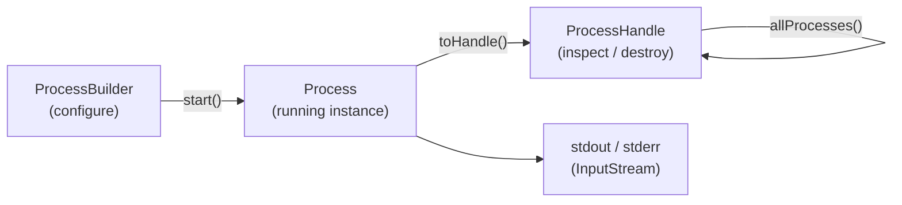

# Java Process API

[← Back to README](../README.md)

---

The **Java Process API** (`ProcessBuilder`, `Process`, `ProcessHandle`) lets you spawn, manage, and monitor OS-level subprocesses from Java. Use cases include running CLI tools (ffmpeg, pg_dump, openssl), executing shell scripts, managing child processes in a sidecar, and introspecting the current process tree. Java 9 significantly enhanced the API with `ProcessHandle` for process discovery and lifecycle management.



---

## ProcessBuilder Basics

```java
// Run a simple command
ProcessBuilder pb = new ProcessBuilder("ls", "-la", "/tmp");
pb.directory(new File("/tmp"));            // working directory
pb.environment().put("MY_VAR", "value");  // environment variables

Process process = pb.start();

// Read stdout
String output = new String(process.getInputStream().readAllBytes());

// Wait for completion with timeout
boolean finished = process.waitFor(30, TimeUnit.SECONDS);
if (!finished) {
    process.destroyForcibly();
    throw new TimeoutException("Command timed out");
}

int exitCode = process.exitValue();
if (exitCode != 0) {
    String stderr = new String(process.getErrorStream().readAllBytes());
    throw new RuntimeException("Command failed (exit " + exitCode + "): " + stderr);
}
```

---

## I/O Redirection

```java
Path outputFile = Path.of("/tmp/pg_dump.sql");
Path errorLog   = Path.of("/tmp/pg_dump.err");

ProcessBuilder pb = new ProcessBuilder(
    "pg_dump", "-h", "localhost", "-U", "postgres", "mydb");

pb.redirectOutput(outputFile.toFile());     // stdout → file
pb.redirectError(errorLog.toFile());        // stderr → file
// pb.redirectErrorStream(true);            // merge stderr into stdout

Process process = pb.start();
int exitCode = process.waitFor();
```

```java
// Inherit parent's stdin/stdout/stderr (useful for interactive CLIs)
ProcessBuilder pb = new ProcessBuilder("psql", "-U", "postgres");
pb.inheritIO();
Process process = pb.start();
process.waitFor();
```

---

## Async Process with CompletableFuture

```java
@Service
public class VideoTranscodeService {

    public CompletableFuture<Path> transcodeAsync(Path input, Path output) {
        return CompletableFuture.supplyAsync(() -> {
            try {
                ProcessBuilder pb = new ProcessBuilder(
                    "ffmpeg", "-i", input.toString(),
                    "-c:v", "libx264", "-preset", "fast",
                    "-y", output.toString());

                pb.redirectErrorStream(true);

                Process process = pb.start();

                // Stream output in real-time
                try (BufferedReader reader = new BufferedReader(
                        new InputStreamReader(process.getInputStream()))) {
                    reader.lines().forEach(line -> log.debug("ffmpeg: {}", line));
                }

                int exitCode = process.waitFor();
                if (exitCode != 0) {
                    throw new RuntimeException("ffmpeg failed with exit code " + exitCode);
                }
                return output;

            } catch (IOException | InterruptedException e) {
                Thread.currentThread().interrupt();
                throw new RuntimeException("Transcode failed", e);
            }
        });
    }
}
```

---

## Process.onExit() — Non-Blocking Completion

```java
Process process = new ProcessBuilder("long-running-tool").start();

// Non-blocking — returns a CompletableFuture<Process>
process.onExit()
    .thenAccept(p -> log.info("Process exited with code {}", p.exitValue()))
    .exceptionally(ex -> {
        log.error("Process failed", ex);
        return null;
    });

log.info("Doing other work while process runs...");
```

---

## ProcessHandle — Inspection and Management

```java
// Current process
ProcessHandle self = ProcessHandle.current();
log.info("PID: {}", self.pid());
log.info("Command: {}", self.info().command().orElse("unknown"));
log.info("Start time: {}", self.info().startInstant().orElse(null));

// Children and descendants
Process child = new ProcessBuilder("sleep", "60").start();
ProcessHandle handle = child.toHandle();

handle.info().command().ifPresent(cmd -> log.info("Child command: {}", cmd));
handle.children().forEach(ch ->
    log.info("Child PID: {}", ch.pid()));
handle.descendants().forEach(d ->
    log.info("Descendant PID: {}", d.pid()));

// Destroy forcibly and wait
handle.destroyForcibly();
handle.onExit().get(5, TimeUnit.SECONDS);
```

---

## Discovering All Processes

```java
// Snapshot of all running processes (requires OS permissions)
ProcessHandle.allProcesses()
    .filter(ph -> ph.info().command()
        .map(cmd -> cmd.contains("java"))
        .orElse(false))
    .forEach(ph -> {
        ProcessHandle.Info info = ph.info();
        log.info("PID={} cmd={} user={} cpu={}",
            ph.pid(),
            info.command().orElse("?"),
            info.user().orElse("?"),
            info.totalCpuDuration().orElse(Duration.ZERO));
    });
```

---

## Pipeline — Chaining Processes

```java
// Equivalent to: cat input.txt | grep "ERROR" | wc -l
List<ProcessBuilder> pipeline = List.of(
    new ProcessBuilder("cat", "input.txt"),
    new ProcessBuilder("grep", "ERROR"),
    new ProcessBuilder("wc", "-l")
);

List<Process> processes = ProcessBuilder.startPipeline(pipeline);

// Read output of the last process
Process last = processes.get(processes.size() - 1);
String count = new String(last.getInputStream().readAllBytes()).trim();
log.info("ERROR lines: {}", count);

// Wait for all
for (Process p : processes) {
    p.waitFor();
}
```

---

## Secure Command Construction

```java
// NEVER build commands via string concatenation — command injection risk!
// BAD:
// Runtime.getRuntime().exec("ls -la " + userInput);   // injection!

// GOOD: always pass arguments as separate list elements
public void listDirectory(String directory) throws IOException {
    // Validate first
    Path path = Path.of(directory).toRealPath();   // resolves symlinks, throws if not found

    ProcessBuilder pb = new ProcessBuilder("ls", "-la", path.toString());
    // Each argument is a separate element — no shell interpretation
    pb.start();
}

// For shell features (pipes, redirects), use the shell explicitly and sanitize
ProcessBuilder pb = new ProcessBuilder(
    "sh", "-c", "find /var/log -name '*.log' -newer /tmp/marker");
```

---

## Utility Wrapper

```java
@Component
public class ShellRunner {

    public ShellResult run(List<String> command, Duration timeout) throws IOException {
        ProcessBuilder pb = new ProcessBuilder(command).redirectErrorStream(true);
        Process process = pb.start();

        try {
            String output = new String(process.getInputStream().readAllBytes());
            boolean finished = process.waitFor(timeout.toMillis(), TimeUnit.MILLISECONDS);

            if (!finished) {
                process.destroyForcibly();
                throw new TimeoutException("Command timed out after " + timeout);
            }

            return new ShellResult(process.exitValue(), output);
        } catch (InterruptedException e) {
            Thread.currentThread().interrupt();
            process.destroyForcibly();
            throw new RuntimeException("Interrupted", e);
        }
    }

    public record ShellResult(int exitCode, String output) {
        public boolean succeeded() { return exitCode == 0; }
    }
}
```

---

## Java Process API Summary

| Concept | Detail |
|---------|--------|
| `ProcessBuilder(cmd, args...)` | Configure command, environment, working directory, I/O redirection |
| `pb.redirectOutput(file)` | Redirect stdout to a `File`; `redirectError` for stderr |
| `pb.redirectErrorStream(true)` | Merge stderr into stdout stream |
| `pb.inheritIO()` | Child process shares parent's stdin/stdout/stderr (interactive mode) |
| `process.waitFor(n, unit)` | Block with timeout; returns `false` if timeout expired |
| `process.onExit()` | Returns `CompletableFuture<Process>` — non-blocking completion hook |
| `process.destroyForcibly()` | SIGKILL on Unix; `TerminateProcess` on Windows |
| `ProcessHandle.current()` | Current JVM's `ProcessHandle` — access PID, command, CPU time |
| `ProcessHandle.allProcesses()` | Snapshot of all visible processes on the system |
| `ProcessBuilder.startPipeline(list)` | Chain multiple processes with stdout→stdin piping |
| Command injection | Never build commands via string concatenation; pass each arg as a separate list element |

---

[← Back to README](../README.md)
