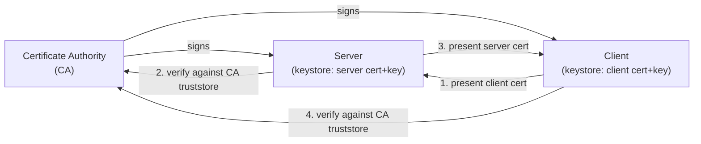

# mTLS & Certificate Management

[← Back to README](../README.md)

---

**Mutual TLS (mTLS)** extends standard TLS by requiring the *client* to also present a certificate during the handshake. Both parties authenticate each other — eliminating the need for API keys or bearer tokens on service-to-service calls. This is the security model used by service meshes (Istio, Linkerd) and is increasingly required for zero-trust internal networks.



---

## Generating Certificates with keytool

```bash
# 1. Create a CA (self-signed root certificate)
keytool -genkeypair \
  -alias ca \
  -keyalg RSA -keysize 4096 \
  -validity 3650 \
  -dname "CN=Acme CA, O=Acme Corp, C=ZA" \
  -ext bc:c \
  -keystore ca.p12 \
  -storetype PKCS12 \
  -storepass ca-secret

# 2. Export the CA certificate (public key)
keytool -exportcert -alias ca -keystore ca.p12 -storepass ca-secret \
  -file ca.crt -rfc

# 3. Generate server keypair
keytool -genkeypair \
  -alias server \
  -keyalg RSA -keysize 2048 \
  -validity 730 \
  -dname "CN=api.acme.example.com, O=Acme Corp, C=ZA" \
  -keystore server.p12 \
  -storetype PKCS12 \
  -storepass server-secret

# 4. Sign server cert with CA
keytool -certreq -alias server -keystore server.p12 -storepass server-secret | \
keytool -gencert -alias ca -keystore ca.p12 -storepass ca-secret \
  -ext san=dns:api.acme.example.com \
  -validity 730 -rfc > server-signed.crt

keytool -importcert -alias ca     -file ca.crt        -keystore server.p12 -storepass server-secret -noprompt
keytool -importcert -alias server -file server-signed.crt -keystore server.p12 -storepass server-secret

# 5. Create server truststore (trusts the CA → accepts client certs signed by CA)
keytool -importcert -alias ca -file ca.crt -keystore server-truststore.p12 \
  -storetype PKCS12 -storepass trust-secret -noprompt

# 6. Generate and sign client keypair (same process as server)
keytool -genkeypair -alias client -keyalg RSA -keysize 2048 \
  -dname "CN=order-service, O=Acme Corp, C=ZA" \
  -keystore client.p12 -storetype PKCS12 -storepass client-secret

# (sign client cert with CA — same steps 4-5 as server)
```

---

## Spring Boot Server — TLS + Require Client Certificate

```yaml
# application.yml
server:
  port: 8443
  ssl:
    enabled: true
    key-store: classpath:certs/server.p12
    key-store-password: ${SERVER_KEYSTORE_PASSWORD}
    key-store-type: PKCS12
    key-alias: server
    trust-store: classpath:certs/server-truststore.p12
    trust-store-password: ${SERVER_TRUSTSTORE_PASSWORD}
    trust-store-type: PKCS12
    client-auth: need    # need = require client cert; want = optional; none = TLS only
```

---

## RestClient / WebClient with Client Certificate

```java
@Configuration
public class MtlsClientConfig {

    @Bean
    public SSLContext sslContext(
            @Value("${client.keystore.path}") Resource keystoreResource,
            @Value("${client.keystore.password}") String keystorePassword,
            @Value("${client.truststore.path}") Resource truststoreResource,
            @Value("${client.truststore.password}") String truststorePassword) throws Exception {

        KeyStore keyStore = KeyStore.getInstance("PKCS12");
        keyStore.load(keystoreResource.getInputStream(),
            keystorePassword.toCharArray());

        KeyStore trustStore = KeyStore.getInstance("PKCS12");
        trustStore.load(truststoreResource.getInputStream(),
            truststorePassword.toCharArray());

        KeyManagerFactory kmf = KeyManagerFactory.getInstance(
            KeyManagerFactory.getDefaultAlgorithm());
        kmf.init(keyStore, keystorePassword.toCharArray());

        TrustManagerFactory tmf = TrustManagerFactory.getInstance(
            TrustManagerFactory.getDefaultAlgorithm());
        tmf.init(trustStore);

        SSLContext sslContext = SSLContext.getInstance("TLS");
        sslContext.init(kmf.getKeyManagers(), tmf.getTrustManagers(), null);
        return sslContext;
    }

    @Bean
    public RestClient mtlsRestClient(SSLContext sslContext) throws Exception {
        SSLConnectionSocketFactory sslFactory =
            new SSLConnectionSocketFactory(sslContext,
                new DefaultHostnameVerifier());

        CloseableHttpClient httpClient = HttpClients.custom()
            .setSSLSocketFactory(sslFactory)
            .build();

        return RestClient.builder()
            .requestFactory(new HttpComponentsClientHttpRequestFactory(httpClient))
            .baseUrl("https://api.acme.example.com")
            .build();
    }

    @Bean
    public WebClient mtlsWebClient(SSLContext sslContext) {
        SslContext nettySsl = SslContextBuilder.forClient()
            .keyManager(sslContext.getKeyManagers()[0])   // simplified; use real KeyManagerFactory
            .build();

        HttpClient httpClient = HttpClient.create()
            .secure(t -> t.sslContext(nettySsl));

        return WebClient.builder()
            .clientConnector(new ReactorClientHttpConnector(httpClient))
            .baseUrl("https://api.acme.example.com")
            .build();
    }
}
```

---

## Extracting the Client Certificate in a Controller

```java
@RestController
public class SecureEndpointController {

    @GetMapping("/api/service-info")
    public ServiceInfo serviceInfo(HttpServletRequest request) {
        X509Certificate[] certs =
            (X509Certificate[]) request.getAttribute(
                "jakarta.servlet.request.X509Certificate");

        if (certs == null || certs.length == 0) {
            throw new ResponseStatusException(HttpStatus.UNAUTHORIZED,
                "Client certificate required");
        }

        X509Certificate clientCert = certs[0];
        String subject = clientCert.getSubjectX500Principal().getName();
        String cn = extractCN(subject);   // "CN=order-service"

        log.info("Authenticated service: {}", cn);
        return new ServiceInfo(cn, clientCert.getNotAfter().toInstant());
    }

    private String extractCN(String dn) {
        return Arrays.stream(dn.split(","))
            .map(String::trim)
            .filter(s -> s.startsWith("CN="))
            .findFirst()
            .map(s -> s.substring(3))
            .orElse("unknown");
    }
}
```

---

## JVM SSL System Properties

```bash
# Point JVM to system truststore (useful for custom CAs)
java -Djavax.net.ssl.trustStore=/path/to/truststore.p12 \
     -Djavax.net.ssl.trustStorePassword=secret \
     -Djavax.net.ssl.trustStoreType=PKCS12 \
     -jar app.jar

# Debug TLS handshake
java -Djavax.net.debug=ssl:handshake -jar app.jar

# Disable hostname verification (NEVER in production)
# -Djavax.net.ssl.hostnameVerification=false  ← don't do this
```

---

## Certificate Rotation

```java
// Hot-reload certificates without restart using SSLContext factory
@Component
@RequiredArgsConstructor
public class ReloadableSslContextFactory {

    @Value("${client.keystore.path}") private Resource keystorePath;
    @Value("${client.keystore.password}") private String password;

    private volatile SSLContext sslContext;

    @PostConstruct
    public void init() throws Exception { reload(); }

    @Scheduled(fixedRate = 3_600_000)   // check hourly
    public void reload() throws Exception {
        KeyStore ks = KeyStore.getInstance("PKCS12");
        ks.load(keystorePath.getInputStream(), password.toCharArray());

        KeyManagerFactory kmf = KeyManagerFactory.getInstance(
            KeyManagerFactory.getDefaultAlgorithm());
        kmf.init(ks, password.toCharArray());

        SSLContext ctx = SSLContext.getInstance("TLS");
        ctx.init(kmf.getKeyManagers(), null, null);
        this.sslContext = ctx;           // atomic reference swap
        log.info("SSL context reloaded");
    }

    public SSLContext get() { return sslContext; }
}
```

---

## mTLS Summary

| Concept | Detail |
|---------|--------|
| mTLS | Both client AND server present certificates; eliminates token-based auth for service calls |
| `server.ssl.client-auth: need` | Spring Boot: require client certificate; `want` = optional |
| `key-store` | Contains the service's own private key and signed certificate |
| `trust-store` | Contains the CA certificate(s) used to verify the other party's cert |
| PKCS12 | Preferred modern keystore format (`.p12`); replaces JKS |
| `keytool -gencert` | Sign a CSR with a CA key; creates a CA-signed certificate |
| `X509Certificate[]` from `HttpServletRequest` | Extract client cert in controller via `jakarta.servlet.request.X509Certificate` |
| `javax.net.debug=ssl:handshake` | JVM flag to dump TLS handshake details for debugging |
| Certificate rotation | Reload `SSLContext` periodically without restart; swap volatile reference |
| SAN extension | Subject Alternative Name (`-ext san=dns:hostname`) — required by modern TLS clients |

---

[← Back to README](../README.md)
