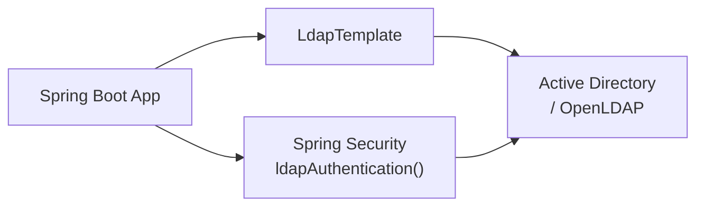

# Spring LDAP

[← Back to README](../README.md)

---

**LDAP** (Lightweight Directory Access Protocol) is the standard protocol for enterprise directories — Active Directory, OpenLDAP, FreeIPA. Spring LDAP provides `LdapTemplate` for querying and modifying directory entries, `@LdapRepository` for Spring Data-style repositories, and integration with Spring Security for authenticating users against a directory. It is the standard solution when users are managed centrally in an organisation.



---

## Dependency

```xml
<dependency>
    <groupId>org.springframework.boot</groupId>
    <artifactId>spring-boot-starter-data-ldap</artifactId>
</dependency>
```

---

## Configuration

```yaml
spring:
  ldap:
    urls: ldap://ldap.acme.example.com:389
    base: dc=acme,dc=example,dc=com
    username: cn=readonly-svc,ou=Service Accounts,dc=acme,dc=example,dc=com
    password: ${LDAP_PASSWORD}
    # For TLS (LDAPS):
    # urls: ldaps://ldap.acme.example.com:636
    # ssl:
    #   trust-store: classpath:ldap-truststore.p12
    #   trust-store-password: ${LDAP_TRUSTSTORE_PASSWORD}
```

---

## LdapTemplate — Querying the Directory

```java
@Service
@RequiredArgsConstructor
public class LdapUserService {

    private final LdapTemplate ldapTemplate;

    public List<LdapUser> searchByDepartment(String department) {
        LdapQuery query = LdapQueryBuilder.query()
            .base("ou=Users")
            .where("objectClass").is("person")
            .and("department").is(department);

        return ldapTemplate.search(query, new LdapUserAttributesMapper());
    }

    public Optional<LdapUser> findByUsername(String username) {
        LdapQuery query = LdapQueryBuilder.query()
            .base("ou=Users")
            .where("sAMAccountName").is(username);   // AD attribute

        List<LdapUser> results = ldapTemplate.search(query, new LdapUserAttributesMapper());
        return results.isEmpty() ? Optional.empty() : Optional.of(results.get(0));
    }

    public List<String> getUserGroups(String username) {
        LdapQuery query = LdapQueryBuilder.query()
            .base("ou=Groups")
            .where("objectClass").is("group")
            .and("member").like("*" + username + "*");

        return ldapTemplate.search(query,
            (AttributesMapper<String>) attrs -> (String) attrs.get("cn").get());
    }

    // Raw attributes mapper
    private static class LdapUserAttributesMapper implements AttributesMapper<LdapUser> {
        @Override
        public LdapUser mapFromAttributes(Attributes attrs) throws NamingException {
            return new LdapUser(
                getAttr(attrs, "sAMAccountName"),
                getAttr(attrs, "givenName"),
                getAttr(attrs, "sn"),
                getAttr(attrs, "mail"),
                getAttr(attrs, "department"),
                getAttr(attrs, "telephoneNumber")
            );
        }

        private String getAttr(Attributes attrs, String name) throws NamingException {
            Attribute attr = attrs.get(name);
            return attr == null ? null : (String) attr.get();
        }
    }
}

public record LdapUser(String username, String firstName, String lastName,
                        String email, String department, String phone) {}
```

---

## Object-Directory Mapper (ODM)

```java
@Entry(base = "ou=Users", objectClasses = {"top", "person", "organizationalPerson", "user"})
public class LdapPerson {

    @Id
    private Name dn;   // Distinguished Name — full path in the tree

    @Attribute(name = "sAMAccountName")
    private String username;

    @Attribute(name = "givenName")
    private String firstName;

    @Attribute(name = "sn")
    private String lastName;

    @Attribute(name = "mail")
    private String email;

    @Attribute(name = "department")
    private String department;

    @Attribute(name = "memberOf")
    private List<String> groups;
}

// Repository — same as Spring Data JPA
public interface LdapPersonRepository extends LdapRepository<LdapPerson> {
    List<LdapPerson> findByDepartment(String department);
    Optional<LdapPerson> findByUsername(String username);
    List<LdapPerson> findByLastNameStartingWith(String prefix);
}
```

---

## Modifying LDAP Entries

```java
@Service
@RequiredArgsConstructor
public class LdapAdminService {

    private final LdapTemplate ldapTemplate;

    public void createUser(NewUserRequest request) {
        Name dn = LdapNameBuilder.newInstance()
            .add("ou", "Users")
            .add("cn", request.firstName() + " " + request.lastName())
            .build();

        DirContextAdapter context = new DirContextAdapter(dn);
        context.setAttributeValues("objectClass", new String[]{"top", "person", "user"});
        context.setAttributeValue("sAMAccountName", request.username());
        context.setAttributeValue("givenName",      request.firstName());
        context.setAttributeValue("sn",             request.lastName());
        context.setAttributeValue("mail",           request.email());

        ldapTemplate.bind(context);
    }

    public void updateEmail(String username, String newEmail) {
        LdapQuery query = LdapQueryBuilder.query()
            .where("sAMAccountName").is(username);

        ldapTemplate.search(query, (ContextMapper<Void>) ctx -> {
            DirContextOperations context = (DirContextOperations) ctx;
            context.setAttributeValue("mail", newEmail);
            ldapTemplate.modifyAttributes(context);
            return null;
        });
    }

    public void deleteUser(String dn) {
        ldapTemplate.unbind(LdapNameBuilder.newInstance(dn).build());
    }

    public void addToGroup(String groupDn, String userDn) {
        ModificationItem item = new ModificationItem(
            DirContext.ADD_ATTRIBUTE,
            new BasicAttribute("member", userDn));
        ldapTemplate.modifyAttributes(groupDn, new ModificationItem[]{item});
    }
}
```

---

## Spring Security — LDAP Authentication

```java
@Configuration
@EnableWebSecurity
public class LdapSecurityConfig {

    @Bean
    public SecurityFilterChain securityFilterChain(HttpSecurity http) throws Exception {
        http
            .authorizeHttpRequests(auth -> auth
                .requestMatchers("/public/**").permitAll()
                .anyRequest().authenticated()
            )
            .formLogin(Customizer.withDefaults());
        return http.build();
    }

    @Bean
    public AuthenticationManager authenticationManager(
            BaseLdapPathContextSource contextSource) throws Exception {
        LdapBindAuthenticationManagerFactory factory =
            new LdapBindAuthenticationManagerFactory(contextSource);

        // Active Directory: authenticate by binding as the user
        factory.setUserDnPatterns("cn={0},ou=Users,dc=acme,dc=example,dc=com");

        // OR: search for user first, then bind
        factory.setUserSearchBase("ou=Users");
        factory.setUserSearchFilter("(sAMAccountName={0})");

        // Map LDAP groups to Spring roles
        factory.setLdapAuthoritiesPopulator(ldapAuthoritiesPopulator(contextSource));

        return factory.createAuthenticationManager();
    }

    @Bean
    public LdapAuthoritiesPopulator ldapAuthoritiesPopulator(
            BaseLdapPathContextSource contextSource) {
        DefaultLdapAuthoritiesPopulator populator =
            new DefaultLdapAuthoritiesPopulator(contextSource, "ou=Groups");
        populator.setGroupSearchFilter("(member={0})");
        populator.setGroupRoleAttribute("cn");
        populator.setRolePrefix("ROLE_");
        populator.setConvertToUpperCase(true);
        return populator;
    }
}
```

---

## Active Directory — Nested Group Membership

```java
// AD supports recursive group membership via LDAP_MATCHING_RULE_IN_CHAIN
@Service
@RequiredArgsConstructor
public class AdGroupService {

    private final LdapTemplate ldapTemplate;

    public List<String> getTransitiveGroups(String userDn) {
        // 1.2.840.113556.1.4.1941 = LDAP_MATCHING_RULE_IN_CHAIN (AD-specific)
        LdapQuery query = LdapQueryBuilder.query()
            .base("ou=Groups")
            .filter("(member:1.2.840.113556.1.4.1941:=" + userDn + ")");

        return ldapTemplate.search(query,
            (AttributesMapper<String>) attrs -> (String) attrs.get("cn").get());
    }
}
```

---

## Testing with Embedded LDAP

```java
@SpringBootTest
@TestPropertySource(properties = {
    "spring.ldap.urls=ldap://localhost:${local.server.port}",
    "spring.ldap.embedded.base-dn=dc=acme,dc=example,dc=com",
    "spring.ldap.embedded.ldif=classpath:test-users.ldif"
})
class LdapUserServiceTest {

    @Autowired LdapUserService ldapUserService;

    @Test
    void findsByDepartment() {
        List<LdapUser> engineers = ldapUserService.searchByDepartment("Engineering");
        assertThat(engineers).hasSize(3);
    }
}
```

```
# test-users.ldif
dn: dc=acme,dc=example,dc=com
objectClass: top
objectClass: domain

dn: ou=Users,dc=acme,dc=example,dc=com
objectClass: organizationalUnit
ou: Users

dn: cn=Alice Smith,ou=Users,dc=acme,dc=example,dc=com
objectClass: person
cn: Alice Smith
sn: Smith
givenName: Alice
mail: alice@acme.com
department: Engineering
```

---

## Spring LDAP Summary

| Concept | Detail |
|---------|--------|
| `LdapTemplate` | Core class; `search()`, `lookup()`, `bind()`, `unbind()`, `modifyAttributes()` |
| `LdapQueryBuilder.query()` | Fluent LDAP filter builder with base DN, scope, and attribute conditions |
| `AttributesMapper<T>` | Callback mapping LDAP `Attributes` to a domain object |
| `@Entry` | Marks a class as an LDAP entry; `base` + `objectClasses` define the entry type |
| `@Attribute(name)` | Maps a Java field to an LDAP attribute name |
| `LdapRepository` | Spring Data repository for `@Entry`-annotated entities |
| `LdapBindAuthenticationManagerFactory` | Spring Security factory for LDAP bind authentication |
| `setUserDnPatterns` | Constructs DN directly; fast but requires knowing the DN template |
| `setUserSearchFilter` | Search-then-bind; flexible, works when DN isn't predictable |
| `DefaultLdapAuthoritiesPopulator` | Maps LDAP groups to Spring `GrantedAuthority` roles |
| Embedded LDAP | Spring Boot auto-configures `UnboundID` LDAP server when `ldif` is configured |

---

[← Back to README](../README.md)
