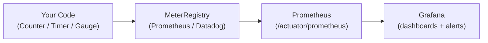

# Micrometer Metrics Deep Dive

[← Back to README](../README.md)

---

**Micrometer** is the metrics facade for the JVM — like SLF4J for logs, but for metrics. It provides a vendor-neutral API (`Counter`, `Gauge`, `Timer`, `DistributionSummary`) that publishes to Prometheus, Datadog, CloudWatch, InfluxDB, and others via pluggable registry backends. This doc covers the full metrics API: instrumentation, tagging strategy, percentile histograms, SLO buckets, and `MeterFilter` for global rules.



---

## Core Meter Types

### Counter

```java
@Service
@RequiredArgsConstructor
public class OrderService {

    private final MeterRegistry registry;

    private Counter ordersPlaced;
    private Counter ordersFailed;

    @PostConstruct
    void initMetrics() {
        ordersPlaced = Counter.builder("orders.placed")
            .description("Total orders successfully placed")
            .tag("region", "za-south")
            .register(registry);

        ordersFailed = Counter.builder("orders.failed")
            .description("Total orders that failed")
            .register(registry);
    }

    public Order placeOrder(PlaceOrderRequest request) {
        try {
            Order order = processOrder(request);
            ordersPlaced.increment();
            return order;
        } catch (Exception e) {
            ordersFailed.increment();
            throw e;
        }
    }
}
```

### Gauge

```java
@Configuration
@RequiredArgsConstructor
public class GaugeConfig {

    private final OrderRepository orderRepository;
    private final MeterRegistry registry;

    @PostConstruct
    void registerGauges() {
        // Gauge from a supplier — polled on each scrape
        Gauge.builder("orders.pending.count",
                orderRepository, repo -> repo.countByStatus("PENDING"))
            .description("Number of orders in PENDING state")
            .register(registry);

        // Gauge from a collection size
        Map<String, Object> activeConnections = new ConcurrentHashMap<>();
        Gauge.builder("connections.active", activeConnections, Map::size)
            .tag("pool", "external-api")
            .register(registry);
    }
}
```

### Timer

```java
@Service
@RequiredArgsConstructor
public class PaymentService {

    private final MeterRegistry registry;

    public PaymentResult charge(PaymentRequest request) {
        Timer timer = Timer.builder("payment.charge.duration")
            .description("Time to charge a payment")
            .tag("provider", request.getProvider())
            .publishPercentiles(0.5, 0.95, 0.99)           // p50, p95, p99
            .publishPercentileHistogram()                    // Prometheus-compatible histogram
            .serviceLevelObjectives(                         // SLO buckets
                Duration.ofMillis(200),
                Duration.ofMillis(500),
                Duration.ofSeconds(1))
            .register(registry);

        return timer.record(() -> paymentGateway.charge(request));
    }

    // Functional style — wrap checked exceptions
    public CompletableFuture<PaymentResult> chargeAsync(PaymentRequest request) {
        Timer.Sample sample = Timer.start(registry);
        return paymentGateway.chargeAsync(request)
            .whenComplete((result, ex) -> sample.stop(
                Timer.builder("payment.charge.async.duration")
                    .tag("status", ex == null ? "success" : "error")
                    .register(registry)));
    }
}
```

### DistributionSummary

```java
// For measuring non-duration quantities: payload sizes, scores, queue depths
@Component
@RequiredArgsConstructor
public class ApiMetrics {

    private final MeterRegistry registry;
    private final DistributionSummary payloadSizeBytes;

    public ApiMetrics(MeterRegistry registry) {
        this.registry = registry;
        this.payloadSizeBytes = DistributionSummary.builder("api.request.size.bytes")
            .description("HTTP request payload size in bytes")
            .baseUnit("bytes")
            .publishPercentiles(0.5, 0.95, 0.99)
            .scale(1.0)
            .register(registry);
    }

    public void recordPayload(byte[] payload) {
        payloadSizeBytes.record(payload.length);
    }
}
```

---

## @Timed — Declarative Timing

```java
@RestController
@RequiredArgsConstructor
@Timed(value = "http.requests", extraTags = {"controller", "order"})
public class OrderController {

    @GetMapping("/orders/{id}")
    @Timed(value = "order.find.by.id", description = "Find order by ID")
    public Order findOrder(@PathVariable Long id) {
        return orderService.findById(id);
    }
}

// Enable @Timed support
@Configuration
public class TimedConfig {
    @Bean
    public TimedAspect timedAspect(MeterRegistry registry) {
        return new TimedAspect(registry);
    }
}
```

---

## Tags — Cardinality Rules

```java
// GOOD: bounded cardinality tags
Counter.builder("api.calls")
    .tag("method", request.getMethod())       // GET, POST, PUT, DELETE — low cardinality
    .tag("status", String.valueOf(status))    // 200, 400, 500 — low cardinality
    .tag("endpoint", "/api/orders")           // known endpoint — low cardinality
    .register(registry)
    .increment();

// BAD: unbounded cardinality — NEVER do this
Counter.builder("api.calls")
    .tag("user_id", userId)           // millions of unique values → metric explosion
    .tag("order_id", orderId)         // never use IDs as tags
    .register(registry);

// Rule: tags must have < 100 distinct values
// High-cardinality data → use logs or tracing, not metrics
```

---

## MeterFilter — Global Rules

```java
@Configuration
public class MetricsConfig {

    @Bean
    public MeterFilter denyHighCardinalityFilter() {
        // Drop any meter with a "user_id" tag
        return MeterFilter.deny(id ->
            id.getTagKeys().contains("user_id"));
    }

    @Bean
    public MeterFilter commonTagsFilter() {
        // Add app + env tags to every meter automatically
        return MeterFilter.commonTags(
            Tags.of("app", "order-service",
                    "env", System.getenv().getOrDefault("ENVIRONMENT", "local")));
    }

    @Bean
    public MeterFilter renameFilter() {
        // Rename metrics from a library to fit your naming convention
        return MeterFilter.renameTag("jvm.gc", "cause", "gc.cause");
    }

    @Bean
    public MeterFilter maxUriTagFilter() {
        // Keep URL cardinality in check (Spring MVC auto-tags with URI)
        return new MaximumAllowableMeterFilter(1000);
    }
}
```

---

## Percentile Histograms for Prometheus

```java
// publishPercentileHistogram() produces a histogram compatible with
// Prometheus' histogram_quantile() function — computed server-side
Timer timer = Timer.builder("db.query.duration")
    .publishPercentileHistogram()     // produces _bucket, _count, _sum
    .minimumExpectedValue(Duration.ofMillis(1))
    .maximumExpectedValue(Duration.ofSeconds(30))
    .register(registry);

// Prometheus query — 99th percentile over last 5 minutes:
// histogram_quantile(0.99, rate(db_query_duration_seconds_bucket[5m]))

// SLO buckets — how many requests completed within each threshold
Timer sloTimer = Timer.builder("payment.latency")
    .serviceLevelObjectives(
        Duration.ofMillis(100),
        Duration.ofMillis(500),
        Duration.ofSeconds(1))
    .register(registry);

// Produces:
// payment_latency_seconds_bucket{le="0.1"}  — requests under 100ms
// payment_latency_seconds_bucket{le="0.5"}  — requests under 500ms
// payment_latency_seconds_bucket{le="1.0"}  — requests under 1s
```

---

## Composite Registry — Multiple Backends

```java
@Bean
public MeterRegistry meterRegistry() {
    CompositeMeterRegistry composite = new CompositeMeterRegistry();

    // Prometheus (primary — scraped by Grafana Agent)
    composite.add(new PrometheusMeterRegistry(PrometheusConfig.DEFAULT));

    // Datadog (secondary — for cloud monitoring)
    DatadogConfig ddConfig = key -> switch (key) {
        case "datadog.apiKey" -> System.getenv("DD_API_KEY");
        case "datadog.step"   -> "PT1M";
        default               -> null;
    };
    composite.add(new DatadogMeterRegistry(ddConfig, Clock.SYSTEM));

    return composite;
}
```

---

## Micrometer Metrics Summary

| Concept | Detail |
|---------|--------|
| `Counter` | Monotonically increasing count; `.increment()` or `.increment(n)` |
| `Gauge` | Point-in-time value from a supplier; polled on each registry scrape |
| `Timer` | Measures duration and count; produces `_sum`, `_count`, `_max` |
| `DistributionSummary` | Like Timer but for arbitrary units (bytes, scores, depths) |
| `publishPercentiles(0.5, 0.95)` | Client-side precomputed percentiles — less accurate, no re-aggregation |
| `publishPercentileHistogram()` | Prometheus histogram buckets — allows `histogram_quantile()` server-side |
| `serviceLevelObjectives(...)` | Named bucket thresholds — directly measure SLO compliance |
| `@Timed` | Declarative method timing via AOP; requires `TimedAspect` bean |
| Tags cardinality | Keep tag values bounded (< 100); never use user IDs or entity IDs as tags |
| `MeterFilter` | Global deny/rename/common-tags rules applied to all registered meters |

---

[← Back to README](../README.md)
