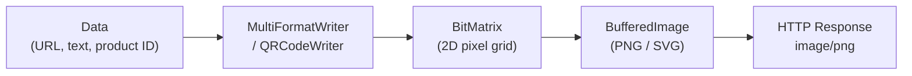

# QR Code & Barcode Generation

[← Back to README](../README.md)

---

**ZXing** ("Zebra Crossing") is the standard open-source library for generating and reading QR codes, Code 128, EAN-13, PDF417, and other barcode formats in Java. Common use cases: payment QR codes, product labels, event tickets, inventory tracking, and two-factor authentication setup URLs.



---

## Dependency

```xml
<dependency>
    <groupId>com.google.zxing</groupId>
    <artifactId>core</artifactId>
    <version>3.5.3</version>
</dependency>
<dependency>
    <groupId>com.google.zxing</groupId>
    <artifactId>javase</artifactId>
    <version>3.5.3</version>
</dependency>
```

---

## Generating a QR Code

```java
@Service
public class QrCodeService {

    public byte[] generateQrCode(String content, int width, int height)
            throws WriterException, IOException {

        Map<EncodeHintType, Object> hints = new EnumMap<>(EncodeHintType.class);
        hints.put(EncodeHintType.ERROR_CORRECTION, ErrorCorrectionLevel.H);  // highest correction
        hints.put(EncodeHintType.MARGIN, 1);                                  // quiet zone
        hints.put(EncodeHintType.CHARACTER_SET, "UTF-8");

        QRCodeWriter writer = new QRCodeWriter();
        BitMatrix matrix = writer.encode(content, BarcodeFormat.QR_CODE,
            width, height, hints);

        ByteArrayOutputStream out = new ByteArrayOutputStream();
        MatrixToImageWriter.writeToStream(matrix, "PNG", out);
        return out.toByteArray();
    }

    // With custom colours
    public byte[] generateQrCodeStyled(String content, int size,
                                        Color foreground, Color background)
            throws WriterException, IOException {

        BitMatrix matrix = new QRCodeWriter()
            .encode(content, BarcodeFormat.QR_CODE, size, size);

        MatrixToImageConfig config = new MatrixToImageConfig(
            foreground.getRGB(),
            background.getRGB());

        ByteArrayOutputStream out = new ByteArrayOutputStream();
        MatrixToImageWriter.writeToStream(matrix, "PNG", out, config);
        return out.toByteArray();
    }
}
```

---

## Generating Barcodes

```java
@Service
public class BarcodeService {

    private final MultiFormatWriter writer = new MultiFormatWriter();

    // Code 128 — general-purpose alphanumeric barcode
    public byte[] generateCode128(String content, int width, int height)
            throws WriterException, IOException {
        BitMatrix matrix = writer.encode(content, BarcodeFormat.CODE_128, width, height);
        return toBytes(matrix);
    }

    // EAN-13 — retail product barcode (exactly 13 digits)
    public byte[] generateEan13(String digits, int width, int height)
            throws WriterException, IOException {
        if (digits.length() != 13) throw new IllegalArgumentException("EAN-13 requires 13 digits");
        BitMatrix matrix = writer.encode(digits, BarcodeFormat.EAN_13, width, height);
        return toBytes(matrix);
    }

    // EAN-8 — short version (8 digits)
    public byte[] generateEan8(String digits, int width, int height)
            throws WriterException, IOException {
        BitMatrix matrix = writer.encode(digits, BarcodeFormat.EAN_8, width, height);
        return toBytes(matrix);
    }

    // PDF417 — 2D barcode for ID documents and shipping labels
    public byte[] generatePdf417(String content, int width, int height)
            throws WriterException, IOException {
        BitMatrix matrix = writer.encode(content, BarcodeFormat.PDF_417, width, height);
        return toBytes(matrix);
    }

    // Data Matrix — compact 2D barcode for small labels
    public byte[] generateDataMatrix(String content, int size)
            throws WriterException, IOException {
        BitMatrix matrix = writer.encode(content, BarcodeFormat.DATA_MATRIX, size, size);
        return toBytes(matrix);
    }

    private byte[] toBytes(BitMatrix matrix) throws IOException {
        ByteArrayOutputStream out = new ByteArrayOutputStream();
        MatrixToImageWriter.writeToStream(matrix, "PNG", out);
        return out.toByteArray();
    }
}
```

---

## Serving from a Spring Controller

```java
@RestController
@RequiredArgsConstructor
@RequestMapping("/api/barcodes")
public class BarcodeController {

    private final QrCodeService qrCodeService;
    private final BarcodeService barcodeService;

    @GetMapping(value = "/qr", produces = MediaType.IMAGE_PNG_VALUE)
    public ResponseEntity<byte[]> generateQr(
            @RequestParam String content,
            @RequestParam(defaultValue = "300") int size) throws Exception {

        byte[] image = qrCodeService.generateQrCode(content, size, size);

        return ResponseEntity.ok()
            .contentType(MediaType.IMAGE_PNG)
            .contentLength(image.length)
            .cacheControl(CacheControl.maxAge(1, TimeUnit.HOURS).cachePublic())
            .body(image);
    }

    @GetMapping(value = "/code128/{value}", produces = MediaType.IMAGE_PNG_VALUE)
    public ResponseEntity<byte[]> generateCode128(
            @PathVariable String value,
            @RequestParam(defaultValue = "300") int width,
            @RequestParam(defaultValue = "100") int height) throws Exception {

        byte[] image = barcodeService.generateCode128(value, width, height);

        return ResponseEntity.ok()
            .contentType(MediaType.IMAGE_PNG)
            .header(HttpHeaders.CONTENT_DISPOSITION,
                "inline; filename=\"barcode-" + value + ".png\"")
            .body(image);
    }

    // Return as Base64 for embedding in HTML/JSON
    @GetMapping("/qr/base64")
    public Map<String, String> generateQrBase64(
            @RequestParam String content,
            @RequestParam(defaultValue = "200") int size) throws Exception {

        byte[] image = qrCodeService.generateQrCode(content, size, size);
        String base64 = Base64.getEncoder().encodeToString(image);

        return Map.of(
            "content",  content,
            "mimeType", "image/png",
            "data",     "data:image/png;base64," + base64
        );
    }
}
```

---

## Reading / Decoding a QR Code

```java
@Service
public class QrCodeReader {

    public String decode(byte[] imageBytes) throws IOException, NotFoundException {
        BufferedImage image = ImageIO.read(new ByteArrayInputStream(imageBytes));
        BinaryBitmap bitmap = new BinaryBitmap(
            new HybridBinarizer(new BufferedImageLuminanceSource(image)));

        Map<DecodeHintType, Object> hints = new EnumMap<>(DecodeHintType.class);
        hints.put(DecodeHintType.TRY_HARDER, Boolean.TRUE);

        Result result = new MultiFormatReader().decode(bitmap, hints);
        return result.getText();
    }

    public String decode(MultipartFile upload) throws IOException, NotFoundException {
        return decode(upload.getBytes());
    }
}

@PostMapping("/api/barcodes/decode")
public Map<String, String> decode(@RequestParam MultipartFile file) throws Exception {
    String text = qrCodeReader.decode(file);
    return Map.of("content", text);
}
```

---

## TOTP QR Code (Two-Factor Authentication Setup)

```java
@Service
@RequiredArgsConstructor
public class TotpService {

    private final QrCodeService qrCodeService;

    public byte[] generateTotpQrCode(String username, String secret)
            throws WriterException, IOException {

        // otpauth URI — scanned by Google Authenticator / Authy
        String otpUri = String.format(
            "otpauth://totp/%s:%s?secret=%s&issuer=%s&algorithm=SHA1&digits=6&period=30",
            URLEncoder.encode("Acme Corp", StandardCharsets.UTF_8),
            URLEncoder.encode(username, StandardCharsets.UTF_8),
            secret,
            URLEncoder.encode("Acme Corp", StandardCharsets.UTF_8));

        return qrCodeService.generateQrCode(otpUri, 250, 250);
    }

    public String generateSecret() {
        // 20 random bytes → Base32 encoded → 32-char secret
        byte[] bytes = new byte[20];
        new SecureRandom().nextBytes(bytes);
        return Base32.encode(bytes);
    }
}
```

---

## Error Correction Levels

| Level | Correction | Use when |
|-------|------------|----------|
| `L` | ~7% | Clean scanning environment (digital display) |
| `M` | ~15% | General purpose (default) |
| `Q` | ~25% | Printed labels that may get dirty |
| `H` | ~30% | Logos embedded in QR code; harsh environments |

Higher correction → larger QR code for the same content.

---

## QR Code & Barcode Summary

| Concept | Detail |
|---------|--------|
| `QRCodeWriter` | Generates QR codes only; simpler API than `MultiFormatWriter` |
| `MultiFormatWriter` | Generates any supported barcode format via `BarcodeFormat` enum |
| `BitMatrix` | Raw 2D boolean grid representing the barcode pixels |
| `MatrixToImageWriter.writeToStream` | Converts `BitMatrix` → `BufferedImage` → PNG/JPEG/BMP |
| `BarcodeFormat.CODE_128` | Alphanumeric; variable length; most common 1D barcode |
| `BarcodeFormat.EAN_13` | Retail barcode; exactly 12 digits + 1 check digit |
| `BarcodeFormat.PDF_417` | 2D barcode for large payloads; used on passports, boarding passes |
| `ErrorCorrectionLevel.H` | Highest correction (30%); required when embedding a logo in the QR |
| `EncodeHintType.MARGIN` | Quiet zone size in modules around the barcode |
| `MultiFormatReader.decode` | Decodes any supported barcode from a `BufferedImage` |
| Base64 embedding | `data:image/png;base64,...` — embed QR codes directly in HTML or JSON |

---

[← Back to README](../README.md)
