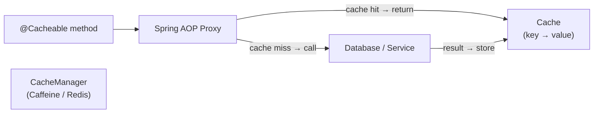

# Spring Cache Abstraction

[← Back to README](../README.md)

---

Spring's cache abstraction decouples your business logic from the caching infrastructure. Annotate methods with `@Cacheable`, `@CacheEvict`, and `@CachePut`, and Spring wraps them with a `CacheManager` that can be backed by Caffeine, Redis, Hazelcast, or any other provider — without changing the annotated code. This is the declarative caching layer; the underlying stores (Caffeine configuration, Redis TTLs) live in infrastructure config, not in business code.



---

## Enabling Caching

```java
@Configuration
@EnableCaching
public class CacheConfig {

    // Caffeine — in-process, ideal for single-instance or read-heavy
    @Bean
    public CacheManager caffeineCacheManager() {
        CaffeineCacheManager manager = new CaffeineCacheManager();
        manager.setCaffeineSpec(CaffeineSpec.parse(
            "maximumSize=10000,expireAfterWrite=30m,recordStats"));
        return manager;
    }
}
```

---

## @Cacheable

```java
@Service
@RequiredArgsConstructor
public class ProductService {

    private final ProductRepository productRepository;

    // Cache the result; key defaults to method parameters
    @Cacheable("products")
    public Product findById(Long id) {
        return productRepository.findById(id)
            .orElseThrow(() -> new ProductNotFoundException(id));
    }

    // Custom SpEL key expression
    @Cacheable(cacheNames = "products", key = "#id + '-' + #currency")
    public ProductPrice getPrice(Long id, String currency) {
        return pricingService.quote(id, currency);
    }

    // condition: only cache when result is non-null and active
    @Cacheable(value = "products",
               condition = "#id > 0",
               unless = "#result == null || !#result.active()")
    public Product findActiveById(Long id) {
        return productRepository.findById(id).orElse(null);
    }

    // sync = true: only one thread loads; others wait (prevents cache stampede)
    @Cacheable(value = "products", key = "#id", sync = true)
    public Product findByIdSync(Long id) {
        return productRepository.findById(id).orElseThrow();
    }
}
```

---

## @CacheEvict

```java
@Service
@RequiredArgsConstructor
public class ProductAdminService {

    // Evict a specific entry
    @CacheEvict(value = "products", key = "#product.id")
    public Product update(Product product) {
        return productRepository.save(product);
    }

    // Evict all entries in the cache
    @CacheEvict(value = "products", allEntries = true)
    public void clearAll() {
        log.info("Products cache cleared");
    }

    // Evict BEFORE the method runs (for void methods or when stale reads must not happen)
    @CacheEvict(value = "products", key = "#id", beforeInvocation = true)
    public void delete(Long id) {
        productRepository.deleteById(id);
    }
}
```

---

## @CachePut — Always Update the Cache

```java
// @CachePut always calls the method AND updates the cache
// Use to keep cache warm after writes — unlike @CacheEvict which forces a reload
@CachePut(value = "products", key = "#result.id")
public Product save(Product product) {
    return productRepository.save(product);
}

// Useful pattern: save to DB + update cache atomically (from caller's perspective)
@Transactional
@CachePut(value = "products", key = "#product.id")
public Product updateWithCache(Product product) {
    Product saved = productRepository.save(product);
    eventPublisher.publishEvent(new ProductUpdatedEvent(saved));
    return saved;
}
```

---

## @Caching — Multiple Operations on One Method

```java
// Apply several cache operations to a single method
@Caching(
    evict = {
        @CacheEvict(value = "products",         key = "#product.id"),
        @CacheEvict(value = "products-by-sku",  key = "#product.sku"),
        @CacheEvict(value = "product-summaries", allEntries = true)
    },
    put = {
        @CachePut(value = "products", key = "#result.id")
    }
)
public Product updateProduct(Product product) {
    return productRepository.save(product);
}
```

---

## @CacheConfig — Class-Level Defaults

```java
@Service
@CacheConfig(cacheNames = "orders", keyGenerator = "orderKeyGenerator")
public class OrderService {

    @Cacheable   // uses "orders" cache and orderKeyGenerator from class-level config
    public Order findById(Long id) { ... }

    @CacheEvict(allEntries = true)
    public void clearOrderCache() { ... }
}
```

---

## Multiple Cache Managers — Per-Cache TTL with Redis

```java
@Configuration
@EnableCaching
public class MultiCacheConfig {

    @Bean
    @Primary
    public CacheManager cacheManager(RedisConnectionFactory factory) {
        RedisCacheConfiguration defaultConfig = RedisCacheConfiguration.defaultCacheConfig()
            .entryTtl(Duration.ofMinutes(30))
            .disableCachingNullValues()
            .serializeValuesWith(
                RedisSerializationContext.SerializationPair.fromSerializer(
                    new GenericJackson2JsonRedisSerializer()));

        Map<String, RedisCacheConfiguration> cacheConfigs = Map.of(
            "products",       defaultConfig.entryTtl(Duration.ofHours(1)),
            "product-prices", defaultConfig.entryTtl(Duration.ofMinutes(5)),
            "sessions",       defaultConfig.entryTtl(Duration.ofMinutes(30)),
            "user-profiles",  defaultConfig.entryTtl(Duration.ofDays(1))
        );

        return RedisCacheManager.builder(factory)
            .cacheDefaults(defaultConfig)
            .withInitialCacheConfigurations(cacheConfigs)
            .build();
    }

    // Separate in-process cache for very hot, short-lived data
    @Bean("localCacheManager")
    public CacheManager localCacheManager() {
        CaffeineCacheManager manager = new CaffeineCacheManager("hot-products");
        manager.setCaffeine(Caffeine.newBuilder()
            .maximumSize(500)
            .expireAfterWrite(Duration.ofSeconds(30)));
        return manager;
    }
}

// Use a specific cache manager
@Cacheable(value = "hot-products", cacheManager = "localCacheManager")
public List<Product> getHotProducts() { ... }
```

---

## Programmatic Cache Operations

```java
@Service
@RequiredArgsConstructor
public class CacheManagementService {

    private final CacheManager cacheManager;

    public void evict(String cacheName, Object key) {
        Cache cache = cacheManager.getCache(cacheName);
        if (cache != null) cache.evict(key);
    }

    public <T> Optional<T> get(String cacheName, Object key, Class<T> type) {
        Cache cache = cacheManager.getCache(cacheName);
        if (cache == null) return Optional.empty();
        Cache.ValueWrapper wrapper = cache.get(key);
        return wrapper == null ? Optional.empty()
            : Optional.ofNullable(type.cast(wrapper.get()));
    }

    public void put(String cacheName, Object key, Object value) {
        Cache cache = cacheManager.getCache(cacheName);
        if (cache != null) cache.put(key, value);
    }

    public void clearAll(String cacheName) {
        Cache cache = cacheManager.getCache(cacheName);
        if (cache != null) cache.clear();
    }
}
```

---

## Custom Key Generator

```java
@Component("orderKeyGenerator")
public class OrderKeyGenerator implements KeyGenerator {

    @Override
    public Object generate(Object target, Method method, Object... params) {
        StringBuilder key = new StringBuilder();
        key.append(target.getClass().getSimpleName()).append(":");
        key.append(method.getName()).append(":");
        for (Object param : params) {
            if (param instanceof Identifiable<?> identifiable) {
                key.append(identifiable.getId());
            } else {
                key.append(param);
            }
            key.append(":");
        }
        return key.toString();
    }
}
```

---

## Testing Cached Methods

```java
@SpringBootTest
class ProductServiceCacheTest {

    @Autowired ProductService productService;
    @Autowired CacheManager cacheManager;
    @MockBean  ProductRepository productRepository;

    @BeforeEach
    void clearCache() {
        cacheManager.getCache("products").clear();
    }

    @Test
    void secondCallReturnsCachedResult() {
        Product product = new Product(1L, "Widget");
        given(productRepository.findById(1L)).willReturn(Optional.of(product));

        productService.findById(1L);   // cache miss → calls repository
        productService.findById(1L);   // cache hit → no repository call

        verify(productRepository, times(1)).findById(1L);
    }

    @Test
    void evictClearsCache() {
        Product product = new Product(1L, "Widget");
        given(productRepository.findById(1L)).willReturn(Optional.of(product));
        given(productRepository.save(any())).willReturn(product);

        productService.findById(1L);   // populate cache
        productAdminService.update(product);   // evict
        productService.findById(1L);   // cache miss again

        verify(productRepository, times(2)).findById(1L);
    }
}
```

---

## Spring Cache Abstraction Summary

| Concept | Detail |
|---------|--------|
| `@EnableCaching` | Activates cache proxy on a `@Configuration` class |
| `@Cacheable` | Returns cached value on hit; calls method on miss and stores result |
| `key` | SpEL expression for cache key; default uses all parameters |
| `condition` | SpEL; if false, caching is skipped entirely |
| `unless` | SpEL evaluated after invocation; if true, result is NOT stored |
| `sync = true` | Only one thread loads; others wait — prevents cache stampede under load |
| `@CacheEvict` | Removes entry on method execution; `allEntries = true` clears entire cache |
| `@CachePut` | Always calls method AND updates cache — keeps cache warm after writes |
| `@Caching` | Combine multiple cache annotations on one method |
| `@CacheConfig` | Class-level defaults for `cacheNames` and `keyGenerator` |
| `RedisCacheConfiguration` | Per-cache TTL, serializer, null-value policy for Redis backend |

---

[← Back to README](../README.md)
