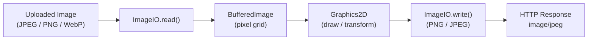

# Java Image Processing

[← Back to README](../README.md)

---

Java's built-in `BufferedImage` and `ImageIO` API handles reading, writing, and transforming raster images. For common tasks — thumbnails, watermarks, format conversion — the **Thumbnailator** library dramatically simplifies the code. Both integrate naturally with Spring Boot's HTTP layer for serving processed images on demand or accepting image uploads.



---

## Reading and Writing Images

```java
@Service
public class ImageService {

    // Read from file or stream
    public BufferedImage read(Path path) throws IOException {
        return ImageIO.read(path.toFile());
    }

    public BufferedImage read(byte[] bytes) throws IOException {
        return ImageIO.read(new ByteArrayInputStream(bytes));
    }

    // Write to byte array
    public byte[] toBytes(BufferedImage image, String format) throws IOException {
        ByteArrayOutputStream out = new ByteArrayOutputStream();
        ImageIO.write(image, format, out);   // format: "png", "jpeg", "webp"
        return out.toByteArray();
    }

    // Control JPEG quality (0.0 – 1.0)
    public byte[] toJpeg(BufferedImage image, float quality) throws IOException {
        Iterator<ImageWriter> writers = ImageIO.getImageWritersByFormatName("jpeg");
        ImageWriter writer = writers.next();

        ImageWriteParam params = writer.getDefaultWriteParam();
        params.setCompressionMode(ImageWriteParam.MODE_EXPLICIT);
        params.setCompressionQuality(quality);

        ByteArrayOutputStream out = new ByteArrayOutputStream();
        writer.setOutput(ImageIO.createImageOutputStream(out));
        writer.write(null, new IIOImage(image, null, null), params);
        writer.dispose();
        return out.toByteArray();
    }
}
```

---

## Scaling and Resizing

```java
public BufferedImage scale(BufferedImage src, int targetWidth, int targetHeight) {
    // Create destination image with correct colour model
    BufferedImage scaled = new BufferedImage(targetWidth, targetHeight, src.getType());
    Graphics2D g = scaled.createGraphics();

    // Rendering hints for quality
    g.setRenderingHint(RenderingHints.KEY_INTERPOLATION,
        RenderingHints.VALUE_INTERPOLATION_BILINEAR);
    g.setRenderingHint(RenderingHints.KEY_RENDERING,
        RenderingHints.VALUE_RENDER_QUALITY);
    g.setRenderingHint(RenderingHints.KEY_ANTIALIASING,
        RenderingHints.VALUE_ANTIALIAS_ON);

    g.drawImage(src, 0, 0, targetWidth, targetHeight, null);
    g.dispose();
    return scaled;
}

// Scale preserving aspect ratio
public BufferedImage scaleToWidth(BufferedImage src, int targetWidth) {
    double ratio = (double) targetWidth / src.getWidth();
    int targetHeight = (int) (src.getHeight() * ratio);
    return scale(src, targetWidth, targetHeight);
}
```

---

## Cropping

```java
public BufferedImage crop(BufferedImage src, int x, int y, int width, int height) {
    // Clamp to image bounds
    x = Math.max(0, x);
    y = Math.max(0, y);
    width  = Math.min(width,  src.getWidth()  - x);
    height = Math.min(height, src.getHeight() - y);
    return src.getSubimage(x, y, width, height);
}

// Centre-crop to square (useful for avatars/thumbnails)
public BufferedImage cropCentreSquare(BufferedImage src) {
    int size = Math.min(src.getWidth(), src.getHeight());
    int x = (src.getWidth()  - size) / 2;
    int y = (src.getHeight() - size) / 2;
    return crop(src, x, y, size, size);
}
```

---

## Watermarking

```java
public BufferedImage addTextWatermark(BufferedImage src, String text) {
    Graphics2D g = src.createGraphics();

    g.setRenderingHint(RenderingHints.KEY_TEXT_ANTIALIASING,
        RenderingHints.VALUE_TEXT_ANTIALIAS_ON);

    // Semi-transparent white text
    AlphaComposite composite = AlphaComposite.getInstance(AlphaComposite.SRC_OVER, 0.5f);
    g.setComposite(composite);
    g.setColor(Color.WHITE);

    Font font = new Font(Font.SANS_SERIF, Font.BOLD,
        Math.max(12, src.getWidth() / 20));
    g.setFont(font);

    FontMetrics fm = g.getFontMetrics();
    int textWidth  = fm.stringWidth(text);
    int textHeight = fm.getHeight();

    // Bottom-right corner
    int x = src.getWidth()  - textWidth  - 10;
    int y = src.getHeight() - textHeight + fm.getAscent();

    g.drawString(text, x, y);
    g.dispose();
    return src;
}

public BufferedImage addImageWatermark(BufferedImage src, BufferedImage watermark, float opacity) {
    Graphics2D g = src.createGraphics();
    g.setComposite(AlphaComposite.getInstance(AlphaComposite.SRC_OVER, opacity));

    int x = src.getWidth()  - watermark.getWidth()  - 10;
    int y = src.getHeight() - watermark.getHeight() - 10;
    g.drawImage(watermark, x, y, null);
    g.dispose();
    return src;
}
```

---

## Rotation and Flipping

```java
public BufferedImage rotate(BufferedImage src, double degrees) {
    double radians = Math.toRadians(degrees);
    double sin = Math.abs(Math.sin(radians));
    double cos = Math.abs(Math.cos(radians));

    int newWidth  = (int) Math.floor(src.getWidth() * cos + src.getHeight() * sin);
    int newHeight = (int) Math.floor(src.getHeight() * cos + src.getWidth() * sin);

    BufferedImage rotated = new BufferedImage(newWidth, newHeight, src.getType());
    Graphics2D g = rotated.createGraphics();
    g.setBackground(Color.WHITE);
    g.clearRect(0, 0, newWidth, newHeight);

    AffineTransform at = AffineTransform.getRotateInstance(radians,
        newWidth / 2.0, newHeight / 2.0);
    at.translate((newWidth - src.getWidth()) / 2.0,
                 (newHeight - src.getHeight()) / 2.0);
    g.drawRenderedImage(src, at);
    g.dispose();
    return rotated;
}

public BufferedImage flipHorizontal(BufferedImage src) {
    AffineTransform at = AffineTransform.getScaleInstance(-1, 1);
    at.translate(-src.getWidth(), 0);
    AffineTransformOp op = new AffineTransformOp(at, AffineTransformOp.TYPE_BILINEAR);
    return op.filter(src, null);
}
```

---

## Thumbnailator — Simplified Resizing

```xml
<dependency>
    <groupId>net.coobird</groupId>
    <artifactId>thumbnailator</artifactId>
    <version>0.4.20</version>
</dependency>
```

```java
@Service
public class ThumbnailService {

    // Resize to exact dimensions
    public byte[] thumbnail(byte[] imageBytes, int width, int height)
            throws IOException {
        ByteArrayOutputStream out = new ByteArrayOutputStream();
        Thumbnails.of(new ByteArrayInputStream(imageBytes))
            .size(width, height)
            .outputFormat("jpeg")
            .outputQuality(0.85)
            .toOutputStream(out);
        return out.toByteArray();
    }

    // Scale preserving aspect ratio, cropping to fit exactly
    public byte[] thumbnailCrop(byte[] imageBytes, int width, int height)
            throws IOException {
        ByteArrayOutputStream out = new ByteArrayOutputStream();
        Thumbnails.of(new ByteArrayInputStream(imageBytes))
            .size(width, height)
            .crop(Positions.CENTER)
            .outputFormat("jpeg")
            .toOutputStream(out);
        return out.toByteArray();
    }

    // Batch: generate multiple sizes from one upload
    public Map<String, byte[]> generateSizes(byte[] original) throws IOException {
        Map<String, byte[]> result = new LinkedHashMap<>();
        for (Map.Entry<String, int[]> entry : Map.of(
                "thumb",  new int[]{150, 150},
                "medium", new int[]{400, 400},
                "large",  new int[]{800, 800}).entrySet()) {
            int[] dims = entry.getValue();
            result.put(entry.getKey(), thumbnail(original, dims[0], dims[1]));
        }
        return result;
    }

    // Add watermark via Thumbnailator
    public byte[] watermark(byte[] imageBytes, String text) throws IOException {
        // Thumbnailator supports watermark(position, image, opacity)
        // For text watermarks, combine with Graphics2D
        BufferedImage src = ImageIO.read(new ByteArrayInputStream(imageBytes));
        addTextWatermark(src, text);
        ByteArrayOutputStream out = new ByteArrayOutputStream();
        Thumbnails.of(src).scale(1).outputFormat("jpeg").toOutputStream(out);
        return out.toByteArray();
    }
}
```

---

## Serving Images from a Spring Controller

```java
@RestController
@RequiredArgsConstructor
@RequestMapping("/api/images")
public class ImageController {

    private final ThumbnailService thumbnailService;

    @PostMapping(value = "/thumbnail",
                 consumes = MediaType.MULTIPART_FORM_DATA_VALUE,
                 produces = MediaType.IMAGE_JPEG_VALUE)
    public ResponseEntity<byte[]> thumbnail(
            @RequestParam MultipartFile file,
            @RequestParam(defaultValue = "200") int width,
            @RequestParam(defaultValue = "200") int height) throws IOException {

        byte[] thumbnail = thumbnailService.thumbnail(file.getBytes(), width, height);

        return ResponseEntity.ok()
            .contentType(MediaType.IMAGE_JPEG)
            .contentLength(thumbnail.length)
            .cacheControl(CacheControl.maxAge(7, TimeUnit.DAYS))
            .body(thumbnail);
    }

    @GetMapping(value = "/products/{id}/image", produces = MediaType.IMAGE_JPEG_VALUE)
    public ResponseEntity<byte[]> productImage(
            @PathVariable Long id,
            @RequestParam(defaultValue = "400") int width) throws IOException {

        byte[] image = productImageService.get(id);
        byte[] resized = thumbnailService.thumbnail(image, width, width);

        return ResponseEntity.ok()
            .contentType(MediaType.IMAGE_JPEG)
            .header(HttpHeaders.CACHE_CONTROL, "public, max-age=86400")
            .body(resized);
    }
}
```

---

## Java Image Processing Summary

| Concept | Detail |
|---------|--------|
| `ImageIO.read(file)` | Read JPEG, PNG, GIF, BMP, TIFF from file, URL, or stream |
| `ImageIO.write(img, "jpeg", out)` | Write `BufferedImage` to any `OutputStream` |
| `BufferedImage` | In-memory pixel grid; `getType()` returns colour model (RGB, ARGB, GRAY) |
| `Graphics2D` | Drawing context; use `setRenderingHint` for anti-aliasing and quality |
| `AlphaComposite.SRC_OVER` | Alpha compositing for semi-transparent overlays (watermarks) |
| `AffineTransform` | Matrix-based 2D transformation: scale, rotate, shear, translate |
| Subimage | `src.getSubimage(x, y, w, h)` — zero-copy crop (shares pixel data with original) |
| JPEG quality | Use `ImageWriteParam.setCompressionQuality(0.85f)` — 0.85 is a good quality/size balance |
| Thumbnailator | `Thumbnails.of(...).size(w,h).crop(Positions.CENTER).toOutputStream(out)` |
| `Positions.CENTER` | Thumbnailator crop anchor — crop after resize to fill exact dimensions |

---

[← Back to README](../README.md)
