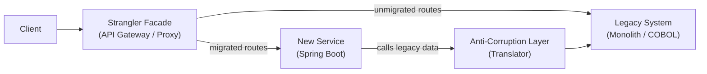

# Strangler Fig & Anti-Corruption Layer

[← Back to README](../README.md)

---

The **Strangler Fig** pattern incrementally replaces a legacy monolith by routing requests through a facade — new functionality goes to modern services, old functionality stays in the legacy system until it can be migrated or retired. The **Anti-Corruption Layer (ACL)** sits at the boundary between two bounded contexts (e.g., legacy and greenfield), translating models so neither system leaks its concepts into the other.



---

## Strangler Facade with Spring Cloud Gateway

```yaml
# application.yml — route new endpoints to new service, old to legacy
spring:
  cloud:
    gateway:
      routes:
        # Migrated: orders v2 go to new service
        - id: orders-new
          uri: http://orders-service:8080
          predicates:
            - Path=/api/v2/orders/**

        # Unmigrated: orders v1 still go to monolith
        - id: orders-legacy
          uri: http://monolith:8080
          predicates:
            - Path=/api/v1/orders/**

        # Feature-flag based routing
        - id: products-new
          uri: http://products-service:8080
          predicates:
            - Path=/api/products/**
            - Header=X-Feature-Flag, new-products
          filters:
            - StripPrefix=0

        - id: products-legacy
          uri: http://monolith:8080
          predicates:
            - Path=/api/products/**
```

---

## Programmatic Strangler Facade

```java
@RestController
@RequiredArgsConstructor
@RequestMapping("/api/orders")
public class StranglerOrderController {

    private final NewOrderService newOrderService;
    private final LegacyOrderClient legacyOrderClient;
    private final FeatureFlagService featureFlags;

    @GetMapping("/{id}")
    public ResponseEntity<OrderResponse> getOrder(@PathVariable Long id) {
        if (featureFlags.isEnabled("new-order-read", id)) {
            return ResponseEntity.ok(newOrderService.findById(id));
        }
        // Delegate to legacy, translate response through ACL
        LegacyOrderDto legacy = legacyOrderClient.getOrder(id);
        return ResponseEntity.ok(OrderAcl.fromLegacy(legacy));
    }

    @PostMapping
    public ResponseEntity<OrderResponse> createOrder(@RequestBody CreateOrderRequest req) {
        if (featureFlags.isEnabled("new-order-write")) {
            OrderResponse created = newOrderService.create(req);
            // Sync to legacy for reads not yet migrated
            legacyOrderClient.syncCreate(OrderAcl.toLegacy(created));
            return ResponseEntity.status(HttpStatus.CREATED).body(created);
        }
        LegacyCreateOrderDto legacyReq = OrderAcl.toLegacyCreate(req);
        LegacyOrderDto created = legacyOrderClient.create(legacyReq);
        return ResponseEntity.status(HttpStatus.CREATED).body(OrderAcl.fromLegacy(created));
    }
}
```

---

## Anti-Corruption Layer — Model Translation

```java
// Legacy domain model (their concepts, their names)
public record LegacyOrderDto(
    String ordNo,          // "ORD-12345"
    String custCd,         // customer code
    String ordDt,          // "20240115" (YYYYMMDD)
    String stsCd,          // "C" = confirmed, "P" = pending, "X" = cancelled
    List<LegacyLineDto> lns
) {}

public record LegacyLineDto(
    String itCd,           // item code
    int qty,
    BigDecimal unitPrc
) {}

// New domain model (clean, expressive)
public record OrderResponse(
    Long id,
    String orderNumber,
    Long customerId,
    LocalDate orderDate,
    OrderStatus status,
    List<OrderLineResponse> lines,
    Money total
) {}

// ACL — translates between the two worlds
@Component
public class OrderAcl {

    private static final Map<String, OrderStatus> STATUS_MAP = Map.of(
        "C", OrderStatus.CONFIRMED,
        "P", OrderStatus.PENDING,
        "X", OrderStatus.CANCELLED
    );

    public static OrderResponse fromLegacy(LegacyOrderDto legacy) {
        Long id = Long.parseLong(legacy.ordNo().replace("ORD-", ""));
        LocalDate date = LocalDate.parse(legacy.ordDt(),
            DateTimeFormatter.ofPattern("yyyyMMdd"));
        OrderStatus status = STATUS_MAP.getOrDefault(legacy.stsCd(), OrderStatus.UNKNOWN);

        List<OrderLineResponse> lines = legacy.lns().stream()
            .map(OrderAcl::lineFromLegacy)
            .toList();

        Money total = lines.stream()
            .map(l -> l.unitPrice().multiply(l.quantity()))
            .reduce(Money.ZERO, Money::add);

        return new OrderResponse(id,
            legacy.ordNo(),
            Long.parseLong(legacy.custCd()),
            date, status, lines, total);
    }

    public static LegacyOrderDto toLegacy(OrderResponse order) {
        String stsCd = STATUS_MAP.entrySet().stream()
            .filter(e -> e.getValue() == order.status())
            .map(Map.Entry::getKey)
            .findFirst().orElse("P");

        return new LegacyOrderDto(
            order.orderNumber(),
            String.valueOf(order.customerId()),
            order.orderDate().format(DateTimeFormatter.ofPattern("yyyyMMdd")),
            stsCd,
            order.lines().stream().map(OrderAcl::lineToLegacy).toList()
        );
    }

    private static OrderLineResponse lineFromLegacy(LegacyLineDto line) {
        return new OrderLineResponse(line.itCd(), line.qty(),
            Money.of(line.unitPrc(), "USD"));
    }

    private static LegacyLineDto lineToLegacy(OrderLineResponse line) {
        return new LegacyLineDto(line.productCode(), line.quantity(),
            line.unitPrice().amount());
    }
}
```

---

## Legacy Client with Resilience

```java
@Component
@RequiredArgsConstructor
public class LegacyOrderClient {

    private final RestClient restClient;

    @CircuitBreaker(name = "legacy-orders", fallbackMethod = "fallback")
    @Retry(name = "legacy-orders")
    public LegacyOrderDto getOrder(Long id) {
        return restClient.get()
            .uri("/legacy-api/orders/{id}", "ORD-" + id)
            .retrieve()
            .body(LegacyOrderDto.class);
    }

    // Fallback returns a minimal stub to avoid cascading failures
    public LegacyOrderDto fallback(Long id, Exception ex) {
        log.warn("Legacy system unavailable for order {}: {}", id, ex.getMessage());
        return new LegacyOrderDto("ORD-" + id, "", "", "P", List.of());
    }
}
```

---

## Event-Driven ACL — Sync via Kafka

```java
// New service publishes domain events; ACL translates and feeds legacy
@Component
@RequiredArgsConstructor
public class OrderEventAcl {

    private final LegacyOrderSyncClient legacySync;
    private final KafkaTemplate<String, Object> kafka;

    // Listen to new domain events, translate, push to legacy
    @KafkaListener(topics = "order.events", groupId = "legacy-sync")
    public void onOrderEvent(OrderEvent event) {
        switch (event) {
            case OrderCreatedEvent e -> legacySync.insertOrder(toLegacyInsert(e));
            case OrderUpdatedEvent e -> legacySync.updateOrder(toLegacyUpdate(e));
            case OrderCancelledEvent e -> legacySync.cancelOrder("ORD-" + e.orderId());
        }
    }

    // Listen to legacy change-data-capture, translate, publish domain events
    @KafkaListener(topics = "legacy.order.cdc", groupId = "acl-cdc")
    public void onLegacyCdcEvent(LegacyCdcEvent event) {
        if ("INSERT".equals(event.operation()) || "UPDATE".equals(event.operation())) {
            LegacyOrderDto legacy = event.after();
            OrderResponse order = OrderAcl.fromLegacy(legacy);
            kafka.send("order.events", String.valueOf(order.id()),
                new OrderSyncedEvent(order));
        }
    }
}
```

---

## Migration Progress Tracking

```java
@Entity
@Table(name = "migration_progress")
public class MigrationProgress {

    @Id
    String featureName;

    double percentageMigrated;   // 0.0 → 100.0
    LocalDateTime startedAt;
    LocalDateTime completedAt;

    @Enumerated(EnumType.STRING)
    MigrationStatus status;      // IN_PROGRESS, COMPLETED, ROLLED_BACK
}

@Service
@RequiredArgsConstructor
public class StranglerMigrationService {

    private final MigrationProgressRepository repo;

    // Gradually roll traffic to new service (canary approach)
    public boolean routeToNew(String feature, Long entityId) {
        MigrationProgress progress = repo.findById(feature)
            .orElse(new MigrationProgress(feature, 0.0));

        // Use entity ID for consistent routing (same entity always same route)
        double bucket = (entityId % 100) / 100.0;
        return bucket < progress.percentageMigrated() / 100.0;
    }
}
```

---

## Strangler Fig & ACL Summary

| Concept | Detail |
|---------|--------|
| Strangler Fig | Route requests through a facade; new code handles migrated routes, legacy handles the rest |
| Facade | Spring Cloud Gateway routes or a hand-rolled `@RestController` that delegates conditionally |
| Anti-Corruption Layer | Translates between two domain models; neither model leaks into the other |
| Feature flags | Gate migration by user, entity ID bucket, or header — enables gradual rollout |
| CDC sync | Kafka CDC (Debezium) feeds legacy changes to the new system via ACL translation |
| Parallel run | Call both systems, compare results, log discrepancies before cutover |
| Circuit breaker | Protect the new system when calling the legacy system — fail fast, fallback gracefully |
| Migration tracking | Record `percentageMigrated` per feature — supports canary rollout and rollback |

---

[← Back to README](../README.md)
