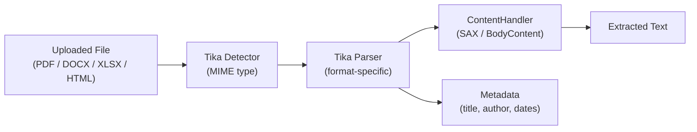

# Apache Tika — Document Parsing

[← Back to README](../README.md)

---

**Apache Tika** detects MIME types and extracts text and metadata from over 1,000 file formats — PDF, Word, Excel, PowerPoint, HTML, images (via OCR with Tesseract), ZIP archives, and more — through a single unified API. It is the standard library for content extraction pipelines in Java: search indexing, data migration, document classification, and storage of structured content.



---

## Dependency

```xml
<dependency>
    <groupId>org.apache.tika</groupId>
    <artifactId>tika-core</artifactId>
    <version>2.9.2</version>
</dependency>

<!-- Full parsers (PDF, Office, HTML, etc.) -->
<dependency>
    <groupId>org.apache.tika</groupId>
    <artifactId>tika-parsers-standard-package</artifactId>
    <version>2.9.2</version>
</dependency>
```

---

## Basic Text Extraction

```java
@Service
public class DocumentExtractorService {

    private final Tika tika = new Tika();

    // Simplest API — auto-detects format, returns plain text
    public String extractText(Path file) throws TikaException, IOException {
        return tika.parseToString(file.toFile());
    }

    public String extractText(byte[] bytes) throws TikaException, IOException {
        return tika.parseToString(new ByteArrayInputStream(bytes));
    }

    // Cap extracted text length (prevents OOM on huge files)
    public String extractText(InputStream in, int maxChars)
            throws TikaException, IOException {
        tika.setMaxStringLength(maxChars);
        return tika.parseToString(in);
    }

    // Detect MIME type only (no parsing)
    public String detectMimeType(byte[] bytes) throws IOException {
        return tika.detect(bytes);
    }

    public String detectMimeType(Path file) throws IOException {
        return tika.detect(file.toFile());
    }
}
```

---

## Metadata Extraction

```java
@Service
public class MetadataExtractorService {

    private final AutoDetectParser parser = new AutoDetectParser();
    private final Detector detector = parser.getDetector();

    public DocumentMetadata extract(InputStream in, String filename)
            throws TikaException, SAXException, IOException {

        Metadata metadata = new Metadata();
        metadata.set(TikaCoreProperties.RESOURCE_NAME_KEY, filename);

        ContentHandler handler = new BodyContentHandler(-1);  // -1 = no limit
        ParseContext context = new ParseContext();
        context.set(Parser.class, parser);

        parser.parse(in, handler, metadata, context);

        return DocumentMetadata.builder()
            .text(handler.toString().trim())
            .title(metadata.get(TikaCoreProperties.TITLE))
            .author(metadata.get(TikaCoreProperties.CREATOR))
            .created(metadata.getDate(TikaCoreProperties.CREATED))
            .modified(metadata.getDate(TikaCoreProperties.MODIFIED))
            .contentType(metadata.get(Metadata.CONTENT_TYPE))
            .pageCount(parseIntOrNull(metadata.get("xmpTPg:NPages")))
            .wordCount(parseIntOrNull(metadata.get("meta:word-count")))
            .allMetadata(buildMetadataMap(metadata))
            .build();
    }

    private Map<String, String> buildMetadataMap(Metadata metadata) {
        Map<String, String> map = new LinkedHashMap<>();
        for (String name : metadata.names()) {
            map.put(name, metadata.get(name));
        }
        return map;
    }

    private Integer parseIntOrNull(String value) {
        try { return value == null ? null : Integer.parseInt(value.trim()); }
        catch (NumberFormatException e) { return null; }
    }
}
```

---

## Spring Service with MultipartFile

```java
@Service
@RequiredArgsConstructor
public class TikaDocumentService {

    private final MetadataExtractorService metadataExtractor;
    private final Tika tika = new Tika();

    public ParsedDocument parse(MultipartFile file) throws Exception {
        String originalName = file.getOriginalFilename();
        String mimeType = tika.detect(file.getBytes(), originalName);

        validateAllowedType(mimeType);

        DocumentMetadata meta;
        try (InputStream in = file.getInputStream()) {
            meta = metadataExtractor.extract(in, originalName);
        }

        return ParsedDocument.builder()
            .fileName(originalName)
            .mimeType(mimeType)
            .sizeBytes(file.getSize())
            .text(meta.text())
            .metadata(meta)
            .build();
    }

    private void validateAllowedType(String mimeType) {
        Set<String> allowed = Set.of(
            "application/pdf",
            "application/vnd.openxmlformats-officedocument.wordprocessingml.document",
            "application/vnd.openxmlformats-officedocument.spreadsheetml.sheet",
            "text/plain",
            "text/html"
        );
        if (!allowed.contains(mimeType)) {
            throw new UnsupportedMediaTypeException("Unsupported type: " + mimeType);
        }
    }
}
```

---

## REST Controller

```java
@RestController
@RequiredArgsConstructor
@RequestMapping("/api/documents")
public class DocumentController {

    private final TikaDocumentService tikaService;

    @PostMapping(value = "/parse",
                 consumes = MediaType.MULTIPART_FORM_DATA_VALUE)
    public ResponseEntity<ParsedDocumentResponse> parseDocument(
            @RequestParam MultipartFile file) throws Exception {

        ParsedDocument doc = tikaService.parse(file);

        return ResponseEntity.ok(ParsedDocumentResponse.builder()
            .fileName(doc.fileName())
            .mimeType(doc.mimeType())
            .sizeBytes(doc.sizeBytes())
            .textPreview(truncate(doc.text(), 500))
            .wordCount(doc.metadata().wordCount())
            .title(doc.metadata().title())
            .author(doc.metadata().author())
            .pageCount(doc.metadata().pageCount())
            .build());
    }

    @PostMapping("/detect")
    public Map<String, String> detectType(@RequestParam MultipartFile file)
            throws IOException {
        Tika tika = new Tika();
        String mimeType = tika.detect(file.getBytes(), file.getOriginalFilename());
        return Map.of("fileName", file.getOriginalFilename(), "mimeType", mimeType);
    }

    private String truncate(String text, int maxLen) {
        if (text == null || text.length() <= maxLen) return text;
        return text.substring(0, maxLen) + "…";
    }
}
```

---

## Batch Document Indexing

```java
@Service
@RequiredArgsConstructor
public class DocumentIndexingService {

    private final TikaDocumentService tikaService;
    private final SearchIndexClient searchIndex;
    private final DocumentRepository documentRepository;

    @Async
    public CompletableFuture<IndexResult> indexDirectory(Path directory)
            throws IOException {

        List<Path> files;
        try (Stream<Path> walk = Files.walk(directory)) {
            files = walk.filter(Files::isRegularFile).toList();
        }

        int success = 0, failed = 0;
        for (Path file : files) {
            try {
                ParsedDocument doc = tikaService.parse(file);
                searchIndex.index(doc);
                documentRepository.save(toEntity(doc, file));
                success++;
            } catch (Exception e) {
                log.warn("Failed to index {}: {}", file, e.getMessage());
                failed++;
            }
        }

        return CompletableFuture.completedFuture(
            new IndexResult(success, failed, files.size()));
    }

    private ParsedDocument tikaService.parse(Path file) throws Exception {
        try (InputStream in = Files.newInputStream(file)) {
            return tikaService.parse(in, file.getFileName().toString());
        }
    }
}
```

---

## Recursive Archive Extraction

```java
@Service
public class ArchiveExtractorService {

    private final AutoDetectParser parser = new AutoDetectParser();

    // Recursively extract text from ZIP/TAR/JAR archives
    public List<ExtractedFile> extractArchive(InputStream archiveStream,
                                               String archiveName)
            throws TikaException, SAXException, IOException {

        List<ExtractedFile> results = new ArrayList<>();
        Metadata metadata = new Metadata();
        metadata.set(TikaCoreProperties.RESOURCE_NAME_KEY, archiveName);

        ContentHandler handler = new BodyContentHandler(-1);
        ParseContext context = new ParseContext();
        context.set(Parser.class, parser);

        // EmbeddedDocumentExtractor handles nested documents
        context.set(EmbeddedDocumentExtractor.class,
            new RecursiveEmbeddedExtractor(results, parser));

        parser.parse(archiveStream, handler, metadata, context);
        return results;
    }

    private static class RecursiveEmbeddedExtractor implements EmbeddedDocumentExtractor {

        private final List<ExtractedFile> results;
        private final Parser parser;

        RecursiveEmbeddedExtractor(List<ExtractedFile> results, Parser parser) {
            this.results = results;
            this.parser = parser;
        }

        @Override
        public boolean shouldParseEmbedded(Metadata metadata) { return true; }

        @Override
        public void parseEmbedded(InputStream stream, ContentHandler handler,
                                   Metadata metadata, boolean outputHtml)
                throws TikaException, SAXException, IOException {
            BodyContentHandler h = new BodyContentHandler(-1);
            parser.parse(stream, h, metadata, new ParseContext());
            String name = metadata.get(TikaCoreProperties.RESOURCE_NAME_KEY);
            results.add(new ExtractedFile(name, h.toString()));
        }
    }
}
```

---

## Apache Tika Summary

| Concept | Detail |
|---------|--------|
| `Tika.parseToString(file)` | Simplest API — auto-detect format, return plain text |
| `Tika.detect(bytes, name)` | MIME type detection without parsing — fast, no content extraction |
| `AutoDetectParser` | Full parser that delegates to format-specific parsers (PDF, Office, HTML…) |
| `Metadata` | Populated during parsing — `TikaCoreProperties.TITLE`, `.CREATOR`, `.CREATED`, etc. |
| `BodyContentHandler` | SAX handler that collects visible text; pass `-1` to remove the size cap |
| `ParseContext` | Thread context for parsers; set recursive `Parser` and `EmbeddedDocumentExtractor` |
| `EmbeddedDocumentExtractor` | Hook to process embedded/nested documents (files inside ZIP, images in Word) |
| `tika-parsers-standard-package` | All bundled parsers — PDF (PDFBox), Office (POI), HTML (Jsoup), images |
| `setMaxStringLength` | Prevent OOM — cap extracted text to N characters for untrusted uploads |
| MIME validation | Always detect MIME from content + filename, not just the `Content-Type` header |

---

[← Back to README](../README.md)
