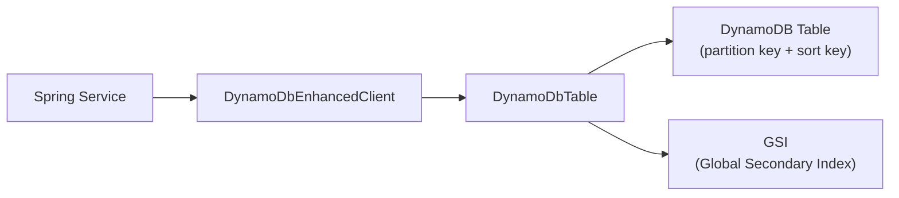

# DynamoDB with Spring

[← Back to README](../README.md)

---

Amazon DynamoDB is a serverless key-value and document database that delivers single-digit millisecond latency at any scale. The **AWS SDK v2 Enhanced DynamoDB Client** provides a type-safe mapper that converts plain Java objects to DynamoDB items. **Spring Data for DynamoDB** (community) or the enhanced client directly can be used in Spring Boot; this guide covers the enhanced client approach as it is fully supported by AWS.



---

## Dependency

```xml
<dependency>
    <groupId>software.amazon.awssdk</groupId>
    <artifactId>dynamodb-enhanced</artifactId>
    <version>2.25.45</version>
</dependency>
<dependency>
    <groupId>io.awspring.cloud</groupId>
    <artifactId>spring-cloud-aws-starter-dynamodb</artifactId>
    <version>3.1.1</version>
</dependency>
```

---

## Configuration

```java
@Configuration
public class DynamoDbConfig {

    @Bean
    public DynamoDbClient dynamoDbClient(
            @Value("${aws.region}") String region,
            @Value("${aws.endpoint-override:#{null}}") String endpointOverride) {

        DynamoDbClientBuilder builder = DynamoDbClient.builder()
            .region(Region.of(region))
            .credentialsProvider(DefaultCredentialsProvider.create());

        if (endpointOverride != null) {
            // Local DynamoDB for dev/test
            builder.endpointOverride(URI.create(endpointOverride));
        }
        return builder.build();
    }

    @Bean
    public DynamoDbEnhancedClient dynamoDbEnhancedClient(DynamoDbClient client) {
        return DynamoDbEnhancedClient.builder()
            .dynamoDbClient(client)
            .build();
    }
}
```

```yaml
# application.yml
aws:
  region: eu-west-1
# For local development:
# aws:
#   endpoint-override: http://localhost:8000
```

---

## Entity Mapping

```java
@DynamoDbBean
public class Order {

    private String customerId;     // partition key
    private String orderId;        // sort key (UUID)
    private String status;
    private BigDecimal total;
    private Instant createdAt;
    private List<OrderLine> lines;

    @DynamoDbPartitionKey
    public String getCustomerId() { return customerId; }

    @DynamoDbSortKey
    public String getOrderId() { return orderId; }

    @DynamoDbAttribute("status")
    public String getStatus() { return status; }

    // BigDecimal stored as Number
    @DynamoDbAttribute("total")
    public BigDecimal getTotal() { return total; }

    @DynamoDbAttribute("createdAt")
    @DynamoDbConvertedBy(InstantAsStringConverter.class)
    public Instant getCreatedAt() { return createdAt; }

    // Nested objects stored as DynamoDB Map
    @DynamoDbAttribute("lines")
    public List<OrderLine> getLines() { return lines; }

    // ... setters
}

@DynamoDbBean
public class OrderLine {
    private String productId;
    private int quantity;
    private BigDecimal unitPrice;
    // getters + setters
}
```

---

## Repository Service

```java
@Service
@RequiredArgsConstructor
public class OrderRepository {

    private final DynamoDbEnhancedClient enhancedClient;

    private DynamoDbTable<Order> table() {
        return enhancedClient.table("orders", TableSchema.fromBean(Order.class));
    }

    public void save(Order order) {
        table().putItem(order);
    }

    // Conditional put — fail if item already exists
    public void saveIfNotExists(Order order) {
        table().putItem(r -> r
            .item(order)
            .conditionExpression(Expression.builder()
                .expression("attribute_not_exists(customerId)")
                .build()));
    }

    public Optional<Order> findById(String customerId, String orderId) {
        Key key = Key.builder()
            .partitionValue(customerId)
            .sortValue(orderId)
            .build();
        return Optional.ofNullable(table().getItem(key));
    }

    // Query all orders for a customer (all sort keys)
    public List<Order> findByCustomer(String customerId) {
        QueryConditional query = QueryConditional
            .keyEqualTo(Key.builder().partitionValue(customerId).build());
        return table().query(query).items().stream().toList();
    }

    // Query orders in a date range using sort key prefix
    public List<Order> findByCustomerAndDateRange(String customerId,
                                                    String fromOrderId,
                                                    String toOrderId) {
        QueryConditional query = QueryConditional.sortBetween(
            Key.builder().partitionValue(customerId).sortValue(fromOrderId).build(),
            Key.builder().partitionValue(customerId).sortValue(toOrderId).build());
        return table().query(query).items().stream().toList();
    }

    public void delete(String customerId, String orderId) {
        Key key = Key.builder()
            .partitionValue(customerId)
            .sortValue(orderId)
            .build();
        table().deleteItem(key);
    }

    // Update a single attribute (partial update)
    public Order updateStatus(String customerId, String orderId, String newStatus) {
        Order order = new Order();
        order.setCustomerId(customerId);
        order.setOrderId(orderId);
        order.setStatus(newStatus);

        return table().updateItem(r -> r
            .item(order)
            .ignoreNulls(true)  // only update non-null fields
        );
    }
}
```

---

## Global Secondary Index (GSI) Query

```java
@DynamoDbBean
public class Order {
    // ... existing fields

    // GSI: query orders by status
    @DynamoDbSecondaryPartitionKey(indexNames = "status-created-index")
    public String getStatus() { return status; }

    @DynamoDbSecondarySortKey(indexNames = "status-created-index")
    @DynamoDbConvertedBy(InstantAsStringConverter.class)
    public Instant getCreatedAt() { return createdAt; }
}

@Service
@RequiredArgsConstructor
public class OrderQueryService {

    private final DynamoDbEnhancedClient enhancedClient;

    public List<Order> findByStatus(String status) {
        DynamoDbTable<Order> table = enhancedClient.table(
            "orders", TableSchema.fromBean(Order.class));

        DynamoDbIndex<Order> gsi = table.index("status-created-index");

        QueryConditional query = QueryConditional
            .keyEqualTo(Key.builder().partitionValue(status).build());

        return gsi.query(query).stream()
            .flatMap(page -> page.items().stream())
            .toList();
    }
}
```

---

## Batch Operations

```java
@Service
@RequiredArgsConstructor
public class OrderBatchService {

    private final DynamoDbEnhancedClient enhancedClient;

    public void batchWrite(List<Order> toSave, List<Order> toDelete) {
        DynamoDbTable<Order> table = enhancedClient.table(
            "orders", TableSchema.fromBean(Order.class));

        WriteBatch.Builder<Order> writeBuilder = WriteBatch.builder(Order.class)
            .mappedTableResource(table);

        toSave.forEach(writeBuilder::addPutItem);
        toDelete.forEach(o -> writeBuilder.addDeleteItem(Key.builder()
            .partitionValue(o.getCustomerId())
            .sortValue(o.getOrderId())
            .build()));

        // DynamoDB limits: 25 items per batch
        enhancedClient.batchWriteItem(r -> r.writeBatches(writeBuilder.build()));
    }

    public Map<String, Order> batchGet(List<Key> keys) {
        DynamoDbTable<Order> table = enhancedClient.table(
            "orders", TableSchema.fromBean(Order.class));

        ReadBatch readBatch = ReadBatch.builder(Order.class)
            .mappedTableResource(table)
            .addGetItem(keys.toArray(new Key[0]))
            .build();

        BatchGetResultPageIterable result = enhancedClient.batchGetItem(
            r -> r.readBatches(readBatch));

        return result.resultsForTable(table).stream()
            .collect(Collectors.toMap(Order::getOrderId, Function.identity()));
    }
}
```

---

## Transactions

```java
@Service
@RequiredArgsConstructor
public class OrderTransactionService {

    private final DynamoDbEnhancedClient enhancedClient;

    // Atomic write across multiple items / tables
    public void placeOrder(Order order, Inventory inventory) {
        DynamoDbTable<Order> orderTable = enhancedClient.table(
            "orders", TableSchema.fromBean(Order.class));
        DynamoDbTable<Inventory> inventoryTable = enhancedClient.table(
            "inventory", TableSchema.fromBean(Inventory.class));

        enhancedClient.transactWriteItems(r -> r
            .addPutItem(orderTable, order)
            .addUpdateItem(inventoryTable, TransactUpdateItemEnhancedRequest
                .builder(Inventory.class)
                .item(inventory)
                .conditionExpression(Expression.builder()
                    .expression("stockLevel >= :required")
                    .putExpressionValue(":required",
                        AttributeValue.fromN(String.valueOf(order.quantity())))
                    .build())
                .build())
        );
    }
}
```

---

## Custom Converter

```java
public class InstantAsStringConverter implements AttributeConverter<Instant> {

    @Override
    public AttributeValue transformFrom(Instant instant) {
        return AttributeValue.fromS(instant.toString());  // ISO-8601
    }

    @Override
    public Instant transformTo(AttributeValue value) {
        return Instant.parse(value.s());
    }

    @Override
    public EnhancedType<Instant> type() {
        return EnhancedType.of(Instant.class);
    }

    @Override
    public AttributeValueType attributeValueType() {
        return AttributeValueType.S;
    }
}
```

---

## DynamoDB with Spring Summary

| Concept | Detail |
|---------|--------|
| `@DynamoDbBean` | Marks a class for DynamoDB bean table schema mapping |
| `@DynamoDbPartitionKey` | Marks the partition key getter — must be unique per item (combined with sort key) |
| `@DynamoDbSortKey` | Marks the sort key getter — allows multiple items per partition key |
| `TableSchema.fromBean(T.class)` | Builds schema from annotated bean at startup |
| `QueryConditional.keyEqualTo` | Efficient single-partition query — reads one partition only |
| `QueryConditional.sortBetween` | Range query on sort key within a partition |
| `@DynamoDbSecondaryPartitionKey` | Marks a GSI partition key; `indexNames` links it to the GSI |
| `ignoreNulls(true)` | Partial update — only write non-null fields in `updateItem` |
| `transactWriteItems` | Atomic write across up to 100 items / 10 tables (2 WCU per item) |
| `batchWriteItem` | Up to 25 items per call; unprocessed items must be retried |
| `AttributeConverter` | Custom type conversion (e.g., `Instant` ↔ String, enums, money) |

---

[← Back to README](../README.md)
