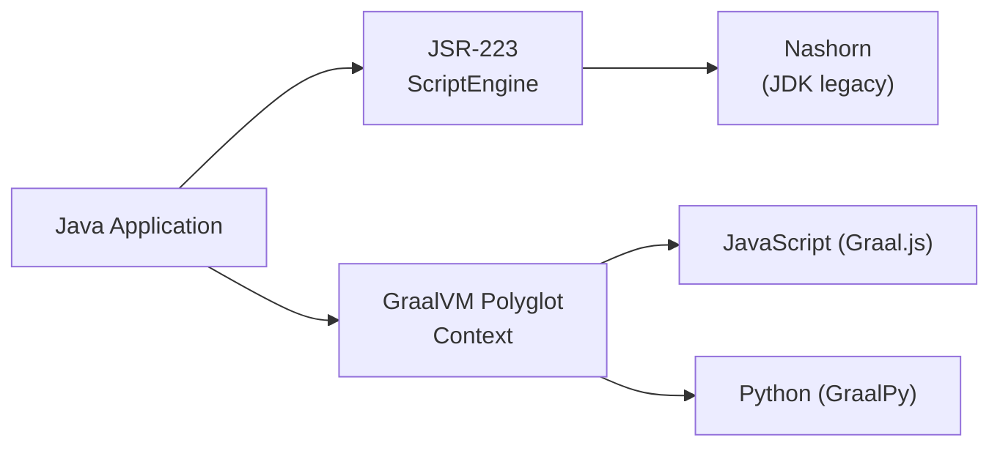

# Java Scripting API & GraalVM Polyglot

[← Back to README](../README.md)

---

The **Java Scripting API** (`javax.script`) provides a vendor-neutral interface for evaluating scripts in any JSR-223-compatible engine at runtime. **GraalVM Polyglot** goes further: it embeds JavaScript, Python, Ruby, R, or WASM into a JVM process with true bidirectional interop — Java calls script functions, scripts call Java classes, and values cross the language boundary without serialisation.



---

## JSR-223 — ScriptEngine API

```java
@Service
public class ScriptEngineService {

    private final ScriptEngineManager manager = new ScriptEngineManager();

    // Evaluate a one-off expression
    public Object eval(String engineName, String script) throws ScriptException {
        ScriptEngine engine = manager.getEngineByName(engineName);
        if (engine == null) throw new IllegalArgumentException("No engine: " + engineName);
        return engine.eval(script);
    }

    // Pass Java variables into the script
    public Object evalWithBindings(String script, Map<String, Object> variables)
            throws ScriptException {
        ScriptEngine engine = manager.getEngineByName("javascript");
        Bindings bindings = engine.createBindings();
        bindings.putAll(variables);
        return engine.eval(script, bindings);
    }

    // Compile for reuse (faster repeated invocations)
    public CompiledScript compile(String engineName, String script)
            throws ScriptException {
        ScriptEngine engine = manager.getEngineByName(engineName);
        if (engine instanceof Compilable compilable) {
            return compilable.compile(script);
        }
        throw new UnsupportedOperationException(engineName + " is not compilable");
    }

    // Call a named function defined in a previously evaluated script
    public Object invokeFunction(ScriptEngine engine, String functionName, Object... args)
            throws ScriptException, NoSuchMethodException {
        if (engine instanceof Invocable invocable) {
            return invocable.invokeFunction(functionName, args);
        }
        throw new UnsupportedOperationException("Engine does not support Invocable");
    }
}
```

---

## List Available Engines

```java
public List<String> availableEngines() {
    ScriptEngineManager manager = new ScriptEngineManager();
    return manager.getEngineFactories().stream()
        .map(f -> f.getEngineName() + " " + f.getEngineVersion()
            + " [" + String.join(", ", f.getNames()) + "]")
        .toList();
}
// On GraalVM: "Graal.js 23.1.0 [Graal.js, graal.js, js, JavaScript, javascript, ECMAScript, ecmascript]"
```

---

## GraalVM Polyglot Context

```xml
<!-- GraalVM SDK — use on GraalVM JDK or with Truffle on standard JDK -->
<dependency>
    <groupId>org.graalvm.sdk</groupId>
    <artifactId>graal-sdk</artifactId>
    <version>23.1.2</version>
</dependency>
<dependency>
    <groupId>org.graalvm.js</groupId>
    <artifactId>js</artifactId>
    <version>23.1.2</version>
</dependency>
```

```java
@Service
public class GraalPolyglotService implements Closeable {

    private final Context context;

    public GraalPolyglotService() {
        context = Context.newBuilder("js")
            .allowHostAccess(HostAccess.ALL)        // JS can call Java objects
            .allowHostClassLookup(className ->
                className.startsWith("com.example")) // restrict Java access
            .allowExperimentalOptions(true)
            .option("js.ecmascript-version", "2023")
            .build();
    }

    public Value eval(String jsCode) {
        return context.eval("js", jsCode);
    }

    // Pass a Java object into JS
    public Value evalWithBinding(String name, Object javaObject, String jsCode) {
        context.getBindings("js").putMember(name, javaObject);
        return context.eval("js", jsCode);
    }

    // Call a JS function from Java
    public Value callFunction(String functionName, Object... args) {
        Value fn = context.getBindings("js").getMember(functionName);
        if (fn == null || !fn.canExecute()) {
            throw new IllegalArgumentException("No callable function: " + functionName);
        }
        return fn.execute(args);
    }

    @Override
    public void close() {
        context.close();
    }
}
```

---

## Bidirectional Interop

```java
// Java interface implemented by JS
public interface Validator {
    boolean validate(String input);
    String sanitize(String input);
}

@Service
public class DynamicValidatorService {

    private final Context context = Context.newBuilder("js")
        .allowHostAccess(HostAccess.ALL)
        .build();

    // Load a JS script that implements the Validator interface
    public Validator loadValidator(String jsScript) {
        context.eval("js", jsScript);
        // Return JS object as Java interface proxy
        return context.eval("js", "validator").asProxyObject(Validator.class);
    }

    // Example JS that implements Validator:
    // const validator = { validate: (s) => s.length > 3, sanitize: (s) => s.trim() }
}
```

```java
// JS calling back into Java
@Service
public class JavaCallbackDemo {

    private final Context context = Context.newBuilder("js")
        .allowHostAccess(HostAccess.ALL)
        .allowHostClassLookup(c -> true)
        .build();

    public void demo() {
        // Expose a Java object to JS
        context.getBindings("js").putMember("javaList", new ArrayList<String>());

        context.eval("js", """
            // JS adds items to a Java ArrayList
            for (let i = 0; i < 5; i++) {
                javaList.add("item-" + i);
            }
            """);

        // Changes are visible on the Java side
        List<String> list = context.getBindings("js")
            .getMember("javaList").asHostObject();
        System.out.println(list);  // [item-0, item-1, item-2, item-3, item-4]
    }
}
```

---

## User-Defined Business Rules Engine

```java
@Service
@RequiredArgsConstructor
public class BusinessRuleEngine {

    private final Context context = Context.newBuilder("js")
        .allowHostAccess(HostAccess.ALL)
        .allowHostClassLookup(c -> false)  // no Java class access from rules
        .build();

    private final Map<String, Value> compiledRules = new ConcurrentHashMap<>();

    // Compile rule once, evaluate many times
    public void registerRule(String ruleId, String jsFunction) {
        context.eval("js", jsFunction);
        Value fn = context.getBindings("js").getMember(ruleId);
        if (fn == null || !fn.canExecute()) {
            throw new IllegalArgumentException("Rule must define function: " + ruleId);
        }
        compiledRules.put(ruleId, fn);
    }

    public boolean evaluate(String ruleId, Map<String, Object> facts) {
        Value rule = compiledRules.get(ruleId);
        if (rule == null) throw new IllegalArgumentException("Unknown rule: " + ruleId);

        // Build JS object from facts map
        Value jsContext = context.eval("js", "({})");
        facts.forEach((k, v) -> jsContext.putMember(k, v));

        return rule.execute(jsContext).asBoolean();
    }
}

// Usage:
// engine.registerRule("eligibilityCheck",
//     "function eligibilityCheck(ctx) { return ctx.age >= 18 && ctx.country === 'ZA'; }");
// engine.evaluate("eligibilityCheck", Map.of("age", 22, "country", "ZA")); // true
```

---

## Sandbox — Limiting Resources

```java
Context sandboxed = Context.newBuilder("js")
    .allowAllAccess(false)               // deny all by default
    .allowHostAccess(HostAccess.NONE)    // no Java object access
    .allowHostClassLookup(c -> false)    // no class lookup
    .allowCreateThread(false)
    .allowIO(IOAccess.NONE)
    .resourceLimits(ResourceLimits.newBuilder()
        .statementLimit(10_000, null)    // max 10k statements
        .build())
    .build();
```

---

## Java Scripting & GraalVM Summary

| Concept | Detail |
|---------|--------|
| `ScriptEngineManager` | Discovers JSR-223 engines on the classpath via `ServiceLoader` |
| `ScriptEngine.eval(script)` | Execute a script string; return value is the last expression |
| `Bindings` | Key-value map of variables passed into/out of the engine |
| `Compilable` | Optional interface; `compile()` pre-parses for faster repeated execution |
| `Invocable` | Optional interface; `invokeFunction(name, args)` calls a named script function |
| `Context` (GraalVM) | Polyglot execution context — owns all state for one or more languages |
| `HostAccess.ALL` | Allows JS to call public Java methods and access public fields |
| `allowHostClassLookup` | Predicate controlling which Java classes JS can instantiate |
| `Value.asProxyObject(iface)` | Cast a GraalVM Value to a Java interface — implements it via the JS object |
| `ResourceLimits.statementLimit` | Prevent infinite loops — throw `PolyglotException` after N statements |
| Sandbox | Deny `allowAllAccess`, `allowIO`, `allowCreateThread` for untrusted scripts |

---

[← Back to README](../README.md)
