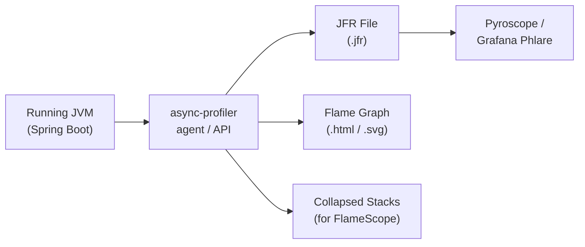

# Continuous Profiling with async-profiler

[← Back to README](../README.md)

---

**async-profiler** is a low-overhead sampling profiler for the JVM that captures CPU, allocation, lock contention, and wall-clock profiles without the safepoint bias that plagues traditional JVMTI-based profilers. It works by attaching directly to the running JVM via Linux `perf_events` or `AsyncGetCallTrace`, producing flame graphs, JFR files, and collapsed stacks suitable for continuous profiling in production.



---

## Installation

```bash
# Download from GitHub releases
curl -L https://github.com/async-profiler/async-profiler/releases/download/v3.0/\
async-profiler-3.0-linux-x64.tar.gz | tar xz

# Or on macOS
curl -L https://github.com/async-profiler/async-profiler/releases/download/v3.0/\
async-profiler-3.0-macos.zip -o async-profiler.zip && unzip async-profiler.zip
```

---

## One-Shot Profiling (CLI)

```bash
# Attach to a running JVM process (PID or app name)
./asprof -d 30 -f /tmp/profile.html <pid>      # 30s CPU, flame graph HTML
./asprof -d 30 -e alloc -f /tmp/alloc.html <pid>  # allocation profiling
./asprof -d 30 -e lock  -f /tmp/lock.html <pid>   # lock contention
./asprof -d 30 -e wall  -f /tmp/wall.html <pid>   # wall-clock (all threads)

# Start/stop manually (capture during a specific operation)
./asprof start <pid>
# ... trigger the operation under test ...
./asprof stop -f /tmp/snapshot.html <pid>

# Output formats
./asprof -d 30 -o flamegraph -f profile.html <pid>   # interactive flame graph
./asprof -d 30 -o jfr        -f profile.jfr  <pid>   # JFR for JMC / IntelliJ
./asprof -d 30 -o collapsed  -f profile.txt  <pid>   # collapsed stacks
./asprof -d 30 -o tree       -f profile.html <pid>   # call tree
```

---

## JVM Agent — Attach at Startup

```bash
# Attach as a Java agent (captures from JVM startup, including JIT compilation)
java -agentpath:/path/to/libasyncProfiler.so=start,event=cpu,file=/tmp/startup.html \
     -jar myapp.jar

# Start with profiler but only capture during specific periods
java -agentpath:/path/to/libasyncProfiler.so=start,event=alloc,interval=524288,\
file=/tmp/alloc.jfr,jfrsync=default \
     -jar myapp.jar
```

```yaml
# Spring Boot application.yml — embed agent path for containerized apps
spring:
  jmx:
    enabled: true

# Pass via JVM args in Kubernetes:
# -agentpath:/profiler/libasyncProfiler.so=start,event=cpu,interval=10ms,file=/profiles/profile.jfr
```

---

## Programmatic API (Spring Integration)

```java
@Component
public class AsyncProfilerController {

    // One API method - attach via dynamic loading
    private volatile boolean profiling = false;

    @PostMapping("/admin/profiler/start")
    @PreAuthorize("hasRole('ADMIN')")
    public ResponseEntity<String> startProfiling(
            @RequestParam(defaultValue = "cpu") String event,
            @RequestParam(defaultValue = "60") int durationSeconds) {

        if (profiling) return ResponseEntity.badRequest().body("Already profiling");
        profiling = true;

        String outputPath = "/tmp/profile-" + Instant.now().toEpochMilli() + ".html";

        // Run in background thread — attach to current process
        CompletableFuture.runAsync(() -> {
            try {
                ProcessBuilder pb = new ProcessBuilder(
                    "/opt/async-profiler/asprof",
                    "-d", String.valueOf(durationSeconds),
                    "-e", event,
                    "-o", "flamegraph",
                    "-f", outputPath,
                    String.valueOf(ProcessHandle.current().pid())
                );
                pb.redirectErrorStream(true);
                Process p = pb.start();
                p.waitFor();
            } catch (Exception e) {
                log.error("Profiling failed", e);
            } finally {
                profiling = false;
            }
        });

        return ResponseEntity.accepted()
            .body("Profiling started for " + durationSeconds + "s → " + outputPath);
    }

    @GetMapping(value = "/admin/profiler/download", produces = "text/html")
    @PreAuthorize("hasRole('ADMIN')")
    public ResponseEntity<Resource> downloadProfile(@RequestParam String file)
            throws IOException {
        Path path = Path.of(file).normalize();
        if (!path.startsWith("/tmp/profile-")) {
            return ResponseEntity.badRequest().build();
        }
        Resource resource = new FileSystemResource(path);
        return ResponseEntity.ok()
            .header(HttpHeaders.CONTENT_DISPOSITION,
                "attachment; filename=\"" + path.getFileName() + "\"")
            .body(resource);
    }
}
```

---

## Continuous Profiling with Pyroscope

```xml
<dependency>
    <groupId>io.pyroscope</groupId>
    <artifactId>agent</artifactId>
    <version>0.13.0</version>
</dependency>
```

```java
@Configuration
public class PyroscopeConfig {

    @Bean
    @ConditionalOnProperty("pyroscope.enabled")
    public PyroscopeAgent pyroscopeAgent(
            @Value("${pyroscope.server-url}") String serverUrl,
            @Value("${spring.application.name}") String appName) {

        PyroscopeAgent.start(
            new Config.Builder()
                .setApplicationName(appName)
                .setProfilingEvent(EventType.ITIMER)
                .setProfilingAlloc("512k")   // allocation profiling, 512 KB sample interval
                .setServerAddress(serverUrl)
                .setLabels(Map.of(
                    "env",     System.getenv().getOrDefault("ENVIRONMENT", "dev"),
                    "version", getClass().getPackage().getImplementationVersion()
                ))
                .build()
        );
        return PyroscopeAgent.getInstance();
    }
}
```

---

## JFR (Java Flight Recorder) Integration

```java
@Service
public class JfrProfilingService {

    // Start a JFR recording programmatically
    public Path captureJfr(Duration duration) throws Exception {
        Path output = Files.createTempFile("jfr-", ".jfr");

        ProcessBuilder pb = new ProcessBuilder(
            "jcmd",
            String.valueOf(ProcessHandle.current().pid()),
            "JFR.start",
            "duration=" + duration.toSeconds() + "s",
            "filename=" + output,
            "settings=profile"
        );
        pb.start().waitFor();

        return output;
    }

    // Combine with async-profiler's JFR output for wall-clock events
    // not captured by JFR alone (e.g., native frames, kernel stacks)
    public void mergeWithAsyncProfiler(Path jfrFile) {
        // Use jfr-flame-graph or IntelliJ to visualize
    }
}
```

---

## Reading Flame Graphs

```
# Flame graph anatomy:
#
#  ┌─────────────────────────────────────────────────────────┐
#  │                   main() [10%]                          │
#  ├───────────────────────┬─────────────────────────────────┤
#  │ handleRequest() [7%]  │ parseConfig() [3%]              │
#  ├───────────┬───────────┤                                 │
#  │ db.query  │ json.ser  │                                 │
#  │ [5%]      │ [2%]      │                                 │
#  └───────────┴───────────┴─────────────────────────────────┘
#
# Wide frames at the top = hottest code paths
# Flat top = CPU bound in that frame (no callees)
# Deep stacks = call depth (not necessarily slow)
# Look for: plateau tops, wide unexpected frames
```

---

## Profiling Checklist

```bash
# Before profiling
# 1. Warm up the JVM (JIT must have compiled hot paths)
# 2. Generate realistic load (use wrk, k6, or Gatling)

# CPU profiling (find hot methods)
./asprof -d 60 -e cpu -f cpu.html <pid>

# Allocation profiling (find GC pressure sources)
./asprof -d 60 -e alloc -f alloc.html <pid>

# Wall-clock profiling (find threads blocked on I/O or locks)
./asprof -d 60 -e wall -t -f wall.html <pid>   # -t separates threads

# Lock contention (find monitor contention)
./asprof -d 60 -e lock -f lock.html <pid>

# Filter to a specific thread name
./asprof -d 30 -e cpu --filter 'http-nio*' -f http.html <pid>
```

---

## Continuous Profiling Summary

| Concept | Detail |
|---------|--------|
| async-profiler | Low-overhead sampling profiler; no safepoint bias; captures native frames |
| `-e cpu` | CPU profiling — samples threads on-CPU every N microseconds (default 10ms) |
| `-e alloc` | Allocation profiling — records allocation sites weighted by bytes allocated |
| `-e wall` | Wall-clock profiling — includes threads blocked on I/O, sleeps, and locks |
| `-e lock` | Monitor contention — records threads waiting to acquire a Java monitor |
| `-o flamegraph` | Interactive SVG flame graph — wide frames are hot; flat top = CPU-bound |
| `-o jfr` | JFR output — open in IntelliJ, JMC, or JDK Mission Control |
| `jfrsync=default` | Synchronize async-profiler events into a JFR stream for combined analysis |
| Pyroscope / Phlare | Continuous profiling backends — scrape JFR/async-profiler on a schedule |
| Allocation sampling | Use large interval (`-i 524288`) to reduce overhead; still finds hot paths |

---

[← Back to README](../README.md)
