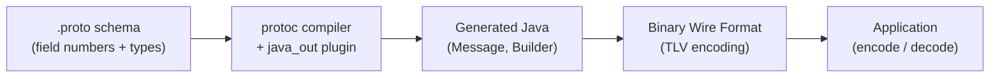

# Protocol Buffers Deep Dive

[← Back to README](../README.md)

---

Protocol Buffers (protobuf) is Google's language-neutral, binary serialization format. It is ~3–10× smaller and ~5–10× faster than JSON for comparable payloads, and its schema-first design enforces backward/forward compatibility through field numbers. In Java, `protoc` generates immutable message classes with builders; **protobuf-java** provides the runtime; **gRPC** uses protobuf as its wire format.



---

## Maven Setup

```xml
<dependency>
    <groupId>com.google.protobuf</groupId>
    <artifactId>protobuf-java</artifactId>
    <version>3.25.3</version>
</dependency>
<dependency>
    <groupId>com.google.protobuf</groupId>
    <artifactId>protobuf-java-util</artifactId>
    <version>3.25.3</version>
</dependency>

<build>
    <plugins>
        <plugin>
            <groupId>io.github.ascopes</groupId>
            <artifactId>protobuf-maven-plugin</artifactId>
            <version>2.6.0</version>
            <configuration>
                <protocVersion>3.25.3</protocVersion>
            </configuration>
            <executions>
                <execution>
                    <goals><goal>generate</goal></goals>
                </execution>
            </executions>
        </plugin>
    </plugins>
</build>
```

---

## Proto Schema

```protobuf
// src/main/proto/order.proto
syntax = "proto3";

package com.example.order;

option java_package = "com.example.order.proto";
option java_outer_classname = "OrderProto";
option java_multiple_files = true;  // one .java file per message

import "google/protobuf/timestamp.proto";
import "google/protobuf/wrappers.proto";  // nullable primitives

message Order {
    int64  order_id   = 1;
    string customer_id = 2;
    OrderStatus status = 3;
    repeated OrderLine lines = 4;
    google.protobuf.Timestamp created_at = 5;
    map<string, string> metadata = 6;
    oneof payment {
        CreditCard credit_card = 7;
        BankTransfer bank_transfer = 8;
    }
}

message OrderLine {
    string product_id = 1;
    int32  quantity   = 2;
    int64  unit_price_cents = 3;  // store money as integer cents
}

enum OrderStatus {
    ORDER_STATUS_UNSPECIFIED = 0;  // proto3 default must be 0
    ORDER_STATUS_PENDING     = 1;
    ORDER_STATUS_CONFIRMED   = 2;
    ORDER_STATUS_SHIPPED     = 3;
    ORDER_STATUS_CANCELLED   = 4;
}

message CreditCard {
    string last_four = 1;
    string network   = 2;
}

message BankTransfer {
    string reference = 1;
}
```

---

## Building Messages

```java
@Service
public class OrderProtoService {

    // Build with fluent builder
    public Order buildOrder(Long orderId, String customerId, List<CartItem> items) {
        Order.Builder builder = Order.newBuilder()
            .setOrderId(orderId)
            .setCustomerId(customerId)
            .setStatus(OrderStatus.ORDER_STATUS_PENDING)
            .setCreatedAt(toTimestamp(Instant.now()))
            .putMetadata("source", "web")
            .putMetadata("version", "2");

        items.forEach(item -> builder.addLines(
            OrderLine.newBuilder()
                .setProductId(item.productId())
                .setQuantity(item.quantity())
                .setUnitPriceCents(item.priceInCents())
                .build()
        ));

        builder.setCreditCard(CreditCard.newBuilder()
            .setLastFour("4242")
            .setNetwork("VISA")
            .build());

        return builder.build();
    }

    private Timestamp toTimestamp(Instant instant) {
        return Timestamp.newBuilder()
            .setSeconds(instant.getEpochSecond())
            .setNanos(instant.getNano())
            .build();
    }
}
```

---

## Serialization and Deserialization

```java
@Service
public class ProtoSerializationService {

    // Serialize to bytes
    public byte[] serialize(Order order) {
        return order.toByteArray();
    }

    // Deserialize from bytes
    public Order deserialize(byte[] bytes) throws InvalidProtocolBufferException {
        return Order.parseFrom(bytes);
    }

    // Stream serialization (length-delimited — multiple messages in one stream)
    public void writeToStream(List<Order> orders, OutputStream out) throws IOException {
        for (Order order : orders) {
            order.writeDelimitedTo(out);
        }
    }

    public List<Order> readFromStream(InputStream in) throws IOException {
        List<Order> orders = new ArrayList<>();
        Order order;
        while ((order = Order.parseDelimitedFrom(in)) != null) {
            orders.add(order);
        }
        return orders;
    }

    // JSON interop (via protobuf-java-util)
    public String toJson(Order order) throws InvalidProtocolBufferException {
        return JsonFormat.printer()
            .includingDefaultValueFields()
            .omittingInsignificantWhitespace()
            .print(order);
    }

    public Order fromJson(String json) throws InvalidProtocolBufferException {
        Order.Builder builder = Order.newBuilder();
        JsonFormat.parser().ignoringUnknownFields().merge(json, builder);
        return builder.build();
    }
}
```

---

## Spring Boot — Protobuf HTTP

```xml
<!-- Spring MVC support for protobuf request/response bodies -->
<dependency>
    <groupId>com.google.protobuf</groupId>
    <artifactId>protobuf-java-util</artifactId>
    <version>3.25.3</version>
</dependency>
```

```java
@Configuration
public class ProtobufConfig implements WebMvcConfigurer {

    @Override
    public void configureMessageConverters(List<HttpMessageConverter<?>> converters) {
        // Binary protobuf: application/x-protobuf
        converters.add(new ProtobufHttpMessageConverter());
        // JSON with protobuf field names: application/json
        converters.add(new ProtobufJsonFormatHttpMessageConverter());
    }
}

@RestController
@RequestMapping("/api/orders")
public class OrderController {

    @PostMapping(
        consumes = "application/x-protobuf",
        produces = "application/x-protobuf"
    )
    public ResponseEntity<Order> create(@RequestBody Order order) {
        Order saved = orderService.save(order);
        return ResponseEntity.status(HttpStatus.CREATED).body(saved);
    }

    @GetMapping(value = "/{id}", produces = {
        "application/x-protobuf",
        MediaType.APPLICATION_JSON_VALUE
    })
    public ResponseEntity<Order> get(@PathVariable Long id) {
        return ResponseEntity.ok(orderService.findById(id));
    }
}
```

---

## Schema Evolution — Backward Compatibility

```protobuf
// v1 schema
message Order {
    int64  order_id = 1;
    string customer_id = 2;
}

// v2 schema — SAFE additions
message Order {
    int64  order_id    = 1;  // unchanged — never change field numbers
    string customer_id = 2;  // unchanged
    string notes       = 3;  // NEW optional field — v1 readers ignore it
    // NEVER reuse field number 3 for a different type once deployed
    // NEVER rename fields (wire format uses numbers, not names)
    // NEVER change field type (int32 → int64 may break parsers)
    // reserved 10 to 15;  // mark removed fields as reserved to prevent reuse
}
```

---

## Reflection and Dynamic Messages

```java
// Dynamic message — no generated code required
public void dynamicMessage() throws InvalidProtocolBufferException {
    // Load descriptor from a .desc file or embedded descriptor
    FileDescriptorSet fds = FileDescriptorSet.parseFrom(
        getClass().getResourceAsStream("/proto/order.desc"));

    FileDescriptor fileDescriptor = FileDescriptor.buildFrom(
        fds.getFile(0), new FileDescriptor[0]);

    Descriptor orderDescriptor = fileDescriptor.findMessageTypeByName("Order");

    // Build a dynamic message
    DynamicMessage msg = DynamicMessage.newBuilder(orderDescriptor)
        .setField(orderDescriptor.findFieldByName("order_id"), 42L)
        .setField(orderDescriptor.findFieldByName("customer_id"), "cust-1")
        .build();

    // Introspect fields
    for (FieldDescriptor fd : orderDescriptor.getFields()) {
        System.out.println(fd.getName() + " = " + msg.getField(fd));
    }
}
```

---

## Kafka Integration with Protobuf

```java
@Configuration
public class KafkaProtoConfig {

    @Bean
    public ProducerFactory<String, Order> producerFactory() {
        Map<String, Object> props = new HashMap<>();
        props.put(ProducerConfig.BOOTSTRAP_SERVERS_CONFIG, "localhost:9092");
        props.put(ProducerConfig.KEY_SERIALIZER_CLASS_CONFIG, StringSerializer.class);
        props.put(ProducerConfig.VALUE_SERIALIZER_CLASS_CONFIG, ByteArraySerializer.class);
        return new DefaultKafkaProducerFactory<>(props,
            new StringSerializer(),
            (topic, order) -> order.toByteArray());  // serialize to proto bytes
    }

    @Bean
    public ConsumerFactory<String, Order> consumerFactory() {
        Map<String, Object> props = new HashMap<>();
        props.put(ConsumerConfig.BOOTSTRAP_SERVERS_CONFIG, "localhost:9092");
        props.put(ConsumerConfig.KEY_DESERIALIZER_CLASS_CONFIG, StringDeserializer.class);
        props.put(ConsumerConfig.VALUE_DESERIALIZER_CLASS_CONFIG, ByteArrayDeserializer.class);
        return new DefaultKafkaConsumerFactory<>(props,
            new StringDeserializer(),
            (topic, bytes) -> {
                try { return Order.parseFrom(bytes); }
                catch (InvalidProtocolBufferException e) { throw new RuntimeException(e); }
            });
    }
}
```

---

## Protocol Buffers Summary

| Concept | Detail |
|---------|--------|
| Field number | Integer tag in the binary wire format — the true identity of a field, not the name |
| `syntax = "proto3"` | All fields optional by default; enum defaults to 0; no `required` keyword |
| `repeated` | Variable-length list field — serialized as packed encoding for numeric types |
| `oneof` | Exactly one of the listed fields may be set; others are cleared |
| `map<K, V>` | Key-value pairs; serialized as repeated entries (not ordered) |
| `Timestamp` | Well-known type from `google/protobuf/timestamp.proto` — seconds + nanos |
| `toByteArray()` | Serialize to compact binary; typically 3–10× smaller than equivalent JSON |
| `parseDelimitedFrom` | Length-prefix framing for streaming multiple messages on one connection |
| `JsonFormat.printer()` | Convert proto message to JSON using proto field names (snake_case by default) |
| Backward compatibility | Never change or reuse field numbers; new fields are safe; use `reserved` for deleted fields |
| `DynamicMessage` | Parse/inspect proto messages at runtime without generated code |

---

[← Back to README](../README.md)
