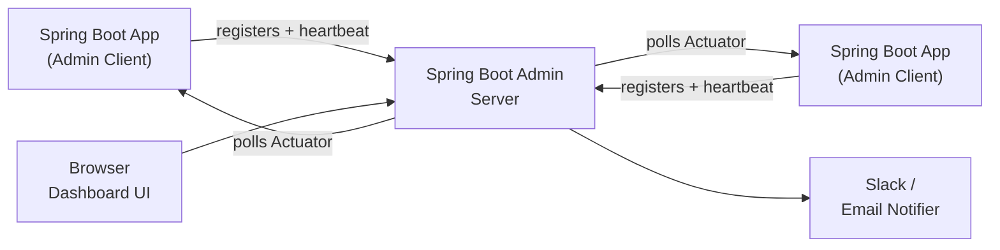

# Spring Boot Admin

[← Back to README](../README.md)

---

**Spring Boot Admin** is a community project that provides a web UI on top of Spring Boot Actuator endpoints. It consists of a **server** (the dashboard) and a **client** (each Spring Boot app). Clients register with the server, which then polls their Actuator endpoints and displays health, metrics, log levels, environment, HTTP traces, thread dumps, and heap dumps in one place. It also supports notifications (Slack, Teams, email) when application health changes.



---

## Server Setup

```xml
<!-- Spring Boot Admin Server -->
<dependency>
    <groupId>de.codecentric</groupId>
    <artifactId>spring-boot-admin-starter-server</artifactId>
    <version>3.3.3</version>
</dependency>
<dependency>
    <groupId>org.springframework.boot</groupId>
    <artifactId>spring-boot-starter-web</artifactId>
</dependency>
```

```java
@SpringBootApplication
@EnableAdminServer
public class AdminServerApplication {
    public static void main(String[] args) {
        SpringApplication.run(AdminServerApplication.class, args);
    }
}
```

```yaml
# application.yml (server)
server:
  port: 8080

spring:
  application:
    name: admin-server
  boot:
    admin:
      ui:
        title: "My Company — Admin"
        brand: "<span>Admin</span>"
```

---

## Client Setup

```xml
<!-- Add to each monitored Spring Boot app -->
<dependency>
    <groupId>de.codecentric</groupId>
    <artifactId>spring-boot-admin-starter-client</artifactId>
    <version>3.3.3</version>
</dependency>
```

```yaml
# application.yml (each client app)
spring:
  application:
    name: orders-service
  boot:
    admin:
      client:
        url: http://admin-server:8080
        instance:
          prefer-ip: true           # register with IP instead of hostname
          metadata:
            environment: production
            version: ${app.version:unknown}

management:
  endpoints:
    web:
      exposure:
        include: "*"               # expose all Actuator endpoints
  endpoint:
    health:
      show-details: always
    logfile:
      enabled: true               # enable log file access in Admin UI
  info:
    env:
      enabled: true
```

---

## Security — Securing the Admin Server

```xml
<dependency>
    <groupId>org.springframework.boot</groupId>
    <artifactId>spring-boot-starter-security</artifactId>
</dependency>
```

```java
@Configuration
@EnableWebSecurity
public class AdminServerSecurityConfig {

    private final AdminServerProperties adminServer;

    public AdminServerSecurityConfig(AdminServerProperties adminServer) {
        this.adminServer = adminServer;
    }

    @Bean
    public SecurityFilterChain securityFilterChain(HttpSecurity http) throws Exception {
        SavedRequestAwareAuthenticationSuccessHandler successHandler =
            new SavedRequestAwareAuthenticationSuccessHandler();
        successHandler.setTargetUrlParameter("redirectTo");
        successHandler.setDefaultTargetUrl(adminServer.path("/"));

        http
            .authorizeHttpRequests(auth -> auth
                .requestMatchers(adminServer.path("/assets/**")).permitAll()
                .requestMatchers(adminServer.path("/login")).permitAll()
                .requestMatchers(adminServer.path("/instances")).permitAll()  // client registration
                .requestMatchers(adminServer.path("/instances/**")).permitAll()
                .requestMatchers(adminServer.path("/actuator/**")).permitAll()
                .anyRequest().authenticated())
            .formLogin(form -> form
                .loginPage(adminServer.path("/login"))
                .successHandler(successHandler))
            .logout(logout -> logout
                .logoutUrl(adminServer.path("/logout")))
            .csrf(csrf -> csrf.csrfTokenRepository(
                CookieCsrfTokenRepository.withHttpOnlyFalse())
                .ignoringRequestMatchers(
                    new AntPathRequestMatcher(adminServer.path("/instances"),
                        HttpMethod.POST.toString()),
                    new AntPathRequestMatcher(adminServer.path("/instances/*"),
                        HttpMethod.DELETE.toString()),
                    new AntPathRequestMatcher(adminServer.path("/actuator/**"))));

        return http.build();
    }
}
```

```yaml
# Admin server credentials
spring:
  security:
    user:
      name: admin
      password: "${ADMIN_PASSWORD}"
```

```yaml
# Client must send credentials when registering with secured server
spring:
  boot:
    admin:
      client:
        url: http://admin-server:8080
        username: admin
        password: "${ADMIN_PASSWORD}"
```

---

## Custom Health Indicator

```java
@Component
public class ExternalApiHealthIndicator implements HealthIndicator {

    private final ExternalApiClient client;

    public ExternalApiHealthIndicator(ExternalApiClient client) {
        this.client = client;
    }

    @Override
    public Health health() {
        try {
            ApiStatus status = client.ping();
            if (status.isUp()) {
                return Health.up()
                    .withDetail("latencyMs", status.latencyMs())
                    .withDetail("version", status.version())
                    .build();
            }
            return Health.down()
                .withDetail("reason", status.errorMessage())
                .build();
        } catch (Exception e) {
            return Health.down(e)
                .withDetail("reason", "connection failed")
                .build();
        }
    }
}
```

---

## Notifications — Slack

```yaml
spring:
  boot:
    admin:
      notify:
        slack:
          webhook-url: "${SLACK_WEBHOOK_URL}"
          channel: "#alerts"
          username: "Spring Boot Admin"
          message: "*#{instance.registration.name}* (#{instance.id}) is *#{event.statusInfo.status}*"
          icon: ":spring:"
```

---

## Notifications — Email

```yaml
spring:
  mail:
    host: smtp.company.com
    port: 587
    username: "${MAIL_USER}"
    password: "${MAIL_PASS}"
    properties:
      mail.smtp.starttls.enable: true

  boot:
    admin:
      notify:
        mail:
          to: "ops-team@company.com"
          from: "admin@company.com"
          subject: "Spring Boot Admin — #{instance.registration.name} is #{event.statusInfo.status}"
```

---

## Custom Notifier

```java
@Component
public class PagerDutyNotifier extends AbstractStatusChangeNotifier {

    private final PagerDutyClient pagerDuty;

    public PagerDutyNotifier(PagerDutyClient pagerDuty, InstanceRepository repository) {
        super(repository);
        this.pagerDuty = pagerDuty;
    }

    @Override
    protected Mono<Void> doNotify(InstanceEvent event, Instance instance) {
        if (event instanceof InstanceStatusChangedEvent statusEvent) {
            StatusInfo status = statusEvent.getStatusInfo();
            if ("DOWN".equals(status.getStatus()) || "OFFLINE".equals(status.getStatus())) {
                return Mono.fromRunnable(() ->
                    pagerDuty.trigger(
                        instance.getRegistration().getName(),
                        "App went " + status.getStatus()));
            }
        }
        return Mono.empty();
    }
}
```

---

## Kubernetes — Self-Discovery via Eureka / Spring Cloud

```yaml
# When deployed in Kubernetes, use Spring Cloud Kubernetes discovery
# instead of manual client registration
spring:
  boot:
    admin:
      discovery:
        enabled: true
      ui:
        public-url: https://admin.company.com
```

---

## Spring Boot Admin Summary

| Concept | Detail |
|---------|--------|
| `@EnableAdminServer` | Activates the Admin Server — serves the dashboard UI and REST API |
| Admin Client | `spring-boot-admin-starter-client` — registers with server, sends heartbeats |
| `management.endpoints.web.exposure.include=*` | Expose all Actuator endpoints so Admin can read them |
| `prefer-ip: true` | Register with IP address instead of hostname — avoids DNS issues in containers |
| `instance.metadata` | Key-value pairs shown in the UI — useful for environment, version, team |
| Health indicators | Custom `HealthIndicator` beans appear as named subsystems in the health view |
| Log-level management | Change Logback/Log4j2 log levels at runtime from the UI without restart |
| Slack notifier | `spring.boot.admin.notify.slack.webhook-url` — alerts on DOWN/UP transitions |
| CSRF exceptions | Client registration endpoints (`POST /instances`) must bypass CSRF protection |
| `AbstractStatusChangeNotifier` | Base class for custom notifiers — override `doNotify()` |

---

[← Back to README](../README.md)
