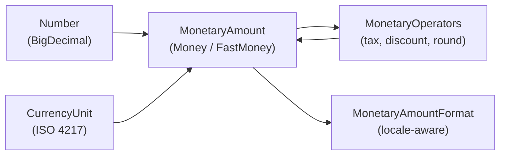

# Java Money (JSR 354 / Moneta)

[← Back to README](../README.md)

---

**JSR 354** defines the Java Money API — a standard for representing monetary amounts and currencies in a type-safe, immutable way. **Moneta** is the reference implementation. It solves the classic problems of using `double` or even raw `BigDecimal` for money: precision loss, currency confusion, rounding ambiguity, and missing formatting. The API distinguishes `MonetaryAmount` (amount + currency) from `CurrencyUnit`, and provides a rich set of operators, rounding modes, and formatters.



---

## Dependency

```xml
<dependency>
    <groupId>org.javamoney</groupId>
    <artifactId>moneta</artifactId>
    <version>1.4.4</version>
    <type>pom</type>
</dependency>
```

---

## Creating Monetary Amounts

```java
// CurrencyUnit — ISO 4217
CurrencyUnit usd = Monetary.getCurrency("USD");
CurrencyUnit zar = Monetary.getCurrency("ZAR");
CurrencyUnit eur = Monetary.getCurrency(Locale.GERMANY);

// Money — arbitrary precision (backed by BigDecimal)
MonetaryAmount price    = Money.of(29.99, "USD");
MonetaryAmount discount = Money.of(new BigDecimal("5.00"), usd);
MonetaryAmount zero     = Money.zero(usd);

// FastMoney — fixed-scale long (faster, limited to 5 decimal places)
MonetaryAmount fast = FastMoney.of(29.99, "USD");

// From string
MonetaryAmount parsed = Money.parse("USD 29.99");
```

---

## Arithmetic

```java
MonetaryAmount price    = Money.of(100, "USD");
MonetaryAmount tax      = Money.of(15, "USD");
MonetaryAmount shipping = Money.of(9.99, "USD");

// Basic operations — all return new instances (immutable)
MonetaryAmount subtotal = price.add(tax);           // USD 115.00
MonetaryAmount afterTax = price.subtract(tax);      // USD 85.00
MonetaryAmount doubled  = price.multiply(2);        // USD 200.00
MonetaryAmount half     = price.divide(2);          // USD 50.00

// Negation and absolute value
MonetaryAmount refund = price.negate();             // USD -100.00
MonetaryAmount abs    = refund.abs();               // USD 100.00

// Comparison
boolean isPositive = price.isPositive();
boolean isGreater  = price.isGreaterThan(tax);
int     cmp        = price.compareTo(tax);          // 1

// WRONG — mixing currencies throws ArithmeticException
// price.add(Money.of(10, "EUR"));  // throws CurrencyMismatchException
```

---

## Rounding

```java
MonetaryAmount amount = Money.of(10.555, "USD");

// Standard rounding modes
MonetaryAmount rounded = amount.with(
    Monetary.getDefaultRounding());                 // rounds to currency scale (2dp for USD)

MonetaryOperator halfUp = MonetaryRoundings.getRounding(
    RoundingQueryBuilder.of()
        .setScale(2)
        .set(RoundingMode.HALF_UP)
        .build());

MonetaryAmount halfUpRounded = amount.with(halfUp); // USD 10.56

// Round to 0 decimal places (e.g., JPY has no cents)
CurrencyUnit jpy = Monetary.getCurrency("JPY");
MonetaryAmount yenAmount = Money.of(1234.567, "JPY")
    .with(Monetary.getDefaultRounding());           // JPY 1235
```

---

## Custom Monetary Operators

```java
// MonetaryOperator is a functional interface: MonetaryAmount → MonetaryAmount

// Percentage operator
public class PercentageOperator implements MonetaryOperator {

    private final BigDecimal rate;

    public PercentageOperator(double percentage) {
        this.rate = BigDecimal.valueOf(percentage / 100.0);
    }

    @Override
    public MonetaryAmount apply(MonetaryAmount amount) {
        return amount.multiply(rate)
            .with(Monetary.getDefaultRounding());
    }
}

MonetaryAmount price = Money.of(200, "USD");

MonetaryOperator vat15     = new PercentageOperator(15);
MonetaryOperator discount5 = new PercentageOperator(5);

MonetaryAmount vatAmount      = price.with(vat15);       // USD 30.00
MonetaryAmount discountAmount = price.with(discount5);   // USD 10.00
MonetaryAmount total          = price.add(vatAmount);    // USD 230.00

// Chain operators
MonetaryAmount finalPrice = price
    .subtract(price.with(discount5))
    .add(price.subtract(price.with(discount5)).with(vat15));
```

---

## Formatting and Parsing

```java
// Locale-aware formatting
MonetaryAmountFormat usdFormat = MonetaryFormats.getAmountFormat(Locale.US);
MonetaryAmountFormat gbpFormat = MonetaryFormats.getAmountFormat(Locale.UK);
MonetaryAmountFormat zarFormat = MonetaryFormats.getAmountFormat(new Locale("en", "ZA"));

MonetaryAmount amount = Money.of(1234.56, "USD");

System.out.println(usdFormat.format(amount));  // $1,234.56
System.out.println(gbpFormat.format(amount));  // USD1,234.56 (USD not native to UK)

// Custom format
MonetaryAmountFormat custom = MonetaryFormats.getAmountFormat(
    AmountFormatQueryBuilder.of(Locale.US)
        .set(CurrencyStyle.SYMBOL)
        .build());

// Parsing
MonetaryAmount parsed = usdFormat.parse("$1,234.56");
```

---

## Jackson Integration

```java
@Configuration
public class JacksonMoneyConfig {

    @Bean
    public Jackson2ObjectMapperBuilderCustomizer moneyCustomizer() {
        return builder -> {
            // Serialize MonetaryAmount as { "amount": 29.99, "currency": "USD" }
            builder.serializerByType(MonetaryAmount.class,
                new JsonSerializer<MonetaryAmount>() {
                    @Override
                    public void serialize(MonetaryAmount value, JsonGenerator gen,
                                          SerializerProvider serializers) throws IOException {
                        gen.writeStartObject();
                        gen.writeNumberField("amount",
                            value.getNumber().numberValueExact(BigDecimal.class));
                        gen.writeStringField("currency",
                            value.getCurrency().getCurrencyCode());
                        gen.writeEndObject();
                    }
                });

            builder.deserializerByType(MonetaryAmount.class,
                new JsonDeserializer<MonetaryAmount>() {
                    @Override
                    public MonetaryAmount deserialize(JsonParser p, DeserializationContext ctx)
                            throws IOException {
                        JsonNode node = p.getCodec().readTree(p);
                        BigDecimal amount = node.get("amount").decimalValue();
                        String currency = node.get("currency").asText();
                        return Money.of(amount, currency);
                    }
                });
        };
    }
}
```

---

## JPA Converter

```java
@Converter(autoApply = false)
public class MonetaryAmountConverter implements AttributeConverter<MonetaryAmount, String> {

    // Store as "USD 29.99" in a VARCHAR column
    @Override
    public String convertToDatabaseColumn(MonetaryAmount amount) {
        return amount == null ? null : amount.getCurrency().getCurrencyCode()
            + " " + amount.getNumber().numberValueExact(BigDecimal.class).toPlainString();
    }

    @Override
    public MonetaryAmount convertToEntityAttribute(String dbData) {
        if (dbData == null) return null;
        String[] parts = dbData.split(" ", 2);
        return Money.of(new BigDecimal(parts[1]), parts[0]);
    }
}

@Entity
public class Order {
    @Id Long id;

    @Convert(converter = MonetaryAmountConverter.class)
    @Column(name = "total_amount")
    private MonetaryAmount total;

    @Convert(converter = MonetaryAmountConverter.class)
    @Column(name = "tax_amount")
    private MonetaryAmount tax;
}
```

---

## Currency Conversion

```java
// Moneta provides an ExchangeRateProvider SPI
// For live rates, use a provider like ECB (European Central Bank)
ExchangeRateProvider ecbProvider = MonetaryConversions.getExchangeRateProvider("ECB");

CurrencyConversion toEur = ecbProvider.getCurrencyConversion("EUR");

MonetaryAmount usd = Money.of(100, "USD");
MonetaryAmount eur = usd.with(toEur);   // converts at ECB rate

// Cache-aware conversion (Moneta caches rates by default)
ExchangeRate rate = ecbProvider.getExchangeRate("USD", "EUR");
System.out.println("1 USD = " + rate.getFactor() + " EUR");
```

---

## Value Object Pattern

```java
// Use MonetaryAmount inside a value object
public record Price(MonetaryAmount amount) {

    public Price {
        Objects.requireNonNull(amount);
        if (amount.isNegativeOrZero()) throw new IllegalArgumentException("Price must be positive");
    }

    public Price withTax(double vatRate) {
        MonetaryOperator vat = new PercentageOperator(vatRate);
        return new Price(amount.add(amount.with(vat)).with(Monetary.getDefaultRounding()));
    }

    public Price withDiscount(MonetaryAmount discount) {
        if (!discount.getCurrency().equals(amount.getCurrency())) {
            throw new CurrencyMismatchException(amount.getCurrency(), discount.getCurrency());
        }
        return new Price(amount.subtract(discount).with(Monetary.getDefaultRounding()));
    }

    @Override
    public String toString() {
        return MonetaryFormats.getAmountFormat(Locale.US).format(amount);
    }
}
```

---

## Java Money Summary

| Concept | Detail |
|---------|--------|
| `MonetaryAmount` | Immutable amount + currency — the core type; never use `double` for money |
| `Money` | BigDecimal-backed implementation — arbitrary precision, use for financial calculations |
| `FastMoney` | Long-backed, fixed 5 decimal places — 3–4× faster but limited precision |
| `CurrencyUnit` | ISO 4217 currency code — obtained via `Monetary.getCurrency("USD")` |
| `MonetaryOperator` | `MonetaryAmount → MonetaryAmount` — compose tax, discount, rounding operations |
| `Monetary.getDefaultRounding()` | Rounds to currency's default scale (USD=2, JPY=0, KWD=3) |
| `MonetaryFormats` | Locale-aware formatting and parsing — handles symbols, grouping, decimal separators |
| `AttributeConverter` | Store as `"USD 29.99"` VARCHAR in DB; parse back on load |
| `ExchangeRateProvider` | SPI for currency conversion — ECB provider included, plug in live rates |
| `CurrencyMismatchException` | Thrown when adding amounts of different currencies — enforced at runtime |

---

[← Back to README](../README.md)
