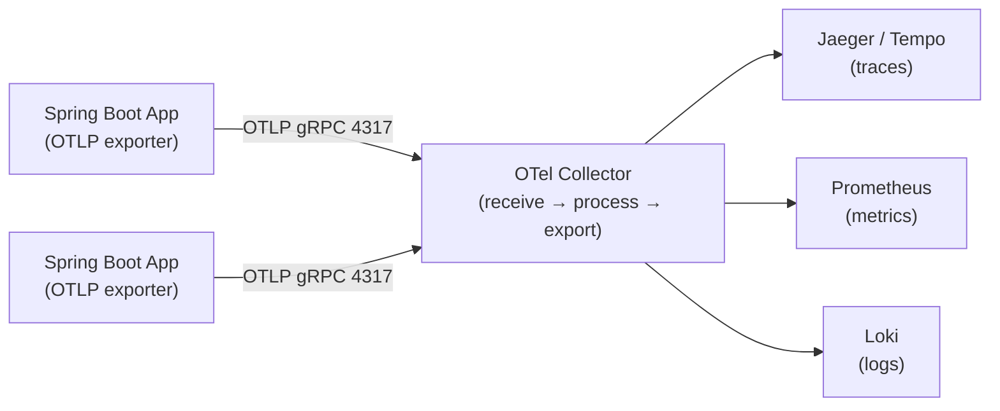

# OpenTelemetry Collector

[← Back to README](../README.md)

---

The **OpenTelemetry Collector** is a vendor-agnostic proxy that receives, processes, and exports telemetry data (traces, metrics, logs). Instead of each application shipping directly to Jaeger, Prometheus, and Loki, they ship to the Collector, which fans out to multiple backends. This decouples your application from observability backends and lets you add sampling, attribute filtering, batching, and enrichment in one place.



---

## Collector Configuration — otel-collector.yaml

```yaml
# Full pipeline: receivers → processors → exporters
receivers:
  otlp:
    protocols:
      grpc:
        endpoint: 0.0.0.0:4317
      http:
        endpoint: 0.0.0.0:4318

  # Scrape Prometheus metrics from apps that expose /actuator/prometheus
  prometheus:
    config:
      scrape_configs:
        - job_name: spring-apps
          scrape_interval: 15s
          static_configs:
            - targets: ["orders-service:8080", "inventory-service:8080"]
          metrics_path: /actuator/prometheus

processors:
  # Batch before exporting — reduces network round-trips
  batch:
    timeout: 5s
    send_batch_size: 1000

  # Filter out noisy health-check spans
  filter/drop-health:
    traces:
      span:
        - 'attributes["http.route"] == "/actuator/health"'
        - 'attributes["http.route"] == "/actuator/prometheus"'

  # Enrich every span with deployment metadata
  resource:
    attributes:
      - key: deployment.environment
        value: production
        action: upsert
      - key: cloud.region
        value: eu-west-1
        action: upsert

  # Probabilistic tail sampling — keep 10% of successful traces, 100% of errors
  tail_sampling:
    decision_wait: 10s
    policies:
      - name: errors-policy
        type: status_code
        status_code: { status_codes: [ERROR] }
      - name: slow-traces
        type: latency
        latency: { threshold_ms: 1000 }
      - name: probabilistic
        type: probabilistic
        probabilistic: { sampling_percentage: 10 }

  # Add memory limiter to prevent OOM
  memory_limiter:
    check_interval: 5s
    limit_mib: 512
    spike_limit_mib: 128

exporters:
  # Traces → Tempo
  otlp/tempo:
    endpoint: tempo:4317
    tls:
      insecure: true

  # Metrics → Prometheus remote write
  prometheusremotewrite:
    endpoint: http://prometheus:9090/api/v1/write
    tls:
      insecure: true

  # Logs → Loki
  loki:
    endpoint: http://loki:3100/loki/api/v1/push
    labels:
      resource:
        service.name: "service_name"
        deployment.environment: "environment"

  # Debug — print to stdout (dev only)
  debug:
    verbosity: detailed

extensions:
  health_check:
    endpoint: 0.0.0.0:13133
  pprof:
    endpoint: 0.0.0.0:1777

service:
  extensions: [health_check, pprof]
  pipelines:
    traces:
      receivers:  [otlp]
      processors: [memory_limiter, filter/drop-health, resource, tail_sampling, batch]
      exporters:  [otlp/tempo]

    metrics:
      receivers:  [otlp, prometheus]
      processors: [memory_limiter, resource, batch]
      exporters:  [prometheusremotewrite]

    logs:
      receivers:  [otlp]
      processors: [memory_limiter, resource, batch]
      exporters:  [loki]
```

---

## Docker Compose — Local Stack

```yaml
# docker-compose.yml
services:
  otel-collector:
    image: otel/opentelemetry-collector-contrib:0.104.0
    command: ["--config=/etc/otel-collector.yaml"]
    volumes:
      - ./otel-collector.yaml:/etc/otel-collector.yaml
    ports:
      - "4317:4317"    # OTLP gRPC
      - "4318:4318"    # OTLP HTTP
      - "13133:13133"  # health check
    depends_on: [tempo, prometheus, loki]

  tempo:
    image: grafana/tempo:2.5.0
    command: ["-config.file=/etc/tempo.yaml"]
    ports:
      - "4317"     # OTLP gRPC (internal)
      - "3200:3200" # Tempo HTTP API

  prometheus:
    image: prom/prometheus:v2.52.0
    volumes:
      - ./prometheus.yaml:/etc/prometheus/prometheus.yaml
    ports:
      - "9090:9090"
    command: ["--config.file=/etc/prometheus/prometheus.yaml",
              "--web.enable-remote-write-receiver"]

  loki:
    image: grafana/loki:3.0.0
    ports:
      - "3100:3100"

  grafana:
    image: grafana/grafana:11.0.0
    ports:
      - "3000:3000"
    environment:
      - GF_AUTH_ANONYMOUS_ENABLED=true
      - GF_AUTH_ANONYMOUS_ORG_ROLE=Admin
```

---

## Spring Boot App — OTLP Export

```yaml
# application.yml — send to Collector, not directly to backends
management:
  tracing:
    sampling:
      probability: 1.0      # send 100% to Collector; let Collector sample
  otlp:
    tracing:
      endpoint: http://otel-collector:4317
    metrics:
      export:
        url: http://otel-collector:4318/v1/metrics
        step: 15s
  logging:
    structured:
      format:
        console: ecs          # structured logs for Loki

otel:
  service:
    name: orders-service
  resource:
    attributes:
      service.version: ${app.version:1.0.0}
      deployment.environment: ${ENVIRONMENT:dev}
  exporter:
    otlp:
      endpoint: http://otel-collector:4317
      protocol: grpc
```

```xml
<dependency>
    <groupId>io.opentelemetry.instrumentation</groupId>
    <artifactId>opentelemetry-spring-boot-starter</artifactId>
    <version>2.4.0-alpha</version>
</dependency>
```

---

## Kubernetes — Collector as DaemonSet

```yaml
# Collector as DaemonSet — one per node, apps send to node-local collector
apiVersion: apps/v1
kind: DaemonSet
metadata:
  name: otel-collector
  namespace: observability
spec:
  selector:
    matchLabels:
      app: otel-collector
  template:
    metadata:
      labels:
        app: otel-collector
    spec:
      containers:
        - name: collector
          image: otel/opentelemetry-collector-contrib:0.104.0
          args: ["--config=/conf/otel-collector.yaml"]
          ports:
            - containerPort: 4317  # OTLP gRPC
            - containerPort: 4318  # OTLP HTTP
          resources:
            requests: { memory: "256Mi", cpu: "100m" }
            limits:   { memory: "512Mi", cpu: "500m" }
          volumeMounts:
            - name: config
              mountPath: /conf
      volumes:
        - name: config
          configMap:
            name: otel-collector-config
```

```yaml
# Apps point to the node-local collector via the downward API
env:
  - name: NODE_IP
    valueFrom:
      fieldRef:
        fieldPath: status.hostIP
  - name: OTEL_EXPORTER_OTLP_ENDPOINT
    value: "http://$(NODE_IP):4317"
```

---

## Attribute Transformation — Sensitive Data Scrubbing

```yaml
processors:
  # Replace sensitive header values
  transform/scrub:
    trace_statements:
      - context: span
        statements:
          - replace_pattern(attributes["http.request.header.authorization"],
              "^Bearer .+$", "Bearer [REDACTED]")
          - delete_key(attributes, "http.request.header.cookie")
          - delete_key(attributes, "db.statement")   # remove SQL with PII
```

---

## OpenTelemetry Collector Summary

| Concept | Detail |
|---------|--------|
| Receiver | Ingests telemetry — `otlp` (gRPC/HTTP), `prometheus` scrape, `jaeger`, `zipkin` |
| Processor | Transforms in-flight data — `batch`, `filter`, `resource`, `tail_sampling`, `transform` |
| Exporter | Ships to backends — `otlp`, `prometheusremotewrite`, `loki`, `debug` |
| Pipeline | `receivers → processors → exporters`; separate pipelines for traces/metrics/logs |
| `batch` processor | Buffers and sends in bulk — reduces network overhead dramatically |
| `filter` processor | Drop spans/metrics by attribute — remove health-check noise |
| `tail_sampling` | Make sampling decisions after seeing the whole trace — keeps all errors |
| `memory_limiter` | Prevents OOM under load — drops data rather than crashing |
| DaemonSet deployment | One Collector per node — apps send to `status.hostIP:4317` |
| `transform` processor | OTTL expressions for scrubbing PII, renaming attributes, enriching spans |

---

[← Back to README](../README.md)
