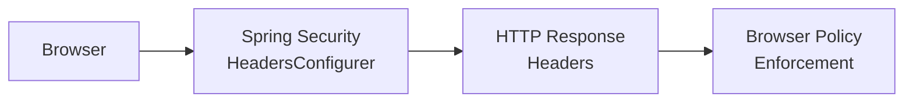

# Spring Security HTTP Security Headers

[← Back to README](../README.md)

---

HTTP security headers are a browser-enforced defence layer that restrict what content can be loaded, prevent clickjacking, stop MIME-type sniffing, and enforce HTTPS. Spring Security applies a sensible default set automatically, but real applications need to tune Content Security Policy, Permissions-Policy, and HSTS carefully. All headers are set once in `SecurityFilterChain` and apply to every response.



---

## Default Headers (Spring Security Applies Automatically)

| Header | Default Value | Purpose |
|--------|--------------|---------|
| `X-Content-Type-Options` | `nosniff` | Prevent MIME-type sniffing |
| `X-Frame-Options` | `DENY` | Prevent clickjacking via iframes |
| `X-XSS-Protection` | `0` | Disabled (CSP replaces this) |
| `Cache-Control` | `no-cache, no-store, max-age=0, must-revalidate` | Prevent caching of authenticated responses |
| `Pragma` | `no-cache` | HTTP/1.0 cache control |
| `Expires` | `0` | Force re-validation |

---

## SecurityFilterChain — Full Configuration

```java
@Configuration
@EnableWebSecurity
public class SecurityHeadersConfig {

    @Bean
    public SecurityFilterChain filterChain(HttpSecurity http) throws Exception {
        http
            .headers(headers -> headers
                // Content Security Policy
                .contentSecurityPolicy(csp -> csp
                    .policyDirectives("""
                        default-src 'self';
                        script-src 'self' 'nonce-{nonce}' https://cdn.jsdelivr.net;
                        style-src 'self' 'unsafe-inline' https://fonts.googleapis.com;
                        font-src 'self' https://fonts.gstatic.com;
                        img-src 'self' data: https:;
                        connect-src 'self' https://api.company.com;
                        frame-ancestors 'none';
                        base-uri 'self';
                        form-action 'self';
                        upgrade-insecure-requests;
                        """))

                // HTTP Strict Transport Security — force HTTPS for 1 year
                .httpStrictTransportSecurity(hsts -> hsts
                    .includeSubDomains(true)
                    .preload(true)
                    .maxAgeInSeconds(31536000))

                // Clickjacking protection
                .frameOptions(frame -> frame.deny())

                // Permissions-Policy (formerly Feature-Policy)
                .permissionsPolicy(permissions -> permissions
                    .policy("""
                        camera=(),
                        microphone=(),
                        geolocation=(self),
                        payment=(self "https://stripe.com"),
                        fullscreen=(self)
                        """))

                // Cross-origin policies
                .crossOriginEmbedderPolicy(coep -> coep
                    .policy(CrossOriginEmbedderPolicyHeaderWriter.CrossOriginEmbedderPolicy
                        .REQUIRE_CORP))
                .crossOriginOpenerPolicy(coop -> coop
                    .policy(CrossOriginOpenerPolicyHeaderWriter.CrossOriginOpenerPolicy
                        .SAME_ORIGIN))
                .crossOriginResourcePolicy(corp -> corp
                    .policy(CrossOriginResourcePolicyHeaderWriter.CrossOriginResourcePolicy
                        .SAME_ORIGIN))

                // Referrer-Policy
                .referrerPolicy(referrer -> referrer
                    .policy(ReferrerPolicyHeaderWriter.ReferrerPolicy.STRICT_ORIGIN_WHEN_CROSS_ORIGIN))

                // Content-Type options (already default but explicit)
                .contentTypeOptions(Customizer.withDefaults())
            );

        return http.build();
    }
}
```

---

## Content Security Policy (CSP) Deep Dive

```java
// CSP Report-Only mode — log violations without blocking (use during rollout)
@Bean
public SecurityFilterChain cspReportOnly(HttpSecurity http) throws Exception {
    http.headers(headers -> headers
        .addHeaderWriter(new StaticHeadersWriter(
            "Content-Security-Policy-Report-Only",
            "default-src 'self'; report-uri /csp-report; report-to csp-endpoint"
        ))
    );
    return http.build();
}

// CSP violation report endpoint
@RestController
public class CspReportController {

    @PostMapping(value = "/csp-report",
                 consumes = "application/csp-report")
    @ResponseStatus(HttpStatus.NO_CONTENT)
    public void report(@RequestBody String report) {
        log.warn("CSP violation: {}", report);
        // Forward to your SIEM or log aggregator
    }
}
```

---

## Nonce-Based CSP for SPAs

```java
// Generate per-request nonce for inline scripts (React, Angular hydration)
@Component
public class CspNonceFilter extends OncePerRequestFilter {

    @Override
    protected void doFilterInternal(HttpServletRequest request,
                                     HttpServletResponse response,
                                     FilterChain chain) throws ServletException, IOException {
        byte[] nonceBytes = new byte[16];
        new SecureRandom().nextBytes(nonceBytes);
        String nonce = Base64.getUrlEncoder().withoutPadding().encodeToString(nonceBytes);

        // Store for use in Thymeleaf templates: th:nonce="${cspNonce}"
        request.setAttribute("cspNonce", nonce);

        // Overwrite CSP header with the nonce
        response.setHeader("Content-Security-Policy",
            "default-src 'self'; " +
            "script-src 'self' 'nonce-" + nonce + "'; " +
            "style-src 'self' 'nonce-" + nonce + "'; " +
            "frame-ancestors 'none'");

        chain.doFilter(request, response);
    }
}
```

```html
<!-- Thymeleaf template — inject nonce into script tags -->
<script th:nonce="${cspNonce}">
    window.__INITIAL_STATE__ = /*[[${initialState}]]*/ {};
</script>
```

---

## HSTS Preload

```java
// HSTS with preload — tell browsers to never connect via HTTP (even first visit)
// Submit to https://hstspreload.org after deployment
.httpStrictTransportSecurity(hsts -> hsts
    .includeSubDomains(true)
    .preload(true)
    .maxAgeInSeconds(63072000))  // 2 years (hstspreload.org requirement)
```

---

## Custom Headers

```java
// Add headers not supported by Spring Security's DSL
@Bean
public SecurityFilterChain customHeaders(HttpSecurity http) throws Exception {
    http.headers(headers -> headers
        .addHeaderWriter(new StaticHeadersWriter(
            "X-Permitted-Cross-Domain-Policies", "none"))
        .addHeaderWriter(new StaticHeadersWriter(
            "Report-To",
            """
            {"group":"csp-endpoint","max_age":10886400,
             "endpoints":[{"url":"https://company.report-uri.com/r/d/csp/enforce"}]}
            """))
        .addHeaderWriter(new StaticHeadersWriter(
            "NEL",
            """
            {"report_to":"csp-endpoint","max_age":10886400,"include_subdomains":true}
            """))
    );
    return http.build();
}
```

---

## Relaxing Headers for Specific Paths

```java
@Bean
public SecurityFilterChain mixedHeaders(HttpSecurity http) throws Exception {
    http
        .headers(headers -> headers
            // Global: deny framing
            .frameOptions(frame -> frame.deny())
        )
        // Allow iframes only on the /embed/** path
        .securityMatcher("/embed/**")
        .headers(headers -> headers
            .frameOptions(frame -> frame
                .sameOrigin())
        );

    return http.build();
}

// Or use a HeaderWriterFilter for path-specific overrides
@Bean
public FilterRegistrationBean<HeaderFilter> embeddableFilter() {
    FilterRegistrationBean<HeaderFilter> registration = new FilterRegistrationBean<>();
    registration.setFilter(new HeaderFilter());
    registration.addUrlPatterns("/embed/*");
    registration.setOrder(Ordered.HIGHEST_PRECEDENCE);
    return registration;
}
```

---

## Testing Headers

```java
@SpringBootTest(webEnvironment = RANDOM_PORT)
@AutoConfigureMockMvc
class SecurityHeadersTest {

    @Autowired MockMvc mockMvc;

    @Test
    void shouldHaveSecurityHeaders() throws Exception {
        mockMvc.perform(get("/api/products"))
            .andExpect(header().string("X-Content-Type-Options", "nosniff"))
            .andExpect(header().string("X-Frame-Options", "DENY"))
            .andExpect(header().exists("Content-Security-Policy"))
            .andExpect(header().string("Strict-Transport-Security",
                containsString("max-age=")))
            .andExpect(header().string("Referrer-Policy",
                "strict-origin-when-cross-origin"))
            .andExpect(header().string("Permissions-Policy",
                containsString("camera=()")));
    }

    @Test
    void cspShouldDenyFrameAncestors() throws Exception {
        mockMvc.perform(get("/"))
            .andExpect(header().string("Content-Security-Policy",
                containsString("frame-ancestors 'none'")));
    }
}
```

---

## HTTP Security Headers Summary

| Header | Recommended Value | Protects Against |
|--------|------------------|-----------------|
| `Content-Security-Policy` | `default-src 'self'; frame-ancestors 'none'` | XSS, data injection, clickjacking |
| `Strict-Transport-Security` | `max-age=63072000; includeSubDomains; preload` | SSL stripping, protocol downgrade |
| `X-Frame-Options` | `DENY` (superseded by CSP `frame-ancestors`) | Clickjacking via iframe |
| `X-Content-Type-Options` | `nosniff` | MIME-type confusion attacks |
| `Referrer-Policy` | `strict-origin-when-cross-origin` | Leaking URLs in Referer header |
| `Permissions-Policy` | `camera=(), microphone=(), geolocation=(self)` | Restricts browser feature access |
| `Cross-Origin-Opener-Policy` | `same-origin` | Spectre/cross-origin isolation |
| `Cross-Origin-Embedder-Policy` | `require-corp` | Required for `SharedArrayBuffer` |
| `Cross-Origin-Resource-Policy` | `same-origin` | Prevents cross-origin reads of responses |
| CSP `report-uri` / `report-to` | Your violation endpoint | Visibility into CSP violations |
| Nonce-based CSP | Per-request random nonce in `script-src` | Avoids `'unsafe-inline'` for SPAs |

---

[← Back to README](../README.md)
