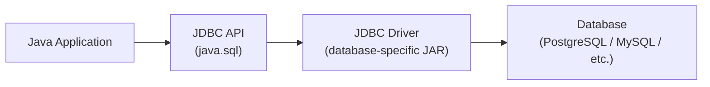

# JDBC and Database Access

[← Back to README](../README.md)

---

**JDBC** (Java Database Connectivity) is the standard API for connecting Java applications to relational databases. It works with any database that has a JDBC driver — PostgreSQL, MySQL, SQLite, H2, Oracle, and more.



---

## Adding a JDBC Driver

### PostgreSQL (Maven)

```xml
<dependency>
    <groupId>org.postgresql</groupId>
    <artifactId>postgresql</artifactId>
    <version>42.7.3</version>
</dependency>
```

### H2 (in-memory, great for testing)

```xml
<dependency>
    <groupId>com.h2database</groupId>
    <artifactId>h2</artifactId>
    <version>2.2.224</version>
    <scope>test</scope>
</dependency>
```

---

## Connecting to a Database

```java
import java.sql.*;

String url      = "jdbc:postgresql://localhost:5432/mydb";
String username = "alice";
String password = "secret";

try (Connection conn = DriverManager.getConnection(url, username, password)) {
    System.out.println("Connected: " + conn.getMetaData().getDatabaseProductName());
} catch (SQLException e) {
    System.err.println("Connection failed: " + e.getMessage());
}
```

### Common JDBC URLs

| Database | URL format |
|----------|-----------|
| PostgreSQL | `jdbc:postgresql://host:5432/dbname` |
| MySQL | `jdbc:mysql://host:3306/dbname` |
| SQLite | `jdbc:sqlite:path/to/file.db` |
| H2 (in-memory) | `jdbc:h2:mem:testdb` |
| H2 (file) | `jdbc:h2:./data/mydb` |
| Oracle | `jdbc:oracle:thin:@host:1521:sid` |

---

## Executing Queries

### Statement (plain SQL — never use for user input)

```java
try (Connection conn = DriverManager.getConnection(url, user, pass);
     Statement stmt  = conn.createStatement()) {

    // DDL
    stmt.execute("""
        CREATE TABLE IF NOT EXISTS users (
            id    SERIAL PRIMARY KEY,
            name  VARCHAR(100) NOT NULL,
            email VARCHAR(255) UNIQUE NOT NULL,
            age   INT
        )
    """);

    // INSERT
    stmt.executeUpdate("INSERT INTO users (name, email, age) VALUES ('Alice', 'alice@example.com', 30)");

    // SELECT
    ResultSet rs = stmt.executeQuery("SELECT * FROM users");
    while (rs.next()) {
        System.out.printf("%-5d %-20s %-30s %d%n",
            rs.getInt("id"),
            rs.getString("name"),
            rs.getString("email"),
            rs.getInt("age"));
    }
}
```

### PreparedStatement (always use for user input — prevents SQL injection)

```java
String insertSql = "INSERT INTO users (name, email, age) VALUES (?, ?, ?)";
String selectSql = "SELECT * FROM users WHERE age > ? ORDER BY name";

try (Connection conn = DriverManager.getConnection(url, user, pass)) {

    // INSERT with parameters
    try (PreparedStatement ps = conn.prepareStatement(insertSql)) {
        ps.setString(1, "Bob");
        ps.setString(2, "bob@example.com");
        ps.setInt(3, 25);
        int rowsInserted = ps.executeUpdate();
        System.out.println("Inserted: " + rowsInserted);
    }

    // INSERT multiple rows efficiently
    try (PreparedStatement ps = conn.prepareStatement(insertSql)) {
        String[][] users = {
            {"Charlie", "charlie@example.com", "35"},
            {"Diana",   "diana@example.com",   "28"}
        };
        for (String[] u : users) {
            ps.setString(1, u[0]);
            ps.setString(2, u[1]);
            ps.setInt(3, Integer.parseInt(u[2]));
            ps.addBatch();
        }
        ps.executeBatch();
    }

    // SELECT with parameters
    try (PreparedStatement ps = conn.prepareStatement(selectSql)) {
        ps.setInt(1, 25);
        ResultSet rs = ps.executeQuery();
        while (rs.next()) {
            System.out.println(rs.getString("name") + " (" + rs.getInt("age") + ")");
        }
    }
}
```

---

## ResultSet — Reading Data

```java
ResultSet rs = stmt.executeQuery("SELECT * FROM users");

while (rs.next()) {
    // read by column name (preferred)
    int    id    = rs.getInt("id");
    String name  = rs.getString("name");
    String email = rs.getString("email");
    int    age   = rs.getInt("age");

    // read by column index (1-based)
    int id2 = rs.getInt(1);

    // handle nullable columns
    Integer nullableAge = rs.getInt("age");
    if (rs.wasNull()) nullableAge = null;

    // other types
    rs.getDouble("salary");
    rs.getBoolean("active");
    rs.getDate("created_at");       // java.sql.Date
    rs.getTimestamp("updated_at");  // java.sql.Timestamp
    rs.getBigDecimal("price");
}

// ResultSetMetaData — inspect column info
ResultSetMetaData meta = rs.getMetaData();
int columnCount = meta.getColumnCount();
for (int i = 1; i <= columnCount; i++) {
    System.out.println(meta.getColumnName(i) + " : " + meta.getColumnTypeName(i));
}
```

---

## Retrieving Generated Keys

```java
String sql = "INSERT INTO users (name, email) VALUES (?, ?)";

try (PreparedStatement ps = conn.prepareStatement(sql, Statement.RETURN_GENERATED_KEYS)) {
    ps.setString(1, "Eve");
    ps.setString(2, "eve@example.com");
    ps.executeUpdate();

    ResultSet keys = ps.getGeneratedKeys();
    if (keys.next()) {
        long newId = keys.getLong(1);
        System.out.println("New user ID: " + newId);
    }
}
```

---

## Transactions

By default, JDBC auto-commits every statement. Disable auto-commit to group operations into a transaction.

```java
try (Connection conn = DriverManager.getConnection(url, user, pass)) {
    conn.setAutoCommit(false);  // begin transaction

    try {
        // debit sender
        PreparedStatement debit = conn.prepareStatement(
            "UPDATE accounts SET balance = balance - ? WHERE id = ?");
        debit.setDouble(1, 500.0);
        debit.setInt(2, 1);
        debit.executeUpdate();

        // credit receiver
        PreparedStatement credit = conn.prepareStatement(
            "UPDATE accounts SET balance = balance + ? WHERE id = ?");
        credit.setDouble(1, 500.0);
        credit.setInt(2, 2);
        credit.executeUpdate();

        conn.commit();  // all good — commit
        System.out.println("Transfer complete");

    } catch (SQLException e) {
        conn.rollback();  // something went wrong — roll back
        System.err.println("Transfer failed, rolled back: " + e.getMessage());
    }
}
```

### Transaction Isolation Levels

```java
conn.setTransactionIsolation(Connection.TRANSACTION_READ_COMMITTED);  // most common
conn.setTransactionIsolation(Connection.TRANSACTION_SERIALIZABLE);     // strictest
conn.setTransactionIsolation(Connection.TRANSACTION_READ_UNCOMMITTED); // loosest
conn.setTransactionIsolation(Connection.TRANSACTION_REPEATABLE_READ);
```

---

## Connection Pooling with HikariCP

Creating a new `Connection` for every request is slow. A **connection pool** maintains a set of reusable connections.

**HikariCP** is the fastest and most widely used Java connection pool.

```xml
<dependency>
    <groupId>com.zaxxer</groupId>
    <artifactId>HikariCP</artifactId>
    <version>5.1.0</version>
</dependency>
```

```java
import com.zaxxer.hikari.*;

HikariConfig config = new HikariConfig();
config.setJdbcUrl("jdbc:postgresql://localhost:5432/mydb");
config.setUsername("alice");
config.setPassword("secret");
config.setMaximumPoolSize(10);          // max connections in the pool
config.setMinimumIdle(2);              // keep at least 2 idle connections
config.setConnectionTimeout(30_000);   // ms to wait for a connection
config.setIdleTimeout(600_000);        // ms before idle connection is removed
config.setMaxLifetime(1_800_000);      // ms max connection lifetime

HikariDataSource dataSource = new HikariDataSource(config);

// use like a regular DataSource
try (Connection conn = dataSource.getConnection()) {
    // ... run queries
}

// close the pool on application shutdown
dataSource.close();
```

---

## DAO Pattern

The **Data Access Object** pattern separates database logic from business logic.

```java
public record User(int id, String name, String email) {}

public interface UserDao {
    User       findById(int id);
    java.util.List<User> findAll();
    int        save(User user);
    void       update(User user);
    void       delete(int id);
}

public class UserDaoImpl implements UserDao {
    private final javax.sql.DataSource ds;

    public UserDaoImpl(javax.sql.DataSource ds) { this.ds = ds; }

    @Override
    public User findById(int id) {
        String sql = "SELECT id, name, email FROM users WHERE id = ?";
        try (Connection conn = ds.getConnection();
             PreparedStatement ps = conn.prepareStatement(sql)) {
            ps.setInt(1, id);
            ResultSet rs = ps.executeQuery();
            if (rs.next()) {
                return new User(rs.getInt("id"), rs.getString("name"), rs.getString("email"));
            }
            return null;
        } catch (SQLException e) {
            throw new RuntimeException("Failed to find user " + id, e);
        }
    }

    @Override
    public java.util.List<User> findAll() {
        String sql = "SELECT id, name, email FROM users ORDER BY name";
        var users = new java.util.ArrayList<User>();
        try (Connection conn = ds.getConnection();
             Statement  stmt = conn.createStatement();
             ResultSet  rs   = stmt.executeQuery(sql)) {
            while (rs.next()) {
                users.add(new User(rs.getInt("id"), rs.getString("name"), rs.getString("email")));
            }
        } catch (SQLException e) {
            throw new RuntimeException("Failed to list users", e);
        }
        return users;
    }

    @Override
    public int save(User user) {
        String sql = "INSERT INTO users (name, email) VALUES (?, ?) RETURNING id";
        try (Connection conn = ds.getConnection();
             PreparedStatement ps = conn.prepareStatement(sql)) {
            ps.setString(1, user.name());
            ps.setString(2, user.email());
            ResultSet rs = ps.executeQuery();
            rs.next();
            return rs.getInt(1);
        } catch (SQLException e) {
            throw new RuntimeException("Failed to save user", e);
        }
    }

    @Override
    public void update(User user) {
        String sql = "UPDATE users SET name = ?, email = ? WHERE id = ?";
        try (Connection conn = ds.getConnection();
             PreparedStatement ps = conn.prepareStatement(sql)) {
            ps.setString(1, user.name());
            ps.setString(2, user.email());
            ps.setInt(3, user.id());
            ps.executeUpdate();
        } catch (SQLException e) {
            throw new RuntimeException("Failed to update user", e);
        }
    }

    @Override
    public void delete(int id) {
        try (Connection conn = ds.getConnection();
             PreparedStatement ps = conn.prepareStatement("DELETE FROM users WHERE id = ?")) {
            ps.setInt(1, id);
            ps.executeUpdate();
        } catch (SQLException e) {
            throw new RuntimeException("Failed to delete user " + id, e);
        }
    }
}
```

---

## JDBC Best Practices

- **Always use `PreparedStatement`** for any query with user input — never string-concatenate SQL.
- **Always use try-with-resources** — `Connection`, `Statement`, and `ResultSet` all implement `Closeable`.
- **Use a connection pool** (HikariCP) in production — raw `DriverManager.getConnection()` is too slow.
- **Wrap `SQLException`** in an unchecked exception at the DAO layer — callers shouldn't need to handle SQL details.
- **Use transactions** for operations that must succeed or fail together.
- **Never select `*`** — list columns explicitly so schema changes don't silently break mapping.
- **Use `executeBatch()`** for bulk inserts — far faster than looping individual inserts.
- **Close connections promptly** — leaked connections exhaust the pool.

---

## JDBC Summary

| Concept | Class / Method |
|---------|---------------|
| Connect | `DriverManager.getConnection(url, user, pass)` |
| Plain SQL | `Statement` — only for DDL or static queries |
| Parameterised SQL | `PreparedStatement` — always for user input |
| Read results | `ResultSet.next()`, `getString()`, `getInt()` etc. |
| Auto-generated keys | `RETURN_GENERATED_KEYS` + `getGeneratedKeys()` |
| Transactions | `setAutoCommit(false)`, `commit()`, `rollback()` |
| Bulk inserts | `addBatch()` + `executeBatch()` |
| Connection pooling | HikariCP `HikariDataSource` |
| Data access layer | DAO pattern — separate DB logic from business logic |

---

[← Back to README](../README.md)
