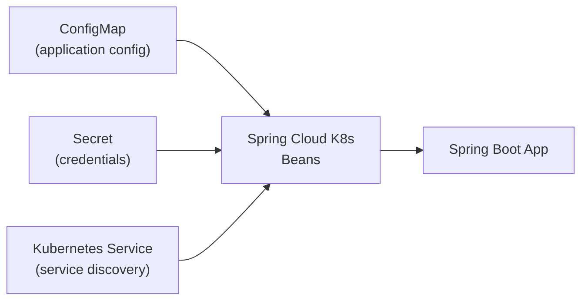

# Spring Cloud Kubernetes

[← Back to README](../README.md)

---

**Spring Cloud Kubernetes** integrates Spring Boot applications with Kubernetes-native primitives. It replaces config servers and service registries with Kubernetes ConfigMaps and Services, injects configuration from ConfigMaps and Secrets directly into `@ConfigurationProperties`, provides Kubernetes-aware service discovery, and automatically refreshes configuration when ConfigMaps change. It is the idiomatic way to run Spring Boot on Kubernetes without external infrastructure like Consul or Vault for basic use cases.



---

## Dependencies

```xml
<dependencyManagement>
    <dependencies>
        <dependency>
            <groupId>org.springframework.cloud</groupId>
            <artifactId>spring-cloud-dependencies</artifactId>
            <version>2023.0.3</version>
            <type>pom</type>
            <scope>import</scope>
        </dependency>
    </dependencies>
</dependencyManagement>

<dependencies>
    <!-- ConfigMap + Secret injection -->
    <dependency>
        <groupId>org.springframework.cloud</groupId>
        <artifactId>spring-cloud-starter-kubernetes-client-config</artifactId>
    </dependency>
    <!-- Kubernetes service discovery -->
    <dependency>
        <groupId>org.springframework.cloud</groupId>
        <artifactId>spring-cloud-starter-kubernetes-client-all</artifactId>
    </dependency>
</dependencies>
```

---

## ConfigMap Injection

```yaml
# Kubernetes ConfigMap — my-app-config
apiVersion: v1
kind: ConfigMap
metadata:
  name: orders-service          # must match spring.application.name
  namespace: default
data:
  application.yaml: |
    app:
      orders:
        max-per-page: 50
        processing-timeout: 30s
    spring:
      datasource:
        url: jdbc:postgresql://postgres:5432/orders
```

```yaml
# application.yaml — Bootstrap config (loaded before the app context)
spring:
  application:
    name: orders-service
  config:
    import: "kubernetes:"       # triggers ConfigMap loading

  cloud:
    kubernetes:
      config:
        enabled: true
        name: orders-service    # ConfigMap name (defaults to app name)
        namespace: default
        fail-fast: true         # crash on startup if ConfigMap not found
      reload:
        enabled: true           # watch for ConfigMap changes
        mode: event             # "event" (watch API) or "polling"
        period: 15000           # polling interval ms (when mode=polling)
```

```java
@ConfigurationProperties(prefix = "app.orders")
@RefreshScope                   // picks up config reload without restart
public record OrdersProperties(
    int maxPerPage,
    Duration processingTimeout
) {}
```

---

## Secret Injection

```yaml
# Kubernetes Secret
apiVersion: v1
kind: Secret
metadata:
  name: orders-service-secrets
  namespace: default
type: Opaque
stringData:
  application.yaml: |
    spring:
      datasource:
        username: orders_user
        password: s3cr3t
      rabbitmq:
        password: rabbit_pass
```

```yaml
# application.yaml
spring:
  cloud:
    kubernetes:
      secrets:
        enabled: true
        name: orders-service-secrets
        namespace: default
        enable-api: true         # read secrets via Kubernetes API (vs mounted volume)
        # Alternatively: mount the Secret as a volume and Spring reads the files
```

---

## RBAC — Required Permissions

```yaml
# ServiceAccount the app runs as
apiVersion: v1
kind: ServiceAccount
metadata:
  name: orders-service
  namespace: default
---
# Role — read ConfigMaps, Secrets, and Services in the namespace
apiVersion: rbac.authorization.k8s.io/v1
kind: Role
metadata:
  name: orders-service-role
  namespace: default
rules:
  - apiGroups: [""]
    resources: ["configmaps", "pods", "services", "endpoints", "secrets"]
    verbs: ["get", "list", "watch"]
---
apiVersion: rbac.authorization.k8s.io/v1
kind: RoleBinding
metadata:
  name: orders-service-binding
  namespace: default
subjects:
  - kind: ServiceAccount
    name: orders-service
    namespace: default
roleRef:
  kind: Role
  name: orders-service-role
  apiGroup: rbac.authorization.k8s.io
---
# Deployment — use the ServiceAccount
apiVersion: apps/v1
kind: Deployment
metadata:
  name: orders-service
spec:
  template:
    spec:
      serviceAccountName: orders-service
      containers:
        - name: orders-service
          image: company/orders-service:latest
```

---

## Service Discovery

```java
// Spring Cloud Kubernetes registers all Kubernetes Services as DiscoveryClient instances
@Service
@RequiredArgsConstructor
public class InventoryClient {

    // @LoadBalanced RestTemplate resolves "inventory-service" via Kubernetes DNS
    private final RestClient.Builder restClientBuilder;

    @Bean
    @LoadBalanced
    public RestClient.Builder loadBalancedRestClientBuilder() {
        return RestClient.builder();
    }

    public InventoryStatus checkInventory(String productId) {
        return restClientBuilder.build()
            .get()
            .uri("http://inventory-service/api/inventory/{id}", productId)
            .retrieve()
            .body(InventoryStatus.class);
    }
}
```

```java
// Programmatic discovery
@Service
@RequiredArgsConstructor
public class ServiceDiscoveryService {

    private final DiscoveryClient discoveryClient;

    public List<ServiceInstance> getInstances(String serviceName) {
        return discoveryClient.getInstances(serviceName);
    }

    public List<String> getServices() {
        return discoveryClient.getServices();
    }
}
```

---

## Health and Liveness Probes

```java
@Component
public class DatabaseHealthIndicator implements HealthIndicator {

    private final DataSource dataSource;

    public DatabaseHealthIndicator(DataSource dataSource) {
        this.dataSource = dataSource;
    }

    @Override
    public Health health() {
        try (Connection conn = dataSource.getConnection()) {
            conn.isValid(1);
            return Health.up().build();
        } catch (Exception e) {
            return Health.down(e).build();
        }
    }
}
```

```yaml
# application.yaml — separate liveness from readiness
management:
  endpoint:
    health:
      probes:
        enabled: true
      group:
        liveness:
          include: livenessState          # JVM alive
        readiness:
          include: readinessState, db, redis  # dependencies ready
```

```yaml
# Kubernetes Deployment probes
livenessProbe:
  httpGet:
    path: /actuator/health/liveness
    port: 8080
  initialDelaySeconds: 30
  periodSeconds: 10
  failureThreshold: 3

readinessProbe:
  httpGet:
    path: /actuator/health/readiness
    port: 8080
  initialDelaySeconds: 10
  periodSeconds: 5
  failureThreshold: 3
```

---

## Leader Election

```java
// Only one instance runs the scheduled job — useful for batch tasks in a multi-replica deployment
@Configuration
@EnableScheduling
public class LeaderElectionConfig {

    @Bean
    public LeaderInitiatorFactoryBean leaderInitiator(
            KubernetesClient client,
            @Value("${spring.application.name}") String name) {

        return new LeaderInitiatorFactoryBean()
            .setClient(client)
            .setNamespace("default")
            .setRole(name + "-leader");
    }
}

@Component
public class LeaderOnlyScheduler {

    @EventListener(OnGrantedEvent.class)
    public void onLeaderGranted(OnGrantedEvent event) {
        log.info("This instance is now the leader: {}", event.getRole());
    }

    @EventListener(OnRevokedEvent.class)
    public void onLeaderRevoked(OnRevokedEvent event) {
        log.info("Leadership revoked: {}", event.getRole());
    }

    @Scheduled(fixedDelay = 30_000)
    public void scheduledJob(LeaderElectionRecord record) {
        if (record.isLeader()) {
            runBatchJob();
        }
    }
}
```

---

## Spring Cloud Kubernetes Summary

| Concept | Detail |
|---------|--------|
| `spring.config.import=kubernetes:` | Triggers ConfigMap loading during bootstrap |
| ConfigMap name | Must match `spring.application.name` by default |
| `spring.cloud.kubernetes.reload.enabled` | Watches ConfigMap/Secret changes; triggers `@RefreshScope` refresh |
| `reload.mode=event` | Uses Kubernetes Watch API — immediate; requires `list` + `watch` RBAC |
| `reload.mode=polling` | Polls every N ms — simpler RBAC, slight delay |
| RBAC `Role` | App needs `get/list/watch` on `configmaps`, `secrets`, `services`, `endpoints` |
| `@LoadBalanced` | Makes `RestClient`/`WebClient` resolve service names via Kubernetes DNS |
| `DiscoveryClient` | Lists all Kubernetes Services and their instances |
| Liveness probe | `/actuator/health/liveness` — is the JVM alive? |
| Readiness probe | `/actuator/health/readiness` — are dependencies ready? |
| Leader election | Built-in via `LeaderInitiatorFactoryBean` — uses a Kubernetes ConfigMap as the lock |

---

[← Back to README](../README.md)
