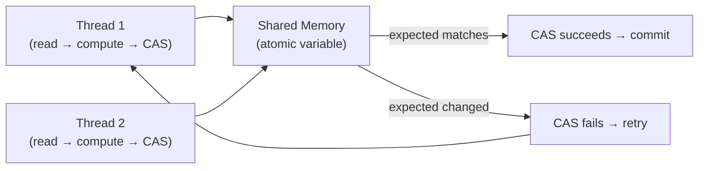

# Lock-Free Concurrency

[← Back to README](../README.md)

---

Lock-free concurrency eliminates synchronization overhead by using **Compare-And-Swap (CAS)** hardware instructions instead of locks. The JVM exposes CAS through `AtomicInteger`, `AtomicReference`, and the lower-level `VarHandle` API. Lock-free structures have higher throughput under contention because threads never block — they retry instead. The trade-off is complexity: the **ABA problem**, memory ordering, and correct retry logic require careful design.



---

## Atomic Primitives

```java
// AtomicInteger / AtomicLong — most common
AtomicInteger counter = new AtomicInteger(0);

counter.incrementAndGet();         // ++ then return (CAS-based)
counter.getAndIncrement();         // return then ++
counter.addAndGet(5);              // += 5 then return
counter.compareAndSet(10, 20);     // if value == 10, set to 20; return true/false

// AtomicLong for IDs and sequence numbers
AtomicLong idSequence = new AtomicLong(1000);
long nextId = idSequence.getAndIncrement();

// AtomicBoolean — one-shot flags
AtomicBoolean initialized = new AtomicBoolean(false);
if (initialized.compareAndSet(false, true)) {
    // Only one thread enters this block
    runExpensiveInit();
}
```

---

## LongAdder — High-Throughput Counters

```java
// LongAdder beats AtomicLong under heavy contention:
// it maintains a stripe of cells, one per thread, summed on read
LongAdder requestCount = new LongAdder();

// Writers (many threads)
requestCount.increment();
requestCount.add(5);

// Reader (infrequent)
long total = requestCount.sum();
long totalAndReset = requestCount.sumThenReset();

// LongAccumulator — generalize beyond addition
LongAccumulator maxLatency = new LongAccumulator(Long::max, 0);
maxLatency.accumulate(observedLatencyMs);
long peak = maxLatency.get();
```

---

## AtomicReference — Lock-Free State

```java
// AtomicReference<T> — CAS on any object
AtomicReference<String> config = new AtomicReference<>("v1");

// Atomic swap
String old = config.getAndSet("v2");

// Conditional update (CAS)
boolean updated = config.compareAndSet("v1", "v2");

// updateAndGet — atomic read-modify-write with a function
AtomicReference<List<String>> items = new AtomicReference<>(List.of());
items.updateAndGet(list -> {
    List<String> copy = new ArrayList<>(list);
    copy.add("newItem");
    return Collections.unmodifiableList(copy);
});
```

---

## ABA Problem and AtomicStampedReference

```java
// ABA: thread reads A, another changes A→B→A, first thread's CAS succeeds
// but the value has changed and changed back — invisible to plain CAS

// Fix: pair the value with a version stamp
AtomicStampedReference<String> stamped = new AtomicStampedReference<>("A", 0);

// Read atomically
int[] stampHolder = new int[1];
String value = stamped.get(stampHolder);   // value="A", stamp=0

// CAS now checks both value and stamp
boolean success = stamped.compareAndSet("A", "B", 0, 1);
// Even if value cycles back to "A", stamp 0 will never match again
```

---

## Lock-Free Stack (Treiber Stack)

```java
public class LockFreeStack<T> {

    private final AtomicReference<Node<T>> head = new AtomicReference<>(null);

    public void push(T item) {
        Node<T> newNode = new Node<>(item);
        Node<T> current;
        do {
            current = head.get();
            newNode.next = current;
        } while (!head.compareAndSet(current, newNode));
        // Retry if another thread modified head between our read and CAS
    }

    public T pop() {
        Node<T> current;
        Node<T> next;
        do {
            current = head.get();
            if (current == null) return null;   // empty
            next = current.next;
        } while (!head.compareAndSet(current, next));
        return current.item;
    }

    private static final class Node<T> {
        final T item;
        Node<T> next;
        Node(T item) { this.item = item; }
    }
}
```

---

## Lock-Free Queue (Michael-Scott Queue)

```java
// Java's ConcurrentLinkedQueue uses this algorithm
public class LockFreeQueue<T> {

    private static final class Node<T> {
        final T item;
        final AtomicReference<Node<T>> next = new AtomicReference<>(null);
        Node(T item) { this.item = item; }
    }

    private final AtomicReference<Node<T>> head;
    private final AtomicReference<Node<T>> tail;

    public LockFreeQueue() {
        Node<T> sentinel = new Node<>(null);
        head = new AtomicReference<>(sentinel);
        tail = new AtomicReference<>(sentinel);
    }

    public void enqueue(T item) {
        Node<T> node = new Node<>(item);
        while (true) {
            Node<T> last = tail.get();
            Node<T> next = last.next.get();
            if (last == tail.get()) {
                if (next == null) {
                    if (last.next.compareAndSet(null, node)) {
                        tail.compareAndSet(last, node);  // advance tail (best effort)
                        return;
                    }
                } else {
                    tail.compareAndSet(last, next);  // help advance stale tail
                }
            }
        }
    }

    public T dequeue() {
        while (true) {
            Node<T> first = head.get();
            Node<T> last  = tail.get();
            Node<T> next  = first.next.get();
            if (first == head.get()) {
                if (first == last) {
                    if (next == null) return null;  // empty
                    tail.compareAndSet(last, next);
                } else {
                    T item = next.item;
                    if (head.compareAndSet(first, next)) return item;
                }
            }
        }
    }
}
```

---

## VarHandle — Low-Level Access (Java 9+)

```java
// VarHandle provides CAS on arbitrary fields with explicit memory ordering
public class Counter {

    private volatile long value = 0;

    private static final VarHandle VALUE_HANDLE;

    static {
        try {
            VALUE_HANDLE = MethodHandles.lookup()
                .findVarHandle(Counter.class, "value", long.class);
        } catch (ReflectiveOperationException e) {
            throw new ExceptionInInitializerError(e);
        }
    }

    public long incrementAndGet() {
        return (long) VALUE_HANDLE.getAndAdd(this, 1L) + 1L;
    }

    public boolean compareAndSet(long expected, long update) {
        return VALUE_HANDLE.compareAndSet(this, expected, update);
    }

    // Plain read (no memory fence — fastest, use only when visibility not needed)
    public long getPlain() {
        return (long) VALUE_HANDLE.get(this);
    }

    // Opaque — ordered relative to this variable only
    public long getOpaque() {
        return (long) VALUE_HANDLE.getOpaque(this);
    }

    // Acquire — pairs with release writes
    public long getAcquire() {
        return (long) VALUE_HANDLE.getAcquire(this);
    }
}
```

---

## Memory Ordering Reference

```java
// From weakest to strongest — each stronger mode has more overhead

// 1. Plain — no ordering guarantees (use only for non-shared data)
VALUE_HANDLE.set(this, value);
VALUE_HANDLE.get(this);

// 2. Opaque — coherent for this variable only (no cross-variable ordering)
VALUE_HANDLE.setOpaque(this, value);
VALUE_HANDLE.getOpaque(this);

// 3. Release / Acquire — release write is visible to acquire read (pairs)
VALUE_HANDLE.setRelease(this, value);   // release
VALUE_HANDLE.getAcquire(this);          // acquire

// 4. Volatile — sequentially consistent (most expensive, synchronizes all variables)
VALUE_HANDLE.setVolatile(this, value);
VALUE_HANDLE.getVolatile(this);

// 5. CAS — atomically compare-and-set with volatile semantics
VALUE_HANDLE.compareAndSet(this, expected, update);
```

---

## When to Use Lock-Free vs Locks

```java
// Lock-free wins when:
// - Very high contention (many threads competing on one variable)
// - Operation is short (increment, flag swap, pointer update)
// - Latency tail matters (locks can cause thread parking latency spikes)

// Example: Micrometer uses LongAdder for high-throughput counter
LongAdder requestsTotal = new LongAdder();

// Locks win when:
// - Operation spans multiple variables (need all-or-nothing atomicity)
// - Code is complex (lock-free retry loops are hard to reason about)
// - Low contention (lock overhead is negligible, code is simpler)

// Example: updating two related values atomically
ReentrantLock lock = new ReentrantLock();
lock.lock();
try {
    balance -= amount;
    ledger.add(new Entry(amount));  // two-variable update — use a lock
} finally {
    lock.unlock();
}
```

---

## Lock-Free Concurrency Summary

| Concept | Detail |
|---------|--------|
| CAS | Compare-And-Swap — hardware-level atomic `if(mem==expected) mem=update` |
| `AtomicInteger.compareAndSet` | Returns `true` on success; `false` if value changed (caller retries) |
| `LongAdder` | Striped counter — outperforms `AtomicLong` under high write contention |
| `AtomicReference.updateAndGet` | Retry loop: read → apply function → CAS; repeats until CAS wins |
| ABA problem | Value changes A→B→A; CAS wrongly succeeds; fix with `AtomicStampedReference` |
| Treiber Stack | Lock-free stack using CAS on head pointer — simple, correct |
| Michael-Scott Queue | Lock-free FIFO; used by `ConcurrentLinkedQueue` — two pointers (head/tail) |
| `VarHandle` | Java 9+ low-level CAS on arbitrary fields; replaces `Unsafe` |
| Memory ordering | `plain < opaque < acquire/release < volatile` — weaker = faster |
| Lock-free trade-off | Better throughput under contention; harder to implement correctly than locks |

---

[← Back to README](../README.md)
