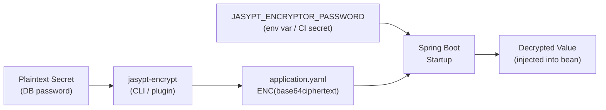

# Jasypt — Encrypted Properties

[← Back to README](../README.md)

---

**Jasypt** (Java Simplified Encryption) lets you store encrypted secrets in `application.properties` or `application.yaml` using the `ENC(...)` wrapper. At startup, Spring Boot decrypts the values using a master password supplied via environment variable, system property, or CI secret — so plaintext credentials never live in source control. It is one of the simplest ways to secure config files without a full secrets manager.



---

## Dependency

```xml
<dependency>
    <groupId>com.github.ulisesbocchio</groupId>
    <artifactId>jasypt-spring-boot-starter</artifactId>
    <version>3.0.5</version>
</dependency>
```

The starter auto-configures a `StringEncryptor` bean and a custom `PropertySource` that decrypts `ENC(...)` values during context refresh.

---

## Encrypting a Value

```bash
# Option 1: Maven plugin
mvn jasypt:encrypt-value \
  -Djasypt.encryptor.password=my-master-key \
  -Djasypt.plugin.value="s3cr3t-db-password"

# Output:
# ENC(7kNbQRjFnH2mPk+xH8tZyS1aDROl5CbBmhDI1LPqsVk=)

# Option 2: CLI JAR
java -cp jasypt-1.9.3.jar \
  org.jasypt.intf.cli.JasyptPBEStringEncryptionCLI \
  input="s3cr3t-db-password" \
  password=my-master-key \
  algorithm=PBEWITHHMACSHA512ANDAES_256

# Option 3: Spring Boot plugin
mvn jasypt:encrypt \
  -Djasypt.encryptor.password=my-master-key
# Encrypts all ENC() placeholders in application.properties in-place
```

---

## application.yaml with Encrypted Values

```yaml
spring:
  datasource:
    url: jdbc:postgresql://localhost:5432/orders
    username: orders_user
    password: ENC(7kNbQRjFnH2mPk+xH8tZyS1aDROl5CbBmhDI1LPqsVk=)

  rabbitmq:
    host: rabbitmq
    username: app_user
    password: ENC(9sTRsqKlXpqQ2ZVP8jKLmN7WbY3aX4uoHq5PpEMc+c4=)

  mail:
    username: alerts@company.com
    password: ENC(3FwPUG9bTjxSk/hBRYpqz9tCvMOlKnE7VVHd2ZxKf44=)

app:
  payment:
    stripe-secret-key: ENC(R2Fg1bZ+N7cMhP...==)
    webhook-secret:    ENC(Kq9Xv4WnTp...==)
```

---

## Supplying the Master Password

```bash
# Method 1: Environment variable (recommended for production)
export JASYPT_ENCRYPTOR_PASSWORD=my-master-key
java -jar myapp.jar

# Method 2: System property (for local dev)
java -Djasypt.encryptor.password=my-master-key -jar myapp.jar

# Method 3: Spring property (least secure — don't commit the value)
# jasypt.encryptor.password=my-master-key
```

```yaml
# application.yaml — never set jasypt.encryptor.password here
# Use environment variable or CI secret instead
jasypt:
  encryptor:
    algorithm: PBEWITHHMACSHA512ANDAES_256
    iv-generator-classname: org.jasypt.iv.RandomIvGenerator
    salt-generator-classname: org.jasypt.salt.RandomSaltGenerator
    key-obtention-iterations: 1000
    string-output-type: base64
```

---

## Custom Encryptor Bean

```java
@Configuration
public class JasyptConfig {

    // Override default encryptor for full control
    @Bean("jasyptStringEncryptor")  // bean name must match
    public StringEncryptor stringEncryptor(
            @Value("${jasypt.encryptor.password}") String password) {

        PooledPBEStringEncryptor encryptor = new PooledPBEStringEncryptor();
        SimpleStringPBEConfig config = new SimpleStringPBEConfig();

        config.setPassword(password);
        config.setAlgorithm("PBEWITHHMACSHA512ANDAES_256");
        config.setKeyObtentionIterations("1000");
        config.setPoolSize("1");
        config.setProviderName("SunJCE");
        config.setSaltGeneratorClassName("org.jasypt.salt.RandomSaltGenerator");
        config.setIvGeneratorClassName("org.jasypt.iv.RandomIvGenerator");
        config.setStringOutputType("base64");

        encryptor.setConfig(config);
        return encryptor;
    }
}
```

---

## Programmatic Encryption (Utility)

```java
@Component
@RequiredArgsConstructor
public class EncryptionUtil {

    private final StringEncryptor encryptor;

    // Encrypt a new secret (for developer tooling)
    public String encrypt(String plaintext) {
        return "ENC(" + encryptor.encrypt(plaintext) + ")";
    }

    // Decrypt (for validation / migration tooling)
    public String decrypt(String ciphertext) {
        if (ciphertext.startsWith("ENC(") && ciphertext.endsWith(")")) {
            return encryptor.decrypt(
                ciphertext.substring(4, ciphertext.length() - 1));
        }
        return ciphertext;  // not encrypted
    }
}
```

---

## CI/CD Integration

```yaml
# GitHub Actions — pass master key as a secret
jobs:
  deploy:
    steps:
      - name: Deploy
        run: java -jar myapp.jar
        env:
          JASYPT_ENCRYPTOR_PASSWORD: ${{ secrets.JASYPT_MASTER_KEY }}
```

```yaml
# Kubernetes Secret — inject master key
apiVersion: v1
kind: Secret
metadata:
  name: jasypt-master-key
type: Opaque
stringData:
  JASYPT_ENCRYPTOR_PASSWORD: my-master-key

---
# Deployment — mount as env var
spec:
  containers:
    - name: myapp
      envFrom:
        - secretRef:
            name: jasypt-master-key
```

---

## Testing with Encrypted Properties

```java
// Provide the master key in test context
@SpringBootTest
@TestPropertySource(properties = "jasypt.encryptor.password=test-key")
class OrderServiceTest {
    // Encrypted properties are decrypted automatically during test startup
}
```

```java
// Or use an unencrypted override for tests
@SpringBootTest
@TestPropertySource(properties = {
    "spring.datasource.password=test-password",  // override ENC() with plaintext
    "jasypt.encryptor.password=test-key"
})
class OrderServiceTest { ... }
```

---

## Security Considerations

```java
// DO:
// - Store master key in CI secret / KMS / Vault (not in files)
// - Rotate encrypted values when the master key changes
// - Use PBEWITHHMACSHA512ANDAES_256 (the default is weaker in older versions)
// - Treat the ENC() ciphertext as semi-sensitive (don't log it)

// DON'T:
// - Commit jasypt.encryptor.password to source control
// - Use the same key across environments (dev/staging/prod each get their own)
// - Use Jasypt as a substitute for a proper secrets manager in high-security contexts
//   — prefer HashiCorp Vault or AWS Secrets Manager for production
```

---

## Jasypt Summary

| Concept | Detail |
|---------|--------|
| `ENC(...)` | Wrapper that triggers decryption; plaintext anywhere else is passed through |
| `jasyptStringEncryptor` | Bean name the starter looks for; override to customize algorithm |
| `JASYPT_ENCRYPTOR_PASSWORD` | Environment variable for the master key — keep it out of source control |
| `PBEWITHHMACSHA512ANDAES_256` | Recommended algorithm — AES-256 + HMAC-SHA512 for key derivation |
| `RandomIvGenerator` | Generates a random IV per encryption — same plaintext produces different ciphertext |
| `RandomSaltGenerator` | Random salt for PBE — prevents precomputed dictionary attacks |
| `mvn jasypt:encrypt-value` | CLI to encrypt a single value without writing code |
| `mvn jasypt:encrypt` | Encrypts all `ENC()` placeholders in `application.properties` in-place |
| Test setup | Pass `jasypt.encryptor.password` via `@TestPropertySource` or `@SpringBootTest` properties |
| Limitations | Single shared master key per app; not a substitute for Vault in high-security contexts |

---

[← Back to README](../README.md)
