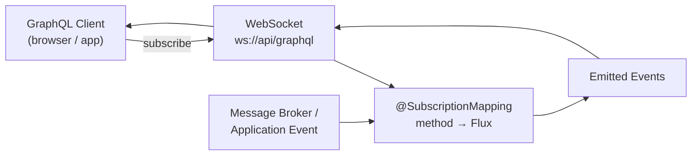

# GraphQL Subscriptions

[← Back to README](../README.md)

---

GraphQL **Subscriptions** enable real-time push from server to client. Where queries and mutations are request-response, a subscription establishes a long-lived connection and the server sends events as they occur. Spring for GraphQL supports subscriptions over **WebSocket** (default) and **Server-Sent Events (SSE)**. The server side returns a `Flux<T>` from the subscription handler; Spring converts each emission to a GraphQL response and sends it down the connection.



---

## Dependencies

```xml
<dependency>
    <groupId>org.springframework.boot</groupId>
    <artifactId>spring-boot-starter-graphql</artifactId>
</dependency>
<dependency>
    <groupId>org.springframework.boot</groupId>
    <artifactId>spring-boot-starter-websocket</artifactId>
</dependency>
<!-- For SSE transport instead of/in addition to WebSocket -->
<dependency>
    <groupId>org.springframework.boot</groupId>
    <artifactId>spring-boot-starter-webflux</artifactId>
</dependency>
```

---

## GraphQL Schema

```graphql
type Subscription {
    # Real-time order status updates
    orderStatusChanged(orderId: ID!): OrderStatusEvent!

    # All new orders (for ops dashboard)
    newOrders: Order!

    # Price ticker
    priceUpdates(productId: ID!): PriceUpdate!

    # Chat room messages
    chatMessages(roomId: ID!): ChatMessage!
}

type OrderStatusEvent {
    orderId: ID!
    previousStatus: OrderStatus!
    newStatus: OrderStatus!
    changedAt: String!
}

type PriceUpdate {
    productId: ID!
    price: Float!
    currency: String!
    timestamp: String!
}
```

---

## Subscription Handler

```java
@Controller
public class OrderSubscriptionController {

    private final Sinks.Many<OrderStatusEvent> orderEventSink =
        Sinks.many().multicast().onBackpressureBuffer(256);

    // Publish events from the service layer
    public void publishStatusChange(OrderStatusEvent event) {
        orderEventSink.tryEmitNext(event);
    }

    // @SubscriptionMapping — returns Flux<T>; Spring handles the rest
    @SubscriptionMapping
    public Flux<OrderStatusEvent> orderStatusChanged(@Argument String orderId) {
        return orderEventSink.asFlux()
            .filter(event -> event.orderId().equals(orderId))
            .doOnSubscribe(sub -> log.info("Client subscribed to order {}", orderId))
            .doOnCancel(() -> log.info("Client unsubscribed from order {}", orderId));
    }
}

@Controller
public class PriceSubscriptionController {

    @SubscriptionMapping
    public Flux<PriceUpdate> priceUpdates(@Argument String productId) {
        // Emit a price update every second (simulating a price feed)
        return Flux.interval(Duration.ofSeconds(1))
            .map(tick -> new PriceUpdate(
                productId,
                randomPrice(),
                "USD",
                Instant.now().toString()))
            .take(Duration.ofHours(1))  // auto-close after 1 hour
            .onBackpressureDrop();      // drop old ticks if client is slow
    }
}
```

---

## Spring Application Events as Subscription Source

```java
@Controller
@RequiredArgsConstructor
public class NewOrderSubscriptionController {

    private final ApplicationEventPublisher publisher;

    // Reactive bridge: Spring Events → Flux
    @SubscriptionMapping
    public Flux<Order> newOrders() {
        return Flux.create(sink -> {
            ApplicationListener<OrderCreatedEvent> listener =
                event -> sink.next(event.order());

            publisher.addApplicationListener(listener);
            sink.onCancel(() -> publisher.removeApplicationListener(listener));
        });
    }
}

// Elsewhere in the service layer
@Service
@RequiredArgsConstructor
public class OrderService {

    private final ApplicationEventPublisher publisher;

    @Transactional
    public Order create(CreateOrderRequest req) {
        Order order = orderRepository.save(buildOrder(req));
        publisher.publishEvent(new OrderCreatedEvent(order));
        return order;
    }
}
```

---

## Kafka-Backed Subscriptions

```java
@Controller
@RequiredArgsConstructor
public class KafkaOrderSubscriptionController {

    private final ReactiveKafkaConsumerTemplate<String, OrderEvent> kafkaConsumer;

    @SubscriptionMapping
    public Flux<OrderStatusEvent> orderStatusChanged(@Argument String orderId) {
        return kafkaConsumer
            .receive()
            .filter(record -> orderId.equals(record.key()))
            .map(record -> toStatusEvent(record.value()))
            .doOnNext(event -> log.debug("Emitting event for order {}", orderId));
    }
}
```

---

## WebSocket Configuration

```yaml
# application.yaml
spring:
  graphql:
    websocket:
      path: /graphql     # WebSocket endpoint (default: /graphql)
      connection-init-timeout: 60s   # time to receive connection_init message
```

```java
@Configuration
public class GraphQlWebSocketConfig implements WebSocketConfigurer {

    @Override
    public void registerWebSocketHandlers(WebSocketHandlerRegistry registry) {
        registry.addHandler(webSocketHandler(), "/graphql")
            .setAllowedOrigins("https://app.company.com");
    }
}
```

---

## SSE Transport (HTTP Streaming)

```yaml
# Enable SSE transport for environments where WebSocket is blocked
spring:
  graphql:
    http:
      sse-timeout: 300000   # 5 minutes; -1 for indefinite
```

```javascript
// Client-side SSE subscription using graphql-sse library
import { createClient } from 'graphql-sse';

const client = createClient({
  url: 'https://api.company.com/graphql/stream',
});

const subscription = client.subscribe({
  query: `subscription { orderStatusChanged(orderId: "123") { newStatus } }`,
}, {
  next: (data) => console.log(data),
  error: (err) => console.error(err),
  complete: () => console.log('completed'),
});

// Unsubscribe
subscription();
```

---

## Authentication for Subscriptions

```java
@Configuration
public class GraphQlSecurityConfig {

    @Bean
    public WebGraphQlInterceptor authInterceptor() {
        return (request, chain) -> {
            // Extract auth from WebSocket connection_init payload or HTTP headers
            String token = extractToken(request);
            if (token != null) {
                Authentication auth = validateToken(token);
                return chain.next(request)
                    .contextWrite(ReactiveSecurityContextHolder.withAuthentication(auth));
            }
            return chain.next(request);
        };
    }

    private String extractToken(WebGraphQlRequest request) {
        // Check HTTP header first
        String header = request.getHeaders().getFirst("Authorization");
        if (header != null && header.startsWith("Bearer ")) {
            return header.substring(7);
        }
        // Check WebSocket connection_init payload
        return (String) request.getExtensions().get("authorization");
    }
}
```

---

## Error Handling

```java
@Controller
public class ChatSubscriptionController {

    @SubscriptionMapping
    public Flux<ChatMessage> chatMessages(@Argument String roomId,
                                           @AuthenticationPrincipal User user) {
        if (!user.canAccessRoom(roomId)) {
            return Flux.error(new GraphQLException("Access denied to room: " + roomId));
        }

        return chatService.messagesFor(roomId)
            .onErrorResume(ex -> {
                log.warn("Chat stream error for room {}: {}", roomId, ex.getMessage());
                return Flux.error(new GraphQLException("Stream interrupted: " + ex.getMessage()));
            });
    }
}
```

---

## Testing Subscriptions

```java
@SpringBootTest
@AutoConfigureHttpGraphQlTester
class OrderSubscriptionTest {

    @Autowired
    HttpGraphQlTester tester;

    @Autowired
    OrderSubscriptionController controller;

    @Test
    void shouldReceiveStatusUpdate() {
        Flux<String> statusFlux = tester
            .document("""
                subscription {
                    orderStatusChanged(orderId: "123") {
                        newStatus
                    }
                }
                """)
            .executeSubscription()
            .toFlux("orderStatusChanged.newStatus", String.class);

        // Emit a test event
        controller.publishStatusChange(new OrderStatusEvent(
            "123", OrderStatus.PENDING, OrderStatus.CONFIRMED, Instant.now().toString()));

        StepVerifier.create(statusFlux)
            .expectNext("CONFIRMED")
            .thenCancel()
            .verify(Duration.ofSeconds(5));
    }
}
```

---

## GraphQL Subscriptions Summary

| Concept | Detail |
|---------|--------|
| `@SubscriptionMapping` | Marks a method as a subscription resolver; must return `Flux<T>` |
| `Flux<T>` | Each emission becomes one GraphQL response sent to the client |
| `Sinks.Many` | Reactor hot source — publish events imperatively into a Flux |
| WebSocket transport | Default; path configured by `spring.graphql.websocket.path` |
| SSE transport | HTTP streaming; enabled with `spring.graphql.http.sse-timeout` |
| `graphql-ws` protocol | Client library for WebSocket subscriptions — handles `connection_init`, `subscribe`, `next` |
| `graphql-sse` protocol | Client library for SSE subscriptions — simpler, works through HTTP proxies |
| `connection_init` timeout | Time allowed for client to send `connection_init` after WebSocket open |
| `WebGraphQlInterceptor` | Intercept all GraphQL operations — use to inject auth into reactive context |
| `onBackpressureDrop` | Drop events if the subscriber is slower than the publisher |

---

[← Back to README](../README.md)
