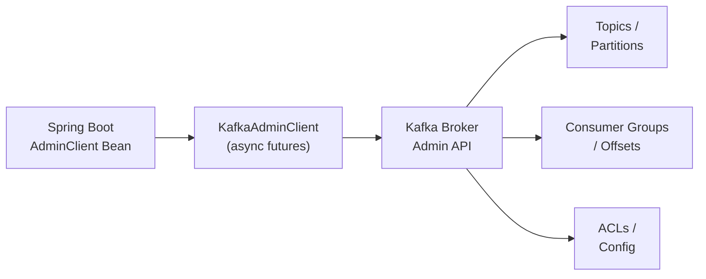

# Kafka AdminClient — Programmatic Topic Management

[← Back to README](../README.md)

---

**Kafka AdminClient** provides a programmatic Java API for managing Kafka cluster resources: creating and deleting topics, listing and altering partition counts, inspecting consumer group offsets, managing ACLs, and describing broker configurations. It is the alternative to `kafka-topics.sh` scripts in automated pipelines, Spring Boot startup routines, and operational tooling.



---

## Dependency & Configuration

```xml
<!-- Included in spring-kafka, no extra dependency needed -->
<dependency>
    <groupId>org.springframework.kafka</groupId>
    <artifactId>spring-kafka</artifactId>
</dependency>
```

```java
@Configuration
public class KafkaAdminConfig {

    @Bean
    public AdminClient adminClient(KafkaProperties kafkaProperties) {
        return AdminClient.create(kafkaProperties.buildAdminProperties(null));
    }

    // Spring's KafkaAdmin auto-creates topics defined as @Bean NewTopic
    @Bean
    public KafkaAdmin kafkaAdmin(KafkaProperties kafkaProperties) {
        KafkaAdmin admin = new KafkaAdmin(kafkaProperties.buildAdminProperties(null));
        admin.setAutoCreate(true);          // create missing topics at startup
        admin.setFatalIfBrokerNotAvailable(true);
        return admin;
    }
}
```

---

## Declarative Topic Creation with Spring

```java
@Configuration
public class TopicConfig {

    // Spring KafkaAdmin creates these at startup if they don't exist
    @Bean
    public NewTopic ordersTopic() {
        return TopicBuilder.name("orders")
            .partitions(12)
            .replicas(3)
            .config(TopicConfig.RETENTION_MS_CONFIG, String.valueOf(
                Duration.ofDays(7).toMillis()))
            .config(TopicConfig.CLEANUP_POLICY_CONFIG, "delete")
            .compact()               // enable log compaction + deletion
            .build();
    }

    @Bean
    public NewTopic ordersDlqTopic() {
        return TopicBuilder.name("orders.DLT")
            .partitions(3)
            .replicas(3)
            .build();
    }
}
```

---

## Programmatic Topic Management

```java
@Service
@RequiredArgsConstructor
public class KafkaTopicService {

    private final AdminClient adminClient;

    // Create topics
    public void createTopic(String name, int partitions, short replication)
            throws ExecutionException, InterruptedException {

        NewTopic topic = new NewTopic(name, partitions, replication)
            .configs(Map.of(
                TopicConfig.RETENTION_MS_CONFIG,
                    String.valueOf(Duration.ofDays(30).toMillis()),
                TopicConfig.COMPRESSION_TYPE_CONFIG, "lz4"
            ));

        CreateTopicsResult result = adminClient.createTopics(List.of(topic));
        result.all().get();  // wait; throws TopicExistsException if already present
    }

    // Create idempotently — ignore if already exists
    public void createTopicIfAbsent(String name, int partitions, short replication)
            throws ExecutionException, InterruptedException {
        try {
            createTopic(name, partitions, replication);
        } catch (ExecutionException e) {
            if (e.getCause() instanceof TopicExistsException) {
                log.info("Topic already exists: {}", name);
            } else {
                throw e;
            }
        }
    }

    // List all topics
    public Set<String> listTopics() throws ExecutionException, InterruptedException {
        return adminClient.listTopics().names().get();
    }

    // Describe topics (partitions, replicas, ISR)
    public Map<String, TopicDescription> describeTopics(List<String> names)
            throws ExecutionException, InterruptedException {
        return adminClient.describeTopics(names).allTopicNames().get();
    }

    // Delete topics
    public void deleteTopic(String name) throws ExecutionException, InterruptedException {
        adminClient.deleteTopics(List.of(name)).all().get();
    }

    // Increase partition count (can only increase, never decrease)
    public void addPartitions(String topicName, int newPartitionCount)
            throws ExecutionException, InterruptedException {
        Map<String, NewPartitions> partitionsMap = Map.of(
            topicName, NewPartitions.increaseTo(newPartitionCount));
        adminClient.createPartitions(partitionsMap).all().get();
    }
}
```

---

## Topic Configuration Management

```java
@Service
@RequiredArgsConstructor
public class KafkaConfigService {

    private final AdminClient adminClient;

    // Read current topic config
    public Map<String, String> getTopicConfig(String topicName)
            throws ExecutionException, InterruptedException {

        ConfigResource resource = new ConfigResource(
            ConfigResource.Type.TOPIC, topicName);

        Config config = adminClient.describeConfigs(List.of(resource))
            .all().get().get(resource);

        return config.entries().stream()
            .filter(entry -> !entry.isDefault())  // only non-default values
            .collect(Collectors.toMap(
                ConfigEntry::name,
                ConfigEntry::value));
    }

    // Update retention for a topic
    public void setRetention(String topicName, Duration retention)
            throws ExecutionException, InterruptedException {

        ConfigResource resource = new ConfigResource(
            ConfigResource.Type.TOPIC, topicName);

        AlterConfigOp op = new AlterConfigOp(
            new ConfigEntry(TopicConfig.RETENTION_MS_CONFIG,
                String.valueOf(retention.toMillis())),
            AlterConfigOp.OpType.SET);

        adminClient.incrementalAlterConfigs(Map.of(resource, List.of(op))).all().get();
    }

    // Reset a config to default
    public void resetConfig(String topicName, String configKey)
            throws ExecutionException, InterruptedException {
        ConfigResource resource = new ConfigResource(ConfigResource.Type.TOPIC, topicName);
        AlterConfigOp op = new AlterConfigOp(
            new ConfigEntry(configKey, null),
            AlterConfigOp.OpType.DELETE);
        adminClient.incrementalAlterConfigs(Map.of(resource, List.of(op))).all().get();
    }

    // Read broker configuration
    public Map<String, String> getBrokerConfig(int brokerId)
            throws ExecutionException, InterruptedException {
        ConfigResource resource = new ConfigResource(
            ConfigResource.Type.BROKER, String.valueOf(brokerId));
        Config config = adminClient.describeConfigs(List.of(resource))
            .all().get().get(resource);
        return config.entries().stream()
            .collect(Collectors.toMap(ConfigEntry::name, ConfigEntry::value));
    }
}
```

---

## Consumer Group Inspection

```java
@Service
@RequiredArgsConstructor
public class ConsumerGroupService {

    private final AdminClient adminClient;

    // List all consumer groups
    public List<String> listConsumerGroups()
            throws ExecutionException, InterruptedException {
        return adminClient.listConsumerGroups()
            .all().get()
            .stream()
            .map(ConsumerGroupListing::groupId)
            .toList();
    }

    // Get committed offsets for a consumer group
    public Map<TopicPartition, OffsetAndMetadata> getGroupOffsets(String groupId)
            throws ExecutionException, InterruptedException {
        return adminClient.listConsumerGroupOffsets(groupId)
            .partitionsToOffsetAndMetadata().get();
    }

    // Calculate consumer lag per partition
    public Map<TopicPartition, Long> calculateLag(String groupId, String topic)
            throws ExecutionException, InterruptedException {

        // Get committed offsets
        Map<TopicPartition, OffsetAndMetadata> committed =
            getGroupOffsets(groupId);

        // Get end offsets (latest messages)
        Set<TopicPartition> partitions = committed.keySet().stream()
            .filter(tp -> tp.topic().equals(topic))
            .collect(Collectors.toSet());

        Map<TopicPartition, Long> endOffsets =
            adminClient.listOffsets(partitions.stream()
                .collect(Collectors.toMap(tp -> tp,
                    tp -> OffsetSpec.latest())))
                .all().get()
                .entrySet().stream()
                .collect(Collectors.toMap(
                    Map.Entry::getKey,
                    e -> e.getValue().offset()));

        // Lag = endOffset - committedOffset
        return partitions.stream().collect(Collectors.toMap(
            tp -> tp,
            tp -> {
                long end = endOffsets.getOrDefault(tp, 0L);
                long committed_ = committed.getOrDefault(tp,
                    new OffsetAndMetadata(0)).offset();
                return Math.max(0, end - committed_);
            }));
    }

    // Reset consumer group offsets to earliest
    public void resetToEarliest(String groupId, String topic)
            throws ExecutionException, InterruptedException {

        // Group must be inactive (no running consumers)
        Map<TopicPartition, OffsetAndMetadata> earliestOffsets =
            adminClient.listOffsets(
                describeTopicPartitions(topic).stream()
                    .collect(Collectors.toMap(tp -> tp, tp -> OffsetSpec.earliest())))
                .all().get()
                .entrySet().stream()
                .collect(Collectors.toMap(
                    Map.Entry::getKey,
                    e -> new OffsetAndMetadata(e.getValue().offset())));

        adminClient.alterConsumerGroupOffsets(groupId, earliestOffsets).all().get();
    }
}
```

---

## ACL Management

```java
@Service
@RequiredArgsConstructor
public class KafkaAclService {

    private final AdminClient adminClient;

    // Grant a principal read access to a topic
    public void grantRead(String principal, String topic)
            throws ExecutionException, InterruptedException {

        AclBinding aclBinding = new AclBinding(
            new ResourcePattern(ResourceType.TOPIC, topic, PatternType.LITERAL),
            new AccessControlEntry(
                "User:" + principal,
                "*",                    // host wildcard
                AclOperation.READ,
                AclPermissionType.ALLOW));

        adminClient.createAcls(List.of(aclBinding)).all().get();
    }

    // List ACLs for a topic
    public Collection<AclBinding> listAcls(String topic)
            throws ExecutionException, InterruptedException {
        AclBindingFilter filter = new AclBindingFilter(
            new ResourcePatternFilter(ResourceType.TOPIC, topic, PatternType.ANY),
            AccessControlEntryFilter.ANY);
        return adminClient.describeAcls(filter).values().get();
    }

    // Delete an ACL
    public void revokeRead(String principal, String topic)
            throws ExecutionException, InterruptedException {
        AclBindingFilter filter = new AclBindingFilter(
            new ResourcePatternFilter(ResourceType.TOPIC, topic, PatternType.LITERAL),
            new AccessControlEntryFilter("User:" + principal, "*",
                AclOperation.READ, AclPermissionType.ALLOW));
        adminClient.deleteAcls(List.of(filter)).all().get();
    }
}
```

---

## Kafka AdminClient Summary

| Concept | Detail |
|---------|--------|
| `AdminClient.create(props)` | Create from a properties map; close with `try-with-resources` or `@PreDestroy` |
| `NewTopic` | Topic definition: name, partitions, replication factor, config overrides |
| `TopicBuilder` | Fluent builder for `NewTopic` — `.partitions(12).replicas(3).config(k, v)` |
| `KafkaAdmin` + `NewTopic` bean | Spring auto-creates declared topics at context startup |
| `listTopics().names().get()` | Returns `Set<String>` of all topic names |
| `describeTopics(names)` | Returns `TopicDescription` with partition count, replicas, ISR |
| `createPartitions(map)` | Increase partition count — only increasing is allowed, never decreasing |
| `incrementalAlterConfigs` | Change individual topic/broker configs without touching others |
| `listConsumerGroupOffsets` | Returns committed offsets per partition for a consumer group |
| `listOffsets(partitions, OffsetSpec.latest())` | Returns latest (high-water mark) offset per partition |
| Consumer lag | `endOffset - committedOffset` per partition — monitor for alerting |
| `alterConsumerGroupOffsets` | Reset offsets — group must be stopped first |
| `AclBinding` | Grant/deny `READ`/`WRITE`/`DESCRIBE` to a principal on a resource |

---

[← Back to README](../README.md)
