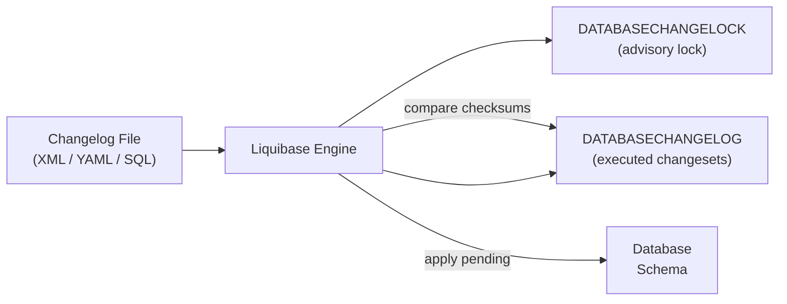

# Liquibase Deep Dive

[← Back to README](../README.md)

---

**Liquibase** manages database schema changes through ordered, tracked **changelogs** of **changeSets**. Each changeSet is identified by `id` + `author` + `file`, executed exactly once, and its checksum recorded in `DATABASECHANGELOG`. Liquibase supports XML, YAML, JSON, and SQL formats; understands preconditions, rollback, contexts, and labels; and integrates with Spring Boot's auto-configuration for zero-setup migrations.



---

## Dependency & Auto-Configuration

```xml
<dependency>
    <groupId>org.liquibase</groupId>
    <artifactId>liquibase-core</artifactId>
</dependency>
```

```yaml
# application.yaml
spring:
  liquibase:
    change-log: classpath:db/changelog/db.changelog-master.yaml
    enabled: true
    drop-first: false          # NEVER true in production
    contexts: ${SPRING_PROFILES_ACTIVE:dev}
    label-filter: "!experimental"
    default-schema: public
    liquibase-schema: public   # schema for DATABASECHANGELOG table
```

---

## Master Changelog (YAML)

```yaml
# src/main/resources/db/changelog/db.changelog-master.yaml
databaseChangeLog:
  - include:
      file: db/changelog/migrations/001-initial-schema.yaml

  - include:
      file: db/changelog/migrations/002-add-orders-table.yaml

  - include:
      file: db/changelog/migrations/003-add-indexes.yaml

  # Include all files in a directory (alphabetical order)
  - includeAll:
      path: db/changelog/migrations/
      relativeToChangelogFile: false
      errorIfMissingOrEmpty: false
```

---

## ChangeSet Examples

```yaml
# db/changelog/migrations/001-initial-schema.yaml
databaseChangeLog:

  - changeSet:
      id: 001-create-customers
      author: alice
      comment: "Initial customers table"
      changes:
        - createTable:
            tableName: customers
            columns:
              - column:
                  name: id
                  type: BIGINT
                  autoIncrement: true
                  constraints:
                    primaryKey: true
                    nullable: false
              - column:
                  name: email
                  type: VARCHAR(255)
                  constraints:
                    nullable: false
                    unique: true
              - column:
                  name: created_at
                  type: TIMESTAMP WITH TIME ZONE
                  defaultValueComputed: CURRENT_TIMESTAMP
      rollback:
        - dropTable:
            tableName: customers

  - changeSet:
      id: 002-add-customers-name
      author: bob
      changes:
        - addColumn:
            tableName: customers
            columns:
              - column:
                  name: full_name
                  type: VARCHAR(200)
                  constraints:
                    nullable: false
                  defaultValue: ""
      rollback:
        - dropColumn:
            tableName: customers
            columnName: full_name

  - changeSet:
      id: 003-create-index-email
      author: alice
      changes:
        - createIndex:
            indexName: idx_customers_email
            tableName: customers
            unique: true
            columns:
              - column:
                  name: email
      rollback:
        - dropIndex:
            indexName: idx_customers_email
            tableName: customers
```

---

## SQL ChangeSets

```yaml
  - changeSet:
      id: 004-seed-data
      author: alice
      context: dev,test         # only run in dev and test environments
      changes:
        - sql:
            sql: |
              INSERT INTO customers (email, full_name)
              VALUES ('admin@example.com', 'Admin User'),
                     ('test@example.com', 'Test User');
      rollback:
        - sql:
            sql: |
              DELETE FROM customers
              WHERE email IN ('admin@example.com', 'test@example.com');
```

```yaml
  # Raw SQL file changeSet
  - changeSet:
      id: 005-complex-migration
      author: charlie
      changes:
        - sqlFile:
            path: db/changelog/sql/005-complex-migration.sql
            relativeToChangelogFile: false
            splitStatements: true
            endDelimiter: ";"
      rollback:
        - sqlFile:
            path: db/changelog/sql/005-complex-migration-rollback.sql
```

---

## Preconditions

```yaml
  - changeSet:
      id: 006-add-column-if-missing
      author: alice
      preConditions:
        - onFail: MARK_RAN      # skip if precondition fails (don't error)
          onError: WARN
          not:
            columnExists:
              tableName: customers
              columnName: phone
      changes:
        - addColumn:
            tableName: customers
            columns:
              - column:
                  name: phone
                  type: VARCHAR(20)

  # Run only on specific database type
  - changeSet:
      id: 007-postgres-specific
      author: alice
      preConditions:
        - onFail: MARK_RAN
          dbms:
            type: postgresql
      changes:
        - sql:
            sql: "ALTER TABLE customers ADD COLUMN search_vector TSVECTOR;"
```

---

## Labels vs Contexts

```yaml
  # Context: environment-based filtering (dev, test, prod)
  - changeSet:
      id: 008-prod-indexes
      author: alice
      context: prod
      changes:
        - createIndex:
            indexName: idx_customers_created_at
            tableName: customers
            columns:
              - column: { name: created_at }

  # Label: feature/release-based filtering
  - changeSet:
      id: 009-new-feature
      author: bob
      labels: "feature-x,v2.0"
      changes:
        - addColumn:
            tableName: customers
            columns:
              - column: { name: tier, type: VARCHAR(20) }
```

```yaml
# application.yaml — run changesets matching context AND label filter
spring:
  liquibase:
    contexts: prod
    label-filter: "!experimental"    # exclude experimental label
```

---

## Rollback

```bash
# Roll back the last N changeSets
liquibase rollbackCount 3

# Roll back to a tag
liquibase tag v1.2.0
liquibase rollback v1.2.0

# Roll back to a date
liquibase rollbackToDate 2024-01-15T00:00:00

# Generate rollback SQL (dry-run)
liquibase rollbackCountSql 3
```

```yaml
# Tag a deployment point
  - changeSet:
      id: tag-v1.0.0
      author: ci
      changes:
        - tagDatabase:
            tag: v1.0.0
```

---

## Diff and generateChangeLog

```bash
# Generate a changelog from an existing database
liquibase --url=jdbc:postgresql://prod/mydb \
          --username=user --password=pass \
          generateChangeLog \
          --changeLogFile=generated.yaml \
          --diffTypes=tables,columns,indexes,foreignkeys

# Diff two databases (dev vs prod)
liquibase --url=jdbc:postgresql://dev/mydb \
          --referenceUrl=jdbc:postgresql://prod/mydb \
          diff

# Generate diff changelog
liquibase --url=jdbc:postgresql://dev/mydb \
          --referenceUrl=jdbc:postgresql://prod/mydb \
          diffChangeLog \
          --changeLogFile=diff.yaml
```

---

## Custom Change (Java)

```java
// Implement complex migration logic in Java
public class BackfillSearchVectorChange implements CustomTaskChange {

    private String tableName;

    @Override
    public void execute(Database database) throws CustomChangeException {
        JdbcConnection conn = (JdbcConnection) database.getConnection();
        try {
            PreparedStatement stmt = conn.getUnderlyingConnection()
                .prepareStatement(
                    "UPDATE " + tableName +
                    " SET search_vector = to_tsvector('english', full_name || ' ' || email)" +
                    " WHERE search_vector IS NULL" +
                    " LIMIT 1000");
            int updated;
            do {
                updated = stmt.executeUpdate();
            } while (updated == 1000);  // batch in pages
        } catch (Exception e) {
            throw new CustomChangeException("Backfill failed", e);
        }
    }

    @Override public String getConfirmationMessage() { return "Search vectors backfilled"; }
    @Override public void setUp() {}
    @Override public void setFileOpener(ResourceAccessor ra) {}
    @Override public ValidationErrors validate(Database db) { return new ValidationErrors(); }

    public void setTableName(String tableName) { this.tableName = tableName; }
}
```

```yaml
  - changeSet:
      id: 010-backfill-search-vector
      author: alice
      changes:
        - customChange:
            class: com.example.db.BackfillSearchVectorChange
            tableName: customers
```

---

## Liquibase Maven Plugin (CI)

```xml
<plugin>
    <groupId>org.liquibase</groupId>
    <artifactId>liquibase-maven-plugin</artifactId>
    <version>4.27.0</version>
    <configuration>
        <changeLogFile>db/changelog/db.changelog-master.yaml</changeLogFile>
        <url>${DB_URL}</url>
        <username>${DB_USER}</username>
        <password>${DB_PASSWORD}</password>
    </configuration>
</plugin>
```

```bash
# Validate changesets without running them
mvn liquibase:validate

# Check which changesets are pending
mvn liquibase:status

# Run migrations
mvn liquibase:update

# Dry-run SQL
mvn liquibase:updateSQL
```

---

## Liquibase Summary

| Concept | Detail |
|---------|--------|
| `changeSet` | Atomic unit of change — identified by `id` + `author` + `file` |
| `DATABASECHANGELOG` | Tracks executed changeSets with checksums — never edit manually |
| `DATABASECHANGELOCK` | Advisory lock preventing concurrent migration runs |
| `include` / `includeAll` | Compose large changelogs from multiple files |
| `context` | Environment filter — `dev`, `test`, `prod`; set via `spring.liquibase.contexts` |
| `label` | Feature/release filter — finer-grained than context; AND/OR expressions |
| `preconditions` | Guard changeSet execution — `onFail: MARK_RAN` skips without error |
| `rollback` | Explicit undo instructions — required for `rollbackCount` / `rollback` commands |
| `tagDatabase` | Mark a point for rollback — use before each release |
| `CustomTaskChange` | Java class for complex logic — backfills, data migrations, external calls |
| `generateChangeLog` | Reverse-engineer an existing schema into a Liquibase changelog |
| `diff` / `diffChangeLog` | Compare two databases and generate delta changelog |

---

[← Back to README](../README.md)
