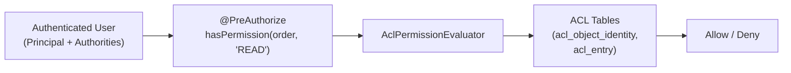

# Spring Security ACL

[← Back to README](../README.md)

---

Spring Security ACL (Access Control List) provides **domain object-level security** — controlling which users can perform which operations on individual instances of a domain object (e.g., "Alice can read Order #42 but not Order #43"). Regular method security (`@PreAuthorize("hasRole('ADMIN')")`) enforces type-level rules. ACL enforces instance-level rules by storing permissions in four database tables and evaluating them at runtime via `AclPermissionEvaluator`.



---

## Dependencies

```xml
<dependency>
    <groupId>org.springframework.security</groupId>
    <artifactId>spring-security-acl</artifactId>
</dependency>
<dependency>
    <groupId>org.springframework</groupId>
    <artifactId>spring-context-support</artifactId>
</dependency>
<!-- Cache (required) -->
<dependency>
    <groupId>com.github.ben-manes.caffeine</groupId>
    <artifactId>caffeine</artifactId>
</dependency>
```

---

## Database Schema

```sql
-- ACL tables (PostgreSQL)
CREATE TABLE acl_sid (
    id       BIGSERIAL PRIMARY KEY,
    principal BOOLEAN NOT NULL,          -- true = user, false = role
    sid      VARCHAR(100) NOT NULL,      -- username or role name
    UNIQUE (sid, principal)
);

CREATE TABLE acl_class (
    id           BIGSERIAL PRIMARY KEY,
    class        VARCHAR(255) NOT NULL UNIQUE,   -- fully qualified class name
    class_id_type VARCHAR(100)                   -- type of the identity field
);

CREATE TABLE acl_object_identity (
    id                 BIGSERIAL PRIMARY KEY,
    object_id_class    BIGINT NOT NULL REFERENCES acl_class(id),
    object_id_identity VARCHAR(255) NOT NULL,    -- the domain object's ID
    parent_object      BIGINT REFERENCES acl_object_identity(id),
    owner_sid          BIGINT REFERENCES acl_sid(id),
    entries_inheriting BOOLEAN NOT NULL DEFAULT TRUE,
    UNIQUE (object_id_class, object_id_identity)
);

CREATE TABLE acl_entry (
    id                  BIGSERIAL PRIMARY KEY,
    acl_object_identity BIGINT NOT NULL REFERENCES acl_object_identity(id),
    ace_order           INT NOT NULL,
    sid                 BIGINT NOT NULL REFERENCES acl_sid(id),
    mask                INT NOT NULL,    -- bitmask: READ=1, WRITE=2, CREATE=4, DELETE=8, ADMIN=16
    granting            BOOLEAN NOT NULL,
    audit_success       BOOLEAN NOT NULL DEFAULT FALSE,
    audit_failure       BOOLEAN NOT NULL DEFAULT FALSE,
    UNIQUE (acl_object_identity, ace_order)
);
```

---

## ACL Configuration

```java
@Configuration
@EnableGlobalMethodSecurity(prePostEnabled = true)
public class AclConfig {

    @Bean
    public AclAuthorizationStrategy aclAuthorizationStrategy() {
        // ROLE_ADMIN can change ownership/auditing/other ACL entries
        return new AclAuthorizationStrategyImpl(
            new SimpleGrantedAuthority("ROLE_ADMIN"));
    }

    @Bean
    public PermissionGrantingStrategy permissionGrantingStrategy() {
        return new DefaultPermissionGrantingStrategy(new ConsoleAuditLogger());
    }

    @Bean
    public AclCache aclCache(CacheManager cacheManager) {
        return new SpringCacheBasedAclCache(
            cacheManager.getCache("acl"),
            permissionGrantingStrategy(),
            aclAuthorizationStrategy());
    }

    @Bean
    public LookupStrategy lookupStrategy(DataSource dataSource, AclCache aclCache) {
        return new BasicLookupStrategy(
            dataSource,
            aclCache,
            aclAuthorizationStrategy(),
            permissionGrantingStrategy());
    }

    @Bean
    public AclService aclService(DataSource dataSource,
                                  LookupStrategy lookupStrategy,
                                  AclCache aclCache) {
        return new JdbcMutableAclService(dataSource, lookupStrategy, aclCache);
    }

    @Bean
    public AclPermissionEvaluator permissionEvaluator(AclService aclService) {
        return new AclPermissionEvaluator(aclService);
    }

    @Bean
    public DefaultMethodSecurityExpressionHandler methodSecurityExpressionHandler(
            AclPermissionEvaluator permissionEvaluator) {
        DefaultMethodSecurityExpressionHandler handler =
            new DefaultMethodSecurityExpressionHandler();
        handler.setPermissionEvaluator(permissionEvaluator);
        return handler;
    }
}
```

---

## Using hasPermission in Method Security

```java
@Service
@RequiredArgsConstructor
public class DocumentService {

    private final DocumentRepository repository;

    // Only return the document if the current user has READ permission on it
    @PreAuthorize("hasPermission(#id, 'com.example.Document', 'READ')")
    public Document findById(Long id) {
        return repository.findById(id).orElseThrow();
    }

    // Check permission on the returned object (post-execution)
    @PostAuthorize("hasPermission(returnObject, 'READ')")
    public Document findBySlug(String slug) {
        return repository.findBySlug(slug).orElseThrow();
    }

    // Filter a collection — remove items the user cannot READ
    @PostFilter("hasPermission(filterObject, 'READ')")
    public List<Document> findAll() {
        return repository.findAll();
    }

    // Require WRITE permission
    @PreAuthorize("hasPermission(#document, 'WRITE')")
    public Document update(Document document) {
        return repository.save(document);
    }

    // Require DELETE permission on the domain object
    @PreAuthorize("hasPermission(#id, 'com.example.Document', 'DELETE')")
    public void delete(Long id) {
        repository.deleteById(id);
    }
}
```

---

## Granting Permissions Programmatically

```java
@Service
@RequiredArgsConstructor
@Transactional
public class AclManagementService {

    private final MutableAclService mutableAclService;

    // Grant a permission to a user on a specific domain object
    public void grantPermission(Long objectId, Class<?> objectClass,
                                 String username, Permission permission) {
        ObjectIdentity oi = new ObjectIdentityImpl(objectClass, objectId);
        Sid sid = new PrincipalSid(username);

        MutableAcl acl;
        try {
            acl = (MutableAcl) mutableAclService.readAclById(oi);
        } catch (NotFoundException e) {
            acl = mutableAclService.createAcl(oi);
        }

        // Add ACE at the end of the list
        acl.insertAce(acl.getEntries().size(), permission, sid, true /* granting */);
        mutableAclService.updateAcl(acl);
    }

    // Revoke a specific permission
    public void revokePermission(Long objectId, Class<?> objectClass,
                                  String username, Permission permission) {
        ObjectIdentity oi = new ObjectIdentityImpl(objectClass, objectId);
        Sid sid = new PrincipalSid(username);

        MutableAcl acl = (MutableAcl) mutableAclService.readAclById(oi);

        for (int i = acl.getEntries().size() - 1; i >= 0; i--) {
            AccessControlEntry entry = acl.getEntries().get(i);
            if (entry.getSid().equals(sid) &&
                entry.getPermission().equals(permission)) {
                acl.deleteAce(i);
            }
        }
        mutableAclService.updateAcl(acl);
    }

    // Grant ownership (used when creating a new object)
    public void grantOwnership(Long objectId, Class<?> objectClass, String ownerUsername) {
        ObjectIdentity oi = new ObjectIdentityImpl(objectClass, objectId);
        Sid owner = new PrincipalSid(ownerUsername);

        MutableAcl acl = mutableAclService.createAcl(oi);
        acl.setOwner(owner);

        // Owner gets all permissions by default
        acl.insertAce(0, BasePermission.READ,   owner, true);
        acl.insertAce(1, BasePermission.WRITE,  owner, true);
        acl.insertAce(2, BasePermission.CREATE, owner, true);
        acl.insertAce(3, BasePermission.DELETE, owner, true);
        acl.insertAce(4, BasePermission.ADMINISTRATION, owner, true);

        mutableAclService.updateAcl(acl);
    }

    // Delete all ACL entries for an object (call when deleting the domain object)
    public void deleteAcl(Long objectId, Class<?> objectClass) {
        ObjectIdentity oi = new ObjectIdentityImpl(objectClass, objectId);
        mutableAclService.deleteAcl(oi, true /* deleteChildren */);
    }
}
```

---

## Wiring Grant on Create

```java
@Service
@RequiredArgsConstructor
@Transactional
public class DocumentService {

    private final DocumentRepository repository;
    private final AclManagementService aclService;

    public Document create(CreateDocumentRequest req) {
        Document doc = repository.save(new Document(req));

        // Creator automatically gets full ownership
        String currentUser = SecurityContextHolder.getContext()
            .getAuthentication().getName();
        aclService.grantOwnership(doc.getId(), Document.class, currentUser);

        return doc;
    }
}
```

---

## Custom Permissions (Beyond the 5 Built-In)

```java
// Built-in: READ(1), WRITE(2), CREATE(4), DELETE(8), ADMINISTRATION(16)
// Custom permission: SHARE = 32
public class CustomPermission extends AbstractPermission {

    public static final Permission SHARE = new CustomPermission(1 << 5, 'S');  // mask=32

    protected CustomPermission(int mask, char code) {
        super(mask, code);
    }
}

// Use in @PreAuthorize
@PreAuthorize("hasPermission(#id, 'com.example.Document', 'SHARE')")
public void shareDocument(Long id, String recipientEmail) { ... }
```

---

## ACL Caching Configuration

```yaml
spring:
  cache:
    caffeine:
      spec: "maximumSize=500,expireAfterWrite=5m"
    cache-names: acl
```

---

## Spring Security ACL Summary

| Concept | Detail |
|---------|--------|
| `acl_sid` | Subject identifiers — users (`principal=true`) and roles (`principal=false`) |
| `acl_class` | Domain class registry — stores fully qualified class names |
| `acl_object_identity` | One row per domain object instance — links class + ID |
| `acl_entry` | One row per permission grant — `mask` bitmask, `granting` true/false |
| `BasePermission` | Built-in permissions: `READ(1)`, `WRITE(2)`, `CREATE(4)`, `DELETE(8)`, `ADMINISTRATION(16)` |
| `ObjectIdentity` | Identifies a domain object by class + ID — key for ACL lookup |
| `Sid` | `PrincipalSid` (username) or `GrantedAuthoritySid` (role) |
| `AclPermissionEvaluator` | Evaluates `hasPermission(obj, 'READ')` in SpEL by querying ACL tables |
| `MutableAclService` | CRUD for ACL entries — `createAcl`, `updateAcl`, `deleteAcl` |
| `insertAce(index, permission, sid, granting)` | Add one ACE to an ACL; lower index = higher priority |
| ACL cache | Cache ACL objects in Caffeine/Redis — ACL lookups happen per secured method call |
| `entries_inheriting` | Parent ACL entries apply to child objects — enables hierarchical permissions |

---

[← Back to README](../README.md)
