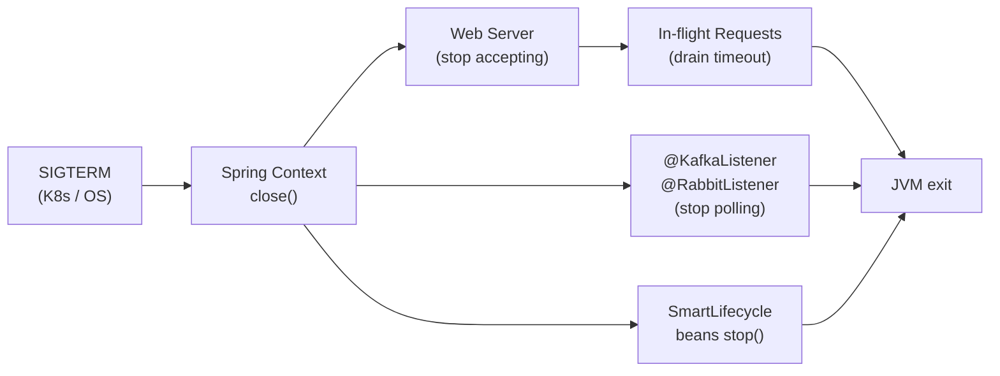

# Spring Boot Graceful Shutdown

[← Back to README](../README.md)

---

**Graceful shutdown** ensures that when a Spring Boot application receives a termination signal (SIGTERM), it stops accepting new requests while completing in-flight work before the process exits. Without it, a Kubernetes pod replacement kills the JVM mid-request, causing `500` errors and data loss. Spring Boot 2.3+ has built-in graceful shutdown support that integrates with the web server, `@Scheduled` tasks, message listeners, and `SmartLifecycle` beans.



---

## Enabling Graceful Shutdown

```yaml
# application.yaml
server:
  shutdown: graceful          # default is "immediate"

spring:
  lifecycle:
    timeout-per-shutdown-phase: 30s   # max time to wait for requests to complete
```

That's all that's needed for the web layer. Spring Boot will stop the embedded server from accepting new connections and wait up to 30 seconds for active requests to finish before closing the application context.

---

## How It Works Internally

```java
// Spring Boot creates a GracefulShutdown component that hooks into the web server
// Tomcat: connector is paused → Undertow: listener is closed → Netty: server is disposed

// The ApplicationContext.close() lifecycle:
// 1. ContextClosedEvent published
// 2. Lifecycle beans stopped (in reverse dependency order)
// 3. Singleton beans destroyed (@PreDestroy, DisposableBean)
// 4. BeanFactory closed

// Phase order (higher phase = stopped first in shutdown):
// DEFAULT_PHASE = Integer.MAX_VALUE / 2 = 1073741823
// SmartLifecycle beans run in reverse phase order on shutdown
```

---

## SmartLifecycle — Custom Shutdown Hooks

```java
@Component
public class WorkerPoolShutdown implements SmartLifecycle {

    private final ExecutorService workerPool;
    private volatile boolean running = false;

    public WorkerPoolShutdown(ExecutorService workerPool) {
        this.workerPool = workerPool;
    }

    @Override
    public void start() {
        running = true;
    }

    @Override
    public void stop(Runnable callback) {
        // Called asynchronously; callback signals completion to Spring
        log.info("Shutting down worker pool...");
        workerPool.shutdown();
        try {
            if (!workerPool.awaitTermination(20, TimeUnit.SECONDS)) {
                workerPool.shutdownNow();
            }
        } catch (InterruptedException e) {
            workerPool.shutdownNow();
            Thread.currentThread().interrupt();
        } finally {
            running = false;
            callback.run();   // MUST be called — otherwise Spring hangs
        }
    }

    @Override public boolean isRunning() { return running; }
    @Override public boolean isAutoStartup() { return true; }
    @Override public int getPhase() { return Integer.MAX_VALUE - 10; }  // stop early
}
```

---

## Kafka Listener Graceful Shutdown

```java
// Spring Kafka stops listeners before the web server by default
// Customize the stop timeout per listener container
@Bean
public ConcurrentKafkaListenerContainerFactory<String, OrderEvent> kafkaListenerFactory(
        ConsumerFactory<String, OrderEvent> cf) {

    ConcurrentKafkaListenerContainerFactory<String, OrderEvent> factory =
        new ConcurrentKafkaListenerContainerFactory<>();
    factory.setConsumerFactory(cf);

    // During shutdown: stop polling, finish current message, then exit
    factory.getContainerProperties()
        .setShutdownTimeout(15_000L);   // ms to wait for current message to finish

    return factory;
}
```

---

## Scheduled Tasks on Shutdown

```java
@Configuration
@EnableScheduling
public class SchedulingConfig implements SchedulingConfigurer {

    @Override
    public void configureTasks(ScheduledTaskRegistrar registrar) {
        ThreadPoolTaskScheduler scheduler = new ThreadPoolTaskScheduler();
        scheduler.setPoolSize(4);
        scheduler.setThreadNamePrefix("scheduled-");
        // Gracefully wait for running tasks before shutdown
        scheduler.setWaitForTasksToCompleteOnShutdown(true);
        scheduler.setAwaitTerminationSeconds(30);
        scheduler.initialize();
        registrar.setTaskScheduler(scheduler);
    }
}
```

---

## @PreDestroy for Cleanup

```java
@Service
@RequiredArgsConstructor
public class CacheWarmingService {

    private final RedisTemplate<String, Object> redis;
    private volatile boolean accepting = true;

    @PostConstruct
    public void warmUp() {
        log.info("Pre-loading cache...");
        loadPopularProducts();
    }

    @PreDestroy
    public void onShutdown() {
        accepting = false;
        log.info("Flushing dirty cache entries before shutdown...");
        flushDirtyEntries();
    }

    public void processRequest(String key) {
        if (!accepting) throw new ServiceUnavailableException("Shutting down");
        // handle request
    }
}
```

---

## Kubernetes — PreStop Hook & Termination Grace Period

```yaml
# Kubernetes Deployment — wire up graceful shutdown correctly
apiVersion: apps/v1
kind: Deployment
spec:
  template:
    spec:
      terminationGracePeriodSeconds: 60   # K8s waits this long before SIGKILL

      containers:
        - name: orders-service
          image: company/orders-service:latest

          lifecycle:
            preStop:
              exec:
                # Sleep before SIGTERM reaches the app — gives load balancer
                # time to stop routing traffic to this pod
                command: ["/bin/sh", "-c", "sleep 5"]

          env:
            - name: SERVER_SHUTDOWN
              value: graceful
            - name: SPRING_LIFECYCLE_TIMEOUT_PER_SHUTDOWN_PHASE
              value: 30s

      # Ensure terminationGracePeriodSeconds > preStop sleep + Spring timeout
      # 60 > 5 (preStop) + 30 (Spring) + buffer
```

---

## Health Probe During Shutdown

```yaml
# application.yaml — report OUT_OF_SERVICE during shutdown so K8s stops routing
management:
  endpoint:
    health:
      probes:
        enabled: true
  health:
    livenessstate:
      enabled: true
    readinessstate:
      enabled: true
```

```java
// When Spring receives shutdown signal, readiness automatically goes DOWN
// Liveness stays UP (so K8s doesn't restart the pod — it's shutting down gracefully)
// K8s readiness probe will fail → pod removed from Service endpoints → no new traffic
```

---

## Testing Graceful Shutdown

```java
@SpringBootTest(webEnvironment = RANDOM_PORT)
class GracefulShutdownTest {

    @Autowired
    private ConfigurableApplicationContext context;

    @Autowired
    private TestRestTemplate restTemplate;

    @Test
    void inFlightRequestsCompleteBeforeShutdown() throws Exception {
        // Start a long-running request in the background
        CompletableFuture<ResponseEntity<String>> future = CompletableFuture
            .supplyAsync(() -> restTemplate.getForEntity("/api/slow-endpoint", String.class));

        Thread.sleep(100); // let the request start

        // Trigger graceful shutdown
        CompletableFuture.runAsync(context::close);

        // The in-flight request should still complete
        ResponseEntity<String> response = future.get(10, TimeUnit.SECONDS);
        assertThat(response.getStatusCode()).isEqualTo(HttpStatus.OK);
    }
}
```

---

## Graceful Shutdown Summary

| Concept | Detail |
|---------|--------|
| `server.shutdown=graceful` | Stops web server from accepting new connections on shutdown |
| `timeout-per-shutdown-phase` | Max time Spring waits for in-flight requests per phase (default 30s) |
| `SmartLifecycle.stop(callback)` | Async stop — call `callback.run()` when done or Spring hangs |
| `getPhase()` | Higher phase = stopped first; web server uses `Integer.MAX_VALUE` |
| `setWaitForTasksToCompleteOnShutdown(true)` | Scheduled tasks finish their current execution before pool closes |
| Kafka `shutdownTimeout` | Time to wait for the current message to finish processing before stopping |
| `@PreDestroy` | Simple synchronous cleanup — flush cache, close connections |
| K8s `preStop` sleep | Delay before SIGTERM to allow load balancer to deregister the pod |
| `terminationGracePeriodSeconds` | K8s waits this long after SIGTERM before sending SIGKILL |
| Readiness probe during shutdown | Spring sets readiness to `OUT_OF_SERVICE` — K8s removes pod from Service endpoints |

---

[← Back to README](../README.md)
