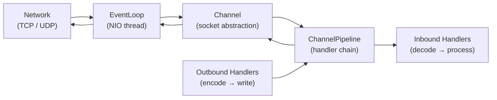

# Netty Deep Dive

[← Back to README](../README.md)

---

**Netty** is the asynchronous, event-driven network framework that underlies Spring WebFlux, gRPC-Java, RSocket, and Vert.x. It models network communication as a **pipeline of handlers** attached to a **channel**, driven by an **EventLoop** thread that never blocks. Understanding Netty is essential for writing custom protocols, tuning reactive HTTP performance, and debugging low-level networking issues.



---

## Core Concepts

```java
// EventLoopGroup — pool of EventLoop threads (one thread per loop)
// Boss group: accepts connections
// Worker group: handles I/O on accepted connections
EventLoopGroup bossGroup   = new NioEventLoopGroup(1);
EventLoopGroup workerGroup = new NioEventLoopGroup(); // defaults to 2 × CPU cores

// ServerBootstrap — wires everything together
ServerBootstrap bootstrap = new ServerBootstrap()
    .group(bossGroup, workerGroup)
    .channel(NioServerSocketChannel.class)         // NIO-backed server channel
    .option(ChannelOption.SO_BACKLOG, 128)
    .childOption(ChannelOption.SO_KEEPALIVE, true)
    .childOption(ChannelOption.TCP_NODELAY, true)  // disable Nagle's algorithm
    .childHandler(new ChannelInitializer<SocketChannel>() {
        @Override
        protected void initChannel(SocketChannel ch) {
            ch.pipeline()
                .addLast(new LoggingHandler(LogLevel.DEBUG))
                .addLast(new LineBasedFrameDecoder(1024))   // split by \n
                .addLast(new StringDecoder(CharsetUtil.UTF_8))
                .addLast(new StringEncoder(CharsetUtil.UTF_8))
                .addLast(new EchoServerHandler());
        }
    });

ChannelFuture future = bootstrap.bind(8080).sync();
future.channel().closeFuture().sync();  // block until server shuts down
```

---

## ChannelHandler — Inbound and Outbound

```java
// Inbound: process data arriving from the network
@ChannelHandler.Sharable   // safe to share a single instance across channels
public class EchoServerHandler extends SimpleChannelInboundHandler<String> {

    @Override
    protected void channelRead0(ChannelHandlerContext ctx, String msg) {
        // Never block here — this is the EventLoop thread
        ctx.writeAndFlush(msg + "\n");
    }

    @Override
    public void channelActive(ChannelHandlerContext ctx) {
        log.info("Client connected: {}", ctx.channel().remoteAddress());
    }

    @Override
    public void channelInactive(ChannelHandlerContext ctx) {
        log.info("Client disconnected: {}", ctx.channel().remoteAddress());
    }

    @Override
    public void exceptionCaught(ChannelHandlerContext ctx, Throwable cause) {
        log.error("Handler error", cause);
        ctx.close();
    }
}

// Outbound: intercept writes going to the network
public class RequestLogHandler extends ChannelOutboundHandlerAdapter {

    @Override
    public void write(ChannelHandlerContext ctx, Object msg, ChannelPromise promise) {
        log.debug("Writing: {}", msg);
        ctx.write(msg, promise);   // pass down the pipeline
    }
}
```

---

## ByteBuf — Zero-Copy Buffer

```java
// ByteBuf is Netty's replacement for Java NIO ByteBuffer
// It has separate read and write indices, reference counting, and pooling

// Allocate from the pooled allocator (avoids GC pressure)
ByteBuf buf = ctx.alloc().buffer(256);

try {
    buf.writeInt(42);
    buf.writeBytes("hello".getBytes(UTF_8));

    int readInt  = buf.readInt();          // 42
    byte[] bytes = new byte[5];
    buf.readBytes(bytes);                  // "hello"

    // Slice — zero-copy sub-buffer (shares backing memory)
    ByteBuf slice = buf.slice(0, 4);      // first 4 bytes, ref count NOT incremented

    // Duplicate — same content, independent indices
    ByteBuf dup = buf.duplicate();

    // Composite — logical concat with no data copy
    CompositeByteBuf composite = ctx.alloc().compositeBuffer();
    composite.addComponents(true, header, body);  // true = advance writerIndex

} finally {
    buf.release();  // MUST release — Netty uses reference counting
}
```

---

## Custom Length-Prefixed Protocol

```java
// Protocol: [4-byte length][payload bytes]

// Decoder — splits byte stream into frames
public class LengthPrefixedDecoder extends LengthFieldBasedFrameDecoder {

    public LengthPrefixedDecoder() {
        super(
            65536,   // maxFrameLength
            0,       // lengthFieldOffset
            4,       // lengthFieldLength (4 bytes = int)
            0,       // lengthAdjustment
            4        // initialBytesToStrip (strip the length header)
        );
    }
}

// Message decoder — ByteBuf → domain object
public class MessageDecoder extends MessageToMessageDecoder<ByteBuf> {

    @Override
    protected void decode(ChannelHandlerContext ctx, ByteBuf in, List<Object> out) {
        byte type    = in.readByte();
        int  version = in.readShort();
        byte[] payload = new byte[in.readableBytes()];
        in.readBytes(payload);
        out.add(new AppMessage(type, version, payload));
    }
}

// Message encoder — domain object → ByteBuf
public class MessageEncoder extends MessageToByteEncoder<AppMessage> {

    @Override
    protected void encode(ChannelHandlerContext ctx, AppMessage msg, ByteBuf out) {
        byte[] payload = msg.payload();
        out.writeInt(1 + 2 + payload.length);  // length header
        out.writeByte(msg.type());
        out.writeShort(msg.version());
        out.writeBytes(payload);
    }
}
```

---

## Full Server with Custom Protocol

```java
public class AppServer {

    public static void main(String[] args) throws InterruptedException {
        EventLoopGroup boss   = new NioEventLoopGroup(1);
        EventLoopGroup worker = new NioEventLoopGroup();

        try {
            new ServerBootstrap()
                .group(boss, worker)
                .channel(NioServerSocketChannel.class)
                .childHandler(new ChannelInitializer<SocketChannel>() {
                    @Override
                    protected void initChannel(SocketChannel ch) {
                        ch.pipeline()
                            // Inbound (top to bottom)
                            .addLast(new LengthPrefixedDecoder())
                            .addLast(new MessageDecoder())
                            .addLast(new AppServerHandler())
                            // Outbound (bottom to top)
                            .addLast(new MessageEncoder());
                    }
                })
                .bind(9090).sync()
                .channel().closeFuture().sync();
        } finally {
            boss.shutdownGracefully();
            worker.shutdownGracefully();
        }
    }
}

public class AppServerHandler extends SimpleChannelInboundHandler<AppMessage> {

    @Override
    protected void channelRead0(ChannelHandlerContext ctx, AppMessage msg) {
        // Business logic — NEVER block this thread
        AppMessage response = process(msg);
        ctx.writeAndFlush(response);
    }

    private AppMessage process(AppMessage msg) {
        return new AppMessage(msg.type(), msg.version(),
            ("echo: " + new String(msg.payload())).getBytes());
    }
}
```

---

## Blocking Work — Off the EventLoop

```java
// If you must block (DB call, heavy computation), offload to a separate thread pool
public class BlockingHandler extends SimpleChannelInboundHandler<AppMessage> {

    private static final EventExecutorGroup blockingPool =
        new DefaultEventExecutorGroup(16);  // separate thread pool

    @Override
    protected void channelRead0(ChannelHandlerContext ctx, AppMessage msg) {
        // Schedule blocking work on the separate pool
        blockingPool.execute(() -> {
            AppMessage response = blockingDbCall(msg);  // safe to block here
            ctx.writeAndFlush(response);                // write back on caller thread (fine)
        });
    }
}

// Alternatively, add handler to the pipeline with the executor group:
// ch.pipeline().addLast(blockingPool, new BlockingHandler());
```

---

## WebFlux Netty Tuning

```java
@Bean
public NettyReactiveWebServerFactory nettyFactory() {
    NettyReactiveWebServerFactory factory = new NettyReactiveWebServerFactory();
    factory.addServerCustomizers(httpServer -> httpServer
        .option(ChannelOption.SO_BACKLOG, 1024)
        .childOption(ChannelOption.TCP_NODELAY, true)
        .childOption(ChannelOption.SO_SNDBUF, 65536)
        .childOption(ChannelOption.SO_RCVBUF, 65536)
        .runOn(LoopResources.create("event-loop", 1, 8, true))
        .accessLog(true)
        .compress(true)
        .idleTimeout(Duration.ofSeconds(30))
        .maxKeepAliveRequests(500)
    );
    return factory;
}
```

---

## Netty Deep Dive Summary

| Concept | Detail |
|---------|--------|
| `EventLoop` | Single-threaded loop that handles all I/O for its assigned channels; NEVER block it |
| `NioEventLoopGroup` | Pool of EventLoop threads; boss=1 (accept), worker=2×CPUs (I/O) |
| `ChannelPipeline` | Ordered chain of `ChannelHandler`s; inbound flows down, outbound flows up |
| `ChannelHandlerContext` | Link between a handler and the pipeline; use to pass events or write |
| `SimpleChannelInboundHandler<T>` | Auto-releases `ByteBuf` after `channelRead0`; override for typed messages |
| `ByteBuf` | Netty's buffer — ref-counted, pooled, separate read/write indices |
| `buf.release()` | MUST be called when you own a `ByteBuf`; memory leak if forgotten |
| `@ChannelHandler.Sharable` | Marks a handler safe to share across channels; must be stateless |
| `LengthFieldBasedFrameDecoder` | Handles TCP framing — reassembles complete frames from byte stream |
| `MessageToByteEncoder` | Outbound handler that encodes a domain object to `ByteBuf` |
| Blocking work | Use `DefaultEventExecutorGroup` to offload blocking operations off the EventLoop |
| WebFlux tuning | `NettyReactiveWebServerFactory` + `addServerCustomizers` for SO_BACKLOG, TCP_NODELAY, etc. |

---

[← Back to README](../README.md)
