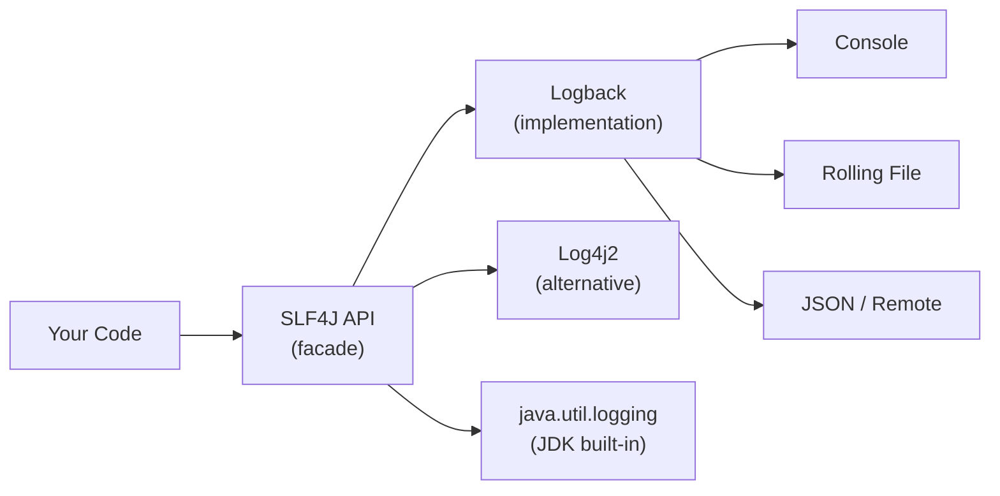

# Logging

[← Back to README](../README.md)

---

Logging records what an application does at runtime — essential for debugging, monitoring, and auditing. Java has several logging options; the industry standard is **SLF4J** as the API with **Logback** as the implementation.



---

## Log Levels

From least to most severe:

| Level | Use for |
|-------|---------|
| `TRACE` | Very fine-grained details — method entry/exit, loop iterations |
| `DEBUG` | Diagnostic info useful during development |
| `INFO` | Normal application events — startup, shutdown, key operations |
| `WARN` | Something unexpected but recoverable — degraded performance, fallback used |
| `ERROR` | A serious problem — operation failed, exception caught |

> In production, set the level to `INFO` or `WARN`. Only enable `DEBUG`/`TRACE` temporarily to diagnose a specific issue.

---

## SLF4J + Logback

### Maven Dependencies

```xml
<!-- SLF4J API -->
<dependency>
    <groupId>org.slf4j</groupId>
    <artifactId>slf4j-api</artifactId>
    <version>2.0.13</version>
</dependency>

<!-- Logback (pulls in the SLF4J binding automatically) -->
<dependency>
    <groupId>ch.qos.logback</groupId>
    <artifactId>logback-classic</artifactId>
    <version>1.5.6</version>
</dependency>
```

### Basic Usage

```java
import org.slf4j.Logger;
import org.slf4j.LoggerFactory;

public class OrderService {

    // one logger per class — use the class itself as the name
    private static final Logger log = LoggerFactory.getLogger(OrderService.class);

    public void placeOrder(String item, int quantity) {
        log.debug("Placing order: item={}, quantity={}", item, quantity);

        try {
            // ... business logic
            log.info("Order placed successfully: item={}", item);
        } catch (Exception e) {
            log.error("Failed to place order for item={}", item, e);  // e logs the stack trace
        }
    }
}
```

**Use `{}` placeholders** — not string concatenation. The string is only built if the log level is enabled.

```java
// bad — string built even if DEBUG is disabled
log.debug("Processing " + items.size() + " items");

// good — string only built if DEBUG is enabled
log.debug("Processing {} items", items.size());
```

---

## Logback Configuration

Logback reads `src/main/resources/logback.xml`.

### Console Only (development)

```xml
<configuration>

    <appender name="CONSOLE" class="ch.qos.logback.core.ConsoleAppender">
        <encoder>
            <pattern>%d{HH:mm:ss.SSS} [%thread] %-5level %logger{36} - %msg%n</pattern>
        </encoder>
    </appender>

    <root level="DEBUG">
        <appender-ref ref="CONSOLE"/>
    </root>

</configuration>
```

### Rolling File (production)

```xml
<configuration>

    <appender name="CONSOLE" class="ch.qos.logback.core.ConsoleAppender">
        <encoder>
            <pattern>%d{yyyy-MM-dd HH:mm:ss.SSS} [%thread] %-5level %logger{36} - %msg%n</pattern>
        </encoder>
    </appender>

    <!-- rolls over daily, keeps 30 days, max 1 GB total -->
    <appender name="FILE" class="ch.qos.logback.core.rolling.RollingFileAppender">
        <file>logs/app.log</file>
        <rollingPolicy class="ch.qos.logback.core.rolling.TimeBasedRollingPolicy">
            <fileNamePattern>logs/app.%d{yyyy-MM-dd}.log.gz</fileNamePattern>
            <maxHistory>30</maxHistory>
            <totalSizeCap>1GB</totalSizeCap>
        </rollingPolicy>
        <encoder>
            <pattern>%d{yyyy-MM-dd HH:mm:ss.SSS} [%thread] %-5level %logger{36} - %msg%n</pattern>
        </encoder>
    </appender>

    <!-- silence noisy third-party libraries -->
    <logger name="org.hibernate" level="WARN"/>
    <logger name="com.zaxxer.hikari" level="INFO"/>

    <!-- your application — more verbose -->
    <logger name="com.example" level="DEBUG"/>

    <!-- root catches everything else -->
    <root level="INFO">
        <appender-ref ref="CONSOLE"/>
        <appender-ref ref="FILE"/>
    </root>

</configuration>
```

### Pattern Format Tokens

| Token | Output |
|-------|--------|
| `%d{pattern}` | Timestamp |
| `%thread` | Thread name |
| `%-5level` | Log level (left-padded to 5 chars) |
| `%logger{36}` | Logger name (truncated to 36 chars) |
| `%msg` | The log message |
| `%n` | Newline |
| `%ex` | Exception stack trace |

---

## Structured / JSON Logging

Plain text logs are hard to search at scale. Use JSON for log aggregation systems (ELK stack, Loki, Datadog).

```xml
<dependency>
    <groupId>ch.qos.logback.contrib</groupId>
    <artifactId>logback-json-classic</artifactId>
    <version>0.1.5</version>
</dependency>
```

```xml
<appender name="JSON" class="ch.qos.logback.core.ConsoleAppender">
    <encoder class="ch.qos.logback.contrib.json.classic.JsonLayout">
        <jsonFormatter class="ch.qos.logback.contrib.jackson.JacksonJsonFormatter">
            <prettyPrint>false</prettyPrint>
        </jsonFormatter>
        <timestampFormat>yyyy-MM-dd'T'HH:mm:ss.SSS'Z'</timestampFormat>
    </encoder>
</appender>
```

Output:
```json
{"timestamp":"2026-06-14T14:30:00.000Z","level":"INFO","thread":"main","logger":"com.example.OrderService","message":"Order placed successfully: item=Laptop"}
```

---

## MDC — Mapped Diagnostic Context

MDC attaches contextual key-value pairs to every log line in the current thread — great for tracing a request across multiple log statements.

```java
import org.slf4j.MDC;

public class RequestFilter {

    public void doFilter(String requestId, String userId) {
        MDC.put("requestId", requestId);
        MDC.put("userId",    userId);

        try {
            processRequest();
        } finally {
            MDC.clear();  // always clear at thread end (especially with thread pools)
        }
    }
}
```

Add `%X{requestId}` and `%X{userId}` to the pattern:

```xml
<pattern>%d [%thread] %-5level [req=%X{requestId} user=%X{userId}] %logger - %msg%n</pattern>
```

Output:
```
2026-06-14 14:30:00 [http-1] INFO  [req=abc-123 user=alice] OrderService - Order placed: item=Laptop
2026-06-14 14:30:00 [http-1] INFO  [req=abc-123 user=alice] PaymentService - Payment processed: £99.99
```

---

## java.util.logging (JUL)

The JDK's built-in logging — no dependencies needed, but less powerful than SLF4J/Logback.

```java
import java.util.logging.*;

Logger logger = Logger.getLogger(MyClass.class.getName());

logger.info("Application started");
logger.warning("Low memory");
logger.severe("Database connection failed");
logger.fine("Debug detail");   // equivalent to DEBUG

// log with exception
try {
    riskyOperation();
} catch (Exception e) {
    logger.log(Level.SEVERE, "Operation failed", e);
}
```

Configure via `logging.properties` (on classpath or `-Djava.util.logging.config.file=...`):

```properties
handlers=java.util.logging.ConsoleHandler
.level=INFO
java.util.logging.ConsoleHandler.level=FINE
java.util.logging.ConsoleHandler.formatter=java.util.logging.SimpleFormatter
com.example.level=FINE
```

---

## Log4j 2 (Alternative to Logback)

```xml
<dependency>
    <groupId>org.apache.logging.log4j</groupId>
    <artifactId>log4j-slf4j2-impl</artifactId>
    <version>2.23.1</version>
</dependency>
```

Configure via `log4j2.xml` in `src/main/resources`:

```xml
<Configuration status="WARN">
    <Appenders>
        <Console name="Console" target="SYSTEM_OUT">
            <PatternLayout pattern="%d{HH:mm:ss.SSS} [%t] %-5level %logger{36} - %msg%n"/>
        </Console>
    </Appenders>
    <Loggers>
        <Root level="info">
            <AppenderRef ref="Console"/>
        </Root>
    </Loggers>
</Configuration>
```

---

## Logging Best Practices

- **One logger per class** — `LoggerFactory.getLogger(MyClass.class)` in a `static final` field.
- **Use `{}` placeholders** — never string concatenation in log calls.
- **Log at the right level** — don't log everything at `ERROR`, don't log sensitive data at any level.
- **Always include the exception** — `log.error("Failed", e)` not `log.error("Failed: " + e.getMessage())`.
- **Use MDC for request context** — attach a correlation/request ID at the entry point and clear it on exit.
- **Never log passwords, tokens, or PII** — credit card numbers, emails, API keys must never appear in logs.
- **Use structured logging in production** — JSON logs are searchable; plain text logs are not.
- **Guard expensive log statements** — `if (log.isDebugEnabled()) { log.debug(...) }` for costly string builds.

---

## Logging Summary

| Concept | Notes |
|---------|-------|
| SLF4J | Facade API — write against this, swap implementations freely |
| Logback | Default SLF4J implementation — fast, flexible |
| Log4j 2 | Alternative implementation — good async support |
| Log levels | TRACE < DEBUG < INFO < WARN < ERROR |
| `{}` placeholders | Lazy string building — always prefer over concatenation |
| `logback.xml` | Configure appenders, patterns, and per-package levels |
| Rolling file | `RollingFileAppender` — rotate by time or size |
| MDC | Attach contextual key-value pairs to all logs in a thread |
| Structured logging | JSON output for log aggregation (ELK, Loki, Datadog) |

---

[← Back to README](../README.md)
