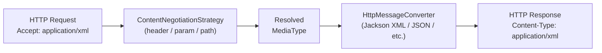

# Spring MVC Content Negotiation

[← Back to README](../README.md)

---

**Content negotiation** is the mechanism by which a Spring MVC application selects the response format — JSON, XML, CSV, protobuf, or any custom type — based on what the client signals it can accept. Spring evaluates the `Accept` header, an optional format query parameter, and path extension (deprecated) in a configurable priority order, then selects the matching `HttpMessageConverter` to serialize the response.



---

## Default Behaviour

```java
// Spring Boot auto-configures:
// 1. Accept header strategy (highest priority)
// 2. Optional format parameter strategy
// 3. Jackson for application/json
// 4. Jackson XML for application/xml (if jackson-dataformat-xml is on classpath)

@RestController
@RequestMapping("/api/products")
public class ProductController {

    @GetMapping(produces = {
        MediaType.APPLICATION_JSON_VALUE,
        MediaType.APPLICATION_XML_VALUE
    })
    public Product getProduct(@PathVariable Long id) {
        return productService.findById(id);
    }
}
```

```bash
# Requesting JSON (default)
curl -H "Accept: application/json" http://localhost:8080/api/products/1

# Requesting XML
curl -H "Accept: application/xml" http://localhost:8080/api/products/1
```

---

## ContentNegotiationConfigurer

```java
@Configuration
@EnableWebMvc
public class ContentNegotiationConfig implements WebMvcConfigurer {

    @Override
    public void configureContentNegotiation(ContentNegotiationConfigurer configurer) {
        configurer
            // Strategy 1: ?format=json query parameter
            .favorParameter(true)
            .parameterName("format")

            // Strategy 2: Accept header (evaluated after param)
            .ignoreAcceptHeader(false)

            // Default when neither param nor Accept header matches
            .defaultContentType(MediaType.APPLICATION_JSON)

            // Map format aliases to media types
            .mediaType("json",  MediaType.APPLICATION_JSON)
            .mediaType("xml",   MediaType.APPLICATION_XML)
            .mediaType("csv",   new MediaType("text", "csv"))
            .mediaType("proto", new MediaType("application", "x-protobuf"));
    }
}
```

```bash
# Using format parameter
curl http://localhost:8080/api/products/1?format=xml
curl http://localhost:8080/api/products/1?format=csv
```

---

## Custom HttpMessageConverter — CSV

```java
// Write a list of domain objects as CSV
public class CsvMessageConverter<T> extends AbstractHttpMessageConverter<List<T>> {

    private static final MediaType CSV_MEDIA_TYPE =
        new MediaType("text", "csv");

    public CsvMessageConverter() {
        super(CSV_MEDIA_TYPE);
    }

    @Override
    protected boolean supports(Class<?> clazz) {
        return List.class.isAssignableFrom(clazz);
    }

    @Override
    protected List<T> readInternal(Class<? extends List<T>> clazz,
                                    HttpInputMessage inputMessage) {
        throw new UnsupportedOperationException("CSV read not supported");
    }

    @Override
    protected void writeInternal(List<T> items, HttpOutputMessage outputMessage)
            throws IOException {
        outputMessage.getHeaders().setContentType(CSV_MEDIA_TYPE);
        try (PrintWriter writer = new PrintWriter(
                new OutputStreamWriter(outputMessage.getBody(), UTF_8))) {
            if (!items.isEmpty()) {
                // Header row — use Jackson introspection for field names
                ObjectWriter csvWriter = new CsvMapper().writerFor(items.get(0).getClass())
                    .with(new CsvSchema.Builder().setUseHeader(true).build());
                writer.print(csvWriter.writeValueAsString(items));
            }
        }
    }
}

@Configuration
public class ConverterConfig implements WebMvcConfigurer {

    @Override
    public void configureMessageConverters(List<HttpMessageConverter<?>> converters) {
        converters.add(new CsvMessageConverter<>());
    }

    // OR extend without replacing defaults:
    @Override
    public void extendMessageConverters(List<HttpMessageConverter<?>> converters) {
        converters.add(0, new CsvMessageConverter<>());  // highest priority
    }
}
```

---

## Producing Multiple Formats from One Endpoint

```java
@RestController
@RequestMapping("/api/reports")
public class ReportController {

    @GetMapping(
        value = "/orders",
        produces = {
            MediaType.APPLICATION_JSON_VALUE,
            MediaType.APPLICATION_XML_VALUE,
            "text/csv",
            "application/x-protobuf"
        })
    public ResponseEntity<List<OrderReport>> getOrders(
            @RequestParam(required = false) String format) {
        List<OrderReport> orders = reportService.getOrders();
        return ResponseEntity.ok()
            .header(HttpHeaders.CONTENT_DISPOSITION,
                "attachment; filename=\"orders." + resolveExtension(format) + "\"")
            .body(orders);
    }
}
```

---

## Jackson XML Support

```xml
<dependency>
    <groupId>com.fasterxml.jackson.dataformat</groupId>
    <artifactId>jackson-dataformat-xml</artifactId>
</dependency>
```

```java
@XmlRootElement(name = "product")  // JAXB annotation for XML root element
@JacksonXmlRootElement(localName = "product")
public record Product(
    Long id,

    @JacksonXmlProperty(localName = "product-name")
    String name,

    BigDecimal price
) {}
```

---

## Content Negotiation in WebFlux

```java
@RestController
@RequestMapping("/api/products")
public class ReactiveProductController {

    @GetMapping(produces = {
        MediaType.APPLICATION_JSON_VALUE,
        MediaType.APPLICATION_XML_VALUE,
        "text/event-stream"
    })
    public Flux<Product> stream(ServerWebExchange exchange) {
        // Spring WebFlux negotiates based on Accept header
        // For text/event-stream → SSE, for JSON → array, for XML → XML list
        return productService.streamAll();
    }
}

@Configuration
public class WebFluxContentNegotiationConfig implements WebFluxConfigurer {

    @Override
    public void configureContentTypeResolver(
            RequestedContentTypeResolverBuilder builder) {
        builder
            .parameterResolver()
            .parameterName("format")
            .mediaType("json",  MediaType.APPLICATION_JSON)
            .mediaType("xml",   MediaType.APPLICATION_XML);

        builder.headerResolver();
        builder.fixedResolver(MediaType.APPLICATION_JSON);  // fallback
    }
}
```

---

## @RequestMapping produces / consumes

```java
@RestController
@RequestMapping(
    value = "/api/orders",
    produces  = MediaType.APPLICATION_JSON_VALUE,   // class-level default
    consumes  = MediaType.APPLICATION_JSON_VALUE
)
public class OrderController {

    // Override at method level — also accepts XML bodies
    @PostMapping(consumes = {
        MediaType.APPLICATION_JSON_VALUE,
        MediaType.APPLICATION_XML_VALUE
    })
    public Order create(@RequestBody Order order) { ... }

    // This endpoint only serves protobuf
    @GetMapping(value = "/{id}/proto",
                produces = "application/x-protobuf")
    public OrderProto.Order getProto(@PathVariable Long id) { ... }
}
```

---

## 406 Not Acceptable Handling

```java
// When no converter matches the Accept header, Spring returns 406
// Provide a fallback or a clear error message

@RestControllerAdvice
public class ContentNegotiationAdvice {

    @ExceptionHandler(HttpMediaTypeNotAcceptableException.class)
    public ResponseEntity<ProblemDetail> handleNotAcceptable(
            HttpMediaTypeNotAcceptableException ex,
            HttpServletRequest request) {

        ProblemDetail pd = ProblemDetail.forStatusAndDetail(
            HttpStatus.NOT_ACCEPTABLE,
            "Supported types: application/json, application/xml, text/csv");
        pd.setProperty("requestedType",
            request.getHeader(HttpHeaders.ACCEPT));
        return ResponseEntity.status(HttpStatus.NOT_ACCEPTABLE).body(pd);
    }
}
```

---

## Content Negotiation Summary

| Concept | Detail |
|---------|--------|
| `Accept` header | Primary negotiation signal — `application/json`, `application/xml`, etc. |
| `favorParameter(true)` | Enables `?format=json` as a negotiation parameter |
| `defaultContentType` | Fallback when client sends `*/*` or no `Accept` header |
| `HttpMessageConverter` | Reads and writes a specific media type; auto-selected by negotiation |
| `produces` | Declares which media types a controller method can produce |
| `consumes` | Declares which media types a controller method accepts as request body |
| `406 Not Acceptable` | Returned when no converter supports the requested `Accept` media type |
| `415 Unsupported Media Type` | Returned when the request `Content-Type` matches no `consumes` |
| `extendMessageConverters` | Add converters without replacing Spring Boot's defaults |
| `configureMessageConverters` | Replace the entire converter list — also removes Jackson defaults |
| Jackson XML | `jackson-dataformat-xml` on classpath auto-adds XML read/write support |
| `@JacksonXmlRootElement` | Customise the XML root element name for a Jackson-serialised class |

---

[← Back to README](../README.md)
