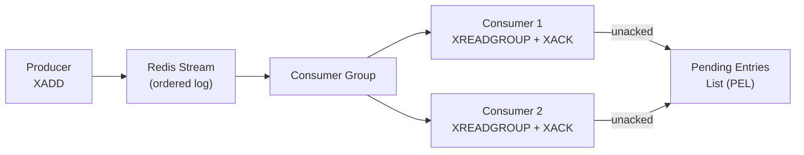

# Redis Streams

[← Back to README](../README.md)

---

**Redis Streams** are an append-only log data structure — similar to Kafka topics but built into Redis. Each entry has an auto-generated ID (`timestamp-sequence`), a set of key-value fields, and is retained until explicitly deleted or trimmed. **Consumer groups** allow multiple consumers to share the load and track which messages have been processed, enabling exactly-once-like semantics with acknowledgement and a pending entries list for recovery.



---

## Core Redis Commands

```bash
# Append a message (auto-generate ID: timestamp-sequence)
XADD orders * event ORDER_CREATED orderId 123 customerId 456 total 99.99

# Append with max length trim (cap at 1000 entries, approximate)
XADD orders MAXLEN ~ 1000 * event ORDER_CREATED orderId 124

# Read last 10 messages
XRANGE orders - + COUNT 10

# Read messages newer than a given ID
XRANGE orders 1700000000000-0 +

# Read from the end (newest messages first)
XREVRANGE orders + - COUNT 5

# Stream length
XLEN orders

# Create a consumer group (start from beginning: 0, or from now: $)
XGROUP CREATE orders order-processors $ MKSTREAM

# Consumer group read — fetch up to 10 unacknowledged messages
XREADGROUP GROUP order-processors consumer-1 COUNT 10 BLOCK 2000 STREAMS orders >

# Acknowledge processed messages
XACK orders order-processors 1700000000000-0 1700000000001-0

# List pending (unacknowledged) entries
XPENDING orders order-processors - + 10

# Claim stale entries (idle > 30s) for recovery
XAUTOCLAIM orders order-processors consumer-1 30000 0-0 COUNT 10
```

---

## Spring Data Redis Streams

```java
@Configuration
public class RedisStreamConfig {

    @Bean
    public StreamMessageListenerContainer<String, ObjectRecord<String, OrderEvent>> streamContainer(
            RedisConnectionFactory factory,
            ObjectMapper objectMapper) {

        StreamMessageListenerContainer.StreamMessageListenerContainerOptions<String,
            ObjectRecord<String, OrderEvent>> options =

            StreamMessageListenerContainer.StreamMessageListenerContainerOptions
                .builder()
                .pollTimeout(Duration.ofMillis(500))
                .targetType(OrderEvent.class)
                .objectMapper(new Jackson2HashMapper(objectMapper, false))
                .build();

        return StreamMessageListenerContainer.create(factory, options);
    }

    @Bean(initMethod = "start", destroyMethod = "stop")
    public StreamMessageListenerContainer<String, ObjectRecord<String, OrderEvent>> startContainer(
            StreamMessageListenerContainer<String, ObjectRecord<String, OrderEvent>> container,
            OrderEventConsumer consumer,
            RedisTemplate<String, String> redis) {

        // Create consumer group if it doesn't exist
        try {
            redis.opsForStream().createGroup("orders", ReadOffset.from("0"), "order-processors");
        } catch (RedisSystemException e) {
            // Group already exists — ignore
        }

        // Register the listener
        container.receive(
            Consumer.from("order-processors", "consumer-1"),
            StreamOffset.create("orders", ReadOffset.lastConsumed()),
            consumer);

        return container;
    }
}
```

---

## Producer — Appending to a Stream

```java
@Service
@RequiredArgsConstructor
public class OrderEventProducer {

    private final RedisTemplate<String, String> redisTemplate;
    private final ObjectMapper objectMapper;

    public RecordId publish(OrderEvent event) throws JsonProcessingException {
        // Publish as a hash map (field → value pairs)
        Map<String, String> fields = objectMapper.convertValue(event,
            new TypeReference<Map<String, String>>() {});

        // XADD orders MAXLEN ~ 10000 * field1 val1 field2 val2 ...
        return redisTemplate.opsForStream().add(
            StreamRecords.newRecord()
                .in("orders")
                .ofMap(fields)
        );
    }

    // Publish as a typed ObjectRecord
    public RecordId publishTyped(OrderEvent event) {
        ObjectRecord<String, OrderEvent> record =
            StreamRecords.newRecord()
                .in("orders")
                .ofObject(event);

        return redisTemplate.opsForStream().add(record);
    }
}
```

---

## Consumer — StreamListener

```java
@Component
@RequiredArgsConstructor
@Slf4j
public class OrderEventConsumer implements StreamListener<String, ObjectRecord<String, OrderEvent>> {

    private final OrderProcessingService processingService;
    private final RedisTemplate<String, String> redisTemplate;

    @Override
    public void onMessage(ObjectRecord<String, OrderEvent> record) {
        String streamKey    = record.getStream();
        RecordId messageId  = record.getId();
        OrderEvent event    = record.getValue();

        try {
            log.info("Processing order event: {} ({})", event.orderId(), messageId);
            processingService.process(event);

            // Acknowledge successful processing
            redisTemplate.opsForStream()
                .acknowledge(streamKey, "order-processors", messageId);

        } catch (Exception e) {
            log.error("Failed to process event {}: {}", messageId, e.getMessage());
            // Don't acknowledge — message stays in PEL for retry / dead-letter
        }
    }
}
```

---

## Manual Reading with RedisTemplate

```java
@Service
@RequiredArgsConstructor
public class OrderEventReaderService {

    private final RedisTemplate<String, String> redis;

    // Read a range of messages (no consumer group — all consumers see everything)
    public List<MapRecord<String, String, String>> readRange(
            String lastId, int count) {

        return redis.opsForStream().range(
            "orders",
            Range.rightOpen(lastId, "+"),
            Limit.limit().count(count)
        );
    }

    // Consumer group read — exclusive ownership of messages
    public List<MapRecord<String, String, String>> readGroup(
            String consumerName, int count) {

        return redis.opsForStream().read(
            Consumer.from("order-processors", consumerName),
            StreamReadOptions.empty().count(count).block(Duration.ofSeconds(2)),
            StreamOffset.create("orders", ReadOffset.lastConsumed())
        );
    }

    // Acknowledge
    public void ack(String... messageIds) {
        redis.opsForStream().acknowledge("orders", "order-processors", messageIds);
    }

    // Claim stale messages from dead consumers (idle > 30s)
    public void claimStaleMessages(String consumerName) {
        redis.opsForStream().claim(
            "orders",
            "order-processors",
            consumerName,
            Duration.ofSeconds(30),
            RecordId.of("0-0")
        );
    }
}
```

---

## Dead-Letter Pattern

```java
@Component
@RequiredArgsConstructor
public class PendingEntryReaper {

    private final RedisTemplate<String, String> redis;

    @Scheduled(fixedDelay = 60_000)
    public void reapDeadMessages() {
        // Find messages pending > 5 minutes
        PendingMessages pending = redis.opsForStream().pending(
            "orders",
            Consumer.from("order-processors", "consumer-dead"),
            Range.unbounded(),
            10L
        );

        for (PendingMessage msg : pending) {
            if (msg.getElapsedTimeSinceLastDelivery().toMinutes() > 5) {
                // Move to dead-letter stream
                MapRecord<String, String, String> original =
                    redis.opsForStream().range("orders",
                        Range.rightOpen(msg.getIdAsString(), msg.getIdAsString()),
                        Limit.limit().count(1)).stream().findFirst().orElse(null);

                if (original != null) {
                    redis.opsForStream().add(
                        StreamRecords.newRecord().in("orders.DLQ").ofMap(original.getValue()));
                    redis.opsForStream().acknowledge(
                        "orders", "order-processors", msg.getId());
                }
            }
        }
    }
}
```

---

## Stream Trimming

```java
// Trim to last 10,000 entries (exact)
redis.opsForStream().trim("orders", 10_000);

// Trim approximate (faster, allows slight overshoot)
redis.opsForStream().trim("orders", 10_000, true);

// Trim by minimum ID (keep messages newer than 24h ago)
String minId = (System.currentTimeMillis() - Duration.ofDays(1).toMillis()) + "-0";
// Use XTRIM MINID ~ <minId> via raw command if not supported directly
```

---

## Redis Streams Summary

| Concept | Detail |
|---------|--------|
| `XADD` | Append to stream; auto-generates `timestamp-sequence` ID |
| `XRANGE` | Read messages between two IDs; `-` = start, `+` = end |
| `XLEN` | Number of entries in the stream |
| `XGROUP CREATE` | Create a consumer group; `$` = only new messages, `0` = from beginning |
| `XREADGROUP` | Exclusive read — each message delivered to exactly one consumer in the group |
| `>` (last consumed offset) | Read only messages not yet delivered to this consumer group |
| `XACK` | Acknowledge a message — removes it from the Pending Entries List |
| Pending Entries List (PEL) | Unacknowledged messages per consumer; queried with `XPENDING` |
| `XAUTOCLAIM` | Claim idle PEL entries from a dead consumer — for crash recovery |
| `MAXLEN ~` | Approximate trim during XADD — keeps stream under a size limit |
| Dead-letter | Move unprocessable messages to a separate `*.DLQ` stream after N retries |
| `StreamMessageListenerContainer` | Spring Data Redis container that polls and dispatches stream messages |

---

[← Back to README](../README.md)
