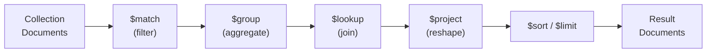

# Spring Data MongoDB Aggregation

[← Back to README](../README.md)

---

MongoDB's **Aggregation Pipeline** processes documents through a sequence of stages — filtering, reshaping, grouping, joining, sorting — and is the primary tool for analytics, reporting, and complex queries that go beyond simple CRUD. Spring Data MongoDB wraps the pipeline in a type-safe `Aggregation` builder and supports both `MongoTemplate.aggregate()` and `@Aggregation` annotations on repository methods.



---

## Basic Aggregation with MongoTemplate

```java
@Service
@RequiredArgsConstructor
public class OrderAggregationService {

    private final MongoTemplate mongoTemplate;

    // Count orders per status
    public List<StatusCount> countByStatus() {
        Aggregation agg = Aggregation.newAggregation(
            Aggregation.group("status").count().as("count"),
            Aggregation.project("count").and("status").previousOperation(),
            Aggregation.sort(Sort.Direction.DESC, "count")
        );

        return mongoTemplate.aggregate(agg, "orders", StatusCount.class)
            .getMappedResults();
    }

    // Total revenue and order count per customer
    public List<CustomerRevenue> revenuePerCustomer() {
        Aggregation agg = Aggregation.newAggregation(
            Aggregation.match(Criteria.where("status").is("COMPLETED")),
            Aggregation.group("customerId")
                .count().as("orderCount")
                .sum("total").as("totalRevenue")
                .avg("total").as("avgOrderValue"),
            Aggregation.sort(Sort.Direction.DESC, "totalRevenue"),
            Aggregation.limit(20)
        );

        return mongoTemplate.aggregate(agg, "orders", CustomerRevenue.class)
            .getMappedResults();
    }
}
```

---

## TypedAggregation (Type-Safe)

```java
@Document("orders")
public class Order {
    @Id private String id;
    private String customerId;
    private String status;
    private BigDecimal total;
    private Instant createdAt;
    private List<OrderLine> lines;
}

@Service
@RequiredArgsConstructor
public class TypedAggregationService {

    private final MongoTemplate mongoTemplate;

    public List<DailySales> dailySales(LocalDate from, LocalDate to) {
        TypedAggregation<Order> agg = Aggregation.newAggregation(Order.class,

            // Filter by date range
            Aggregation.match(Criteria.where("createdAt")
                .gte(from.atStartOfDay(ZoneOffset.UTC).toInstant())
                .lt(to.plusDays(1).atStartOfDay(ZoneOffset.UTC).toInstant())),

            // Group by day
            Aggregation.group(
                Aggregation.dateOf("createdAt").truncatedTo("day").as("day"))
                .count().as("orders")
                .sum("total").as("revenue"),

            // Reshape output
            Aggregation.project("orders", "revenue")
                .and("day").previousOperation(),

            Aggregation.sort(Sort.Direction.ASC, "day")
        );

        return mongoTemplate.aggregate(agg, DailySales.class).getMappedResults();
    }
}
```

---

## $lookup — Joining Collections

```java
public List<OrderWithCustomer> ordersWithCustomers() {
    Aggregation agg = Aggregation.newAggregation(
        // $lookup: join orders → customers on customerId
        Aggregation.lookup()
            .from("customers")
            .localField("customerId")
            .foreignField("_id")
            .as("customerDetails"),

        // Unwind the joined array (one-to-one relationship)
        Aggregation.unwind("customerDetails", true),  // true = preserve null

        // Project final shape
        Aggregation.project("status", "total", "createdAt")
            .and("customerDetails.email").as("customerEmail")
            .and("customerDetails.fullName").as("customerName")
    );

    return mongoTemplate.aggregate(agg, "orders", OrderWithCustomer.class)
        .getMappedResults();
}

// Pipeline $lookup (more powerful — join on expression, not just equality)
public List<Document> ordersWithActiveItems() {
    Aggregation agg = Aggregation.newAggregation(
        Aggregation.lookup("products", "lines.productId", "_id", "productDetails"),
        Aggregation.match(Criteria.where("productDetails.active").is(true))
    );
    return mongoTemplate.aggregate(agg, "orders", Document.class).getMappedResults();
}
```

---

## $unwind — Expanding Arrays

```java
// Flatten order lines to analyse individual products sold
public List<ProductSales> productSalesReport() {
    Aggregation agg = Aggregation.newAggregation(
        Aggregation.match(Criteria.where("status").is("COMPLETED")),

        // Expand the lines array — one document per line
        Aggregation.unwind("lines"),

        // Group by product
        Aggregation.group("lines.productId")
            .count().as("unitsSold")
            .sum("lines.quantity").as("totalQuantity")
            .sum(
                Aggregation.ArithmeticOperators.Multiply.valueOf("lines.quantity")
                    .multiplyBy("lines.unitPrice"))
            .as("revenue"),

        Aggregation.sort(Sort.Direction.DESC, "revenue"),
        Aggregation.limit(10)
    );

    return mongoTemplate.aggregate(agg, "orders", ProductSales.class)
        .getMappedResults();
}
```

---

## $bucket and $bucketAuto — Histograms

```java
// Order count by price range (fixed buckets)
public List<Document> ordersByPriceRange() {
    Aggregation agg = Aggregation.newAggregation(
        Aggregation.bucket("total")
            .withBoundaries(0, 50, 100, 200, 500, 1000)
            .withDefaultBucket("1000+")
            .andOutput("total").count().as("count")
            .andOutput("total").sum().as("revenue")
    );
    return mongoTemplate.aggregate(agg, "orders", Document.class).getMappedResults();
}

// Auto-determine N buckets (equal-size distribution)
public List<Document> ordersByPriceAutoRange() {
    Aggregation agg = Aggregation.newAggregation(
        Aggregation.bucketAuto("total", 5)  // 5 automatic buckets
    );
    return mongoTemplate.aggregate(agg, "orders", Document.class).getMappedResults();
}
```

---

## $facet — Multi-Dimensional Analytics in One Query

```java
// Run multiple aggregation pipelines in a single pass
public FacetedSearchResult facetedSearch(String category, String query) {
    Aggregation agg = Aggregation.newAggregation(
        // First stage: filter
        Aggregation.match(Criteria.where("category").is(category)
            .and("active").is(true)),

        // Facet: run multiple sub-pipelines simultaneously
        Aggregation.facet(
            // Category counts
            Aggregation.group("category").count().as("count")
        ).as("categoryCounts")
        .and(
            // Price histogram
            Aggregation.bucket("price")
                .withBoundaries(0, 25, 50, 100, 250)
                .withDefaultBucket("250+")
        ).as("priceRanges")
        .and(
            // Top 20 results for the page
            Aggregation.sort(Sort.Direction.DESC, "createdAt"),
            Aggregation.skip(0L),
            Aggregation.limit(20L)
        ).as("results")
    );

    return mongoTemplate.aggregate(agg, "products", FacetedSearchResult.class)
        .getUniqueMappedResult();
}
```

---

## @Aggregation on Repository Methods

```java
public interface OrderRepository extends MongoRepository<Order, String> {

    // Inline aggregation pipeline as JSON strings
    @Aggregation(pipeline = {
        "{ '$match': { 'customerId': ?0, 'status': 'COMPLETED' } }",
        "{ '$group': { '_id': null, 'total': { '$sum': '$total' }, 'count': { '$sum': 1 } } }",
        "{ '$project': { '_id': 0, 'total': 1, 'count': 1 } }"
    })
    CustomerSummary getCustomerSummary(String customerId);

    // With Pageable support
    @Aggregation(pipeline = {
        "{ '$match': { 'status': ?0 } }",
        "{ '$sort': { 'createdAt': -1 } }"
    })
    Page<Order> findByStatusPaged(String status, Pageable pageable);

    // With SpEL expressions
    @Aggregation(pipeline = {
        "{ '$match': { 'createdAt': { '$gte': ?#{[0]}, '$lt': ?#{[1]} } } }",
        "{ '$group': { '_id': '$status', 'count': { '$sum': 1 } } }"
    })
    List<StatusCount> countByStatusInDateRange(Instant from, Instant to);
}
```

---

## Explain Plan

```java
// Get the query execution plan for an aggregation pipeline
public Document explainAggregation() {
    Document command = new Document("aggregate", "orders")
        .append("pipeline", List.of(
            new Document("$match", new Document("status", "COMPLETED")),
            new Document("$group", new Document("_id", "$customerId")
                .append("total", new Document("$sum", "$total")))
        ))
        .append("explain", true)
        .append("cursor", new Document());

    return mongoTemplate.getDb().runCommand(command);
}
```

---

## Spring Data MongoDB Aggregation Summary

| Concept | Detail |
|---------|--------|
| `Aggregation.newAggregation()` | Builds a pipeline; pass stage builders as varargs |
| `TypedAggregation` | Type-safe variant — field names resolved from `@Document` class |
| `$match` | Filters documents early — put it first to leverage indexes |
| `$group` | Accumulates — `count()`, `sum()`, `avg()`, `min()`, `max()`, `push()` |
| `$lookup` | Left-outer join to another collection |
| `$unwind` | Deconstructs an array field — one document per array element |
| `$project` | Reshapes output — include/exclude fields, compute expressions |
| `$bucket` / `$bucketAuto` | Group numeric values into ranges (histogram) |
| `$facet` | Run multiple sub-pipelines in one pass — for search facets |
| `@Aggregation` | Inline JSON pipeline on a repository method — avoid for complex pipelines |
| `mongoTemplate.aggregate(agg, collectionName, ResultClass.class)` | Execute and map to a result type |
| Explain plan | Run `aggregate` command with `explain: true` to see index usage |

---

[← Back to README](../README.md)
