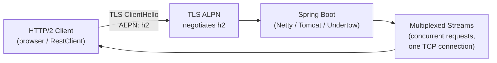

# HTTP/2 with Spring Boot

[← Back to README](../README.md)

---

**HTTP/2** multiplexes multiple requests over a single TCP connection, eliminates head-of-line blocking at the HTTP layer, and supports header compression (HPACK) and server push. Spring Boot supports HTTP/2 over TLS (`h2`) and, with Netty or Undertow, over plain TCP (`h2c`). Enabling HTTP/2 requires virtually no application code changes — the protocol is negotiated transparently via ALPN during the TLS handshake.



---

## Enabling HTTP/2

```yaml
# application.yaml — requires TLS for h2 (ALPN-based negotiation)
server:
  port: 8443
  http2:
    enabled: true
  ssl:
    enabled: true
    key-store: classpath:keystore.p12
    key-store-password: "${KEYSTORE_PASSWORD}"
    key-store-type: PKCS12
    key-alias: myapp
    protocol: TLS
    enabled-protocols: TLSv1.3,TLSv1.2
```

```bash
# Generate a self-signed certificate for development
keytool -genkeypair -alias myapp \
  -keyalg RSA -keysize 2048 \
  -storetype PKCS12 -keystore src/main/resources/keystore.p12 \
  -validity 3650 -storepass changeit \
  -dname "CN=localhost,OU=Dev,O=Company,L=City,S=State,C=ZA"
```

---

## H2C — HTTP/2 Cleartext (No TLS)

```yaml
# H2C requires Netty (WebFlux) or Undertow — Tomcat does NOT support h2c
# For WebFlux with Netty:
spring:
  webflux:
    base-path: /
server:
  http2:
    enabled: true
  ssl:
    enabled: false   # cleartext — no TLS
```

```java
// Netty WebFlux server — h2c via upgrade or prior knowledge
@Bean
public NettyReactiveWebServerFactory nettyFactory() {
    NettyReactiveWebServerFactory factory = new NettyReactiveWebServerFactory();
    factory.addServerCustomizers(httpServer ->
        httpServer.protocol(HttpProtocol.H2C, HttpProtocol.HTTP11));
    return factory;
}
```

---

## Tomcat HTTP/2 Configuration

```java
// Tomcat requires Conscrypt or JSSE for ALPN on older JDKs
// Java 17+ has built-in ALPN support — no extra configuration needed
@Bean
public ConfigurableServletWebServerFactory tomcatFactory() {
    TomcatServletWebServerFactory factory = new TomcatServletWebServerFactory();
    factory.addConnectorCustomizers(connector -> {
        connector.setScheme("https");
        connector.setSecure(true);
        // HTTP/2 upgrade connector
        connector.addUpgradeProtocol(new Http2Protocol());
    });
    return factory;
}
```

---

## HTTP/2 Client — RestClient

```java
@Configuration
public class Http2ClientConfig {

    @Bean
    public RestClient http2RestClient() {
        // Java 11+ HttpClient with HTTP/2
        HttpClient httpClient = HttpClient.newBuilder()
            .version(HttpClient.Version.HTTP_2)
            .connectTimeout(Duration.ofSeconds(5))
            .followRedirects(HttpClient.Redirect.NORMAL)
            .sslContext(trustAllSslContext())  // dev only — trust self-signed certs
            .build();

        ClientHttpRequestFactory requestFactory =
            new JdkClientHttpRequestFactory(httpClient);

        return RestClient.builder()
            .requestFactory(requestFactory)
            .baseUrl("https://api.company.com")
            .build();
    }

    // Production: use proper trust store
    @Bean
    public RestClient productionHttp2Client() throws Exception {
        SSLContext sslContext = SSLContext.getInstance("TLS");
        // ... load trust store ...

        HttpClient httpClient = HttpClient.newBuilder()
            .version(HttpClient.Version.HTTP_2)
            .sslContext(sslContext)
            .build();

        return RestClient.builder()
            .requestFactory(new JdkClientHttpRequestFactory(httpClient))
            .build();
    }
}
```

---

## HTTP/2 Client — WebClient (Reactor Netty)

```java
@Bean
public WebClient http2WebClient() {
    HttpClient nettyHttpClient = HttpClient.create()
        .protocol(HttpProtocol.H2, HttpProtocol.HTTP11)  // prefer H2, fallback to H1
        .secure(sslSpec -> sslSpec
            .sslContext(SslContextBuilder.forClient()
                .trustManager(InsecureTrustManagerFactory.INSTANCE)  // dev only
                .applicationProtocolConfig(new ApplicationProtocolConfig(
                    ApplicationProtocolConfig.Protocol.ALPN,
                    ApplicationProtocolConfig.SelectorFailureBehavior.NO_ADVERTISE,
                    ApplicationProtocolConfig.SelectedListenerFailureBehavior.ACCEPT,
                    ApplicationProtocolNames.HTTP_2,
                    ApplicationProtocolNames.HTTP_1_1))
                .build()))
        .wiretap(true);  // log frames (dev only)

    return WebClient.builder()
        .clientConnector(new ReactorClientHttpConnector(nettyHttpClient))
        .baseUrl("https://api.company.com")
        .build();
}
```

---

## Verifying HTTP/2 is Active

```bash
# curl with verbose output — look for "Using HTTP2"
curl -v --http2 https://localhost:8443/api/products -k

# Output includes:
# * ALPN, server accepted to use h2
# * Using HTTP2, server supports multi-use
# < HTTP/2 200

# Check with nghttp2
nghttp -v https://localhost:8443/api/products

# Check Spring Actuator HTTP exchanges (shows protocol version)
curl https://localhost:8443/actuator/httpexchanges | jq '.exchanges[].request.uri'
```

---

## HTTP/2 Performance Benefits

```java
// HTTP/2 multiplexing: concurrent requests over ONE connection
// vs HTTP/1.1: max 6 parallel connections per browser

// Benchmark: parallel requests
@Test
void http2Multiplexing() throws Exception {
    HttpClient client = HttpClient.newBuilder()
        .version(HttpClient.Version.HTTP_2)
        .build();

    // Fire 50 requests simultaneously
    List<CompletableFuture<HttpResponse<String>>> futures = IntStream.range(0, 50)
        .mapToObj(i -> client.sendAsync(
            HttpRequest.newBuilder()
                .uri(URI.create("https://localhost:8443/api/products/" + i))
                .GET()
                .build(),
            HttpResponse.BodyHandlers.ofString()))
        .toList();

    // All share ONE TCP connection under HTTP/2
    List<HttpResponse<String>> responses = futures.stream()
        .map(CompletableFuture::join)
        .toList();

    assertThat(responses).allMatch(r -> r.statusCode() == 200);
}
```

---

## Header Compression (HPACK)

```java
// HTTP/2 compresses headers — large Cookie / Authorization headers benefit most
// No code change needed — transparent to the application

// Before (HTTP/1.1): each request sends full headers (~800 bytes)
// After (HTTP/2 HPACK): first request sends full headers, subsequent requests
//   send only changed headers (deltas) — typically 10-50 bytes

// Monitor compression ratio via Netty's metrics:
@Bean
public NettyReactiveWebServerFactory nettyFactory() {
    return new NettyReactiveWebServerFactory();
    // Access HTTP/2 connection metrics via Micrometer Netty integration
}
```

---

## Kubernetes Ingress — HTTP/2 Passthrough

```yaml
# nginx-ingress — enable HTTP/2 at the ingress level
apiVersion: networking.k8s.io/v1
kind: Ingress
metadata:
  name: myapp-ingress
  annotations:
    nginx.ingress.kubernetes.io/backend-protocol: "HTTPS"   # TLS to backend
    nginx.ingress.kubernetes.io/ssl-passthrough: "true"     # pass TLS to app
    nginx.ingress.kubernetes.io/http2-push-preload: "true"
spec:
  tls:
    - hosts: [api.company.com]
      secretName: tls-cert
  rules:
    - host: api.company.com
      http:
        paths:
          - path: /
            pathType: Prefix
            backend:
              service:
                name: myapp
                port:
                  number: 8443
```

---

## HTTP/2 with Spring Boot Summary

| Concept | Detail |
|---------|--------|
| `server.http2.enabled=true` | Enables HTTP/2; requires TLS for ALPN negotiation on Tomcat |
| ALPN | Application-Layer Protocol Negotiation — signals HTTP/2 during TLS handshake |
| `h2` | HTTP/2 over TLS — requires a valid certificate; default for browsers |
| `h2c` | HTTP/2 over cleartext TCP — Netty and Undertow only, not Tomcat |
| Multiplexing | Multiple HTTP/2 streams share one TCP connection — no head-of-line blocking |
| HPACK | Header compression — delta encoding reduces repeated headers to bytes |
| `HttpClient.Version.HTTP_2` | Java 11+ HttpClient prefers HTTP/2 with automatic fallback to HTTP/1.1 |
| Reactor Netty `HttpProtocol.H2` | WebClient HTTP/2 with ALPN via Netty's SslContext |
| `Http2Protocol` | Tomcat connector upgrade protocol for HTTP/2 (requires Java 17+ for ALPN) |
| Server push | Not widely supported in Spring Boot; use `Link: rel=preload` headers instead |
| `curl --http2 -v` | Verify HTTP/2 negotiation — look for `Using HTTP2` in verbose output |

---

[← Back to README](../README.md)
