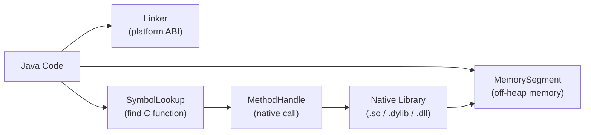

# Java Foreign Function & Memory API (Project Panama)

[← Back to README](../README.md)

---

**Project Panama** replaces JNI with a safer, more ergonomic API for calling native C/C++ libraries and managing off-heap memory. The **Foreign Function & Memory (FFM) API** became stable in Java 22 (after preview in 19-21). It consists of two parts: `MemorySegment` / `Arena` for structured off-heap memory, and `Linker` / `MethodHandle` for calling native functions. The companion `jextract` tool auto-generates Java bindings from C headers.



---

## Memory Segments and Arenas

```java
// Arena manages the lifetime of off-heap MemorySegments
// All segments allocated from an Arena are freed when the Arena is closed

// Confined Arena — single thread, closed manually
try (Arena arena = Arena.ofConfined()) {

    // Allocate a struct-like block: 16 bytes
    MemorySegment point = arena.allocate(16);

    // Write fields (x at offset 0, y at offset 8)
    point.set(ValueLayout.JAVA_DOUBLE, 0, 3.14);
    point.set(ValueLayout.JAVA_DOUBLE, 8, 2.71);

    // Read fields back
    double x = point.get(ValueLayout.JAVA_DOUBLE, 0);
    double y = point.get(ValueLayout.JAVA_DOUBLE, 8);
    System.out.println("x=" + x + " y=" + y);

}   // off-heap memory freed here

// Shared Arena — multi-thread safe
try (Arena arena = Arena.ofShared()) {
    MemorySegment buffer = arena.allocate(1024 * 1024);  // 1 MB
    // Multiple threads can read/write concurrently
}

// Global Arena — never freed (for long-lived segments)
MemorySegment globalBuffer = Arena.global().allocate(4096);
```

---

## MemoryLayout — Struct Definitions

```java
// Define a C struct layout in Java
// struct Point { double x; double y; }
StructLayout pointLayout = MemoryLayout.structLayout(
    ValueLayout.JAVA_DOUBLE.withName("x"),
    ValueLayout.JAVA_DOUBLE.withName("y")
);

// VarHandles for type-safe field access
VarHandle xHandle = pointLayout.varHandle(MemoryLayout.PathElement.groupElement("x"));
VarHandle yHandle = pointLayout.varHandle(MemoryLayout.PathElement.groupElement("y"));

try (Arena arena = Arena.ofConfined()) {
    MemorySegment point = arena.allocate(pointLayout);

    xHandle.set(point, 0L, 3.14);   // 0L = base offset
    yHandle.set(point, 0L, 2.71);

    double x = (double) xHandle.get(point, 0L);
    double y = (double) yHandle.get(point, 0L);
}

// Array of structs
SequenceLayout pointArray = MemoryLayout.sequenceLayout(10, pointLayout);
long stride = pointLayout.byteSize();

try (Arena arena = Arena.ofConfined()) {
    MemorySegment array = arena.allocate(pointArray);
    for (int i = 0; i < 10; i++) {
        xHandle.set(array, i * stride, (double) i);
        yHandle.set(array, i * stride, (double) i * 2);
    }
}
```

---

## Calling C Standard Library Functions

```java
public class NativeStringUtils {

    private static final Linker LINKER = Linker.nativeLinker();
    private static final SymbolLookup STDLIB = LINKER.defaultLookup();

    // strlen(const char* s)
    private static final MethodHandle STRLEN = LINKER.downcallHandle(
        STDLIB.find("strlen").orElseThrow(),
        FunctionDescriptor.of(ValueLayout.JAVA_LONG, ValueLayout.ADDRESS)
    );

    // strdup(const char* s) — allocates a copy of the string
    private static final MethodHandle STRDUP = LINKER.downcallHandle(
        STDLIB.find("strdup").orElseThrow(),
        FunctionDescriptor.of(ValueLayout.ADDRESS, ValueLayout.ADDRESS)
    );

    public static long strlen(String s) {
        try (Arena arena = Arena.ofConfined()) {
            MemorySegment cString = arena.allocateFrom(s);  // null-terminated UTF-8
            return (long) STRLEN.invokeExact(cString);
        } catch (Throwable e) {
            throw new RuntimeException(e);
        }
    }

    // Copy a Java String into native memory and get a pointer
    public static MemorySegment toCString(String s, Arena arena) {
        return arena.allocateFrom(s);   // copies string + null terminator
    }

    // Read a null-terminated C string from native memory
    public static String fromCString(MemorySegment ptr) {
        return ptr.reinterpret(Long.MAX_VALUE).getString(0);
    }
}
```

---

## Calling a Custom Native Library

```c
// mylib.c — compile: gcc -shared -fPIC -o libmylib.so mylib.c
#include <stdint.h>

int64_t add(int64_t a, int64_t b) {
    return a + b;
}

typedef struct {
    double real;
    double imag;
} Complex;

Complex multiply_complex(Complex a, Complex b) {
    return (Complex){
        a.real * b.real - a.imag * b.imag,
        a.real * b.imag + a.imag * b.real
    };
}
```

```java
public class MyLib {

    private static final StructLayout COMPLEX_LAYOUT = MemoryLayout.structLayout(
        ValueLayout.JAVA_DOUBLE.withName("real"),
        ValueLayout.JAVA_DOUBLE.withName("imag")
    );

    private static final VarHandle REAL = COMPLEX_LAYOUT
        .varHandle(MemoryLayout.PathElement.groupElement("real"));
    private static final VarHandle IMAG = COMPLEX_LAYOUT
        .varHandle(MemoryLayout.PathElement.groupElement("imag"));

    private static final Linker LINKER = Linker.nativeLinker();
    private static final SymbolLookup LIB =
        SymbolLookup.libraryLookup("libmylib.so", Arena.global());

    private static final MethodHandle ADD = LINKER.downcallHandle(
        LIB.find("add").orElseThrow(),
        FunctionDescriptor.of(ValueLayout.JAVA_LONG,
            ValueLayout.JAVA_LONG, ValueLayout.JAVA_LONG)
    );

    private static final MethodHandle MULTIPLY_COMPLEX = LINKER.downcallHandle(
        LIB.find("multiply_complex").orElseThrow(),
        FunctionDescriptor.of(COMPLEX_LAYOUT, COMPLEX_LAYOUT, COMPLEX_LAYOUT)
    );

    public static long add(long a, long b) {
        try {
            return (long) ADD.invokeExact(a, b);
        } catch (Throwable e) { throw new RuntimeException(e); }
    }

    public static double[] multiplyComplex(double r1, double i1, double r2, double i2) {
        try (Arena arena = Arena.ofConfined()) {
            MemorySegment a = arena.allocate(COMPLEX_LAYOUT);
            MemorySegment b = arena.allocate(COMPLEX_LAYOUT);
            REAL.set(a, 0L, r1); IMAG.set(a, 0L, i1);
            REAL.set(b, 0L, r2); IMAG.set(b, 0L, i2);

            MemorySegment result = (MemorySegment) MULTIPLY_COMPLEX.invokeExact(
                (SegmentAllocator) arena, a, b);

            return new double[]{
                (double) REAL.get(result, 0L),
                (double) IMAG.get(result, 0L)
            };
        } catch (Throwable e) { throw new RuntimeException(e); }
    }
}
```

---

## Upcalls — Passing a Java Function to C

```java
// C function: void forEach(int* array, int len, void (*callback)(int))
// Java callback passed as a function pointer

public static void callWithCallback(int[] data) {
    Linker linker = Linker.nativeLinker();

    // Define the callback signature: void callback(int)
    FunctionDescriptor callbackDesc = FunctionDescriptor.ofVoid(ValueLayout.JAVA_INT);

    // Create a native function pointer backed by a Java MethodHandle
    MethodHandle javaCallback = MethodHandles.lookup()
        .findStatic(MyLib.class, "onItem",
            MethodType.methodType(void.class, int.class));

    try (Arena arena = Arena.ofConfined()) {
        MemorySegment callbackPtr = linker.upcallStub(javaCallback, callbackDesc, arena);

        // Pass the native pointer to C
        MemorySegment array = arena.allocateFrom(ValueLayout.JAVA_INT, data);
        // forEachHandle.invokeExact(array, data.length, callbackPtr);
    } catch (Throwable e) { throw new RuntimeException(e); }
}

public static void onItem(int value) {
    System.out.println("Got: " + value);
}
```

---

## jextract — Auto-Generate Bindings

```bash
# Extract Java bindings from a C header file
jextract \
  --output src/main/java \
  --target-package com.example.native \
  --library mylib \
  /usr/include/mylib.h

# For system headers (e.g., libc)
jextract \
  --output src/main/java \
  --target-package com.example.libc \
  --library c \
  /usr/include/string.h
```

---

## FFM API Summary

| Concept | Detail |
|---------|--------|
| `Arena` | Manages off-heap memory lifetime — `confined` (single thread), `shared` (multi-thread), `global` |
| `MemorySegment` | Off-heap memory region — typed, bounds-checked; prevents buffer overflows |
| `arena.allocate(layout)` | Allocate off-heap memory conforming to a layout |
| `arena.allocateFrom(string)` | Copy a Java String to a null-terminated C string in off-heap memory |
| `MemoryLayout` | Describes the structure of native memory: `structLayout`, `sequenceLayout`, padding |
| `VarHandle` | Type-safe field accessor for `MemorySegment` fields at specific offsets |
| `Linker` | Platform-specific ABI — creates `MethodHandle`s for native functions |
| `SymbolLookup` | Finds native function addresses in shared libraries |
| `FunctionDescriptor` | Describes a C function's return type and parameter types |
| `downcallHandle` | `Linker` → `MethodHandle` for calling a C function from Java |
| `upcallStub` | `MethodHandle` → native function pointer for passing Java callbacks to C |
| `jextract` | Tool that reads C headers and generates Java FFM binding classes |

---

[← Back to README](../README.md)
