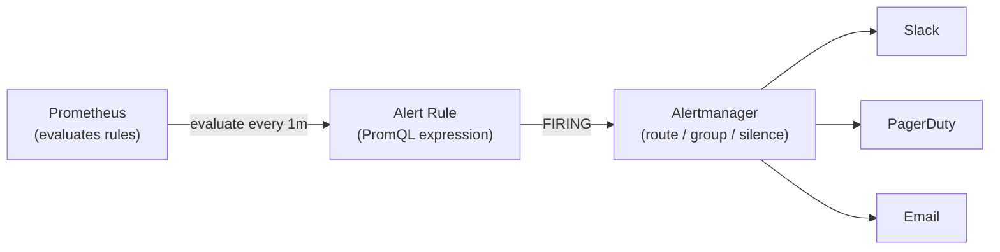

# Prometheus Alerting

[← Back to README](../README.md)

---

Prometheus alerting has two parts: **alert rules** (PromQL expressions evaluated by the Prometheus server) and **Alertmanager** (which receives firing alerts, deduplicates, groups, routes, and silences them). Alert rules live alongside recording rules in `.yaml` files loaded by Prometheus. Alertmanager routes alerts to PagerDuty, Slack, email, or any webhook based on label matchers and routing trees.



---

## Alert Rules

```yaml
# prometheus/rules/spring-boot-alerts.yaml
groups:
  - name: spring-boot
    interval: 1m      # evaluation interval (overrides global default)
    rules:

      # --- Availability ---
      - alert: ServiceDown
        expr: up{job="spring-apps"} == 0
        for: 2m         # must be true for 2 minutes before firing
        labels:
          severity: critical
          team: platform
        annotations:
          summary: "Service {{ $labels.instance }} is down"
          description: >
            {{ $labels.job }} on {{ $labels.instance }} has been unreachable
            for more than 2 minutes.
          runbook: "https://wiki.company.com/runbooks/service-down"

      # --- Latency ---
      - alert: HighP99Latency
        expr: |
          histogram_quantile(0.99,
            sum by (le, job, instance) (
              rate(http_server_requests_seconds_bucket[5m])
            )
          ) > 2.0
        for: 5m
        labels:
          severity: warning
        annotations:
          summary: "P99 latency {{ $value | humanizeDuration }} on {{ $labels.instance }}"
          description: "99th percentile response time is above 2s for 5 minutes."

      # --- Error Rate ---
      - alert: HighErrorRate
        expr: |
          (
            sum by (job, instance) (
              rate(http_server_requests_seconds_count{outcome="SERVER_ERROR"}[5m])
            )
            /
            sum by (job, instance) (
              rate(http_server_requests_seconds_count[5m])
            )
          ) > 0.05
        for: 3m
        labels:
          severity: critical
        annotations:
          summary: "Error rate {{ $value | humanizePercentage }} on {{ $labels.instance }}"

      # --- JVM Memory ---
      - alert: JvmHeapMemoryHigh
        expr: |
          jvm_memory_used_bytes{area="heap"}
          /
          jvm_memory_max_bytes{area="heap"} > 0.90
        for: 5m
        labels:
          severity: warning
        annotations:
          summary: "JVM heap usage {{ $value | humanizePercentage }} on {{ $labels.instance }}"

      # --- Thread Pool Saturation ---
      - alert: ThreadPoolSaturation
        expr: |
          executor_active_threads / executor_pool_max_threads > 0.80
        for: 2m
        labels:
          severity: warning
        annotations:
          summary: "Thread pool {{ $labels.name }} is {{ $value | humanizePercentage }} full"

      # --- Database ---
      - alert: ConnectionPoolExhausted
        expr: hikaricp_connections_pending > 0
        for: 1m
        labels:
          severity: critical
        annotations:
          summary: "HikariCP pending connections on {{ $labels.instance }}"

      # --- Kafka Consumer Lag ---
      - alert: KafkaConsumerLagHigh
        expr: kafka_consumer_fetch_manager_records_lag_max > 10000
        for: 5m
        labels:
          severity: warning
        annotations:
          summary: "Consumer lag {{ $value }} messages on {{ $labels.topic }}"
```

---

## Recording Rules — Pre-Compute Expensive Queries

```yaml
# prometheus/rules/recording-rules.yaml
groups:
  - name: spring-boot-recordings
    interval: 1m
    rules:

      # Pre-compute error rate per job (expensive query — evaluate once, reuse many)
      - record: job:http_error_rate:rate5m
        expr: |
          sum by (job) (
            rate(http_server_requests_seconds_count{outcome="SERVER_ERROR"}[5m])
          )
          /
          sum by (job) (
            rate(http_server_requests_seconds_count[5m])
          )

      # P99 latency per job — reuse in dashboards and alerts
      - record: job:http_p99_latency_seconds:rate5m
        expr: |
          histogram_quantile(0.99,
            sum by (le, job) (
              rate(http_server_requests_seconds_bucket[5m])
            )
          )

      # Request throughput per job
      - record: job:http_requests:rate5m
        expr: |
          sum by (job) (
            rate(http_server_requests_seconds_count[5m])
          )
```

---

## Alertmanager Configuration

```yaml
# alertmanager.yaml
global:
  resolve_timeout: 5m
  slack_api_url: "${SLACK_WEBHOOK_URL}"
  pagerduty_url: https://events.pagerduty.com/v2/enqueue

# Templates for notification messages
templates:
  - /etc/alertmanager/templates/*.tmpl

route:
  receiver: slack-default        # default receiver
  group_by: [alertname, job]     # group similar alerts together
  group_wait: 30s                # wait to batch alerts before sending first notification
  group_interval: 5m             # minimum time between notifications for same group
  repeat_interval: 4h            # re-notify if still firing after this duration

  routes:
    # Critical alerts → PagerDuty (24/7 on-call)
    - match:
        severity: critical
      receiver: pagerduty
      continue: true             # also send to Slack (continue routing)

    # Platform team alerts
    - match:
        team: platform
      receiver: slack-platform
      group_by: [alertname, instance]

    # Business hours only (8am-6pm weekdays)
    - match:
        severity: warning
      receiver: slack-default
      active_time_intervals:
        - business-hours

time_intervals:
  - name: business-hours
    time_intervals:
      - weekdays: [monday:friday]
        times:
          - start_time: 08:00
            end_time: 18:00

receivers:
  - name: slack-default
    slack_configs:
      - channel: "#alerts"
        title: "{{ .Status | toUpper }}: {{ .CommonLabels.alertname }}"
        text: |
          {{ range .Alerts }}
          *Alert:* {{ .Annotations.summary }}
          *Severity:* {{ .Labels.severity }}
          *Instance:* {{ .Labels.instance }}
          *Description:* {{ .Annotations.description }}
          {{ if .Annotations.runbook }}*Runbook:* {{ .Annotations.runbook }}{{ end }}
          {{ end }}
        send_resolved: true

  - name: slack-platform
    slack_configs:
      - channel: "#platform-alerts"
        send_resolved: true

  - name: pagerduty
    pagerduty_configs:
      - service_key: "${PAGERDUTY_SERVICE_KEY}"
        description: "{{ .CommonAnnotations.summary }}"
        severity: "{{ .CommonLabels.severity }}"
        details:
          runbook: "{{ .CommonAnnotations.runbook }}"
          firing: "{{ .Alerts.Firing | len }}"

inhibit_rules:
  # If ServiceDown fires, suppress all other alerts for that instance
  - source_match:
      alertname: ServiceDown
    target_match_re:
      alertname: .+
    equal: [instance]
```

---

## Prometheus Configuration — Load Rules

```yaml
# prometheus.yaml
global:
  scrape_interval: 15s
  evaluation_interval: 1m

alerting:
  alertmanagers:
    - static_configs:
        - targets: ["alertmanager:9093"]

rule_files:
  - /etc/prometheus/rules/*.yaml
```

---

## Notification Templates

```
{{/* /etc/alertmanager/templates/slack.tmpl */}}
{{ define "slack.title" }}
[{{ .Status | toUpper }}{{ if eq .Status "firing" }}:{{ .Alerts.Firing | len }}{{ end }}]
{{ .CommonLabels.alertname }} — {{ .CommonLabels.job }}
{{ end }}

{{ define "slack.text" }}
{{ range .Alerts.Firing }}
• *{{ .Annotations.summary }}*
  Labels: {{ range .Labels.SortedPairs }}{{ .Name }}={{ .Value }} {{ end }}
  Started: {{ .StartsAt | since }}
{{ end }}
{{ if .Alerts.Resolved }}
*Resolved:*
{{ range .Alerts.Resolved }}• {{ .Annotations.summary }} ({{ .EndsAt | since }} ago){{ end }}
{{ end }}
{{ end }}
```

---

## SLO-Based Alert — Burn Rate

```yaml
# SLO: 99.9% availability (error budget: 0.1% = 43.8 min/month)
# Burn rate alerts fire before the budget is exhausted

- alert: ErrorBudgetBurnRateFast
  expr: |
    (
      job:http_error_rate:rate5m{job="orders-service"} > (14.4 * 0.001)
    )
    and
    (
      job:http_error_rate:rate1h{job="orders-service"} > (14.4 * 0.001)
    )
  for: 2m
  labels:
    severity: critical
    slo: availability
  annotations:
    summary: "Fast burn rate: error budget depleted in < 1 hour"
    description: >
      Burn rate {{ $value | humanizePercentage }} is 14.4× the SLO threshold.
      At this rate, the monthly error budget will be exhausted in 1 hour.
```

---

## Prometheus Alerting Summary

| Concept | Detail |
|---------|--------|
| `alert` rule | PromQL expression evaluated on interval; fires when `for` duration elapses |
| `for` duration | Pending state — expression must be true for this long before alert fires |
| `labels` | Key-value metadata on the alert — used by Alertmanager for routing |
| `annotations` | Human-readable context — `summary`, `description`, `runbook` URL |
| `record` rule | Pre-compute expensive PromQL as a new metric — reuse in alerts and dashboards |
| `group_by` | Alertmanager groups alerts with matching labels into one notification |
| `group_wait` | Wait this long for more alerts before sending the first notification in a group |
| `repeat_interval` | Re-send notification if alert is still firing after this duration |
| `inhibit_rules` | Suppress lower-severity alerts when a higher-severity alert fires for the same instance |
| `active_time_intervals` | Route alerts only during specified time windows (business hours) |
| `send_resolved: true` | Send a notification when an alert stops firing |
| Burn rate alert | Alert on the rate of SLO budget consumption, not just the threshold value |

---

[← Back to README](../README.md)
