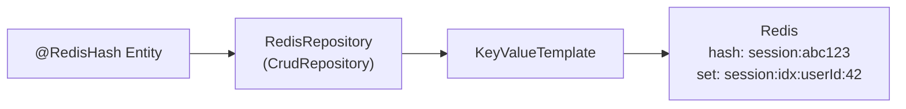

# Spring Data Redis Repositories

[← Back to README](../README.md)

---

Spring Data Redis Repositories map Java objects to Redis hashes using `@RedisHash`, with secondary indexes via `@Indexed` and time-to-live via `@TimeToLive`. They implement the standard `CrudRepository` interface, so you get `save`, `findById`, `findAll`, and derived query methods backed by Redis — no SQL, no relational schema.



---

## Dependency & Configuration

```xml
<dependency>
    <groupId>org.springframework.boot</groupId>
    <artifactId>spring-boot-starter-data-redis</artifactId>
</dependency>
```

```java
@Configuration
@EnableRedisRepositories
public class RedisConfig {

    @Bean
    public RedisConnectionFactory redisConnectionFactory() {
        RedisStandaloneConfiguration config = new RedisStandaloneConfiguration();
        config.setHostName("localhost");
        config.setPort(6379);
        return new LettuceConnectionFactory(config);
    }
}
```

```yaml
spring:
  data:
    redis:
      host: localhost
      port: 6379
      password: "${REDIS_PASSWORD:}"
```

---

## Entity Mapping

```java
@RedisHash("sessions")          // stored as hash at key sessions:{id}
@Data
@NoArgsConstructor
@AllArgsConstructor
public class UserSession {

    @Id
    private String id;           // sessions:{id} — auto-generated UUID if null

    @Indexed                     // creates a secondary index set: sessions:userId:{value}
    private Long userId;

    @Indexed
    private String deviceType;   // "mobile", "desktop"

    private String ipAddress;
    private Instant createdAt;
    private Instant lastAccessedAt;
    private Map<String, String> attributes = new HashMap<>();

    @TimeToLive                  // per-instance TTL in seconds
    private Long ttlSeconds;

    @TimeToLive(unit = TimeUnit.MINUTES)
    private Long ttlMinutes;
}
```

---

## Repository

```java
public interface UserSessionRepository
        extends CrudRepository<UserSession, String>,
                QueryByExampleExecutor<UserSession> {

    // Secondary index query — finds by @Indexed field
    List<UserSession> findByUserId(Long userId);

    // Compound index query (requires both fields to be @Indexed)
    List<UserSession> findByUserIdAndDeviceType(Long userId, String deviceType);

    // Count by index
    long countByUserId(Long userId);

    // Delete by index
    void deleteByUserId(Long userId);
}
```

---

## Service Layer

```java
@Service
@RequiredArgsConstructor
public class SessionService {

    private final UserSessionRepository sessionRepository;
    private final StringRedisTemplate redis;

    public UserSession createSession(Long userId, String deviceType, String ip) {
        UserSession session = new UserSession();
        session.setUserId(userId);
        session.setDeviceType(deviceType);
        session.setIpAddress(ip);
        session.setCreatedAt(Instant.now());
        session.setLastAccessedAt(Instant.now());
        session.setTtlSeconds(3600L);   // expire in 1 hour
        return sessionRepository.save(session);
    }

    public Optional<UserSession> touch(String sessionId) {
        return sessionRepository.findById(sessionId).map(session -> {
            session.setLastAccessedAt(Instant.now());
            session.setTtlSeconds(3600L);   // reset TTL on access
            return sessionRepository.save(session);
        });
    }

    public List<UserSession> getActiveSessions(Long userId) {
        return sessionRepository.findByUserId(userId);
    }

    public void invalidateAll(Long userId) {
        sessionRepository.deleteByUserId(userId);
    }
}
```

---

## KeyValueTemplate — Programmatic Access

```java
@Service
@RequiredArgsConstructor
public class RedisKeyValueService {

    private final KeyValueTemplate kvTemplate;

    // Save with explicit key space
    public void save(UserSession session) {
        kvTemplate.insert(session);
    }

    // Find by example (QBE)
    public List<UserSession> findMobileSessions(Long userId) {
        UserSession probe = new UserSession();
        probe.setUserId(userId);
        probe.setDeviceType("mobile");

        ExampleMatcher matcher = ExampleMatcher.matching()
            .withIgnoreNullValues()
            .withIgnorePaths("id", "createdAt", "lastAccessedAt");

        return (List<UserSession>) kvTemplate.find(
            Example.of(probe, matcher), UserSession.class);
    }

    // Partial update via RedisTemplate
    public void updateLastAccessed(String sessionId) {
        kvTemplate.update(sessionId, PartialUpdate.newPartialUpdate(UserSession.class)
            .set("lastAccessedAt", Instant.now())
            .refreshTtl(true));
    }
}
```

---

## RedisTemplate — Direct Hash Operations

```java
@Service
@RequiredArgsConstructor
public class DirectRedisService {

    private final RedisTemplate<String, Object> redisTemplate;

    // Read a single field without loading the whole hash
    public Object getField(String sessionId, String field) {
        return redisTemplate.opsForHash().get("sessions:" + sessionId, field);
    }

    // Atomic increment of a counter stored in a hash field
    public Long incrementCounter(String sessionId, String counterName) {
        return redisTemplate.opsForHash()
            .increment("sessions:" + sessionId, counterName, 1);
    }

    // Expire manually
    public void expire(String sessionId, Duration duration) {
        redisTemplate.expire("sessions:" + sessionId, duration);
    }

    // Scan all session keys (avoid KEYS * in production)
    public List<String> scanSessionKeys(Long userId) {
        ScanOptions options = ScanOptions.scanOptions()
            .match("sessions:userId:" + userId)
            .count(100)
            .build();

        List<String> keys = new ArrayList<>();
        try (Cursor<byte[]> cursor = redisTemplate.executeWithStickyConnection(
                conn -> conn.scan(options))) {
            cursor.forEachRemaining(k -> keys.add(new String(k)));
        }
        return keys;
    }
}
```

---

## Custom TTL Per Entity Class

```yaml
# Global TTL for all @RedisHash("sessions") — overridden by @TimeToLive field
spring:
  data:
    redis:
      repositories:
        keyspaces:
          sessions:
            time-to-live: 3600    # seconds; per-instance @TimeToLive takes precedence
```

```java
// Listen for keyspace expiration events (requires notify-keyspace-events KEA in redis.conf)
@Component
public class SessionExpirationListener implements MessageListener {

    @Override
    public void onMessage(Message message, byte[] pattern) {
        String expiredKey = new String(message.getBody());
        // expiredKey = "sessions:{id}" — session has expired
        log.info("Session expired: {}", expiredKey);
        // trigger cleanup of related data
    }
}

@Bean
public RedisMessageListenerContainer keyspaceNotifications(
        RedisConnectionFactory factory,
        SessionExpirationListener listener) {
    RedisMessageListenerContainer container = new RedisMessageListenerContainer();
    container.setConnectionFactory(factory);
    container.addMessageListener(listener,
        new PatternTopic("__keyevent@0__:expired"));
    return container;
}
```

---

## Spring Data Redis Repositories Summary

| Concept | Detail |
|---------|--------|
| `@RedisHash("keyspace")` | Maps class to Redis hashes under `keyspace:{id}` |
| `@Id` | The hash key suffix; auto-generates UUID if null on save |
| `@Indexed` | Creates a secondary index set at `keyspace:fieldName:{value}` |
| `@TimeToLive` | Per-entity TTL in seconds (or configurable unit); refreshed on save |
| `CrudRepository` | `save`, `findById`, `findAll`, `delete` — standard Spring Data interface |
| Derived queries | `findByUserId`, `countByDeviceType` — resolved via secondary index sets |
| `KeyValueTemplate` | Lower-level API — partial updates, QBE, explicit keyspace operations |
| `PartialUpdate` | Update individual fields + refresh TTL without loading the whole hash |
| Global TTL | Set default via `spring.data.redis.repositories.keyspaces.{name}.time-to-live` |
| Keyspace notifications | Redis `KEA` event config + `RedisMessageListenerContainer` for expiry hooks |
| Index maintenance | Indexes are maintained automatically on save/delete; beware of stale entries |

---

[← Back to README](../README.md)
