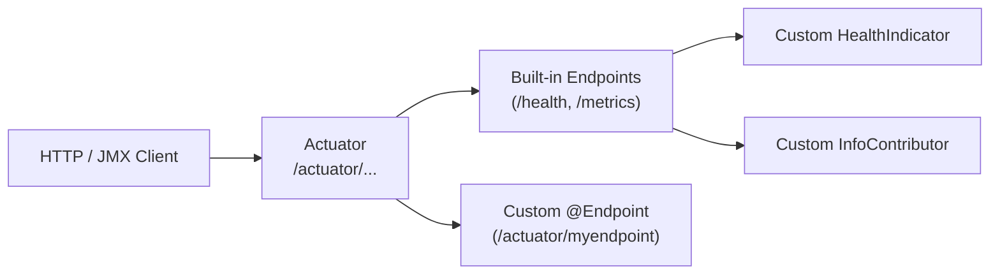

# Spring Boot Actuator Custom Endpoints

[← Back to README](../README.md)

---

Spring Boot Actuator ships with built-in endpoints (`/health`, `/metrics`, `/env`, `/loggers`). You can extend it with **custom endpoints** annotated with `@Endpoint` — operations are annotated `@ReadOperation` (GET), `@WriteOperation` (POST), and `@DeleteOperation` (DELETE). You can also add custom `HealthIndicator` beans and `InfoContributor` beans to enrich the existing `/health` and `/info` endpoints without creating a new one.



---

## Custom @Endpoint

```java
@Component
@Endpoint(id = "features")     // exposed at /actuator/features
public class FeaturesEndpoint {

    private final FeatureFlagService featureFlags;

    public FeaturesEndpoint(FeatureFlagService featureFlags) {
        this.featureFlags = featureFlags;
    }

    // HTTP GET /actuator/features
    @ReadOperation
    public Map<String, Object> features() {
        return Map.of(
            "enabled",  featureFlags.getEnabledFlags(),
            "disabled", featureFlags.getDisabledFlags(),
            "total",    featureFlags.count()
        );
    }

    // HTTP GET /actuator/features/{flagName}
    @ReadOperation
    public Map<String, Object> feature(@Selector String flagName) {
        return Map.of(
            "name",    flagName,
            "enabled", featureFlags.isEnabled(flagName),
            "rollout", featureFlags.getRolloutPercentage(flagName)
        );
    }

    // HTTP POST /actuator/features/{flagName}  body: {"enabled": true}
    @WriteOperation
    public void toggleFeature(@Selector String flagName,
                               @Nullable Boolean enabled,
                               @Nullable Integer rolloutPercentage) {
        if (enabled != null)           featureFlags.setEnabled(flagName, enabled);
        if (rolloutPercentage != null) featureFlags.setRollout(flagName, rolloutPercentage);
    }

    // HTTP DELETE /actuator/features/{flagName}
    @DeleteOperation
    public void deleteFeature(@Selector String flagName) {
        featureFlags.delete(flagName);
    }
}
```

---

## Web-Only vs JMX-Only Endpoints

```java
// @WebEndpoint — exposed over HTTP only (not JMX)
@Component
@WebEndpoint(id = "cache-stats")
public class CacheStatsEndpoint {

    private final CacheManager cacheManager;

    public CacheStatsEndpoint(CacheManager cacheManager) {
        this.cacheManager = cacheManager;
    }

    @ReadOperation
    @Produces(MediaType.APPLICATION_JSON_VALUE)
    public WebEndpointResponse<Map<String, Object>> stats() {
        Map<String, Object> stats = new LinkedHashMap<>();
        cacheManager.getCacheNames().forEach(name -> {
            Cache cache = cacheManager.getCache(name);
            if (cache instanceof CaffeineCache caffeineCache) {
                com.github.benmanes.caffeine.cache.stats.CacheStats s =
                    caffeineCache.getNativeCache().stats();
                stats.put(name, Map.of(
                    "hitRate",   s.hitRate(),
                    "missRate",  s.missRate(),
                    "evictions", s.evictionCount(),
                    "size",      caffeineCache.getNativeCache().estimatedSize()
                ));
            }
        });
        return new WebEndpointResponse<>(stats, 200);
    }

    // POST /actuator/cache-stats/{cacheName}/evict
    @WriteOperation
    public void evict(@Selector String cacheName) {
        Cache cache = cacheManager.getCache(cacheName);
        if (cache != null) cache.clear();
    }
}
```

---

## Custom HealthIndicator

```java
// Appears under /actuator/health as a named component
@Component("paymentGateway")   // name used in the health response
public class PaymentGatewayHealthIndicator implements HealthIndicator {

    private final PaymentGatewayClient client;

    public PaymentGatewayHealthIndicator(PaymentGatewayClient client) {
        this.client = client;
    }

    @Override
    public Health health() {
        try {
            GatewayStatus status = client.ping();
            if (status.isOperational()) {
                return Health.up()
                    .withDetail("provider",   status.provider())
                    .withDetail("latencyMs",  status.latencyMs())
                    .withDetail("apiVersion", status.apiVersion())
                    .build();
            }
            return Health.degraded()
                .withDetail("provider", status.provider())
                .withDetail("reason",   status.statusMessage())
                .build();
        } catch (Exception e) {
            return Health.down()
                .withDetail("error", e.getMessage())
                .build();
        }
    }
}

// Reactive variant for WebFlux apps
@Component("database")
public class ReactiveDbHealthIndicator implements ReactiveHealthIndicator {

    private final R2dbcEntityTemplate template;

    public ReactiveDbHealthIndicator(R2dbcEntityTemplate template) {
        this.template = template;
    }

    @Override
    public Mono<Health> health() {
        return template.getDatabaseClient()
            .sql("SELECT 1")
            .fetch().one()
            .map(row -> Health.up().withDetail("db", "PostgreSQL").build())
            .onErrorReturn(Health.down().build());
    }
}
```

---

## Health Groups

```yaml
# application.yaml — separate liveness from readiness checks
management:
  endpoint:
    health:
      show-details: when-authorized
      show-components: always
      probes:
        enabled: true
      group:
        liveness:
          include: livenessState, diskSpace
          show-details: always
        readiness:
          include: readinessState, db, redis, paymentGateway
          show-details: always
        external:
          include: paymentGateway, emailService
          status:
            http-mapping:
              degraded: 200   # return 200 even for degraded (caller decides)
```

---

## Custom InfoContributor

```java
@Component
public class BuildInfoContributor implements InfoContributor {

    @Override
    public void contribute(Info.Builder builder) {
        builder.withDetail("build", Map.of(
            "version",   getClass().getPackage().getImplementationVersion(),
            "timestamp", BuildProperties.getBuildTime(),
            "git-commit", GitProperties.getCommitId(),
            "java",      System.getProperty("java.version")
        ));
    }
}

@Component
public class EnvironmentInfoContributor implements InfoContributor {

    private final Environment env;

    public EnvironmentInfoContributor(Environment env) {
        this.env = env;
    }

    @Override
    public void contribute(Info.Builder builder) {
        builder.withDetail("environment", Map.of(
            "activeProfiles", Arrays.asList(env.getActiveProfiles()),
            "region",         env.getProperty("aws.region", "local"),
            "zone",           env.getProperty("aws.zone", "local")
        ));
    }
}
```

---

## Securing Custom Endpoints

```yaml
# application.yaml — expose selectively
management:
  endpoints:
    web:
      exposure:
        include: health, info, metrics, features, cache-stats
      base-path: /actuator
  endpoint:
    features:
      enabled: true
```

```java
@Bean
public SecurityFilterChain actuatorSecurity(HttpSecurity http) throws Exception {
    http
        .securityMatcher(EndpointRequest.toAnyEndpoint())
        .authorizeHttpRequests(auth -> auth
            // Read-only endpoints: any authenticated user
            .requestMatchers(EndpointRequest.to(
                HealthEndpoint.class, InfoEndpoint.class, MetricsEndpoint.class))
            .hasAnyRole("USER", "ADMIN")
            // Write endpoints: admin only
            .requestMatchers(EndpointRequest.to("features", "cache-stats"))
            .hasRole("ADMIN")
            .anyRequest().denyAll());
    return http.build();
}
```

---

## Testing Custom Endpoints

```java
@WebMvcTest(FeaturesEndpoint.class)
@Import(WebMvcEndpointManagementContextConfiguration.class)
class FeaturesEndpointTest {

    @Autowired
    private MockMvc mockMvc;

    @MockBean
    private FeatureFlagService featureFlags;

    @Test
    void readReturnsAllFeatures() throws Exception {
        given(featureFlags.getEnabledFlags()).willReturn(List.of("new-ui", "dark-mode"));

        mockMvc.perform(get("/actuator/features"))
            .andExpect(status().isOk())
            .andExpect(jsonPath("$.enabled[0]").value("new-ui"));
    }

    @Test
    void writeTogglesFeature() throws Exception {
        mockMvc.perform(post("/actuator/features/new-ui")
                .contentType(MediaType.APPLICATION_JSON)
                .content("{\"enabled\": false}"))
            .andExpect(status().isNoContent());

        verify(featureFlags).setEnabled("new-ui", false);
    }
}
```

---

## Actuator Custom Endpoints Summary

| Concept | Detail |
|---------|--------|
| `@Endpoint(id)` | Exposes over both HTTP and JMX at `/actuator/{id}` |
| `@WebEndpoint(id)` | HTTP only — use when response is HTTP-specific (status codes, media types) |
| `@JmxEndpoint(id)` | JMX only — for ops tooling that uses MBeans |
| `@ReadOperation` | HTTP GET — returns the endpoint data |
| `@WriteOperation` | HTTP POST — modifies state; body parameters bound from JSON |
| `@DeleteOperation` | HTTP DELETE — removes a resource |
| `@Selector` | Path variable in the endpoint URL — `@Selector String name` |
| `@Nullable` | Marks a write parameter as optional — omitting it is not an error |
| `HealthIndicator` | Named component under `/health`; return `Health.up/down/degraded()` |
| `ReactiveHealthIndicator` | WebFlux variant — returns `Mono<Health>` |
| `InfoContributor` | Adds key-value data to `/actuator/info` — build info, git commit, env |
| Health groups | Separate subsets of indicators under `/health/{group}` — K8s liveness/readiness |

---

[← Back to README](../README.md)
