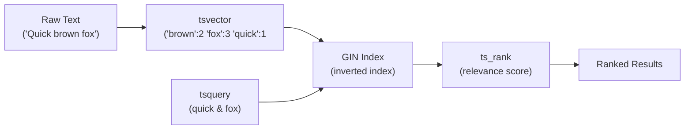

# PostgreSQL Full-Text Search

[← Back to README](../README.md)

---

PostgreSQL has a built-in full-text search engine based on `tsvector` (indexed document representation) and `tsquery` (search expression). It supports stemming, stop-words, ranking, phrase search, prefix matching, and highlight generation — often sufficient to replace Elasticsearch for moderate-scale search requirements. Spring Data JPA integrates through native queries and custom `@Query` annotations.



---

## Core SQL Concepts

```sql
-- tsvector: normalised token list with positions
SELECT to_tsvector('english', 'The quick brown fox jumps over the lazy dog');
-- 'brown':3 'dog':9 'fox':4 'jump':5 'lazi':8 'quick':2

-- tsquery: search expression
SELECT to_tsquery('english', 'quick & fox');    -- AND
SELECT to_tsquery('english', 'quick | fox');    -- OR
SELECT to_tsquery('english', '!lazy');          -- NOT
SELECT plainto_tsquery('english', 'quick fox'); -- plain text → AND query
SELECT phraseto_tsquery('english', 'quick fox'); -- phrase (adjacent)
SELECT websearch_to_tsquery('english', 'quick fox -lazy'); -- Google-style

-- Match operator: @@
SELECT 'quick brown fox' @@ to_tsquery('english', 'quick & fox'); -- true

-- Ranking
SELECT ts_rank(to_tsvector('english', content), query) AS rank, content
FROM documents, to_tsquery('english', 'spring & boot') query
WHERE to_tsvector('english', content) @@ query
ORDER BY rank DESC;

-- Highlight (headline)
SELECT ts_headline('english', content,
    to_tsquery('english', 'spring & boot'),
    'StartSel=<mark>, StopSel=</mark>, MaxWords=35, MinWords=15') AS snippet
FROM documents;
```

---

## Schema with tsvector Column

```sql
-- Store a pre-computed tsvector for performance
CREATE TABLE products (
    id          BIGSERIAL PRIMARY KEY,
    name        VARCHAR(255) NOT NULL,
    description TEXT,
    category    VARCHAR(100),
    tags        TEXT[],
    search_vector TSVECTOR,     -- pre-computed, kept in sync by trigger
    created_at  TIMESTAMPTZ DEFAULT NOW()
);

-- GIN index on the stored tsvector (fast full-text search)
CREATE INDEX idx_products_fts ON products USING GIN(search_vector);

-- Trigger to auto-update search_vector on insert/update
CREATE OR REPLACE FUNCTION update_product_search_vector()
RETURNS TRIGGER AS $$
BEGIN
    NEW.search_vector :=
        setweight(to_tsvector('english', COALESCE(NEW.name, '')),        'A') ||
        setweight(to_tsvector('english', COALESCE(NEW.category, '')),    'B') ||
        setweight(to_tsvector('english', COALESCE(NEW.description, '')), 'C') ||
        setweight(to_tsvector('english', COALESCE(array_to_string(NEW.tags, ' '), '')), 'B');
    RETURN NEW;
END;
$$ LANGUAGE plpgsql;

CREATE TRIGGER trg_products_fts
    BEFORE INSERT OR UPDATE ON products
    FOR EACH ROW EXECUTE FUNCTION update_product_search_vector();
```

---

## JPA Entity

```java
@Entity
@Table(name = "products")
public class Product {

    @Id
    @GeneratedValue(strategy = GenerationType.IDENTITY)
    private Long id;

    @Column(nullable = false)
    private String name;

    private String description;
    private String category;

    @Column(columnDefinition = "text[]")
    private String[] tags;

    // search_vector is managed by the DB trigger — mark as insertable=false, updatable=false
    @Column(name = "search_vector", insertable = false, updatable = false,
            columnDefinition = "tsvector")
    private String searchVector;

    private Instant createdAt;
}
```

---

## Repository — Native Queries

```java
public interface ProductRepository extends JpaRepository<Product, Long> {

    // Full-text search with ranking
    @Query(value = """
        SELECT p.*, ts_rank(p.search_vector, query) AS rank
        FROM products p,
             websearch_to_tsquery('english', :searchTerm) query
        WHERE p.search_vector @@ query
        ORDER BY rank DESC
        LIMIT :limit OFFSET :offset
        """, nativeQuery = true)
    List<Product> searchByText(
        @Param("searchTerm") String searchTerm,
        @Param("limit") int limit,
        @Param("offset") int offset);

    // Count for pagination
    @Query(value = """
        SELECT COUNT(*)
        FROM products p,
             websearch_to_tsquery('english', :searchTerm) query
        WHERE p.search_vector @@ query
        """, nativeQuery = true)
    long countByText(@Param("searchTerm") String searchTerm);

    // Search within a category
    @Query(value = """
        SELECT p.*, ts_rank(p.search_vector, query) AS rank
        FROM products p,
             websearch_to_tsquery('english', :searchTerm) query
        WHERE p.search_vector @@ query
          AND p.category = :category
        ORDER BY rank DESC
        """, nativeQuery = true)
    List<Product> searchByTextAndCategory(
        @Param("searchTerm") String searchTerm,
        @Param("category") String category);
}
```

---

## Service with Highlight and Pagination

```java
@Service
@RequiredArgsConstructor
public class ProductSearchService {

    private final EntityManager em;

    public SearchResult search(String term, int page, int size) {
        int offset = page * size;
        String safeQuery = term.replaceAll("[^\\w\\s-]", "");

        // Search with rank and headline in one query
        List<Object[]> rows = em.createNativeQuery("""
            SELECT
                p.id,
                p.name,
                p.category,
                ts_rank(p.search_vector, query)  AS rank,
                ts_headline('english', p.description, query,
                    'StartSel=<em>, StopSel=</em>, MaxWords=30, MinWords=10') AS snippet
            FROM products p,
                 websearch_to_tsquery('english', :term) query
            WHERE p.search_vector @@ query
            ORDER BY rank DESC
            LIMIT :limit OFFSET :offset
            """)
            .setParameter("term", safeQuery)
            .setParameter("limit", size)
            .setParameter("offset", offset)
            .getResultList();

        Long total = (Long) em.createNativeQuery("""
            SELECT COUNT(*) FROM products p,
                 websearch_to_tsquery('english', :term) query
            WHERE p.search_vector @@ query
            """)
            .setParameter("term", safeQuery)
            .getSingleResult();

        List<SearchHit> hits = rows.stream().map(row -> new SearchHit(
            ((Number) row[0]).longValue(),
            (String) row[1],
            (String) row[2],
            ((Number) row[3]).floatValue(),
            (String) row[4]
        )).toList();

        return new SearchResult(hits, total, page, size);
    }
}
```

---

## Prefix / Autocomplete Search

```sql
-- Prefix search using the :* operator (partial lexeme matching)
SELECT name FROM products
WHERE search_vector @@ to_tsquery('english', 'spri:*');
-- matches: spring, sprint, spread, etc.
```

```java
@Query(value = """
    SELECT p.* FROM products p
    WHERE p.search_vector @@ to_tsquery('english', :prefix || ':*')
    ORDER BY p.name
    LIMIT 10
    """, nativeQuery = true)
List<Product> autocomplete(@Param("prefix") String prefix);
```

---

## Multi-Language Support

```sql
-- Store language per document and use the correct dictionary
ALTER TABLE products ADD COLUMN language REGCONFIG DEFAULT 'english';

CREATE OR REPLACE FUNCTION update_product_search_vector()
RETURNS TRIGGER AS $$
BEGIN
    NEW.search_vector :=
        to_tsvector(NEW.language, COALESCE(NEW.name, '') || ' ' ||
                                   COALESCE(NEW.description, ''));
    RETURN NEW;
END;
$$ LANGUAGE plpgsql;
```

---

## Flyway Migration

```sql
-- V3__add_product_fts.sql
ALTER TABLE products ADD COLUMN IF NOT EXISTS search_vector TSVECTOR;

CREATE INDEX IF NOT EXISTS idx_products_fts ON products USING GIN(search_vector);

-- Backfill existing rows
UPDATE products SET search_vector =
    setweight(to_tsvector('english', COALESCE(name, '')), 'A') ||
    setweight(to_tsvector('english', COALESCE(description, '')), 'C');

CREATE OR REPLACE FUNCTION update_product_search_vector()
RETURNS TRIGGER AS $$
BEGIN
    NEW.search_vector :=
        setweight(to_tsvector('english', COALESCE(NEW.name, '')), 'A') ||
        setweight(to_tsvector('english', COALESCE(NEW.description, '')), 'C');
    RETURN NEW;
END;
$$ LANGUAGE plpgsql;

DROP TRIGGER IF EXISTS trg_products_fts ON products;
CREATE TRIGGER trg_products_fts
    BEFORE INSERT OR UPDATE ON products
    FOR EACH ROW EXECUTE FUNCTION update_product_search_vector();
```

---

## PostgreSQL Full-Text Search Summary

| Concept | Detail |
|---------|--------|
| `tsvector` | Normalised token list with positions — stored per row for performance |
| `tsquery` | Search expression — AND (`&`), OR (`\|`), NOT (`!`), phrase (`<->`) |
| `to_tsvector(lang, text)` | Convert text to tsvector using language-specific stemming and stop-words |
| `websearch_to_tsquery` | Parses Google-style queries (`quick fox -lazy "exact phrase"`) |
| `@@` operator | Match operator — returns true if `tsvector @@ tsquery` |
| `GIN` index | Generalised Inverted Index — fast full-text search; create on the `tsvector` column |
| `setweight(vector, weight)` | Assign A/B/C/D weight to tokens — controls `ts_rank` scoring |
| `ts_rank(vector, query)` | Relevance score — higher = better match |
| `ts_headline(lang, text, query)` | Generates highlighted snippet with matching terms wrapped in tags |
| `:*` suffix | Prefix matching — `to_tsquery('spring:*')` matches `spring`, `springframework`, etc. |
| Trigger-maintained column | Auto-update `search_vector` on INSERT/UPDATE for zero-application-code FTS |
| Language config | `'english'`, `'french'`, `'german'`, etc. — controls stemming and stop-words |

---

[← Back to README](../README.md)
