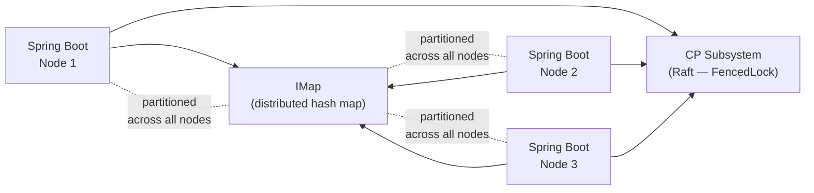

# Hazelcast

[← Back to README](../README.md)

---

**Hazelcast** is an in-memory distributed data platform. It provides distributed `IMap`, `IQueue`, `ITopic`, `ILock` (via CP subsystem), and more — all transparently partitioned across cluster members. Spring Boot integrates Hazelcast as a `CacheManager`, as a distributed session store, and as a general-purpose data grid. The **CP Subsystem** adds linearisable distributed locks, semaphores, and atomic variables backed by the Raft consensus algorithm.



---

## Dependency

```xml
<dependency>
    <groupId>com.hazelcast</groupId>
    <artifactId>hazelcast-spring</artifactId>
    <version>5.4.0</version>
</dependency>
```

---

## Configuration

```java
@Configuration
public class HazelcastConfig {

    @Bean
    public Config hazelcastConfig() {
        Config config = new Config();
        config.setClusterName("production-cluster");

        // Network discovery — Kubernetes
        config.getNetworkConfig()
            .getJoin()
            .getMulticastConfig().setEnabled(false);

        config.getNetworkConfig()
            .getJoin()
            .getKubernetesConfig()
            .setEnabled(true)
            .setProperty("namespace", "default")
            .setProperty("service-name", "hazelcast-service");

        // IMap configuration
        MapConfig productCacheConfig = new MapConfig("products")
            .setTimeToLiveSeconds(3600)
            .setMaxIdleSeconds(600)
            .setEvictionConfig(new EvictionConfig()
                .setEvictionPolicy(EvictionPolicy.LRU)
                .setMaxSizePolicy(MaxSizePolicy.PER_NODE)
                .setSize(10_000))
            .setNearCacheConfig(new NearCacheConfig()
                .setName("products")
                .setTimeToLiveSeconds(60)
                .setMaxIdleSeconds(30));

        config.addMapConfig(productCacheConfig);

        // CP Subsystem for distributed locks
        config.getCPSubsystemConfig()
            .setCPMemberCount(3);

        return config;
    }

    @Bean
    public HazelcastInstance hazelcastInstance(Config config) {
        return Hazelcast.newHazelcastInstance(config);
    }
}
```

---

## Spring Cache Integration

```java
@Configuration
@EnableCaching
public class HazelcastCacheConfig {

    @Bean
    public CacheManager cacheManager(HazelcastInstance hazelcastInstance) {
        return new HazelcastCacheManager(hazelcastInstance);
    }
}

@Service
@RequiredArgsConstructor
public class ProductService {

    private final ProductRepository repository;

    @Cacheable(value = "products", key = "#id")
    public Product findById(Long id) {
        return repository.findById(id).orElseThrow();
    }

    @CacheEvict(value = "products", key = "#product.id")
    public Product update(Product product) {
        return repository.save(product);
    }

    @CacheEvict(value = "products", allEntries = true)
    public void evictAll() { }
}
```

---

## IMap — Distributed Map

```java
@Service
@RequiredArgsConstructor
public class DistributedMapService {

    private final HazelcastInstance hz;

    private <K, V> IMap<K, V> map(String name) {
        return hz.getMap(name);
    }

    // Basic put/get
    public void put(String key, String value) {
        map("shared-data").put(key, value);
    }

    public String get(String key) {
        return (String) map("shared-data").get(key);
    }

    // Put with TTL
    public void putWithTtl(String key, String value, Duration ttl) {
        map("shared-data").put(key, value, ttl.toSeconds(), TimeUnit.SECONDS);
    }

    // Optimistic locking with putIfAbsent
    public boolean setIfAbsent(String key, String value) {
        return map("shared-data").putIfAbsent(key, value) == null;
    }

    // Atomic replace
    public boolean replace(String key, String expected, String newValue) {
        return map("shared-data").replace(key, expected, newValue);
    }

    // Distributed query with SQL-like predicates
    public Collection<String> findByPrefix(String prefix) {
        IMap<String, String> m = map("shared-data");
        return m.values(Predicates.like("__key", prefix + "%"));
    }

    // EntryProcessor — execute logic co-located with the data (no network transfer)
    public void incrementCounter(String key) {
        IMap<String, Integer> counters = hz.getMap("counters");
        counters.executeOnKey(key, entry -> {
            entry.setValue((entry.getValue() == null ? 0 : entry.getValue()) + 1);
            return null;
        });
    }
}
```

---

## CP Subsystem — Distributed Locks

```java
@Service
@RequiredArgsConstructor
public class DistributedLockService {

    private final HazelcastInstance hz;

    // FencedLock — linearisable, backed by Raft consensus
    public void executeWithLock(String lockName, Runnable task) {
        FencedLock lock = hz.getCPSubsystem().getLock(lockName);
        lock.lock();
        try {
            task.run();
        } finally {
            lock.unlock();
        }
    }

    // Try-lock with timeout
    public boolean tryExecuteWithLock(String lockName, Duration timeout, Runnable task) {
        FencedLock lock = hz.getCPSubsystem().getLock(lockName);
        try {
            if (lock.tryLock(timeout.toMillis(), TimeUnit.MILLISECONDS)) {
                try {
                    task.run();
                    return true;
                } finally {
                    lock.unlock();
                }
            }
            return false;
        } catch (InterruptedException e) {
            Thread.currentThread().interrupt();
            return false;
        }
    }

    // IAtomicLong — distributed atomic counter
    public long nextSequenceValue(String name) {
        return hz.getCPSubsystem()
            .getAtomicLong(name)
            .incrementAndGet();
    }

    // ISemaphore — rate limiting across cluster
    public void acquirePermit(String semaphoreName) throws InterruptedException {
        hz.getCPSubsystem()
            .getSemaphore(semaphoreName)
            .acquire();
    }
}
```

---

## Distributed Queue and Topic

```java
@Service
@RequiredArgsConstructor
public class HazelcastMessagingService {

    private final HazelcastInstance hz;

    // IQueue — distributed blocking queue
    public void enqueue(String queueName, Object item) {
        hz.<Object>getQueue(queueName).offer(item);
    }

    public Object dequeue(String queueName, Duration timeout)
            throws InterruptedException {
        return hz.getQueue(queueName).poll(timeout.toMillis(), TimeUnit.MILLISECONDS);
    }

    // ITopic — pub/sub across all cluster members
    public <T> void publish(String topic, T message) {
        hz.<T>getTopic(topic).publish(message);
    }

    public <T> String subscribe(String topic, MessageListener<T> listener) {
        return hz.<T>getTopic(topic).addMessageListener(listener);
    }

    // ReliableTopic — durable, with per-subscriber offset tracking
    public <T> void publishReliable(String topic, T message) {
        hz.<T>getReliableTopic(topic).publish(message);
    }
}
```

---

## Near Cache — Local Cache in Front of IMap

```java
// Near cache stores a local copy on each member — reads never go to network
// Use for read-heavy, rarely-changed data (product catalog, config)
MapConfig config = new MapConfig("products")
    .setNearCacheConfig(new NearCacheConfig()
        .setInMemoryFormat(InMemoryFormat.OBJECT)  // deserialized objects
        .setTimeToLiveSeconds(120)
        .setMaxIdleSeconds(60)
        .setEvictionConfig(new EvictionConfig()
            .setEvictionPolicy(EvictionPolicy.LFU)
            .setSize(5_000)));

// Invalidation: when a member updates a key, all near caches for that key are invalidated
```

---

## Spring Session with Hazelcast

```xml
<dependency>
    <groupId>org.springframework.session</groupId>
    <artifactId>spring-session-hazelcast</artifactId>
</dependency>
```

```java
@Configuration
@EnableHazelcastHttpSession(maxInactiveIntervalInSeconds = 1800)
public class HazelcastSessionConfig {

    @Bean
    public HazelcastIndexedSessionRepository sessionRepository(
            HazelcastInstance hazelcastInstance) {
        return new HazelcastIndexedSessionRepository(hazelcastInstance);
    }
}
```

---

## Hazelcast Summary

| Concept | Detail |
|---------|--------|
| `IMap` | Distributed hash map — partitioned across cluster members; supports predicates and EntryProcessor |
| `EntryProcessor` | Execute code co-located with data — avoids serialization round-trip for read-modify-write |
| Near cache | Local copy per member — eliminates network for hot reads; auto-invalidated on update |
| `HazelcastCacheManager` | Implements Spring `CacheManager` — `@Cacheable`/`@CacheEvict` backed by `IMap` |
| CP Subsystem | Raft-based — `FencedLock`, `ISemaphore`, `IAtomicLong`; requires `cpMemberCount >= 3` |
| `FencedLock` | Linearisable distributed lock — safer than `IMap.lock()` (which is not linearisable) |
| `IAtomicLong` | Distributed atomic counter in CP subsystem — global sequence numbers |
| `IQueue` | Distributed blocking queue — supports `poll(timeout)` |
| `ITopic` | Pub/sub — message delivered to all subscribers on all cluster members |
| `ReliableTopic` | Durable topic backed by Ringbuffer — each subscriber tracks its own offset |
| Spring Session | `@EnableHazelcastHttpSession` — stores HTTP sessions in `IMap` across cluster |
| Kubernetes discovery | `hazelcast-kubernetes` plugin discovers members via Service DNS |

---

[← Back to README](../README.md)
