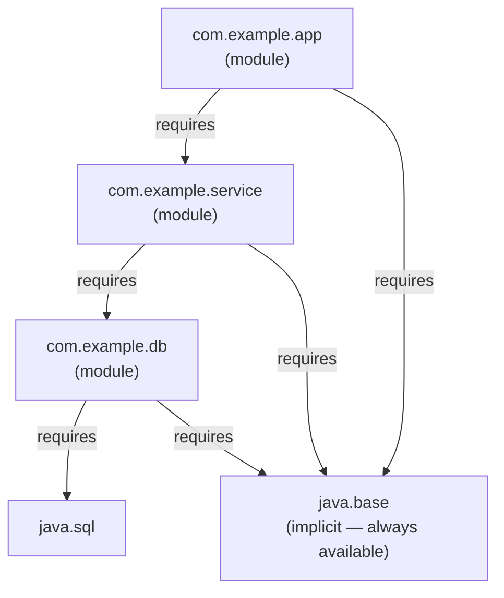

# Java Module System (JPMS)

[← Back to README](../README.md)

---

The **Java Platform Module System** (JPMS), introduced in Java 9, adds a higher-level unit of encapsulation above packages. A **module** declares what it requires and what it exports — giving you reliable, explicit dependencies and stronger encapsulation than packages alone.



---

## Key Concepts

| Concept | Meaning |
|---------|---------|
| **module** | A named, self-describing unit of code with explicit dependencies |
| **requires** | Declares a dependency on another module |
| **exports** | Makes a package accessible to other modules |
| **opens** | Makes a package accessible to reflection at runtime |
| **uses** | Declares that this module uses a service |
| **provides** | Declares that this module provides a service implementation |
| **module-info.java** | The module descriptor — lives in the module root |

---

## module-info.java

Every module has a `module-info.java` at the root of its source tree (not inside a package).

```
src/
└── com.example.service/
    ├── module-info.java
    └── com/
        └── example/
            └── service/
                ├── UserService.java
                └── internal/
                    └── UserRepository.java
```

```java
// module-info.java
module com.example.service {

    // packages this module depends on
    requires java.sql;
    requires org.slf4j;

    // transitive — any module that requires us also gets java.logging
    requires transitive java.logging;

    // static — only needed at compile time (e.g. annotation processors)
    requires static lombok;

    // packages this module exposes to other modules
    exports com.example.service;

    // NOT exported — internal package stays hidden
    // com.example.service.internal is inaccessible to other modules
}
```

---

## A Multi-Module Example

### Module: `com.example.model`

```java
module com.example.model {
    exports com.example.model;  // User, Order records etc.
}
```

### Module: `com.example.service`

```java
module com.example.service {
    requires com.example.model;
    requires java.sql;

    exports com.example.service;
}
```

### Module: `com.example.app`

```java
module com.example.app {
    requires com.example.service;
    requires com.example.model;
}
```

---

## exports and opens

### exports — compile-time and runtime access

```java
module com.example.lib {
    exports com.example.lib.api;           // available to all modules
    exports com.example.lib.util to com.example.app;  // only to specific modules
    // com.example.lib.internal is not exported — fully encapsulated
}
```

### opens — reflection access

Frameworks like Spring, Hibernate, and Jackson use reflection to access fields and constructors. They need `opens`.

```java
module com.example.app {
    requires spring.core;

    // allow Spring to reflect on this package at runtime
    opens com.example.app.model to spring.core, spring.beans;

    // open everything to all modules (avoid in libraries)
    opens com.example.app.config;
}
```

`exports` gives compile + runtime access but **not** deep reflection.
`opens` gives reflection access but **not** compile-time access.

---

## Services — uses and provides

The module system has built-in support for the **Service Loader** pattern — loose coupling via interfaces.

### Define the service interface (in `com.example.api`)

```java
// module-info.java
module com.example.api {
    exports com.example.api;
}

// the service interface
package com.example.api;
public interface GreetingService {
    String greet(String name);
}
```

### Provide an implementation (in `com.example.impl`)

```java
// module-info.java
module com.example.impl {
    requires com.example.api;
    provides com.example.api.GreetingService
        with com.example.impl.EnglishGreeting;
}

// implementation
package com.example.impl;
public class EnglishGreeting implements com.example.api.GreetingService {
    @Override
    public String greet(String name) { return "Hello, " + name + "!"; }
}
```

### Consume the service (in `com.example.app`)

```java
// module-info.java
module com.example.app {
    requires com.example.api;
    uses com.example.api.GreetingService;
}

// load implementations at runtime
ServiceLoader<GreetingService> loader = ServiceLoader.load(GreetingService.class);
for (GreetingService svc : loader) {
    System.out.println(svc.greet("Alice"));  // Hello, Alice!
}
```

---

## Unnamed and Automatic Modules

### Classpath (unnamed module)

Code on the classpath lives in the **unnamed module** — it can access all exported packages of named modules but has no name itself.

### Automatic modules

When you put a JAR without `module-info.java` on the **module path**, it becomes an **automatic module**. Its name is derived from the JAR filename. It exports all its packages and reads all other modules.

```bash
# put legacy-lib-1.0.jar on module path
java --module-path mods:legacy-lib-1.0.jar --module com.example.app/com.example.Main
```

In `module-info.java`:
```java
requires legacy.lib;  // derived from JAR name: legacy-lib-1.0.jar → legacy.lib
```

---

## Compiling and Running Modules

### Project layout

```
project/
├── mods/                        ← compiled module JARs go here
└── src/
    ├── com.example.model/
    │   ├── module-info.java
    │   └── com/example/model/User.java
    └── com.example.app/
        ├── module-info.java
        └── com/example/app/Main.java
```

### Compile

```bash
# compile com.example.model
javac -d mods/com.example.model \
      src/com.example.model/module-info.java \
      src/com.example.model/com/example/model/User.java

# compile com.example.app (depends on model)
javac --module-path mods \
      -d mods/com.example.app \
      src/com.example.app/module-info.java \
      src/com.example.app/com/example/app/Main.java
```

### Run

```bash
java --module-path mods \
     --module com.example.app/com.example.app.Main
```

### Package as modular JARs

```bash
jar --create --file mods/com.example.model.jar \
    --module-version 1.0 \
    -C mods/com.example.model .
```

---

## jlink — Custom Runtime Images

`jlink` bundles only the modules your application needs into a self-contained runtime — no full JDK required on the target machine.

```bash
jlink \
  --module-path $JAVA_HOME/jmods:mods \
  --add-modules com.example.app \
  --output my-runtime \
  --strip-debug \
  --compress=2 \
  --no-header-files \
  --no-man-pages

# run the custom image
./my-runtime/bin/java --module com.example.app/com.example.app.Main
```

The resulting image can be as small as ~30 MB instead of a full 200+ MB JDK.

---

## Useful Module Commands

```bash
# list all JDK modules
java --list-modules

# describe a module
java --describe-module java.sql

# show module resolution for your app
java --module-path mods --show-module-resolution \
     --module com.example.app/com.example.app.Main

# list packages exported by a module
java --describe-module java.base | grep exports
```

---

## When to Use JPMS

| Use JPMS | Stick with classpath |
|----------|---------------------|
| Building a library others will depend on | Internal application with no modular consumers |
| Need strong encapsulation of internals | Heavy use of legacy JARs without `module-info` |
| Want to create a minimal `jlink` runtime | Frameworks that rely heavily on reflection (Spring Boot, Hibernate) without explicit `opens` |
| Open-source / SDK work | Rapid prototyping or scripts |

> Most Spring Boot and Jakarta EE applications still run on the classpath. JPMS is most valuable for libraries, SDKs, and applications packaged with `jlink`.

---

## Module System Summary

| Directive | Purpose |
|-----------|---------|
| `requires` | Declare a compile + runtime dependency |
| `requires transitive` | Pass the dependency through to consumers |
| `requires static` | Compile-time only dependency |
| `exports` | Make a package accessible to all (or specific) modules |
| `opens` | Allow reflection access to a package |
| `uses` | Declare consumption of a service interface |
| `provides ... with` | Register a service implementation |
| Automatic module | Legacy JAR on module path — gets a name, exports everything |
| Unnamed module | Code on the classpath — no module name |
| `jlink` | Build a minimal self-contained runtime image |

---

[← Back to README](../README.md)
