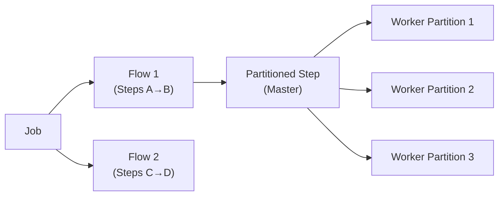

# Spring Batch Advanced

[← Back to README](../README.md)

---

Spring Batch's advanced features go far beyond single-threaded chunk processing: **multi-threaded steps** parallelise within a single step, **partitioning** distributes work across workers (local or remote), **parallel flows** run independent steps concurrently, and the **skip/retry** mechanism handles transient failures without aborting the whole job. All execution metadata lives in the `JobRepository` — restartable from the last committed chunk.



---

## Multi-Threaded Step

```java
@Bean
public Step multiThreadedOrderStep(JobRepository jobRepository,
                                    PlatformTransactionManager txManager,
                                    ItemReader<Order> reader,
                                    ItemProcessor<Order, ProcessedOrder> processor,
                                    ItemWriter<ProcessedOrder> writer) {
    // Reader MUST be thread-safe (e.g., SynchronizedItemStreamReader)
    SynchronizedItemStreamReader<Order> syncReader =
        new SynchronizedItemStreamReaderBuilder<Order>()
            .delegate((ItemStreamReader<Order>) reader)
            .build();

    TaskExecutor taskExecutor = new SimpleAsyncTaskExecutor("batch-");
    ((SimpleAsyncTaskExecutor) taskExecutor).setConcurrencyLimit(8);

    return new StepBuilder("multiThreadedOrderStep", jobRepository)
        .<Order, ProcessedOrder>chunk(100, txManager)
        .reader(syncReader)
        .processor(processor)
        .writer(writer)
        .taskExecutor(taskExecutor)
        .throttleLimit(8)        // max concurrent chunks
        .build();
}
```

---

## Parallel Flows

```java
@Bean
public Job parallelJob(JobRepository jobRepository,
                        Step importOrders, Step importProducts,
                        Step generateReports) {

    // importOrders and importProducts run in parallel
    // generateReports runs after both complete
    Flow parallelFlow = new FlowBuilder<SimpleFlow>("parallelFlow")
        .split(new SimpleAsyncTaskExecutor())
        .add(
            new FlowBuilder<SimpleFlow>("ordersFlow")
                .start(importOrders).build(),
            new FlowBuilder<SimpleFlow>("productsFlow")
                .start(importProducts).build()
        )
        .build();

    return new JobBuilder("parallelJob", jobRepository)
        .start(parallelFlow)
        .next(generateReports)
        .end()
        .build();
}
```

---

## Local Partitioning

```java
// Master step splits work into N partitions; workers run locally in threads
@Bean
public Step partitionedOrderStep(JobRepository jobRepository,
                                  OrderPartitioner partitioner,
                                  Step workerStep) {
    return new StepBuilder("partitionedOrderStep", jobRepository)
        .partitioner("workerStep", partitioner)
        .step(workerStep)
        .gridSize(10)                    // 10 partitions
        .taskExecutor(new SimpleAsyncTaskExecutor())
        .build();
}

// Partitioner: defines what each partition processes
@Component
public class OrderPartitioner implements Partitioner {

    private final OrderRepository orderRepository;

    @Override
    public Map<String, ExecutionContext> partition(int gridSize) {
        long totalOrders = orderRepository.count();
        long pageSize = (totalOrders + gridSize - 1) / gridSize;

        Map<String, ExecutionContext> partitions = new LinkedHashMap<>();
        for (int i = 0; i < gridSize; i++) {
            ExecutionContext ctx = new ExecutionContext();
            ctx.putLong("minId", i * pageSize + 1);
            ctx.putLong("maxId", Math.min((i + 1) * pageSize, totalOrders));
            ctx.putInt("partition", i);
            partitions.put("partition-" + i, ctx);
        }
        return partitions;
    }
}

// Worker step — reads its assigned ID range from ExecutionContext
@Bean
@StepScope   // required for @Value("#{stepExecutionContext[...]}")
public JpaPagingItemReader<Order> partitionedOrderReader(
        EntityManagerFactory emf,
        @Value("#{stepExecutionContext['minId']}") Long minId,
        @Value("#{stepExecutionContext['maxId']}") Long maxId) {

    return new JpaPagingItemReaderBuilder<Order>()
        .name("partitionedOrderReader")
        .entityManagerFactory(emf)
        .queryString("SELECT o FROM Order o WHERE o.id BETWEEN :minId AND :maxId ORDER BY o.id")
        .parameterValues(Map.of("minId", minId, "maxId", maxId))
        .pageSize(500)
        .build();
}
```

---

## Remote Partitioning with Kafka

```xml
<dependency>
    <groupId>org.springframework.batch.integration</groupId>
    <artifactId>spring-batch-integration</artifactId>
</dependency>
```

```java
// Master — sends partition requests to Kafka; workers reply with results
@Configuration
public class RemotePartitioningManagerConfig {

    @Bean
    public Step managerStep(JobRepository jobRepository,
                             OrderPartitioner partitioner,
                             RemotePartitioningManagerStepBuilderFactory factory) {
        return factory.get("managerStep")
            .partitioner("workerStep", partitioner)
            .gridSize(10)
            .outputChannel(outboundRequests())    // send to Kafka
            .inputChannel(inboundReplies())       // receive from workers
            .build();
    }

    @Bean
    public MessageChannel outboundRequests() {
        return MessageChannels.direct().getObject();
    }

    @Bean
    public MessageChannel inboundReplies() {
        return MessageChannels.publishSubscribe().getObject();
    }
}
```

---

## Skip Policy

```java
@Bean
public Step orderProcessingStep(JobRepository jobRepository,
                                 PlatformTransactionManager txManager) {
    return new StepBuilder("orderProcessingStep", jobRepository)
        .<Order, ProcessedOrder>chunk(100, txManager)
        .reader(orderReader())
        .processor(orderProcessor())
        .writer(orderWriter())
        // Skip specific exception types (up to N times)
        .faultTolerant()
            .skip(ValidationException.class)
            .skip(DataIntegrityViolationException.class)
            .skipLimit(50)                              // abort after 50 skips
            .skipPolicy(new AlwaysSkipItemSkipPolicy()) // or custom policy
            .noSkip(FatalProcessingException.class)     // never skip this
        .build();
}

// Custom skip policy — skip only for transient errors
public class TransientSkipPolicy implements SkipPolicy {

    @Override
    public boolean shouldSkip(Throwable t, long skipCount) throws SkipLimitExceededException {
        if (skipCount >= 100) throw new SkipLimitExceededException(100, t);
        return t instanceof TransientDataAccessException
            || t instanceof ValidationException;
    }
}
```

---

## Retry Policy

```java
@Bean
public Step retryableStep(JobRepository jobRepository,
                           PlatformTransactionManager txManager) {
    return new StepBuilder("retryableStep", jobRepository)
        .<Order, ProcessedOrder>chunk(50, txManager)
        .reader(reader())
        .processor(processor())
        .writer(writer())
        .faultTolerant()
            .retry(TransientDataAccessException.class)
            .retry(ResourceAccessException.class)
            .retryLimit(3)
            .backOffPolicy(new ExponentialBackOffPolicy())  // 1s → 2s → 4s
            .noRetry(ConstraintViolationException.class)
        .build();
}
```

---

## Skip Listener — Log Skipped Items

```java
@Component
public class OrderSkipListener implements SkipListener<Order, ProcessedOrder> {

    @Override
    public void onSkipInRead(Throwable t) {
        log.error("Skipped during read: {}", t.getMessage());
    }

    @Override
    public void onSkipInProcess(Order order, Throwable t) {
        log.error("Skipped order {} during processing: {}", order.getId(), t.getMessage());
        // Persist to an error table for investigation
        errorRepository.save(new SkippedOrderError(order, t.getMessage()));
    }

    @Override
    public void onSkipInWrite(ProcessedOrder order, Throwable t) {
        log.error("Skipped order {} during write: {}", order.getId(), t.getMessage());
    }
}
```

---

## Conditional Flow — Step Based on Exit Status

```java
@Bean
public Job conditionalJob(JobRepository jobRepository,
                           Step validateStep, Step processStep,
                           Step errorReportStep, Step successNotifyStep) {
    return new JobBuilder("conditionalJob", jobRepository)
        .start(validateStep)
            .on("FAILED").to(errorReportStep)
            .on("COMPLETED WITH SKIPS").to(errorReportStep)
                .from(errorReportStep).end()
            .on("COMPLETED").to(processStep)
                .from(processStep).on("*").to(successNotifyStep)
        .end()
        .build();
}

// Set a custom exit status from a step listener
@Component
public class ValidationStepListener implements StepExecutionListener {

    @Override
    public ExitStatus afterStep(StepExecution stepExecution) {
        long skipCount = stepExecution.getSkipCount();
        if (skipCount > 0) {
            return new ExitStatus("COMPLETED WITH SKIPS");
        }
        return stepExecution.getExitStatus();
    }
}
```

---

## JobRepository — JDBC Persistence

```java
@Configuration
public class BatchDatasourceConfig {

    // Use a dedicated datasource for batch metadata
    @Bean
    @BatchDataSource                  // Spring Batch 5 annotation
    public DataSource batchDataSource() {
        return DataSourceBuilder.create()
            .url("jdbc:postgresql://localhost/batch_metadata")
            .username("batch")
            .password("${BATCH_DB_PASSWORD}")
            .build();
    }

    @Bean
    public JobRepository jobRepository(
            @BatchDataSource DataSource dataSource,
            PlatformTransactionManager txManager) throws Exception {
        return new JobRepositoryFactoryBean()
            .apply(factory -> {
                factory.setDataSource(dataSource);
                factory.setTransactionManager(txManager);
                factory.setDatabaseType("POSTGRES");
                factory.setIsolationLevelForCreate("ISOLATION_SERIALIZABLE");
            });
    }
}
```

---

## Spring Batch Advanced Summary

| Concept | Detail |
|---------|--------|
| `SimpleAsyncTaskExecutor` | Provides threads for multi-threaded steps and parallel flows |
| `SynchronizedItemStreamReader` | Thread-safe wrapper — required when sharing a reader across threads |
| `Partitioner` | Splits work into `ExecutionContext` slices; each runs as an independent step execution |
| `gridSize` | Number of partitions; each partition gets its own `StepExecution` in the `JobRepository` |
| `@StepScope` | Lazily creates bean per step execution — enables `#{stepExecutionContext[...]}` injection |
| `split()` | Runs multiple flows in parallel on a `TaskExecutor` |
| `.faultTolerant()` | Enables skip and retry — required before calling `.skip()` or `.retry()` |
| `skipLimit` | Total skips allowed before the step fails |
| `SkipPolicy` | Custom logic to decide per-exception whether to skip |
| `retryLimit` | Max retry attempts per item before skip or step failure |
| `BackOffPolicy` | Delay between retries — `FixedBackOffPolicy`, `ExponentialBackOffPolicy` |
| `SkipListener` | Hook to log/persist skipped items from read, process, and write phases |
| Conditional flow | `on("EXIT_STATUS").to(step)` — route to different steps based on step outcome |

---

[← Back to README](../README.md)
