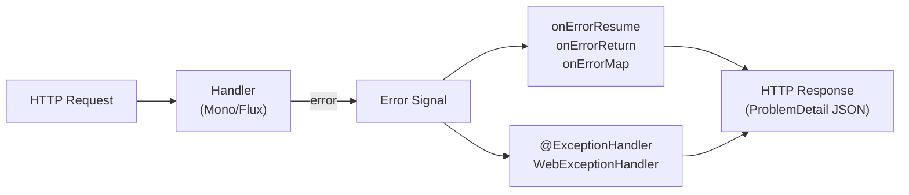

# WebFlux Error Handling

[← Back to README](../README.md)

---

Error handling in Spring WebFlux differs from MVC: exceptions propagate through the reactive pipeline as signals, not thrown synchronously. Operators like `onErrorResume`, `onErrorReturn`, and `onErrorMap` handle errors inline; global handling goes through `WebExceptionHandler` (functional routing) or `@ExceptionHandler` inside `@RestControllerAdvice` (annotated controllers). All of these integrate with Spring's `ProblemDetail` (RFC 9457) for consistent error responses.



---

## Inline Error Operators

```java
@RestController
@RequestMapping("/api/products")
public class ProductController {

    private final ProductService productService;

    @GetMapping("/{id}")
    public Mono<Product> getProduct(@PathVariable Long id) {
        return productService.findById(id)
            // Replace a specific error with a fallback value
            .onErrorReturn(ProductNotFoundException.class, Product.empty())

            // Switch to a fallback publisher on error
            .onErrorResume(ProductNotFoundException.class,
                ex -> Mono.error(new ResponseStatusException(HttpStatus.NOT_FOUND,
                    "Product " + id + " not found")))

            // Transform one error type to another
            .onErrorMap(DataAccessException.class,
                ex -> new ServiceException("Database unavailable", ex))

            // Log and re-signal the error unchanged
            .doOnError(ex -> log.error("Error fetching product {}", id, ex));
    }

    @GetMapping
    public Flux<Product> allProducts() {
        return productService.findAll()
            // Continue processing remaining items even if one errors
            .onErrorContinue(ValidationException.class,
                (ex, item) -> log.warn("Skipping invalid product: {}", ex.getMessage()))

            // Timeout with fallback
            .timeout(Duration.ofSeconds(5))
            .onErrorResume(TimeoutException.class,
                ex -> Flux.error(new ResponseStatusException(
                    HttpStatus.GATEWAY_TIMEOUT, "Products service timed out")));
    }
}
```

---

## @ExceptionHandler in WebFlux Controllers

```java
@RestControllerAdvice
public class GlobalWebFluxExceptionHandler {

    // Handle domain exceptions → ProblemDetail
    @ExceptionHandler(ProductNotFoundException.class)
    public ResponseEntity<ProblemDetail> handleNotFound(
            ProductNotFoundException ex, ServerWebExchange exchange) {

        ProblemDetail pd = ProblemDetail.forStatusAndDetail(
            HttpStatus.NOT_FOUND, ex.getMessage());
        pd.setTitle("Product Not Found");
        pd.setInstance(exchange.getRequest().getURI());
        pd.setProperty("productId", ex.getProductId());
        return ResponseEntity.status(HttpStatus.NOT_FOUND).body(pd);
    }

    @ExceptionHandler(ValidationException.class)
    public ResponseEntity<ProblemDetail> handleValidation(
            ValidationException ex) {
        ProblemDetail pd = ProblemDetail.forStatusAndDetail(
            HttpStatus.UNPROCESSABLE_ENTITY, "Validation failed");
        pd.setProperty("violations", ex.getViolations());
        return ResponseEntity.unprocessableEntity().body(pd);
    }

    // Catch-all
    @ExceptionHandler(Exception.class)
    @ResponseStatus(HttpStatus.INTERNAL_SERVER_ERROR)
    public Mono<ProblemDetail> handleGeneral(Exception ex, ServerWebExchange exchange) {
        log.error("Unhandled exception", ex);
        ProblemDetail pd = ProblemDetail.forStatusAndDetail(
            HttpStatus.INTERNAL_SERVER_ERROR, "An unexpected error occurred");
        pd.setInstance(exchange.getRequest().getURI());
        return Mono.just(pd);
    }
}
```

---

## WebExceptionHandler — Global (Functional Routing)

```java
// WebExceptionHandler sits at the WebFilter level — handles all errors
// including ones from WebFilter chain (before controllers)
@Component
@Order(-2)   // before DefaultErrorWebExceptionHandler (-1)
public class GlobalErrorHandler implements WebExceptionHandler {

    private final ObjectMapper objectMapper;

    public GlobalErrorHandler(ObjectMapper objectMapper) {
        this.objectMapper = objectMapper;
    }

    @Override
    public Mono<Void> handle(ServerWebExchange exchange, Throwable ex) {
        HttpStatus status = resolveStatus(ex);
        ProblemDetail pd = buildProblemDetail(status, ex, exchange);

        exchange.getResponse().setStatusCode(status);
        exchange.getResponse().getHeaders()
            .setContentType(MediaType.APPLICATION_PROBLEM_JSON);

        try {
            byte[] bytes = objectMapper.writeValueAsBytes(pd);
            DataBuffer buffer = exchange.getResponse()
                .bufferFactory().wrap(bytes);
            return exchange.getResponse().writeWith(Mono.just(buffer));
        } catch (JsonProcessingException e) {
            return Mono.error(e);
        }
    }

    private HttpStatus resolveStatus(Throwable ex) {
        if (ex instanceof ResponseStatusException rse)
            return (HttpStatus) rse.getStatusCode();
        if (ex instanceof ProductNotFoundException)
            return HttpStatus.NOT_FOUND;
        if (ex instanceof AccessDeniedException)
            return HttpStatus.FORBIDDEN;
        return HttpStatus.INTERNAL_SERVER_ERROR;
    }

    private ProblemDetail buildProblemDetail(HttpStatus status, Throwable ex,
                                              ServerWebExchange exchange) {
        ProblemDetail pd = ProblemDetail.forStatusAndDetail(status, ex.getMessage());
        pd.setInstance(exchange.getRequest().getURI());
        pd.setProperty("timestamp", Instant.now().toString());
        pd.setProperty("requestId", exchange.getRequest()
            .getHeaders().getFirst("X-Request-Id"));
        return pd;
    }
}
```

---

## Retry with Backoff

```java
@Service
@RequiredArgsConstructor
public class ExternalApiService {

    private final WebClient webClient;

    public Mono<ApiResponse> callWithRetry(String endpoint) {
        return webClient.get()
            .uri(endpoint)
            .retrieve()
            .onStatus(HttpStatusCode::is5xxServerError,
                resp -> resp.bodyToMono(String.class)
                    .flatMap(body -> Mono.error(
                        new ServerErrorException("Server error: " + body))))
            .bodyToMono(ApiResponse.class)
            .retryWhen(Retry.backoff(3, Duration.ofMillis(500))
                .maxBackoff(Duration.ofSeconds(5))
                .jitter(0.5)
                .filter(ex -> ex instanceof ServerErrorException
                           || ex instanceof WebClientRequestException)
                .onRetryExhaustedThrow((spec, signal) ->
                    new ServiceUnavailableException("API unavailable after retries")))
            .timeout(Duration.ofSeconds(10))
            .onErrorMap(TimeoutException.class,
                ex -> new GatewayTimeoutException("API timed out"));
    }
}
```

---

## Error Handling in Reactive Streams (Flux)

```java
@Service
@RequiredArgsConstructor
public class OrderStreamService {

    public Flux<OrderResult> processOrders(Flux<Order> orders) {
        return orders
            .concatMap(order ->
                processOrder(order)
                    // Per-item error handling — continue stream on error
                    .onErrorResume(ex -> {
                        log.warn("Order {} failed: {}", order.getId(), ex.getMessage());
                        return Mono.just(OrderResult.failed(order.getId(), ex.getMessage()));
                    })
            )
            // Global timeout for the whole stream
            .timeout(Duration.ofMinutes(5))
            .onErrorResume(TimeoutException.class,
                ex -> Flux.error(new BatchTimeoutException("Order batch timed out")));
    }

    private Mono<OrderResult> processOrder(Order order) {
        return Mono.fromCallable(() -> orderProcessor.process(order))
            .subscribeOn(Schedulers.boundedElastic())
            .map(OrderResult::success);
    }
}
```

---

## WebClient Error Handling

```java
@Service
public class InventoryClient {

    private final WebClient webClient;

    public Mono<InventoryStatus> checkStock(String productId) {
        return webClient.get()
            .uri("/inventory/{id}", productId)
            .retrieve()
            // Handle 4xx
            .onStatus(HttpStatusCode::is4xxClientError,
                resp -> switch (resp.statusCode().value()) {
                    case 404 -> Mono.error(new ProductNotFoundException(productId));
                    case 429 -> Mono.error(new RateLimitException("Rate limited"));
                    default  -> resp.bodyToMono(ProblemDetail.class)
                        .flatMap(pd -> Mono.error(new ClientException(pd.getDetail())));
                })
            // Handle 5xx
            .onStatus(HttpStatusCode::is5xxServerError,
                resp -> Mono.error(new InventoryServiceException("Inventory unavailable")))
            .bodyToMono(InventoryStatus.class)
            // Fallback: assume in stock on error
            .onErrorReturn(InventoryServiceException.class,
                InventoryStatus.assumed());
    }
}
```

---

## Testing Error Scenarios

```java
@WebFluxTest(ProductController.class)
class ProductControllerErrorTest {

    @Autowired WebTestClient webTestClient;
    @MockBean  ProductService productService;

    @Test
    void returnsNotFoundForMissingProduct() {
        given(productService.findById(99L))
            .willReturn(Mono.error(new ProductNotFoundException(99L)));

        webTestClient.get().uri("/api/products/99")
            .exchange()
            .expectStatus().isNotFound()
            .expectHeader().contentType(MediaType.APPLICATION_PROBLEM_JSON)
            .expectBody()
            .jsonPath("$.status").isEqualTo(404)
            .jsonPath("$.detail").isNotEmpty()
            .jsonPath("$.productId").isEqualTo(99);
    }

    @Test
    void retrysOnServerError() {
        given(productService.findById(1L))
            .willReturn(
                Mono.error(new ServerErrorException("unavailable")),
                Mono.error(new ServerErrorException("unavailable")),
                Mono.just(new Product(1L, "Widget"))
            );

        webTestClient.get().uri("/api/products/1")
            .exchange()
            .expectStatus().isOk()
            .expectBody(Product.class)
            .value(p -> assertThat(p.name()).isEqualTo("Widget"));
    }
}
```

---

## WebFlux Error Handling Summary

| Concept | Detail |
|---------|--------|
| `onErrorReturn(T)` | Replace error signal with a fallback value — stream continues |
| `onErrorResume(fallbackPublisher)` | Switch to another `Mono`/`Flux` on error — allows dynamic fallback |
| `onErrorMap(mapper)` | Transform one exception type to another — used for abstraction layers |
| `onErrorContinue` | Skip errored items in a `Flux` and continue — use carefully, can hide bugs |
| `doOnError` | Side-effect on error (logging) — does NOT handle the error |
| `retryWhen(Retry.backoff(...))` | Retry with exponential backoff, jitter, and predicate filtering |
| `timeout(Duration)` | Emit `TimeoutException` if no item arrives within the duration |
| `@ExceptionHandler` | Works in `@RestControllerAdvice` for annotated WebFlux controllers |
| `WebExceptionHandler` | Global handler at the WebFilter level — catches all errors including filter errors |
| `@Order(-2)` | Must be ordered before `DefaultErrorWebExceptionHandler` (`-1`) |
| `ProblemDetail` | RFC 9457 structured error — `type`, `title`, `status`, `detail`, `instance` |
| `.onStatus(is4xxClientError, ...)` | `WebClient` error handler — map HTTP status codes to exceptions |

---

[← Back to README](../README.md)
