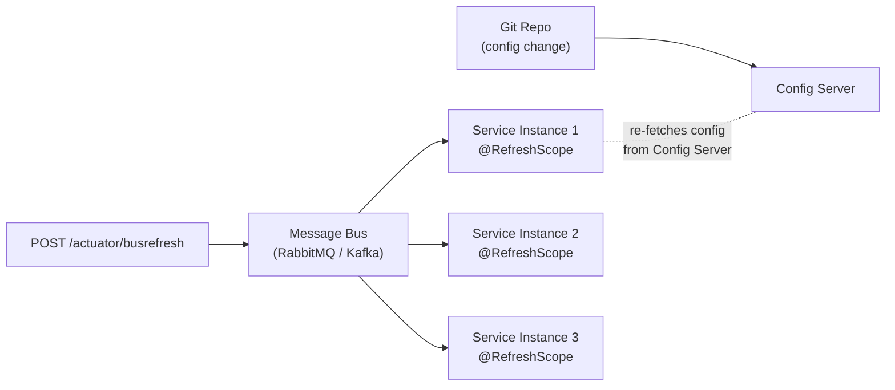

# Spring Cloud Bus

[← Back to README](../README.md)

---

Spring Cloud Bus links nodes of a distributed system with a lightweight message broker (RabbitMQ or Kafka). Its primary use case is **broadcasting configuration refresh events**: when a property changes in a Config Server backend, one `POST /actuator/busrefresh` call propagates the refresh to every service instance automatically — no manual rolling restart needed. Bus also supports custom events.



---

## Dependencies

```xml
<!-- RabbitMQ transport -->
<dependency>
    <groupId>org.springframework.cloud</groupId>
    <artifactId>spring-cloud-starter-bus-amqp</artifactId>
</dependency>

<!-- Kafka transport (alternative) -->
<dependency>
    <groupId>org.springframework.cloud</groupId>
    <artifactId>spring-cloud-starter-bus-kafka</artifactId>
</dependency>

<!-- Config client — receives refreshed properties -->
<dependency>
    <groupId>org.springframework.cloud</groupId>
    <artifactId>spring-cloud-starter-config</artifactId>
</dependency>
```

---

## Configuration

```yaml
# application.yaml (each service instance)
spring:
  cloud:
    bus:
      enabled: true
      id: ${spring.application.name}:${server.port}:${random.uuid}
    config:
      uri: http://config-server:8888

  rabbitmq:
    host: rabbitmq
    port: 5672
    username: guest
    password: guest

management:
  endpoints:
    web:
      exposure:
        include: busrefresh, busenv, health, info
```

---

## @RefreshScope — Beans That Reload on Refresh

```java
@Service
@RefreshScope   // bean is re-created when a RefreshRemoteApplicationEvent arrives
@RequiredArgsConstructor
public class FeatureToggleService {

    // Re-injected from updated Environment after refresh
    @Value("${features.new-checkout:false}")
    private boolean newCheckoutEnabled;

    @Value("${features.max-items:50}")
    private int maxItems;

    public boolean isNewCheckoutEnabled() { return newCheckoutEnabled; }
    public int getMaxItems()              { return maxItems; }
}

// ConfigurationProperties beans refresh automatically without @RefreshScope
// when spring.cloud.refresh.extra-refreshable includes the class
@ConfigurationProperties(prefix = "payment")
@RefreshScope
public class PaymentProperties {
    private String gatewayUrl;
    private int timeoutMs = 5000;
    // getters/setters
}
```

---

## Triggering a Bus Refresh

```bash
# Refresh ALL instances of ALL services
curl -X POST http://any-service:8080/actuator/busrefresh

# Refresh only a specific service (destination = appName:*)
curl -X POST "http://any-service:8080/actuator/busrefresh?destination=order-service:**"

# Refresh a single instance
curl -X POST "http://any-service:8080/actuator/busrefresh?destination=order-service:8081:*"
```

---

## Config Server — Auto-Trigger via Git Webhook

```yaml
# Config Server application.yaml
spring:
  cloud:
    config:
      server:
        git:
          uri: https://github.com/org/config-repo
          clone-on-start: true

management:
  endpoints:
    web:
      exposure:
        include: busrefresh

# GitHub webhook → POST https://config-server/actuator/busrefresh
# Config Server re-reads Git, then broadcasts RefreshRemoteApplicationEvent
```

---

## Custom Bus Events

```java
// Define a custom event
public class FeatureFlagChangedEvent extends RemoteApplicationEvent {

    private String flagName;
    private boolean enabled;

    protected FeatureFlagChangedEvent() { }  // Jackson

    public FeatureFlagChangedEvent(Object source, String originService,
                                    String flagName, boolean enabled) {
        super(source, originService);
        this.flagName = flagName;
        this.enabled  = enabled;
    }

    // getters/setters
}

// Register the event type so Spring Bus can deserialise it
@Configuration
public class BusConfig {

    @Bean
    public BusJacksonMessageConverter busJacksonMessageConverter(ObjectMapper objectMapper) {
        // Allowlist custom event
        return new BusJacksonMessageConverter(objectMapper,
            List.of(FeatureFlagChangedEvent.class.getPackageName()));
    }
}

// Publish from any service instance
@Service
@RequiredArgsConstructor
public class FeatureFlagPublisher {

    private final ApplicationEventPublisher publisher;

    @Value("${spring.cloud.bus.id}")
    private String busId;

    public void broadcast(String flagName, boolean enabled) {
        publisher.publishEvent(
            new FeatureFlagChangedEvent(this, busId, flagName, enabled));
    }
}

// Subscribe on every instance
@Component
public class FeatureFlagListener {

    @EventListener
    public void onFlagChanged(FeatureFlagChangedEvent event) {
        log.info("Flag {} set to {} (origin: {})",
            event.getFlagName(), event.isEnabled(), event.getOriginService());
        // update local cache / feature flags
    }
}
```

---

## /busenv — Update Environment Properties at Runtime

```bash
# Push a property to all instances without a full refresh
curl -X POST http://any-service:8080/actuator/busenv \
  -H "Content-Type: application/json" \
  -d '{"name": "logging.level.com.example", "value": "DEBUG"}'
```

---

## Selective Refresh by Profile / Label

```yaml
# Config client — target a specific Config Server label (Git branch)
spring:
  cloud:
    config:
      label: feature/new-payments    # Git branch
      profile: production
```

```bash
# Refresh only instances in the "production" profile
curl -X POST "http://cfg-server:8888/actuator/busrefresh?destination=*:production:*"
```

---

## Spring Cloud Bus Summary

| Concept | Detail |
|---------|--------|
| Spring Cloud Bus | Broadcasts events (refresh, env update, custom) to all service instances via a message broker |
| `spring-cloud-starter-bus-amqp` | Uses RabbitMQ as the message broker |
| `spring-cloud-starter-bus-kafka` | Uses Kafka as the message broker |
| `@RefreshScope` | Bean is lazily re-created after a `RefreshRemoteApplicationEvent` — picks up new `@Value` bindings |
| `/actuator/busrefresh` | Triggers a `RefreshRemoteApplicationEvent` that propagates to all bus subscribers |
| `?destination=svc:**` | Limits the refresh to a specific application, instance, or profile |
| `RemoteApplicationEvent` | Base class for custom bus events — serialised over the broker |
| `/actuator/busenv` | Pushes an `EnvironmentChangeEvent` to update a single property on all instances |
| Config Server webhook | GitHub/GitLab webhook → `/actuator/busrefresh` on Config Server → all clients refresh |
| `spring.cloud.bus.id` | Unique bus identity per instance (`appName:port:uuid`) — used to route `destination` |

---

[← Back to README](../README.md)
