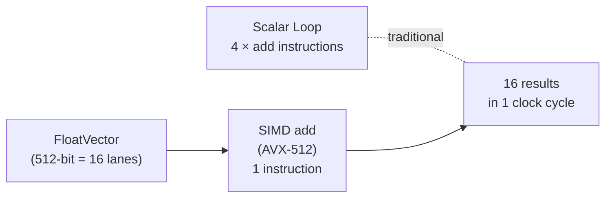

# Java Vector API

[← Back to README](../README.md)

---

The **Java Vector API** (JEP 338/414/417/426/438, incubating since Java 16, stabilised in Java 24) provides a portable abstraction over CPU **SIMD** (Single Instruction, Multiple Data) instructions. A `Vector` holds multiple lane values of the same primitive type; operations on the vector compile down to a single CPU instruction (AVX-512, NEON, SVE) that processes all lanes in parallel. This delivers 4–16× throughput over scalar loops for data-parallel workloads like signal processing, ML inference, and bulk string operations.



---

## Dependency and Module Flag

```xml
<!-- No extra Maven dependency — Vector API is in the JDK -->
<!-- Requires --add-modules jdk.incubator.vector until Java 24 -->
```

```xml
<!-- Maven Compiler Plugin flags (Java 21 incubating) -->
<plugin>
    <groupId>org.apache.maven.plugins</groupId>
    <artifactId>maven-compiler-plugin</artifactId>
    <configuration>
        <compilerArgs>
            <arg>--add-modules</arg>
            <arg>jdk.incubator.vector</arg>
        </compilerArgs>
    </configuration>
</plugin>
```

---

## Core Concepts

```java
import jdk.incubator.vector.*;

// VectorSpecies: element type + bit-width (prefer PREFERRED for the platform's widest)
static final VectorSpecies<Float>  F_SPECIES = FloatVector.SPECIES_PREFERRED;
static final VectorSpecies<Integer> I_SPECIES = IntVector.SPECIES_PREFERRED;

// Lane count: how many floats fit in the preferred vector width
int LANES = F_SPECIES.length();   // 8 on AVX2 (256-bit), 16 on AVX-512 (512-bit)
```

---

## Vector Addition (SIMD vs Scalar)

```java
public class VectorMath {

    private static final VectorSpecies<Float> SPECIES = FloatVector.SPECIES_PREFERRED;

    // SIMD: processes LANES floats per iteration
    public static float[] addVectorised(float[] a, float[] b) {
        float[] result = new float[a.length];
        int i = 0;
        int upperBound = SPECIES.loopBound(a.length);  // largest multiple of LANES ≤ length

        for (; i < upperBound; i += SPECIES.length()) {
            FloatVector va = FloatVector.fromArray(SPECIES, a, i);
            FloatVector vb = FloatVector.fromArray(SPECIES, b, i);
            va.add(vb).intoArray(result, i);
        }

        // Scalar tail — handle remaining elements
        for (; i < a.length; i++) {
            result[i] = a[i] + b[i];
        }
        return result;
    }

    // Equivalent scalar loop (for comparison)
    public static float[] addScalar(float[] a, float[] b) {
        float[] result = new float[a.length];
        for (int i = 0; i < a.length; i++) result[i] = a[i] + b[i];
        return result;
    }
}
```

---

## Dot Product

```java
public static float dotProduct(float[] a, float[] b) {
    var species = FloatVector.SPECIES_PREFERRED;
    var accumulator = FloatVector.zero(species);

    int i = 0;
    for (; i < species.loopBound(a.length); i += species.length()) {
        var va = FloatVector.fromArray(species, a, i);
        var vb = FloatVector.fromArray(species, b, i);
        accumulator = va.fma(vb, accumulator);   // fused multiply-add: acc += va * vb
    }

    // Reduce all lanes to a single sum
    float sum = accumulator.reduceLanes(VectorOperators.ADD);

    // Scalar tail
    for (; i < a.length; i++) sum += a[i] * b[i];
    return sum;
}
```

---

## Masks — Conditional Lane Operations

```java
public static float[] clampVectorised(float[] data, float min, float max) {
    var species = FloatVector.SPECIES_PREFERRED;
    var vMin = FloatVector.broadcast(species, min);
    var vMax = FloatVector.broadcast(species, max);
    float[] result = new float[data.length];

    int i = 0;
    for (; i < species.loopBound(data.length); i += species.length()) {
        FloatVector v = FloatVector.fromArray(species, data, i);
        // Mask: lanes where v < min
        VectorMask<Float> belowMin = v.compare(VectorOperators.LT, vMin);
        VectorMask<Float> aboveMax = v.compare(VectorOperators.GT, vMax);
        v = v.blend(vMin, belowMin);   // replace low lanes with min
        v = v.blend(vMax, aboveMax);   // replace high lanes with max
        v.intoArray(result, i);
    }

    for (; i < data.length; i++) result[i] = Math.clamp(data[i], min, max);
    return result;
}
```

---

## Integer Vectors — Byte/Short/Int/Long

```java
public static int[] multiplyInts(int[] a, int[] b) {
    var species = IntVector.SPECIES_PREFERRED;
    int[] result = new int[a.length];
    int i = 0;

    for (; i < species.loopBound(a.length); i += species.length()) {
        IntVector.fromArray(species, a, i)
                 .mul(IntVector.fromArray(species, b, i))
                 .intoArray(result, i);
    }
    for (; i < a.length; i++) result[i] = a[i] * b[i];
    return result;
}
```

---

## Shuffles and Rearrangement

```java
// Reverse the elements of a float array using vector shuffles
public static float[] reverseVectorised(float[] data) {
    var species = FloatVector.SPECIES_PREFERRED;
    int len = species.length();
    // Shuffle: maps lane i → lane (len-1-i)
    int[] indices = new int[len];
    for (int j = 0; j < len; j++) indices[j] = len - 1 - j;
    VectorShuffle<Float> reversal = VectorShuffle.fromArray(species, indices, 0);

    float[] result = new float[data.length];
    int i = 0;
    for (; i < species.loopBound(data.length); i += len) {
        FloatVector.fromArray(species, data, i)
                   .rearrange(reversal)
                   .intoArray(result, i);
    }
    // tail handled separately
    return result;
}
```

---

## JMH Benchmark — SIMD vs Scalar

```java
@State(Scope.Benchmark)
@BenchmarkMode(Mode.Throughput)
@OutputTimeUnit(TimeUnit.MILLISECONDS)
@Fork(2)
public class VectorBenchmark {

    @Param({"1024", "65536", "1048576"})
    int size;

    float[] a, b;

    @Setup
    public void setup() {
        a = new float[size];
        b = new float[size];
        Random rng = new Random(42);
        for (int i = 0; i < size; i++) { a[i] = rng.nextFloat(); b[i] = rng.nextFloat(); }
    }

    @Benchmark
    public float[] scalar()      { return VectorMath.addScalar(a, b); }

    @Benchmark
    public float[] vectorised()  { return VectorMath.addVectorised(a, b); }
}
```

---

## Java Vector API Summary

| Concept | Detail |
|---------|--------|
| `VectorSpecies<T>` | Combination of element type and bit-width (e.g. `FloatVector.SPECIES_256`) |
| `SPECIES_PREFERRED` | Uses the widest SIMD width the platform supports — best default |
| `species.length()` | Number of lanes (elements) per vector on this platform |
| `species.loopBound(n)` | Largest multiple of `length()` ≤ n — use as the vectorised loop's upper bound |
| `FloatVector.fromArray(sp, arr, i)` | Load `length()` floats from `arr` starting at index `i` |
| `.intoArray(arr, i)` | Store the vector's lanes back into `arr` at index `i` |
| `.fma(b, c)` | Fused multiply-add: `this * b + c` — single instruction, no rounding in between |
| `VectorMask<T>` | Boolean mask over lanes — used with `.blend()`, `.compare()`, masked loads/stores |
| `.reduceLanes(ADD)` | Horizontal reduction: sum all lanes into a scalar |
| `VectorShuffle<T>` | Permutation map — rearranges lanes within a vector |
| `--add-modules jdk.incubator.vector` | Required compiler/runtime flag until Vector API graduates (Java 24+) |
| Scalar tail loop | Always handle `length % LANES` remaining elements with a plain scalar loop |

---

[← Back to README](../README.md)
