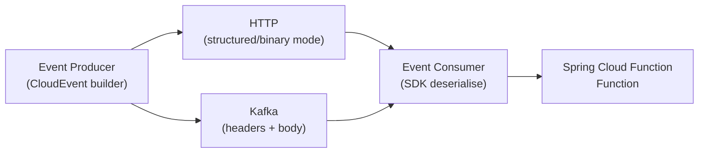

# CloudEvents

[← Back to README](../README.md)

---

**CloudEvents** (CNCF specification v1.0) is a vendor-neutral format for describing event data. It defines a common set of metadata attributes (`id`, `source`, `type`, `specversion`, `datacontenttype`, `time`, `subject`) that travel with the event payload regardless of transport. The Java SDK (`io.cloudevents`) integrates with Spring Cloud Function, Spring Kafka, and HTTP — enabling interoperable event-driven systems across clouds and messaging systems.



---

## Dependencies

```xml
<!-- CloudEvents core + JSON -->
<dependency>
    <groupId>io.cloudevents</groupId>
    <artifactId>cloudevents-core</artifactId>
    <version>3.0.0</version>
</dependency>
<dependency>
    <groupId>io.cloudevents</groupId>
    <artifactId>cloudevents-json-jackson</artifactId>
    <version>3.0.0</version>
</dependency>

<!-- HTTP binding (Spring / Servlet) -->
<dependency>
    <groupId>io.cloudevents</groupId>
    <artifactId>cloudevents-spring</artifactId>
    <version>3.0.0</version>
</dependency>

<!-- Kafka binding -->
<dependency>
    <groupId>io.cloudevents</groupId>
    <artifactId>cloudevents-kafka</artifactId>
    <version>3.0.0</version>
</dependency>
```

---

## Building a CloudEvent

```java
import io.cloudevents.CloudEvent;
import io.cloudevents.core.builder.CloudEventBuilder;
import io.cloudevents.core.format.EventFormat;
import io.cloudevents.core.provider.EventFormatProvider;
import io.cloudevents.jackson.JsonFormat;

public class OrderEventFactory {

    public static CloudEvent orderPlaced(Order order) {
        return CloudEventBuilder.v1()
            .withId(UUID.randomUUID().toString())
            .withSource(URI.create("https://orders.example.com"))
            .withType("com.example.order.placed")       // reverse-DNS convention
            .withDataContentType("application/json")
            .withTime(OffsetDateTime.now())
            .withSubject(order.getId().toString())
            .withData(serialize(order))                 // byte[]
            .build();
    }

    private static byte[] serialize(Order order) {
        try {
            return new ObjectMapper().writeValueAsBytes(order);
        } catch (JsonProcessingException e) {
            throw new RuntimeException(e);
        }
    }
}
```

---

## Structured vs Binary Content Mode

```java
// Structured mode: entire CloudEvent (attributes + data) in the body as JSON
EventFormat format = EventFormatProvider.getInstance()
    .resolveFormat(JsonFormat.CONTENT_TYPE);   // "application/cloudevents+json"

byte[] structured = format.serialize(event);
// Content-Type: application/cloudevents+json
// Body: {"specversion":"1.0","id":"...","type":"...","data":{...}}

// Binary mode: attributes in headers, data as the raw body
// Content-Type: application/json (the data's content type)
// ce-id, ce-source, ce-type, ce-specversion, ce-time — HTTP / Kafka headers
```

---

## HTTP — Spring MVC Controller

```java
@RestController
@RequestMapping("/events")
public class CloudEventController {

    private final OrderService orderService;

    // Receive a CloudEvent from HTTP (Spring auto-binds from request)
    @PostMapping
    public ResponseEntity<Void> receive(@RequestBody CloudEvent event) {
        log.info("Received {} from {}", event.getType(), event.getSource());

        if ("com.example.order.placed".equals(event.getType())) {
            Order order = deserialise(event.getData(), Order.class);
            orderService.process(order);
        }

        return ResponseEntity.accepted().build();
    }

    // Send a CloudEvent over HTTP (RestTemplate / WebClient)
    @GetMapping("/send/{orderId}")
    public ResponseEntity<byte[]> send(@PathVariable Long orderId) {
        Order order = orderService.findById(orderId);
        CloudEvent event = OrderEventFactory.orderPlaced(order);

        EventFormat fmt = EventFormatProvider.getInstance()
            .resolveFormat(JsonFormat.CONTENT_TYPE);
        byte[] body = fmt.serialize(event);

        return ResponseEntity.ok()
            .contentType(MediaType.parseMediaType("application/cloudevents+json"))
            .body(body);
    }
}
```

---

## Kafka Producer — Binary Mode

```java
@Configuration
public class KafkaCloudEventConfig {

    @Bean
    public ProducerFactory<String, CloudEvent> cloudEventProducerFactory() {
        Map<String, Object> config = Map.of(
            ProducerConfig.BOOTSTRAP_SERVERS_CONFIG, "kafka:9092",
            ProducerConfig.KEY_SERIALIZER_CLASS_CONFIG, StringSerializer.class,
            ProducerConfig.VALUE_SERIALIZER_CLASS_CONFIG, CloudEventSerializer.class
        );
        return new DefaultKafkaProducerFactory<>(config);
    }

    @Bean
    public KafkaTemplate<String, CloudEvent> cloudEventKafkaTemplate(
            ProducerFactory<String, CloudEvent> factory) {
        return new KafkaTemplate<>(factory);
    }
}

@Service
@RequiredArgsConstructor
public class OrderEventPublisher {

    private final KafkaTemplate<String, CloudEvent> kafkaTemplate;

    public void publish(Order order) {
        CloudEvent event = OrderEventFactory.orderPlaced(order);
        // ce-* attributes become Kafka record headers; body = JSON data
        kafkaTemplate.send("orders", order.getId().toString(), event);
    }
}
```

---

## Kafka Consumer — Binary Mode

```java
@Configuration
public class KafkaCloudEventConsumerConfig {

    @Bean
    public ConsumerFactory<String, CloudEvent> cloudEventConsumerFactory() {
        Map<String, Object> config = Map.of(
            ConsumerConfig.BOOTSTRAP_SERVERS_CONFIG,  "kafka:9092",
            ConsumerConfig.GROUP_ID_CONFIG,           "order-processors",
            ConsumerConfig.KEY_DESERIALIZER_CLASS_CONFIG,   StringDeserializer.class,
            ConsumerConfig.VALUE_DESERIALIZER_CLASS_CONFIG, CloudEventDeserializer.class
        );
        return new DefaultKafkaConsumerFactory<>(config);
    }
}

@Component
public class OrderEventConsumer {

    @KafkaListener(topics = "orders", groupId = "order-processors")
    public void consume(CloudEvent event) {
        log.info("type={} id={} source={}", event.getType(), event.getId(), event.getSource());

        Order order = deserialise(event.getData(), Order.class);
        // process…
    }
}
```

---

## Spring Cloud Function Integration

```java
// Spring Cloud Function auto-converts HTTP requests / messaging to CloudEvent
@SpringBootApplication
public class EventFunctionApp {

    // Function is invoked when a CloudEvent with matching type arrives
    @Bean
    public Function<CloudEvent, CloudEvent> orderProcessor() {
        return event -> {
            Order order = deserialise(event.getData(), Order.class);
            ProcessedOrder processed = process(order);

            return CloudEventBuilder.v1(event)        // copy attributes
                .withId(UUID.randomUUID().toString())
                .withType("com.example.order.processed")
                .withData(serialize(processed))
                .build();
        };
    }
}
```

```yaml
# application.yaml — route by ce-type
spring:
  cloud:
    function:
      definition: orderProcessor
```

---

## Custom Extension Attributes

```java
// CloudEvents supports extension attributes (ce-correlationid etc.)
CloudEvent event = CloudEventBuilder.v1()
    .withId(UUID.randomUUID().toString())
    .withSource(URI.create("https://example.com"))
    .withType("com.example.order.placed")
    .withExtension("correlationid", traceId)
    .withExtension("tenantid", tenantId)
    .withData(serialize(order))
    .build();

// Read extension
String correlationId = (String) event.getExtension("correlationid");
```

---

## CloudEvents Summary

| Concept | Detail |
|---------|--------|
| CloudEvents v1.0 | CNCF standard event envelope — `id`, `source`, `type`, `specversion`, `time`, `data` |
| `CloudEventBuilder.v1()` | Fluent builder for constructing a `CloudEvent` with required attributes |
| Structured mode | Whole event (attributes + data) in body as `application/cloudevents+json` |
| Binary mode | Attributes in transport headers (`ce-type`, `ce-source`, …); raw data as body |
| `CloudEventSerializer` | Kafka value serialiser — encodes attributes as Kafka record headers (binary mode) |
| `CloudEventDeserializer` | Kafka value deserialiser — reconstructs `CloudEvent` from headers + body |
| `EventFormat` | Serialises/deserialises `CloudEvent` in structured JSON format |
| Spring MVC binding | `@RequestBody CloudEvent` — Spring auto-parses `application/cloudevents+json` or binary HTTP headers |
| Spring Cloud Function | `Function<CloudEvent, CloudEvent>` — function is triggered by incoming CloudEvent via HTTP or messaging |
| Extension attributes | Custom metadata (`withExtension("key", value)`) — prefixed `ce-` in HTTP headers |
| `withSubject(id)` | Identifies the subject entity (e.g. order ID) — filter events without parsing data |
| `specversion` | Always `"1.0"` for CloudEvents v1.0 — mandatory attribute |

---

[← Back to README](../README.md)
